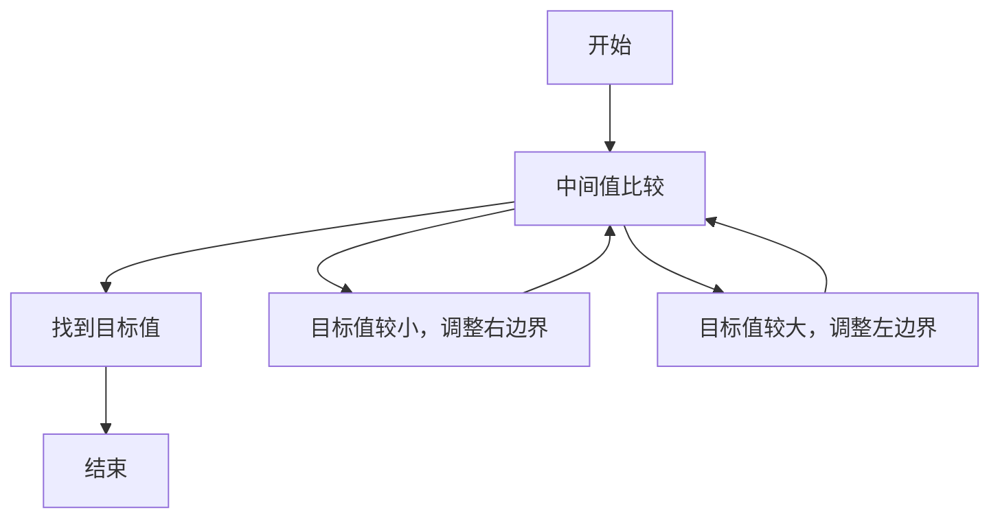
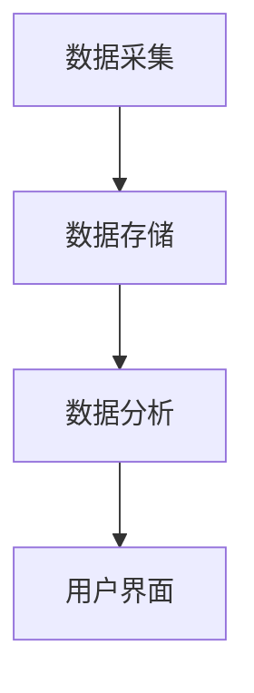
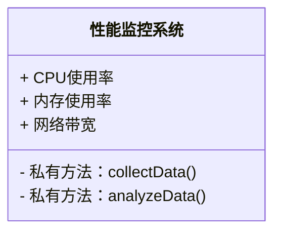
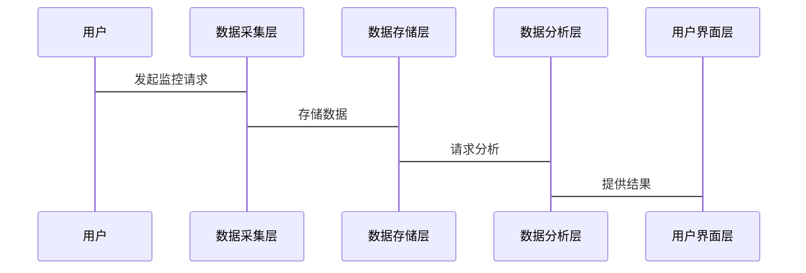

                 


# 性能监控与持续优化

## 关键词：性能监控，性能优化，算法原理，系统架构，数学模型，项目实战

## 摘要：  
性能监控与持续优化是计算机系统设计和运维中的核心任务。本文将从基本概念出发，深入探讨性能监控的核心指标、工具与方法，结合实际案例，详细讲解性能优化的算法原理与数学模型。通过系统架构设计与项目实战，帮助读者掌握性能监控与优化的全过程。文章最后将总结最佳实践，为读者提供实用的指导与启示。

---

# 第1章: 性能监控与持续优化概述

## 1.1 性能监控的基本概念

### 1.1.1 性能监控的定义  
性能监控是指通过收集和分析系统在运行过程中的各种指标（如CPU、内存、磁盘、网络等），实时或定期评估系统的运行状态，发现潜在问题的过程。  

### 1.1.2 性能监控的核心目标  
1. 发现系统性能瓶颈，确保系统在正常负载下稳定运行。  
2. 提供历史数据，支持容量规划和性能预测。  
3. 支持故障排查，快速定位问题根源。  

### 1.1.3 性能监控的边界与外延  
性能监控的边界通常包括硬件资源（CPU、内存、磁盘、网络）、操作系统、中间件（如Web服务器、数据库）和应用程序。外延则延伸至用户体验（如响应时间、错误率）和业务指标（如交易成功率、吞吐量）。  

---

## 1.2 性能优化的基本原理

### 1.2.1 性能优化的定义  
性能优化是指通过调整系统架构、代码实现或配置参数，减少资源消耗，提升系统运行效率的过程。  

### 1.2.2 性能优化的核心要素  
1. **资源利用率**：优化CPU、内存、磁盘等资源的使用效率。  
2. **算法效率**：通过改进算法复杂度，降低计算开销。  
3. **并行与异步**：利用多核处理器或异步编程模型提升系统吞吐量。  

### 1.2.3 性能优化与性能监控的关系  
性能监控是性能优化的前提，优化效果需要通过监控数据来验证。两者相辅相成，形成闭环。  

---

## 1.3 性能监控与持续优化的场景与应用

### 1.3.1 网络性能监控  
监控网络带宽、延迟、丢包率，优化网络拓扑和协议配置。  

### 1.3.2 服务器性能监控  
监控服务器CPU、内存、磁盘I/O和网络I/O，优化资源分配和负载均衡。  

### 1.3.3 数据库性能监控  
监控数据库查询效率、锁竞争和索引使用情况，优化查询语句和索引设计。  

### 1.3.4 应用程序性能监控  
监控应用程序的响应时间、错误率和资源使用情况，优化代码逻辑和架构设计。  

---

# 第2章: 性能监控的核心概念与联系

## 2.1 性能指标与监控工具

### 2.1.1 常见性能指标  
| 指标类型 | 具体指标 | 描述 |  
|----------|----------|------|  
| CPU      | CPU使用率 | CPU核的使用百分比 |  
| 内存      | 内存使用率 | 内存占用百分比 |  
| 磁盘      | I/O次数 | 磁盘读写次数 |  
| 网络      | 带宽利用率 | 网络传输速率 |  

### 2.1.2 性能监控工具的分类  
1. **系统级工具**：如top、htop、vmstat。  
2. **网络级工具**：如netstat、nethogs、tcpdump。  
3. **数据库工具**：如MySQL的SHOW STATUS，PostgreSQL的pg_stat_activity。  
4. **应用程序工具**：如JDK的jvisualvm，Spring Boot Actuator。  

### 2.1.3 性能监控工具的选择与使用  
选择工具时，需综合考虑目标系统的规模、性能需求和团队熟悉度。  

---

## 2.2 性能问题定位与分析

### 2.2.1 性能问题的常见表现  
1. 系统响应变慢。  
2. 网页加载时间过长。  
3. 数据库查询超时。  

### 2.2.2 性能问题的定位方法  
1. **日志分析**：检查错误日志和慢查询日志。  
2. **资源监控**：查看CPU、内存、磁盘I/O是否接近瓶颈。  
3. **代码审查**：检查是否存在低效代码或算法。  

### 2.2.3 性能问题的分析工具  
1. **可视化工具**：如Grafana、Prometheus。  
2. **性能剖析工具**：如perf、gcprof。  

---

## 2.3 性能优化策略与实施

### 2.3.1 性能优化的常见策略  
1. **垂直扩展**：增加硬件资源（如升级CPU、内存）。  
2. **水平扩展**：增加服务器数量，分担负载。  
3. **代码优化**：减少不必要的计算和I/O操作。  

### 2.3.2 性能优化的实施步骤  
1. **问题分析**：明确瓶颈所在。  
2. **方案设计**：制定优化方案。  
3. **实施优化**：逐步优化并监控效果。  
4. **验证效果**：确保优化目标达成。  

---

# 第3章: 性能监控与优化的算法原理

## 3.1 性能监控中的算法概述

### 3.1.1 算法在性能监控中的作用  
算法用于分析和预测性能数据，帮助我们更好地理解系统行为。  

### 3.1.2 常见性能监控算法的分类  
1. **统计分析算法**：如均值、方差、标准差。  
2. **时间序列分析**：如ARIMA模型。  
3. **机器学习算法**：如随机森林、XGBoost。  

---

## 3.2 基于二进制搜索的性能优化算法

### 3.2.1 算法原理  
二进制搜索是一种在有序数组中查找特定元素的算法，具有对数时间复杂度。  

### 3.2.2 算法实现步骤  


### 3.2.3 算法的优缺点分析  
优点：时间复杂度低。缺点：仅适用于有序数据。  

---

## 3.3 性能监控中的统计分析算法

### 3.3.1 统计分析的基本原理  
统计分析通过收集和分析数据，找出数据的分布规律。  

### 3.3.2 常见统计分析方法  
1. **均值与方差**：描述数据的集中趋势和离散程度。  
2. **回归分析**：预测系统性能的变化趋势。  

### 3.3.3 统计分析在性能监控中的应用  
例如，通过分析历史响应时间，预测未来系统的负载情况。  

---

# 第4章: 性能监控的数学模型与公式

## 4.1 性能监控中的数学模型

### 4.1.1 常见性能监控模型的介绍  
1. **队列模型**：描述系统的排队过程。  
2. **马尔可夫链模型**：分析系统的状态转移。  

### 4.1.2 数学模型的构建方法  
1. 确定系统中的状态。  
2. 建立状态转移概率矩阵。  
3. 计算稳态概率。  

### 4.1.3 数学模型的应用场景  
例如，预测系统的响应时间是否满足SLA要求。  

---

## 4.2 性能优化中的数学公式

### 4.2.1 常见性能优化公式  
1. **阿姆达尔定律**：描述并行计算的加速比。  
2. **基尔霍夫定律**：描述网络中的电流分配。  

### 4.2.2 公式的推导过程  
例如，阿姆达尔定律的推导：  
$$ A = \frac{P}{P + (n-1)} $$  
其中，A是加速比，P是串行部分的效率，n是并行度。  

### 4.2.3 公式的实际应用案例  
通过阿姆达尔定律，评估并行化代码的加速效果。  

---

# 第5章: 系统分析与架构设计方案

## 5.1 性能监控系统的架构设计

### 5.1.1 系统架构的概述  
典型的性能监控系统架构包括数据采集层、数据存储层、数据分析层和用户界面层。  

### 5.1.2 系统组件的交互流程  


### 5.1.3 系统架构的优势  
1. 分层设计，便于扩展和维护。  
2. 高可用性，通过冗余设计保证系统稳定。  

---

## 5.2 系统功能设计

### 5.2.1 领域模型设计  


### 5.2.2 系统接口设计  
1. 数据采集接口：提供API，接收性能指标数据。  
2. 数据存储接口：支持高效的数据写入和查询。  

### 5.2.3 系统交互流程  


---

# 第6章: 项目实战

## 6.1 环境安装与配置

### 6.1.1 环境要求  
1. 操作系统：Linux（推荐）或Windows。  
2. 开发工具：Python、JDK、IDE。  

### 6.1.2 工具安装  
安装Grafana、Prometheus、JDK等工具。  

---

## 6.2 系统核心实现

### 6.2.1 数据采集模块  
```python
import time

def collect_data():
    while True:
        cpu_usage = get_cpu_usage()
        memory_usage = get_memory_usage()
        print(f"CPU使用率：{cpu_usage}%，内存使用率：{memory_usage}%")
        time.sleep(1)
```

### 6.2.2 数据分析模块  
```python
from prometheus_client import generate_latest

def analyze_data():
    metrics = generate_latest()
    print("性能指标数据：", metrics)
```

---

## 6.3 实际案例分析

### 6.3.1 案例背景  
假设我们有一个Web应用，响应时间过长，需要优化。  

### 6.3.2 问题定位  
通过监控发现，数据库查询延迟过高。  

### 6.3.3 优化措施  
1. 优化SQL语句。  
2. 增加数据库索引。  
3. 使用缓存技术减少重复查询。  

---

## 6.4 项目小结  
通过本项目，我们掌握了性能监控与优化的基本方法，从数据采集到分析，再到优化实施，整个流程清晰完整。  

---

# 第7章: 总结与展望

## 7.1 总结  
性能监控与优化是系统设计和运维中的重要任务，需要从硬件、软件、算法等多个层面综合考虑。  

## 7.2 最佳实践 tips  
1. 定期监控，及时发现问题。  
2. 优化时尽量采用非侵入式方法。  
3. 建立完善的监控报警机制。  

## 7.3 未来展望  
随着AI和大数据技术的发展，性能监控与优化将更加智能化和自动化。  

---

# 结语  
希望本文能为读者提供有价值的性能监控与优化的知识和方法，帮助大家在实际工作中取得更好的效果。

