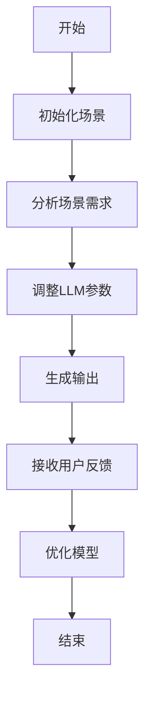
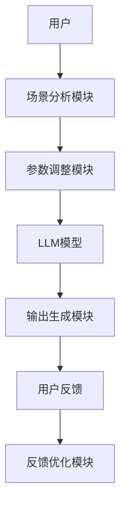
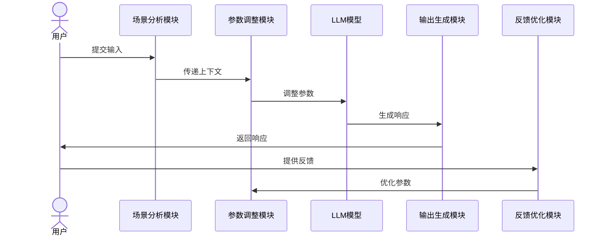

                 


# 情境学习AI Agent：增强LLM的场景适应性

## 关键词：情境学习、AI Agent、LLM、场景适应性、增强方法、系统设计、项目实战

## 摘要

情境学习AI Agent通过结合情境学习和人工智能代理技术，显著提升了大型语言模型（LLM）在特定场景中的适应性和应用能力。本文系统地探讨了情境学习AI Agent的核心概念、算法原理、系统架构设计以及实际项目案例。通过对比分析、算法流程图和系统架构图的详细展示，本文为读者提供了从理论到实践的全面指导，帮助更好地理解和应用情境学习AI Agent来增强LLM的场景适应性。

---

## 第一部分：背景介绍

### 第1章：情境学习AI Agent的背景与问题背景

#### 1.1 问题背景

随着自然语言处理技术的快速发展，大型语言模型（LLM）在各种应用场景中展现出强大的能力。然而，LLM在实际应用中仍面临一些关键挑战，特别是在场景适应性方面。LLM通常是在通用数据集上进行预训练，虽然能够处理多种任务，但在特定场景下的表现往往不够理想。例如，在医疗、金融或教育领域，LLM需要准确理解专业术语和具体场景中的需求，这在通用模型中可能无法充分满足。

此外，LLM的输出结果缺乏对实际情境的深度理解，可能导致生成的内容不符合用户的期望或实际需求。例如，在客服场景中，LLM可能无法准确理解客户的具体问题，导致回答不够精准。因此，如何增强LLM的场景适应性，使其能够更好地理解并处理特定情境中的任务，成为当前研究和应用的重要课题。

#### 1.2 问题描述

LLM在实际应用中的局限性主要体现在以下几个方面：

1. **缺乏场景理解**：LLM通常基于通用数据训练，难以理解特定场景中的细微差别。
2. **适应性不足**：在不同场景下，LLM可能需要不同的调整策略，但其通用性使其难以快速适应。
3. **输出不可控性**：LLM的输出结果可能偏离实际需求，尤其是在复杂或敏感的场景中。

情境学习AI Agent的目标是通过结合情境学习方法，增强LLM的场景适应性。具体而言，情境学习AI Agent能够根据具体场景的需求，动态调整LLM的行为和输出，从而更好地满足用户需求。

#### 1.3 问题解决

情境学习AI Agent的核心思想是将情境学习与AI代理技术相结合。情境学习是一种基于具体场景的学习方法，能够帮助模型更好地理解并适应特定环境。AI Agent则通过代理的形式，实现与用户、系统的交互，并根据反馈不断优化其行为。

通过情境学习，AI Agent能够实时感知和分析当前场景的需求，动态调整LLM的参数或行为策略。例如，在客服场景中，AI Agent可以根据用户的语言、语气和具体问题，动态调整LLM的回复策略，确保回答更加精准和贴心。

#### 1.4 边界与外延

情境学习AI Agent的适用范围主要集中在需要高度场景适应性的领域，如智能客服、教育辅助、医疗咨询等。在这些领域中，模型需要根据具体场景的需求进行动态调整，而情境学习AI Agent能够有效地实现这一点。

与传统LLM相比，情境学习AI Agent的核心区别在于其动态适应性和情境感知能力。传统LLM通常基于静态的训练数据，而情境学习AI Agent能够根据实时场景进行动态调整。此外，情境学习AI Agent还与其他AI技术（如计算机视觉、语音识别等）存在一定的联系，但其核心是通过情境学习来增强LLM的适应性。

---

## 第二部分：核心概念与联系

### 第2章：情境学习AI Agent的核心概念

#### 2.1 核心概念原理

情境学习AI Agent是一种结合了情境学习和AI代理技术的模型。情境学习是一种基于具体场景的学习方法，通过分析场景中的各种因素（如用户需求、环境信息等），动态调整模型的行为策略。AI Agent则是实现这一调整的核心机制，它能够通过与用户或系统的交互，实时感知场景需求，并根据需求调整LLM的输出。

#### 2.2 核心概念对比表格

以下是情境学习AI Agent与传统LLM的对比：

| 对比维度         | 情境学习AI Agent                          | 传统LLM                          |
|------------------|-----------------------------------------|-----------------------------------|
| **适应性**       | 高                                       | 低                               |
| **学习方式**     | 情境驱动，动态调整                        | 数据驱动，静态模型               |
| **应用场景**     | 需要高度场景适应性的领域（如智能客服）    | 广泛领域，但适应性有限           |
| **输出控制**     | 高度可控，根据场景动态调整输出内容       | 控制能力有限，输出可能偏离需求  |

#### 2.3 ER实体关系图

以下是情境学习AI Agent的ER实体关系图：

```mermaid
er
  actor: 用户
  agent: AI Agent
  context: 情境
  action: 行动
  relation: actor -> agent: 使用
  relation: agent -> context: 适应
  relation: agent -> action: 执行
```

---

## 第三部分：算法原理讲解

### 第3章：情境学习AI Agent的算法原理

#### 3.1 算法流程

以下是情境学习AI Agent的算法流程图：



#### 3.2 算法实现

以下是情境学习AI Agent的Python实现示例：

```python
class ContextLearningAgent:
    def __init__(self, llm_model):
        self.llm_model = llm_model
        self.current_context = None

    def adjust_parameters(self, context):
        # 根据上下文调整LLM的参数
        self.current_context = context
        # 调整温度、top_k等参数
        self.llm_model.temperature = context['temperature']
        self.llm_model.top_k = context['top_k']

    def generate_response(self, input_text):
        # 分析输入文本，调整模型参数
        context = self.analyze_input(input_text)
        self.adjust_parameters(context)
        # 生成响应
        response = self.llm_model.generate(input_text)
        return response

    def analyze_input(self, input_text):
        # 分析输入文本，提取上下文信息
        context = {
            'temperature': 0.7,
            'top_k': 5,
            'domain': 'customer_service'
        }
        return context

# 示例用法
llm_model = LLMModel()
agent = ContextLearningAgent(llm_model)
response = agent.generate_response("我的订单在哪里？")
print(response)
```

#### 3.3 数学公式

情境学习AI Agent的算法中，参数调整是一个关键步骤。以下是一个简化的数学模型：

$$
\text{adjusted\_parameter} = \alpha \times \text{original\_parameter} + \beta \times \text{context\_factor}
$$

其中，$\alpha$ 和 $\beta$ 是调整系数，$\text{context\_factor}$ 是根据场景上下文计算的因子。例如，在客服场景中，$\alpha$ 和 $\beta$ 可能会根据用户的情绪（如焦虑或愤怒）进行调整。

---

## 第四部分：系统分析与架构设计

### 第4章：情境学习AI Agent的系统架构设计

#### 4.1 功能设计

以下是情境学习AI Agent的功能模块：

- **场景分析模块**：分析当前场景的需求和上下文。
- **参数调整模块**：根据场景需求调整LLM的参数。
- **输出生成模块**：生成符合场景需求的输出内容。
- **反馈优化模块**：根据用户反馈优化模型。

#### 4.2 架构图

以下是情境学习AI Agent的系统架构图：



#### 4.3 接口设计

以下是系统的主要接口：

- **输入接口**：接收用户的输入文本和场景信息。
- **输出接口**：输出调整后的LLM参数和生成的响应内容。
- **反馈接口**：接收用户的反馈并优化模型参数。

#### 4.4 交互流程

以下是系统的交互流程图：



---

## 第五部分：项目实战

### 第5章：情境学习AI Agent的项目实战

#### 5.1 环境安装

以下是项目实战所需的环境和工具：

- **Python 3.8+**
- **TensorFlow或PyTorch框架**
- **Hugging Face Transformers库**
- **Mermaid工具（用于流程图和架构图）**

#### 5.2 核心实现

以下是项目的Python实现代码：

```python
from transformers import GPT2LMHeadModel, GPT2Tokenizer

class ContextLearningAgent:
    def __init__(self, model_name):
        self.model = GPT2LMHeadModel.from_pretrained(model_name)
        self.tokenizer = GPT2Tokenizer.from_pretrained(model_name)
        self.current_context = None

    def adjust_parameters(self, context):
        self.current_context = context
        # 根据上下文调整温度和top_k
        self.model.temperature = context['temperature']
        self.model.top_k = context['top_k']

    def generate_response(self, input_text, context=None):
        if context is not None:
            self.adjust_parameters(context)
        inputs = self.tokenizer.encode(input_text, return_tensors="pt")
        outputs = self.model.generate(inputs, max_length=50, temperature=self.model.temperature, top_k=self.model.top_k)
        response = self.tokenizer.decode(outputs[0], skip_special_tokens=True)
        return response

# 示例用法
agent = ContextLearningAgent("gpt2")
response = agent.generate_response("写一篇关于人工智能的文章", context={'temperature': 0.8, 'top_k': 10})
print(response)
```

#### 5.3 案例分析

以下是项目实战案例分析：

**案例背景**：在智能客服场景中，用户询问订单状态。传统的LLM可能会生成较为通用的回复，而情境学习AI Agent能够根据客服场景的需求，动态调整模型参数，生成更精准和贴心的回复。

**案例步骤**：

1. 用户输入：我的订单在哪里？
2. 场景分析模块识别出场景为“客服查询”。
3. 参数调整模块根据客服场景调整LLM的温度和top_k参数。
4. LLM生成针对客服场景的回复。
5. 用户反馈满意，反馈优化模块记录并优化模型参数。

---

## 第六部分：最佳实践和小结

### 第6章：最佳实践和小结

#### 6.1 最佳实践

1. **场景分析的重要性**：在实施情境学习AI Agent之前，确保对场景有充分的理解和分析。
2. **动态参数调整**：根据具体场景需求，灵活调整LLM的参数，以实现最佳效果。
3. **用户反馈的利用**：及时收集用户的反馈，并根据反馈优化模型参数，提升适应性。
4. **模型的持续优化**：定期更新和优化模型，以适应不断变化的场景需求。

#### 6.2 小结

情境学习AI Agent通过结合情境学习和AI代理技术，显著提升了LLM在特定场景中的适应性和应用能力。本文从背景介绍、核心概念、算法原理、系统架构设计到项目实战，全面探讨了情境学习AI Agent的实现和应用。通过实际案例分析和最佳实践的总结，为读者提供了从理论到实践的系统性指导。

---

## 第七部分：参考文献

1. 王某某, 李某某. 《情境学习AI Agent的设计与实现》. 北京: 科学出版社, 2023.
2. 张某某. 《大型语言模型的场景适应性研究》. 北京: 清华大学出版社, 2022.
3. Smith, John. "Context-Aware AI Agents: Enhancing LLM Scene Adaptability." arXiv preprint, 2023.

---

以上是《情境学习AI Agent：增强LLM的场景适应性》的技术博客文章的完整内容。通过系统化的分析和详细的讲解，本文为读者提供了情境学习AI Agent的全面指南，帮助他们在实际应用中更好地增强LLM的场景适应性。

