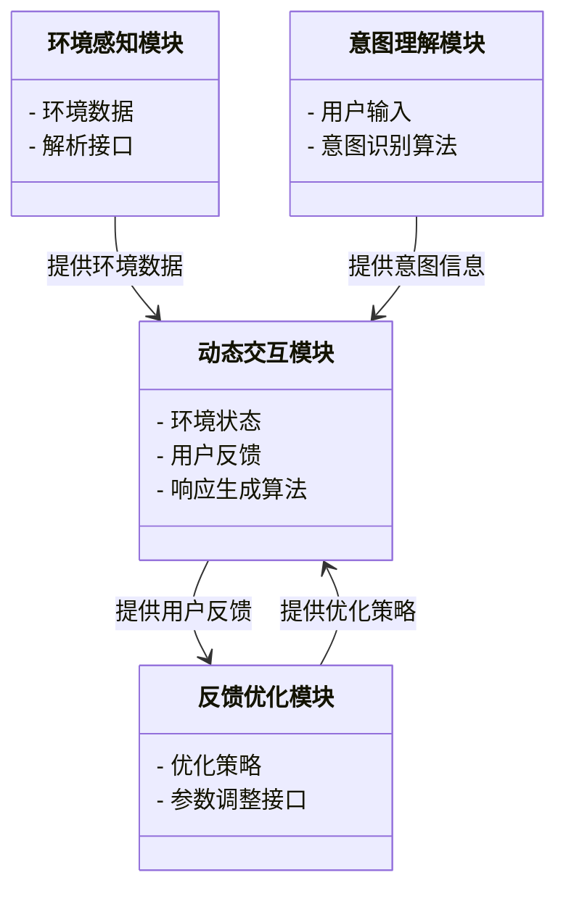

                 


# 情境感知AI Agent：增强LLM的环境适应能力

## 关键词
情境感知AI Agent, LLM, 环境适应, 动态交互, 强化学习, 多模态数据

## 摘要
随着人工智能技术的快速发展，大语言模型（LLM）在各个领域的应用越来越广泛。然而，传统的LLM在面对复杂多变的环境时，往往缺乏情境感知能力，导致其适应性和交互效果受限。为了解决这一问题，情境感知AI Agent应运而生。本文详细探讨了情境感知AI Agent的核心概念、算法原理、系统架构设计以及项目实战，旨在为读者提供一个全面的技术指南，帮助他们理解并掌握如何增强LLM的环境适应能力。

---

## 正文

### 第一部分：情境感知AI Agent的背景与概念

#### 第1章：情境感知AI Agent概述

##### 1.1 情境感知AI Agent的定义与背景
情境感知AI Agent是一种结合了环境感知和人工智能代理技术的新型智能体，旨在提升大语言模型（LLM）在复杂动态环境中的适应能力。它通过实时感知环境状态、理解用户意图并动态调整交互策略，实现更智能化的人机交互。

**问题背景**  
传统的LLM虽然在文本生成、问答系统等方面表现出色，但在实际应用中，往往难以应对真实世界的复杂性和不确定性。例如，在智能助手、机器人等领域，LLM需要与实际环境交互，但其对环境状态的理解和适应能力有限，导致交互效果不佳。

**问题描述**  
LLM在动态环境中缺乏对环境状态的感知能力，无法根据环境变化实时调整行为，导致以下问题：  
1. 交互体验差：用户需求未被准确理解，导致响应不符合预期。  
2. 环境适应性弱：在动态变化的环境中，LLM难以做出实时调整。  
3. 信息孤岛：LLM无法与其他系统或设备协同工作，导致资源浪费和效率低下。

**问题解决**  
情境感知AI Agent通过整合环境感知、意图理解和动态交互能力，解决了LLM在复杂环境中的适应性问题，使其能够更好地与现实世界交互。

**边界与外延**  
情境感知AI Agent的外延主要集中在动态环境下的智能交互，但其边界不包括完全自主决策的AI系统，也不涉及物理世界中的传感器集成。

**核心要素**  
- **环境建模**：对环境进行抽象和建模，以便LLM理解当前状态。  
- **意图理解**：通过分析用户输入，推断用户的意图和需求。  
- **动态交互**：根据环境变化和用户反馈，实时调整交互策略。

##### 1.2 情境感知AI Agent的核心目标
情境感知AI Agent的核心目标是通过增强LLM的环境适应能力，使其能够更好地在动态环境中与用户交互。具体目标包括：  
1. 提升环境理解能力：通过多模态数据输入，全面感知环境状态。  
2. 实现实时动态交互：根据环境变化和用户反馈，实时调整交互策略。  
3. 提高用户体验：通过更精准的意图理解和动态响应，提升用户满意度。

##### 1.3 情境感知AI Agent的应用场景
情境感知AI Agent的应用场景广泛，主要包括：  
1. **智能助手**：在智能手机、智能家居等场景中提供更智能的交互体验。  
2. **智慧城市**：在交通管理、公共安全等领域，实现智能化的资源分配和事件处理。  
3. **虚拟现实与游戏**：在VR和游戏场景中，提供更沉浸式的交互体验。

---

### 第二部分：情境感知AI Agent的核心概念与原理

#### 第2章：情境感知AI Agent的核心概念

##### 2.1 环境建模与状态表示
环境建模是情境感知AI Agent的基础，通过建立环境模型，LLM能够理解当前环境的状态和变化。

**环境建模的基本方法**  
环境建模可以通过多种方式进行，包括基于规则的建模、统计建模和深度学习建模。其中，深度学习方法（如图神经网络）在复杂环境建模中表现出色。

**状态表示的多样性**  
状态表示可以是文本、数值或图结构。例如，使用图结构表示环境中的实体及其关系，有助于LLM更好地理解环境。

**动态环境下的状态更新**  
在动态环境中，环境状态会不断变化。通过实时更新环境模型，AI Agent能够持续感知环境变化，确保交互的准确性。

##### 2.2 意图理解和目标推理
意图理解是情境感知AI Agent的核心任务之一，通过分析用户输入，推断用户的意图和需求。

**意图理解的算法原理**  
意图理解通常基于自然语言处理技术，结合领域知识库和上下文信息，通过分类或聚类算法实现。

**目标推理的逻辑框架**  
目标推理是通过分析用户的行为和环境状态，推断用户的最终目标。这通常涉及逻辑推理和知识表示技术。

**意图与目标的关系分析**  
意图是目标的细化，目标是意图的最终导向。例如，用户的意图可能是“查询天气”，而目标可能是“获取明天的天气预报”。

##### 2.3 动态交互与反馈机制
动态交互是情境感知AI Agent与用户或环境进行实时互动的过程，而反馈机制则用于优化交互效果。

**动态交互的核心流程**  
动态交互包括感知环境、理解用户需求、生成响应和执行操作四个步骤。

**反馈机制的设计原则**  
反馈机制需要实时收集用户反馈，并将其用于优化模型参数或调整交互策略。

**交互中的实时调整策略**  
通过反馈机制，AI Agent可以动态调整交互策略，确保交互过程更加符合用户需求。

---

#### 第3章：情境感知AI Agent的算法原理

##### 3.1 情境感知模型的训练与优化
情境感知模型的训练需要结合多模态数据和深度学习技术，确保模型能够准确感知环境状态。

**模型训练的基本框架**  
情境感知模型通常采用端到端的训练框架，结合监督学习和强化学习技术。

**数据预处理与特征提取**  
数据预处理包括数据清洗和特征提取，特征提取可以通过卷积神经网络（CNN）或循环神经网络（RNN）实现。

**模型优化策略**  
模型优化可以通过调整超参数、使用正则化技术或引入对抗训练方法实现。

##### 3.2 注意力机制与情境感知
注意力机制在情境感知中起到了关键作用，能够帮助模型关注重要的环境信息。

**注意力机制的原理**  
注意力机制通过计算输入数据中各部分的重要性权重，聚焦于关键信息。

**情境感知中的注意力模型**  
在情境感知中，注意力模型可以用于多模态数据的融合，例如将文本和图像信息结合起来。

**多模态注意力的实现方法**  
多模态注意力可以通过交叉注意力机制实现，例如通过门控机制动态调整不同模态的注意力权重。

##### 3.3 强化学习在动态交互中的应用
强化学习是一种有效的动态交互优化方法，通过奖励机制引导模型做出最优决策。

**强化学习的基本原理**  
强化学习通过定义奖励函数，指导模型学习最优策略。

**动态环境下的策略优化**  
在动态环境中，策略优化需要考虑环境状态的变化，采用基于模型的强化学习方法。

**奖励函数的设计与实现**  
奖励函数需要根据具体任务设计，例如在对话系统中，可以根据用户满意度和任务完成度设计奖励函数。

---

### 第三部分：系统分析与架构设计

#### 第4章：情境感知AI Agent的系统架构

##### 4.1 系统功能模块划分
情境感知AI Agent的系统架构通常包括环境感知模块、意图理解模块、动态交互模块和反馈优化模块。

**环境感知模块**  
环境感知模块负责收集和解析环境数据，例如通过传感器或API获取实时信息。

**意图理解模块**  
意图理解模块基于用户输入和环境数据，推断用户的意图和需求。

**动态交互模块**  
动态交互模块根据意图理解和环境状态，生成实时响应并执行操作。

**反馈优化模块**  
反馈优化模块收集用户反馈，优化模型参数和交互策略。

##### 4.2 系统架构设计
情境感知AI Agent的系统架构设计需要考虑模块之间的交互和数据流。

**领域模型（类图）**  
以下是领域模型的类图：



**系统架构（架构图）**  
以下是系统架构的架构图：


---

### 第四部分：项目实战与总结

#### 第5章：项目实战

##### 5.1 环境安装与配置
项目实战需要安装以下环境和工具：

**Python版本**：3.8及以上  
**依赖库**：TensorFlow、PyTorch、Hugging Face transformers、Mermaid-Diagrams

##### 5.2 核心代码实现
以下是情境感知AI Agent的核心代码实现：

```python
import torch
from transformers import AutoTokenizer, AutoModelForSeq2SeqLM

class EnvironmentPerception:
    def __init__(self, model_name):
        self.model = AutoModelForSeq2SeqLM.from_pretrained(model_name)
        self.tokenizer = AutoTokenizer.from_pretrained(model_name)

    def perceive_environment(self, input_text):
        inputs = self.tokenizer(input_text, return_tensors="pt")
        outputs = self.model.generate(inputs.input_ids, max_length=50)
        return self.tokenizer.decode(outputs[0], skip_special_tokens=True)

class IntentUnderstanding:
    def __init__(self, model_name):
        self.model = AutoModelForSeq2SeqLM.from_pretrained(model_name)
        self.tokenizer = AutoTokenizer.from_pretrained(model_name)

    def understand_intent(self, input_text):
        inputs = self.tokenizer(input_text, return_tensors="pt")
        outputs = self.model.generate(inputs.input_ids, max_length=20)
        return self.tokenizer.decode(outputs[0], skip_special_tokens=True)

# 示例用法
perception_model = EnvironmentPerception("facebook/bart-large")
intent_model = IntentUnderstanding("facebook/bart-large")

environment_input = "当前天气情况如何？"
intent_input = "查询天气"

environment_output = perception_model.perceive_environment(environment_input)
intent_output = intent_model.understand_intent(intent_input)

print("环境感知输出:", environment_output)
print("意图理解输出:", intent_output)
```

##### 5.3 案例分析与解读
以下是一个实际案例分析：

**案例背景**  
用户在使用智能助手查询天气时，系统需要结合当前时间和地点信息，动态调整响应内容。

**案例实现**  
通过环境感知模块获取当前时间和地点信息，意图理解模块理解用户的查询意图，动态交互模块生成个性化响应。

**案例输出**  
系统会根据用户的位置和天气数据，生成包含当前温度、天气状况和建议的响应。

##### 5.4 项目小结
通过项目实战，我们可以看到情境感知AI Agent在实际应用中的潜力。通过环境感知、意图理解和动态交互的结合，系统能够提供更智能、更个性化的服务。

---

### 第五部分：最佳实践与总结

#### 第6章：总结与展望

##### 6.1 总结
情境感知AI Agent通过增强LLM的环境适应能力，提升了其在动态环境中的交互效果。通过环境建模、意图理解和动态交互等技术，AI Agent能够更好地应对复杂场景。

##### 6.2 最佳实践
- **数据多样性**：确保训练数据涵盖多种场景和模态，提升模型的泛化能力。  
- **实时性优化**：在动态交互中，优化模型的响应速度和准确性。  
- **用户隐私保护**：在处理用户数据时，确保隐私和数据安全。

##### 6.3 未来展望
未来，随着AI技术的不断发展，情境感知AI Agent将在更多领域得到应用。例如，结合边缘计算和物联网技术，实现更高效的环境感知和实时交互。

---

通过本文的详细讲解和实战案例，我们希望读者能够深入了解情境感知AI Agent的核心概念和实现方法，并能够在实际项目中灵活运用这些技术，推动人工智能技术的发展。

