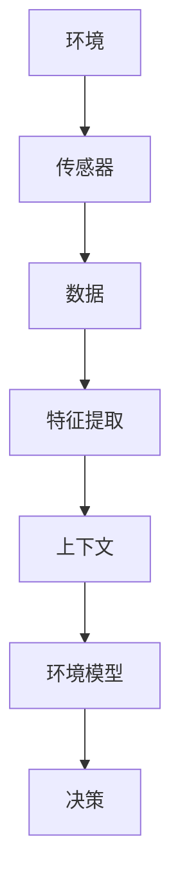
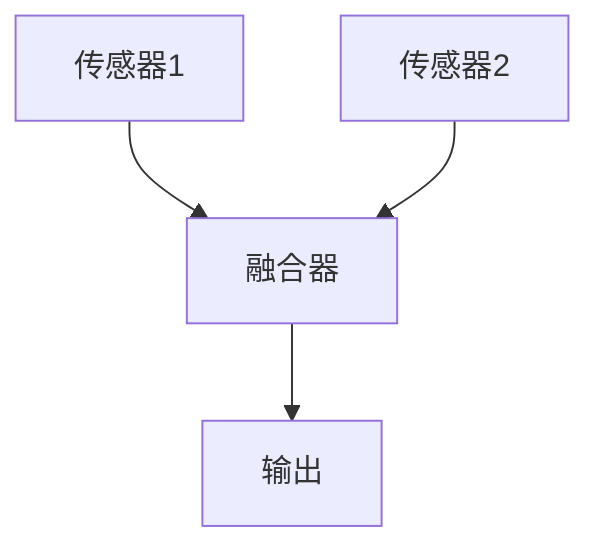
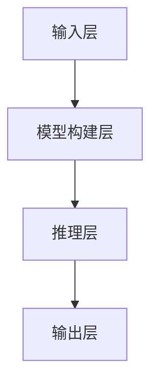

                 


# 情境感知：增强AI Agent的环境理解能力

> 关键词：情境感知，AI Agent，环境理解，动态感知，实时决策

> 摘要：情境感知是AI Agent理解复杂环境的关键能力，本文从概念、算法、系统架构等多维度详细探讨情境感知的核心原理和应用实践，通过具体案例分析，揭示如何通过情境感知提升AI Agent的环境适应能力。

---

## 第一部分：情境感知与AI Agent概述

### 第1章：情境感知的定义与背景

#### 1.1 情境感知的核心概念
- **情境感知的定义**：情境感知是指系统能够根据当前环境中的多源信息，动态理解和推理出环境的状态、关系及潜在意图的能力。
- **问题背景**：传统感知方法仅能获取局部信息，无法理解全局语义，而情境感知通过整合多源数据，实现对环境的深层理解。
- **技术发展**：从单一传感器到多模态数据融合，从静态分析到动态实时推理，情境感知技术不断演进。
- **应用领域**：广泛应用于智能助手、自动驾驶、智能安防、机器人等领域。
- **相关概念对比**：情境感知与环境感知、场景理解的区别与联系。

#### 1.2 AI Agent与情境感知的关系
- AI Agent需要通过情境感知理解环境状态，以便做出更智能的决策。
- 情境感知为AI Agent提供上下文信息，增强其环境适应能力。

---

## 第2章：情境感知的核心概念与联系

### 2.1 情境感知的核心要素
- **环境模型**：描述环境的结构、物体关系及动态变化。
- **上下文理解**：理解当前环境中的语义关联。
- **动态感知**：实时跟踪环境状态变化。

### 2.2 情境感知的关键属性
| 属性 | 描述 |
|------|------|
| 知识表示 | 使用符号、概率或语义网络表示环境 |
| 数据来源 | 多传感器、知识库、用户输入 |
| 不确定性 | 处理环境的模糊性和动态变化 |

### 2.3 情境感知的实体关系图


---

## 第3章：情境感知的算法原理

### 3.1 情境感知的核心算法
- **数据融合算法**：多传感器数据融合，消除信息冗余，提升准确性。
- **模式识别算法**：识别环境中的模式和异常。
- **实时处理算法**：快速处理流数据，实现动态感知。

### 3.2 多传感器数据融合算法


### 3.3 算法实现代码示例
```python
def sensor_fusion(sensor1, sensor2):
    # 示例融合算法
    fused_data = (sensor1 + sensor2) / 2
    return fused_data
```

### 3.4 数学模型与公式
- **贝叶斯网络模型**用于处理不确定性：
  $$ P(e|d) = \frac{P(d|e)P(e)}{P(d)} $$

---

## 第4章：情境感知的系统架构设计

### 4.1 系统架构设计
- **数据输入层**：接收多源数据。
- **环境模型构建层**：构建动态环境模型。
- **推理引擎**：基于模型进行推理和决策。
- **决策输出层**：生成行动计划。

### 4.2 系统架构图


---

## 第5章：情境感知的项目实战

### 5.1 智能助手项目实战
- **环境搭建**：安装必要的库和工具。
- **数据收集**：获取多源数据。
- **模型训练**：训练情境理解模型。
- **系统实现**：实现情境感知功能。

### 5.2 代码实现
```python
def process_context(context_data):
    # 示例上下文处理代码
    processed_data = context_data.apply(transform)
    return processed_data
```

---

## 第6章：最佳实践与小结

### 6.1 最佳实践
- **数据质量管理**：确保数据的准确性和完整性。
- **模型优化**：定期更新模型，适应环境变化。
- **隐私保护**：注意数据隐私问题。

### 6.2 小结
- 情境感知是AI Agent的核心能力，通过多源数据融合和动态推理，实现对环境的深度理解。

### 6.3 未来展望
- 多模态感知：结合视觉、听觉等多种感知方式。
- 自适应学习：增强模型的自适应能力。

---

## 第7章：总结与注意事项

### 7.1 总结
- 情境感知是AI Agent理解环境的关键技术，通过多维度的数据融合和动态推理，实现对环境的深度理解。

### 7.2 注意事项
- 确保数据质量和模型的实时性。
- 处理好数据隐私和安全问题。

---

通过以上章节的详细讲解，我们系统地探讨了情境感知的核心概念、算法原理和系统架构，结合实际案例，深入分析了如何通过情境感知提升AI Agent的环境理解能力。

