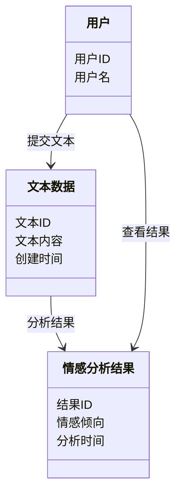
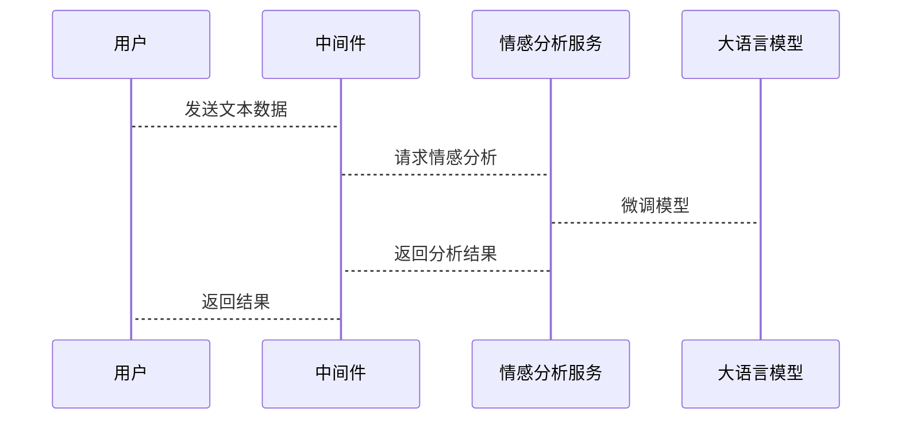

                 


# 情感分析AI Agent：利用LLM洞察文本情感倾向

## 关键词：情感分析, 大语言模型, LLM, 文本挖掘, 自然语言处理, 情感倾向分析

## 摘要：情感分析是自然语言处理中的重要任务，旨在通过分析文本内容，判断作者的情感倾向。本文将介绍情感分析的核心概念、算法原理、系统架构，并通过实际案例展示如何利用大语言模型（LLM）进行情感分析。从传统方法到深度学习，再到最新的大模型应用，本文将全面解析情感分析的技术与实践。

---

## 第1章: 情感分析的定义与背景

### 1.1 情感分析的定义

#### 1.1.1 情感分析的定义与范围

情感分析，也称为情感计算或意见挖掘，是一种自然语言处理技术，旨在识别和分类文本中包含的情感倾向。它通过对文本内容的分析，判断作者对某一事物或主题的情感态度，如正面、负面或中性。

情感分析的应用范围非常广泛，包括社交媒体分析、客户反馈分析、产品评论分析、舆情监测等。在商业领域，情感分析可以帮助企业了解客户满意度、品牌声誉和市场趋势，从而做出更明智的决策。

#### 1.1.2 情感分析的核心目标

情感分析的核心目标是将文本数据转化为情感信息，帮助用户快速了解文本内容的情感倾向。具体目标包括：

1. **文本分类**：将文本分为正面、负面或中性类别。
2. **情感强度分析**：量化情感的强度，例如“非常满意”或“略微不满”。
3. **情感主题分析**：识别文本中情感相关的主题或关键词。

#### 1.1.3 情感分析的应用场景

情感分析在多个领域都有广泛应用：

1. **社交媒体分析**：分析用户在社交媒体上的评论，帮助企业了解公众对品牌或产品的看法。
2. **电商评论分析**：分析电商平台上的用户评论，帮助商家优化产品和服务。
3. **客户服务对话分析**：分析客户与客服的对话，帮助改进服务质量。
4. **新闻情感分析**：分析新闻内容的情感倾向，帮助投资者判断市场情绪。
5. **电影评论分析**：分析观众对电影的评价，帮助电影公司评估影片的市场表现。

### 1.2 情感分析的技术演变

#### 1.2.1 传统情感分析方法

传统情感分析方法主要依赖于特征工程和机器学习算法。常用的算法包括：

1. **朴素贝叶斯分类器**：基于文本中的关键词和特征进行分类。
2. **支持向量机（SVM）**：通过特征空间中的超平面将数据分成不同类别。
3. **决策树**：通过构建决策树模型进行分类。

这些方法的关键在于特征提取，例如使用词袋模型或TF-IDF（词频-逆文档频率）来表示文本。

#### 1.2.2 基于深度学习的情感分析

随着深度学习的兴起，情感分析进入了新的发展阶段。深度学习模型通过端到端的训练，能够自动提取文本特征，减少了对特征工程的依赖。常用的模型包括：

1. **循环神经网络（RNN）**：通过处理序列数据，捕捉文本的上下文信息。
2. **长短期记忆网络（LSTM）**：解决RNN的梯度消失问题，能够处理长序列数据。
3. **Transformer模型**：通过自注意力机制，捕捉文本中的全局依赖关系。

#### 1.2.3 大语言模型在情感分析中的应用

近年来，大语言模型（LLM）如GPT、BERT等在情感分析中展现了强大的能力。这些模型通过大量预训练数据，掌握了丰富的语言知识，能够进行更复杂的情感分析任务。LLM的优势在于：

1. **上下文理解**：能够理解文本的上下文关系，捕捉隐含的情感信息。
2. **多语言支持**：能够处理多种语言的情感分析任务。
3. **动态推理**：能够实时推理情感倾向，适应不断变化的语境。

### 1.3 情感分析的挑战与未来

#### 1.3.1 数据质量与多样性问题

情感分析的准确性很大程度上依赖于数据的质量和多样性。如果训练数据偏向某一特定领域或情感类别，模型可能会出现偏差。此外，数据的稀疏性和噪声也会对模型的性能产生影响。

#### 1.3.2 情感分析的边界与局限性

情感分析的边界主要体现在以下方面：

1. **情感强度分析**：如何量化情感的强度，例如“非常喜欢”与“稍微喜欢”之间的区分。
2. **复杂情感分析**：处理混合情感的文本，例如“这部电影很有趣，但结局让人失望”。
3. **文化差异**：不同文化背景下的情感表达方式不同，模型需要适应这些差异。

#### 1.3.3 未来发展趋势与研究方向

情感分析的未来发展趋势包括：

1. **多模态情感分析**：结合视觉、语音等多种模态信息，进行更全面的情感分析。
2. **小样本学习**：在数据量有限的情况下，提高模型的泛化能力。
3. **实时推理**：优化模型的推理速度，使其能够实时处理情感分析任务。

---

## 第2章: 大语言模型与情感分析

### 2.1 大语言模型的概述

#### 2.1.1 大语言模型的定义与特点

大语言模型（LLM）是指基于大规模数据训练的深度学习模型，具有以下特点：

1. **大规模训练数据**：通常使用海量文本数据进行预训练。
2. **深度网络结构**：采用复杂的神经网络结构，如Transformer架构。
3. **多任务学习能力**：能够同时处理多种语言任务，如翻译、问答、情感分析等。

#### 2.1.2 大语言模型的核心技术

大语言模型的核心技术包括：

1. **自注意力机制**：通过自注意力机制，模型能够捕捉文本中的全局依赖关系。
2. **参数化表示**：模型通过参数化的方式表示文本，能够自动学习特征。
3. **微调与适应**：通过在特定任务上的微调，模型能够适应不同的情感分析需求。

#### 2.1.3 大语言模型与情感分析的结合

大语言模型与情感分析的结合主要体现在以下几个方面：

1. **情感分类**：通过微调模型，直接对文本进行情感分类。
2. **情感强度分析**：通过生成模型，生成更具体的情感强度描述。
3. **上下文理解**：利用模型的上下文理解能力，处理复杂的情感分析任务。

### 2.2 大语言模型在情感分析中的优势

#### 2.2.1 自然语言理解能力

大语言模型具有强大的自然语言理解能力，能够理解文本的上下文关系，捕捉隐含的情感信息。例如，在处理“这部电影让我感到失望”时，模型能够理解“失望”是针对电影的整体评价，而不仅仅是个别词语的负面情绪。

#### 2.2.2 多语言支持与跨文化适应性

大语言模型通常支持多种语言，能够适应不同文化背景下的情感分析需求。例如，在处理中文、英文、西班牙文等不同语言的情感分析任务时，模型能够保持较高的准确性。

#### 2.2.3 实时推理与动态更新

大语言模型通常采用在线推理的方式，能够在短时间内完成情感分析任务。此外，模型可以通过持续微调，动态更新其情感分析能力，以适应不断变化的语言环境。

### 2.3 大语言模型在情感分析中的应用案例

#### 2.3.1 社交媒体情感分析

在社交媒体上，用户每天会产生大量评论和帖子。通过大语言模型进行情感分析，可以帮助企业快速了解公众对品牌或产品的看法。例如，Twitter上的用户评论可以用来分析人们对某部电影的评价。

#### 2.3.2 电商评论分析

在电商平台上，用户评论是重要的反馈来源。通过情感分析，商家可以快速了解产品优缺点，优化产品设计和服务。例如，分析亚马逊上的产品评论，可以帮助商家识别哪些产品更受欢迎。

#### 2.3.3 客户服务对话分析

在客户服务领域，通过情感分析，可以实时监控客户与客服的对话，识别客户的情感状态。例如，当客户表现出不满情绪时，系统可以自动触发预警机制，帮助客服及时解决问题。

---

## 第3章: 情感分析的核心概念与原理

### 3.1 情感分析的关键概念

#### 3.1.1 文本表示与特征提取

文本表示是情感分析的基础，常见的文本表示方法包括：

1. **词袋模型**：将文本表示为词频向量，忽略词语顺序。
2. **词嵌入**：通过训练得到词语的低维向量表示，如Word2Vec、GloVe。
3. **预训练模型**：使用大语言模型的嵌入层，提取词语的上下文表示。

#### 3.1.2 情感倾向的分类与标注

情感倾向的分类是情感分析的核心任务，常见的分类方法包括：

1. **二分类**：将情感分为正面和负面两类。
2. **多分类**：将情感分为多个类别，如正面、负面、中性、怀疑等。
3. **强度分析**：对情感强度进行量化，如“非常满意”、“稍微不满”等。

#### 3.1.3 情感强度与多级分类

情感强度分析是对情感深度的量化，通常需要结合文本内容和上下文信息。例如，在分析“这部电影很一般”时，模型需要判断情感强度是中性还是轻微负面。

### 3.2 情感分析的核心原理

#### 3.2.1 基于词袋模型的分类方法

基于词袋模型的分类方法是一种传统的文本分类方法，其步骤如下：

1. **文本预处理**：对文本进行分词、去停用词等预处理。
2. **特征提取**：使用词袋模型提取文本的特征向量。
3. **模型训练**：使用机器学习算法（如朴素贝叶斯、SVM）进行模型训练。
4. **文本分类**：将新的文本输入模型，得到情感分类结果。

#### 3.2.2 基于词嵌入的表示方法

基于词嵌入的表示方法通过训练得到词语的低维向量表示，能够更好地捕捉词语的语义信息。常用的词嵌入模型包括Word2Vec、GloVe等。

#### 3.2.3 基于深度学习的端到端模型

基于深度学习的端到端模型能够自动提取文本特征，减少了对特征工程的依赖。常用的模型包括RNN、LSTM、Transformer等。

### 3.3 情感分析的算法选择与优化

#### 3.3.1 传统机器学习算法对比

传统机器学习算法在情感分析中的表现：

- **朴素贝叶斯**：简单高效，适合中小规模数据。
- **SVM**：准确率高，适合中小规模数据。
- **决策树**：适合数据量较大的情况，但容易过拟合。

#### 3.3.2 深度学习模型的优缺点

深度学习模型在情感分析中的优缺点：

- **优点**：能够自动提取特征，适用于大规模数据。
- **缺点**：计算资源消耗大，训练时间长。

#### 3.3.3 模型调优与性能优化

模型调优是提高情感分析准确性的关键步骤，常用的调优方法包括：

1. **超参数优化**：通过网格搜索等方法优化模型参数。
2. **数据增强**：通过生成同义词替换、句式变化等方法增加训练数据。
3. **模型集成**：通过集成多个模型的结果，提高分类准确率。

---

## 第4章: 情感分析的算法原理与实现

### 4.1 基于词袋模型的分类方法

#### 4.1.1 词袋模型的构建

词袋模型的构建步骤如下：

1. **文本分词**：将文本分割成词语或短语。
2. **去停用词**：去除常见词汇，如“的”、“是”等。
3. **词频统计**：统计每个词语在文本中的出现次数。
4. **特征向量构建**：将词频统计结果转换为特征向量。

#### 4.1.2 朴素贝叶斯分类器的实现

朴素贝叶斯分类器是一种基于概率论的分类方法，其核心思想是通过计算每个类别下某个特征的条件概率，进而计算出每个类别的概率。

公式如下：

$$ P(y|x) = \frac{P(x|y)P(y)}{P(x)} $$

其中，$P(y)$ 是类别 $y$ 的先验概率，$P(x|y)$ 是在类别 $y$ 下特征 $x$ 的条件概率。

#### 4.1.3 文本分类的评估指标

常用的文本分类评估指标包括：

1. **准确率**：正确分类的样本数占总样本数的比例。
2. **召回率**：正确分类的正样本数占所有正样本数的比例。
3. **F1值**：准确率和召回率的调和平均数。

### 4.2 基于深度学习的模型原理

#### 4.2.1 RNN与LSTM网络结构

RNN（循环神经网络）通过处理序列数据，捕捉文本的上下文信息。LSTM（长短期记忆网络）是对RNN的改进，能够更好地处理长序列数据。

#### 4.2.2 Transformer模型的注意力机制

Transformer模型通过自注意力机制，捕捉文本中的全局依赖关系。自注意力机制的计算公式如下：

$$ \text{Attention}(Q, K, V) = \text{softmax}\left(\frac{QK^T}{\sqrt{d_k}}\right)V $$

其中，$Q$、$K$、$V$ 分别是查询、键、值矩阵，$d_k$ 是键的维度。

#### 4.2.3 BERT模型在情感分析中的应用

BERT模型通过预训练和微调的方式，能够进行情感分析任务。BERT的微调过程包括：

1. **预训练**：在大规模数据上进行无监督预训练，学习文本的上下文表示。
2. **微调**：在特定任务上进行有监督微调，优化模型的性能。

### 4.3 大语言模型的微调与应用

#### 4.3.1 模型微调的定义与流程

模型微调是指在预训练的基础上，对模型进行特定任务的有监督微调。流程如下：

1. **预训练模型加载**：加载大语言模型的预训练权重。
2. **任务适配**：根据具体任务调整模型结构，例如添加任务相关的输出层。
3. **微调训练**：在特定任务数据上进行微调训练，优化模型性能。

#### 4.3.2 情感分析任务的prompt设计

在大语言模型中，通过设计合适的prompt，可以引导模型进行情感分析。例如：

$$ \text{“请判断以下评论的情感倾向，输出'正面'或'负面'。评论：} $$

#### 4.3.3 微调模型的性能评估

微调模型的性能评估包括以下几个方面：

1. **准确率**：模型正确分类的样本数占总样本数的比例。
2. **F1值**：准确率和召回率的调和平均数。
3. **混淆矩阵**：分析模型在不同类别上的分类效果。

---

## 第5章: 系统分析与架构设计方案

### 5.1 问题场景介绍

在实际应用中，情感分析系统通常需要处理大量文本数据，并快速返回情感分析结果。因此，系统需要具备高效的处理能力和良好的扩展性。

### 5.2 项目介绍

假设我们正在开发一个基于大语言模型的情感分析系统，该系统的主要功能包括：

1. **文本输入**：用户输入需要分析的文本。
2. **情感分析**：系统对文本进行情感分类，输出情感倾向。
3. **结果展示**：将分析结果以可视化的方式展示给用户。

### 5.3 系统功能设计

#### 5.3.1 领域模型

领域模型是系统功能设计的基础，通常包括以下几个实体：

- **用户**：系统用户，可以是普通用户或开发者。
- **文本数据**：需要分析的文本数据。
- **情感分析结果**：情感分析的输出结果。

领域模型的Mermaid类图如下：



#### 5.3.2 系统架构设计

系统架构设计需要考虑系统的可扩展性、可靠性和安全性。常用的架构包括：

1. **单体架构**：适合小型项目，功能模块集中在一个程序中。
2. **微服务架构**：适合大型项目，功能模块独立开发和部署。
3. **分布式架构**：适合需要高并发处理的项目，通过分布式系统提高处理能力。

系统架构的Mermaid架构图如下：


#### 5.3.3 系统接口设计

系统接口设计需要考虑接口的灵活性和扩展性。常用的接口设计包括：

1. **RESTful API**：基于HTTP协议，使用JSON格式传输数据。
2. **GraphQL**：支持复杂查询，适合需要动态调整接口参数的场景。

系统接口的Mermaid序列图如下：



---

## 第6章: 项目实战

### 6.1 环境安装

要开始情感分析项目，首先需要安装必要的开发环境和工具。常用的工具包括：

1. **Python**：推荐使用Python 3.8及以上版本。
2. **深度学习框架**：如TensorFlow、PyTorch。
3. **大语言模型库**：如Hugging Face的Transformers库。

安装命令如下：

```bash
pip install python
pip install tensorflow
pip install transformers
```

### 6.2 系统核心实现

以下是情感分析系统的核心代码实现：

```python
from transformers import AutoTokenizer, AutoModelForSequenceClassification
import torch

# 加载预训练模型
model_name = "bert-base-uncased"
tokenizer = AutoTokenizer.from_pretrained(model_name)
model = AutoModelForSequenceClassification.from_pretrained(model_name)

# 定义情感分析函数
def analyze_sentiment(text):
    inputs = tokenizer(text, return_tensors="pt")
    outputs = model(**inputs)
    prediction = torch.argmax(outputs.logits).item()
    return "正面" if prediction == 1 else "负面"

# 示例
text = "这部电影非常精彩"
print(analyze_sentiment(text))  # 输出：正面
```

### 6.3 代码应用解读与分析

上述代码实现了基于BERT模型的情感分析功能。首先，加载预训练的BERT模型和分词器。然后，定义了一个情感分析函数，该函数将输入文本转换为模型所需的输入格式，运行模型进行预测，并输出情感分类结果。

### 6.4 实际案例分析

以下是一个实际案例分析：

**案例描述**：分析用户对某产品的评论。

**评论文本**：这个产品非常出色，功能强大，用户体验很好。

**分析过程**：

1. **文本输入**：用户输入评论文本。
2. **模型处理**：模型对文本进行分词、编码，并输入模型进行预测。
3. **结果输出**：模型输出“正面”情感倾向。

**分析结果**：评论文本的情感倾向为正面。

### 6.5 项目小结

通过上述步骤，我们可以看到情感分析系统的实现过程。从环境安装到模型训练，再到实际应用，每个步骤都需要仔细设计和实现。情感分析系统的性能取决于数据质量、模型选择和算法优化。

---

## 第7章: 最佳实践

### 7.1 小结

情感分析是自然语言处理中的重要任务，能够帮助企业快速了解文本的情感倾向。通过本文的介绍，我们了解了情感分析的核心概念、算法原理、系统架构，并通过实际案例展示了如何利用大语言模型进行情感分析。

### 7.2 注意事项

在实际应用中，需要注意以下几点：

1. **数据隐私**：确保处理的数据符合隐私保护法规。
2. **模型选择**：根据具体任务选择合适的模型和算法。
3. **性能优化**：通过模型调优和数据增强提高分类准确率。

### 7.3 拓展阅读

1. **《Deep Learning for NLP》**：深入理解深度学习在自然语言处理中的应用。
2. **《Transformers: State-of-the-art in Natural Language Processing》**：了解Transformers模型的最新进展。
3. **《Large Language Models: A Survey》**：全面了解大语言模型的现状与发展。

---

## 结语

情感分析是一项具有广泛应用前景的技术，随着大语言模型的不断发展，情感分析的能力和应用范围也在不断扩大。通过本文的介绍，希望能够帮助读者更好地理解情感分析的技术与实践，并在实际应用中发挥其潜力。

