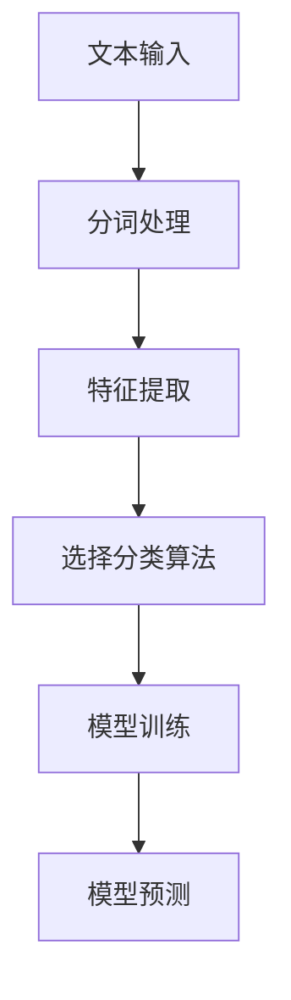

                 

# 情感分析技术在投资决策中的应用与优化

## 关键词：情感分析，投资决策，自然语言处理，机器学习，金融数据

## 摘要：情感分析技术是一种通过分析文本数据来识别和量化情感倾向的技术，其在投资决策中的应用日益广泛。本文将探讨情感分析技术在投资决策中的应用，分析其优势和挑战，并提出优化策略，以提高情感分析在投资决策中的准确性和可靠性。通过结合实际案例和系统设计，本文旨在为投资者和相关技术研究者提供有价值的参考。

---

# 第一部分：情感分析技术基础

## 第1章：情感分析技术概述

### 1.1 情感分析的定义与背景

#### 1.1.1 情感分析的定义
情感分析（Sentiment Analysis），又称意见挖掘，是一种自然语言处理技术，旨在通过分析文本数据来识别和量化其中的情感倾向。情感分析的结果通常可以分为正面、负面或中性三类，也可以进一步细分为多个情感维度，如强度、情绪类型等。

#### 1.1.2 情感分析的发展历程
情感分析技术起源于20世纪90年代，最初主要用于社交媒体分析。随着机器学习和深度学习技术的发展，情感分析的准确性和应用场景得到了显著提升。近年来，情感分析在金融领域的应用逐渐成为研究热点。

#### 1.1.3 情感分析在投资决策中的应用背景
投资决策中，市场情绪和投资者心理对资产价格有着重要影响。通过分析新闻、社交媒体、公司财报等文本数据，投资者可以更及时地捕捉市场情绪变化，从而做出更明智的投资决策。情感分析技术为这一需求提供了技术支持。

### 1.2 投资决策中的情感因素

#### 1.2.1 投资者情绪对市场的影响
投资者情绪是影响市场波动的重要因素。当市场情绪乐观时，资产价格往往会上涨；当市场情绪悲观时，资产价格则可能下跌。通过分析社交媒体、新闻媒体等渠道的文本数据，可以有效捕捉市场情绪的变化。

#### 1.2.2 情感分析在投资决策中的作用
情感分析可以帮助投资者快速识别市场情绪，预测市场走势，发现投资机会，优化投资组合。此外，情感分析还可以用于风险管理和舆情监控，帮助投资者及时规避潜在风险。

#### 1.2.3 情感分析的挑战与局限性
情感分析在投资决策中的应用也面临一些挑战，如数据噪声、情感表达的模糊性、文化差异等。此外，情感分析模型的准确性和实时性也是需要重点关注的问题。

---

## 第2章：情感分析的核心技术

### 2.1 文本预处理技术

#### 2.1.1 分词与词干提取
文本预处理是情感分析的第一步。分词是将文本分割成单词或短语的过程，而词干提取则是去掉单词的不重要部分，保留词干。

#### 2.1.2 停用词处理
停用词是指在文本中没有实际意义的词汇，如“的”、“是”等。去除停用词可以减少文本的冗余信息，提高情感分析的准确率。

#### 2.1.3 词向量表示
词向量表示是将单词或短语映射到向量空间的技术，常用的方法包括Word2Vec和GloVe。词向量可以捕捉单词之间的语义关系，为情感分析提供有效的特征表示。

### 2.2 情感特征提取

#### 2.2.1 基于词袋模型的特征提取
词袋模型是一种简单的特征提取方法，它将文本表示为单词的集合，不考虑单词的顺序。词袋模型适合处理短文本数据，但在长文本中可能会丢失语境信息。

#### 2.2.2 基于词嵌入的特征提取
词嵌入是一种将单词映射到低维连续向量的技术，常用的方法包括Word2Vec和GloVe。词嵌入可以捕捉单词的语义信息，适合处理长文本数据。

#### 2.2.3 高阶特征提取方法
高阶特征提取方法包括基于句法结构、语义网络和情感词典的特征提取。这些方法可以进一步丰富特征表示，提高情感分析的准确率。

### 2.3 情感分类算法

#### 2.3.1 基于机器学习的分类算法
基于机器学习的分类算法包括支持向量机（SVM）、随机森林（RF）和朴素贝叶斯（NB）等。这些算法适合处理中小规模数据，分类效果较好。

#### 2.3.2 基于深度学习的分类算法
基于深度学习的分类算法包括循环神经网络（RNN）、门控循环神经网络（GRU）和Transformer等。这些算法适合处理长文本数据，分类效果更优。

#### 2.3.3 混合模型的应用
混合模型是将机器学习和深度学习模型结合起来的技术，可以利用两种模型的优势，进一步提高情感分析的准确率。

---

## 第3章：情感分析的数学模型与算法

### 3.1 基于机器学习的情感分类模型

#### 3.1.1 支持向量机（SVM）模型
支持向量机是一种监督学习算法，适用于分类和回归问题。SVM通过构建最大边距的超平面，将数据分成不同的类别。

#### 3.1.2 随机森林模型
随机森林是一种基于决策树的集成学习算法，通过构建多棵决策树并进行投票或平均，可以有效提高分类的准确率。

#### 3.1.3 朴素贝叶斯模型
朴素贝叶斯是一种基于概率论的分类算法，假设特征之间相互独立，适用于文本分类问题。

### 3.2 基于深度学习的情感分类模型

#### 3.2.1 循环神经网络（RNN）模型
循环神经网络是一种处理序列数据的深度学习模型，适用于文本分类和情感分析问题。

#### 3.2.2 门控循环神经网络（GRU）模型
门控循环神经网络是对LSTM的一种简化，通过引入门控机制，可以更好地捕捉文本的长距离依赖关系。

#### 3.2.3 Transformer模型
Transformer是一种基于自注意力机制的深度学习模型，近年来在自然语言处理领域取得了显著成果。

### 3.3 情感分析的算法流程图

---

## 第4章：情感分析在投资决策中的应用

### 4.1 投资决策中的情感因素

#### 4.1.1 投资者情绪的识别与预测
通过分析社交媒体、新闻媒体等渠道的文本数据，可以识别投资者情绪，并预测市场走势。

#### 4.1.2 企业舆情分析
企业舆情分析是通过分析公司财报、新闻报道等文本数据，评估企业的市场形象和投资者信心。

#### 4.1.3 投资机会挖掘
通过分析行业动态、市场趋势等文本数据，可以发现潜在的投资机会，优化投资组合。

### 4.2 情感分析的优化策略

#### 4.2.1 特征工程优化
特征工程是提高情感分析准确性的关键步骤。通过选择合适的特征表示和特征选择方法，可以有效提高模型的性能。

#### 4.2.2 模型优化与调参
模型优化是通过调整模型参数和选择合适的算法，进一步提高情感分析的准确率。常用的优化方法包括网格搜索、交叉验证等。

#### 4.2.3 集成学习与模型融合
集成学习是通过结合多个模型的预测结果，进一步提高分类的准确率。常用的集成方法包括投票法、加权平均法等。

### 4.3 情感分析系统的实现

#### 4.3.1 系统架构设计
情感分析系统的架构通常包括数据采集、预处理、特征提取、模型训练和预测等模块。系统架构设计需要考虑数据流、模块之间的交互以及系统的可扩展性。

#### 4.3.2 数据接口设计
数据接口是系统与其他模块交互的接口。常用的数据接口包括文本数据接口、数据库接口等。

#### 4.3.3 系统交互设计
系统交互设计是通过用户界面实现与用户的交互。常用的交互方式包括文本输入、结果展示等。

---

## 第5章：总结与展望

### 5.1 文章总结
本文详细介绍了情感分析技术在投资决策中的应用，分析了其核心技术和优化策略。通过结合实际案例和系统设计，本文为投资者和相关技术研究者提供了有价值的参考。

### 5.2 未来展望
随着人工智能和自然语言处理技术的不断发展，情感分析在投资决策中的应用前景广阔。未来的研究方向包括更准确的情感分类算法、更高效的特征提取方法以及更智能的投资决策系统。

---

以上是《情感分析技术在投资决策中的应用与优化》的技术博客文章的目录大纲。

