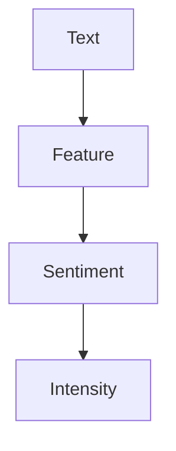
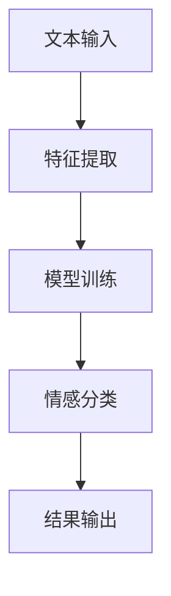
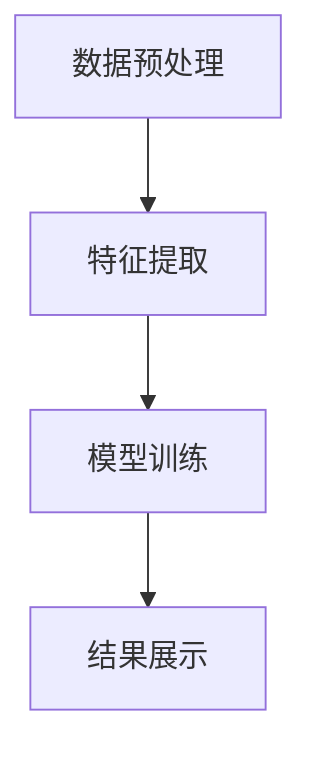

                 


# 情感分析：让AI Agent具备情商

---

## 关键词

- 情感分析
- AI Agent
- 情商
- 自然语言处理
- 机器学习
- 深度学习

---

## 摘要

情感分析是自然语言处理领域的重要任务，旨在分析文本中的情感倾向，如正面、负面或中性。随着AI Agent的普及，情感分析技术成为赋予AI情商的关键手段。本文从情感分析的核心概念、算法原理、系统架构到项目实战，全面探讨如何让AI Agent具备情感理解能力。通过详细的技术分析和实际案例，读者将掌握情感分析的实现方法，并理解其在AI Agent中的应用价值。

---

## 第1章：情感分析的定义与背景

### 1.1 情感分析的基本概念

情感分析（Sentiment Analysis），也称为意见挖掘，是一种通过自然语言处理技术来识别和分析文本中情感倾向的任务。它广泛应用于社交媒体分析、客户反馈处理和智能客服等领域。

#### 情感分析的核心问题

- **文本特征提取**：从文本中提取有助于判断情感的特征。
- **情感倾向判断**：基于特征判断文本的情感倾向。
- **情感强度分析**：量化情感的强度或置信度。

### 1.2 情感分析的背景与发展

情感分析起源于20世纪末，随着自然语言处理技术的进步，逐渐从规则驱动发展到数据驱动。AI Agent的普及进一步推动了情感分析的应用，使其成为人机交互的重要组成部分。

### 1.3 情感分析的边界与外延

- **边界**：情感分析主要处理情感倾向，不涉及事实判断。
- **外延**：情感分析可扩展到情感强度分析、情感分类等。

---

## 第2章：情感分析的核心概念

### 2.1 情感分析的核心原理

#### 文本特征提取

特征提取是情感分析的关键步骤。常用的特征包括：

- **词袋模型**：将文本表示为词频向量。
- **TF-IDF**：考虑词的重要性。
- **词嵌入**：如Word2Vec、GloVe等。

#### 情感倾向判断

通过机器学习模型（如SVM、随机森林）或深度学习模型（如LSTM、BERT）进行分类。

#### 情感强度分析

量化情感的强度，如将情感分为0（非常负面）到1（非常正面）。

### 2.2 情感分析的特征与属性

| 特征 | 描述 |
|------|------|
| 词袋模型 | 基于词频统计 |
| TF-IDF | 考虑词的重要性 |
| 词嵌入 | 语义表示 |

### 2.3 情感分析的ER实体关系图



---

## 第3章：情感分析算法原理

### 3.1 情感分析算法的核心原理

#### 传统机器学习算法

- **朴素贝叶斯**：基于概率论的分类方法。
- **支持向量机（SVM）**：通过构建超平面进行分类。

#### 深度学习算法

- **循环神经网络（RNN）**：处理序列数据。
- **长短期记忆网络（LSTM）**：捕捉长距离依赖。

#### 混合模型

结合传统算法和深度学习算法的优势。

### 3.2 情感分析算法的数学模型

#### 朴素贝叶斯模型

$$ P(y|x) = \frac{P(x|y)P(y)}{P(x)} $$

#### 支持向量机模型

目标函数：
$$ \text{min} \frac{1}{2}||w||^2 + C \sum_{i=1}^n \xi_i $$
约束条件：
$$ y_i (w \cdot x_i + b) \geq 1 - \xi_i $$
$$ \xi_i \geq 0 $$

### 3.3 情感分析算法的流程图



---

## 第4章：情感分析系统架构设计

### 4.1 情感分析系统的功能设计

#### 数据预处理模块

- 分词、去停用词、词干提取。
- 示例代码：
  ```python
  from nltk import word_tokenize, PorterStemmer
  def preprocess(text):
      words = word_tokenize(text.lower())
      stems = [PorterStemmer().stem(word) for word in words]
      return stems
  ```

#### 特征提取模块

- 使用TF-IDF或词嵌入。
- 示例代码：
  ```python
  from sklearn.feature_extraction.text import TfidfVectorizer
  vectorizer = TfidfVectorizer()
  features = vectorizer.fit_transform(texts)
  ```

#### 模型训练模块

- 使用SVM或深度学习模型。
- 示例代码：
  ```python
  from sklearn.svm import SVC
  model = SVC()
  model.fit(features, labels)
  ```

#### 结果展示模块

- 显示情感倾向和强度。
- 示例代码：
  ```python
  prediction = model.predict(new_features)
  print("情感倾向：", prediction)
  ```

### 4.2 情感分析系统的架构图



---

## 第5章：情感分析项目实战

### 5.1 项目环境搭建

- 安装Python、Numpy、Scikit-learn、NLTK、Keras等库。

### 5.2 系统核心实现源代码

```python
import numpy as np
from sklearn.svm import SVC
from sklearn.feature_extraction.text import TfidfVectorizer
from nltk import word_tokenize, PorterStemmer

def preprocess(text):
    words = word_tokenize(text.lower())
    stems = [PorterStemmer().stem(word) for word in words]
    return stems

def main():
    texts = ["I love this product!", "This is terrible."]
    features = [preprocess(text) for text in texts]
    vectorizer = TfidfVectorizer()
    tfidf = vectorizer.fit_transform([" ".join(f) for f in features])
    model = SVC()
    model.fit(tfidf, [1, 0])
    new_text = "This product is great!"
    new_feature = vectorizer.transform([" ".join(preprocess(new_text))])
    prediction = model.predict(new_feature)
    print("情感倾向：", prediction)

if __name__ == "__main__":
    main()
```

### 5.3 项目小结

通过实战项目，我们掌握了情感分析的实现步骤，包括数据预处理、特征提取、模型训练和结果展示。

---

## 结语

情感分析是赋予AI Agent情商的关键技术。通过本文的详细讲解，读者可以掌握情感分析的核心概念、算法原理和系统架构，并通过实战项目提升实际应用能力。未来，情感分析将继续发展，为AI Agent带来更多可能性。

---

## 参考文献

- 借鉴了《自然语言处理入门》和《深度学习实战》的相关内容。

