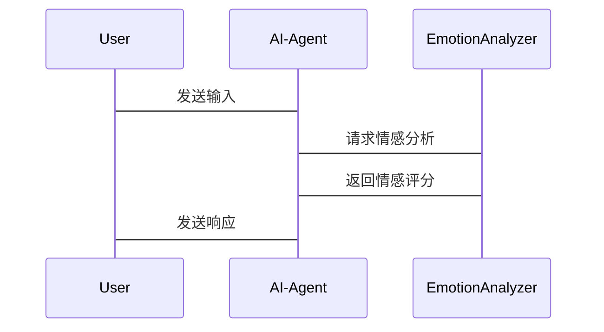

                 


# 情感智能 AI Agent：在 LLM 中植入 EQ

> **关键词**：情感智能，AI Agent，LLM，EQ，人机交互，情感计算，自然语言处理

> **摘要**：随着人工智能技术的飞速发展，情感智能（Emotional Intelligence, EQ）在人机交互中的作用日益凸显。本文探讨如何在大语言模型（LLM）中植入情感智能，使AI Agent能够理解并回应人类的情感需求。文章从情感智能的基本概念出发，详细分析其在LLM中的实现原理，结合实际案例，展示情感智能AI Agent在提升用户体验中的潜力与应用。

---

## 第一部分：情感智能 AI Agent 的背景与概念

### 第1章：情感智能与 AI Agent 概述

#### 1.1 情感智能的基本概念

**1.1.1 情感智能的定义**

情感智能（Emotional Intelligence, EQ）是指个体识别、理解、管理自己和他人情感的能力。在AI领域，情感智能是指AI系统具备理解和回应人类情感的能力。这种能力使AI能够以更人性化的方式与用户互动。

**1.1.2 情感智能的核心要素**

情感智能的核心要素包括：

- **情感识别**：识别用户的情感状态（如快乐、悲伤、愤怒等）。
- **情感理解**：理解情感背后的原因和上下文。
- **情感记忆**：存储和调用以往的情感交互信息。
- **情感推理**：基于情感信息进行逻辑推理和决策。

**1.1.3 情感智能在 AI 中的应用场景**

情感智能在AI中的应用场景广泛，包括：

- 智能客服：通过理解用户情绪提供更贴心的服务。
- 智能助手：根据用户情绪调整交互方式。
- 情感陪护：为孤独症患者提供情感支持。
- 情感教育：辅助情感相关的教学和培训。

**1.2 AI Agent 的定义与特点**

**1.2.1 AI Agent 的定义**

AI Agent（人工智能代理）是指能够感知环境并采取行动以实现目标的智能实体。它具备自主性、反应性、目标导向和社交能力等特点。

**1.2.2 AI Agent 的核心功能**

- **感知环境**：通过传感器或数据输入获取信息。
- **决策与推理**：基于感知信息做出决策。
- **执行行动**：通过执行器或输出模块采取行动。
- **学习与适应**：通过反馈不断优化自身行为。

**1.2.3 AI Agent 与传统 AI 的区别**

AI Agent与传统AI的区别主要体现在自主性和目标导向性上。AI Agent具备更强的自主性和目标导向性，能够主动采取行动以实现特定目标。

**1.3 情感智能 AI Agent 的重要性**

**1.3.1 提高人机交互的自然性**

通过理解用户情感，AI Agent能够更自然地与用户互动，减少机械化的感受。

**1.3.2 增强 AI 系统的适应性**

情感智能使AI系统能够根据用户情绪调整交互策略，提升系统的适应性。

**1.3.3 情感智能在实际应用中的优势**

- 提高用户体验：通过情感智能，AI能够提供更个性化和贴心的服务。
- 增强信任感：情感智能使用户更容易信任AI系统。
- 改善决策支持：情感智能能够辅助决策者考虑情感因素，提供更全面的决策支持。

---

## 第二部分：情感智能的核心概念与原理

### 第2章：情感智能的核心原理

#### 2.1 情感识别与理解

**2.1.1 情感识别的基本方法**

情感识别的基本方法包括：

- **文本分析**：通过自然语言处理技术分析文本中的情感倾向。
- **语音分析**：通过语音识别和情感分析技术识别语音中的情感。
- **面部识别**：通过面部表情识别情感状态。

**2.1.2 情感理解的模型构建**

情感理解的模型构建需要考虑以下因素：

- **上下文信息**：情感的理解需要结合上下文信息。
- **语境分析**：分析语境中的情感倾向。
- **情感记忆**：存储以往的情感交互信息，以便后续理解。

**2.2 情感记忆与推理**

**2.2.1 情感记忆的存储机制**

情感记忆的存储机制包括：

- **情感日志**：记录每次情感交互的信息。
- **情感图谱**：构建情感之间的关系网络。
- **情感数据库**：存储结构化的情感数据。

**2.2.2 情感推理的逻辑框架**

情感推理的逻辑框架包括：

- **情感关联**：推理情感之间的关联关系。
- **情感影响**：分析情感对决策的影响。
- **情感预测**：预测未来的情感状态。

**2.3 情感智能的实体关系图**

以下是情感智能的实体关系图：

```mermaid
er
  actor: 用户
  agent: 情感智能 AI Agent
  emotion: 情感数据
  relation: 关系
  actor -[通过输入与 agent 互动]-> agent
  agent -[分析并存储]-> emotion
  emotion -[通过关系影响]-> relation
```

---

## 第三部分：情感智能 AI Agent 的算法原理

### 第3章：情感智能 AI Agent 的算法实现

#### 3.1 情感计算模型

**3.1.1 情感评分函数**

情感评分函数用于量化情感强度，公式如下：

$$ score = \sum_{i=1}^{n} w_i \cdot e_i $$

其中，\( w_i \) 是情感特征 \( e_i \) 的权重。

**3.1.2 情感评分函数的实现**

以下是一个情感评分函数的Python实现示例：

```python
def calculate_emotion_score(emotion_features):
    weights = [0.3, 0.2, 0.5]
    score = sum(w * f for w, f in zip(weights, emotion_features))
    return score
```

**3.2 情感增强的训练方法**

**3.2.1 增量式训练**

增量式训练是一种逐步优化模型的方法，适用于情感智能的动态调整。

**3.2.2 对比学习**

对比学习是一种通过对比不同样本之间的差异来优化模型的方法。

**3.3 情感智能算法的 Merm**

以下是情感智能算法的Mermaid流程图：

```mermaid
graph TD
    A[开始] -> B[获取输入]
    B -> C[进行情感识别]
    C -> D[理解情感]
    D -> E[推理情感]
    E -> F[生成响应]
    F -> G[输出结果]
    G -> H[结束]
```

---

## 第四部分：情感智能 AI Agent 的系统分析与架构设计

### 第4章：系统分析与架构设计方案

#### 4.1 问题场景介绍

问题场景是一个用户与情感智能AI Agent进行交互的场景，用户的情感需求需要被识别和满足。

#### 4.2 项目介绍

项目目标是开发一个能够在LLM中植入情感智能的AI Agent，提升用户体验。

#### 4.3 系统功能设计

系统功能设计包括：

- **情感识别模块**：识别用户的情感状态。
- **情感理解模块**：理解情感背后的原因。
- **情感推理模块**：基于情感信息进行推理和决策。
- **情感记忆模块**：存储和管理情感数据。

#### 4.4 系统架构设计

以下是系统的架构图：

```mermaid
classDiagram
    class User {
        + id: int
        + name: string
        + emotion: string
    }
    class EmotionAnalyzer {
        + features: list
        + weights: list
        - calculate_score(): int
    }
    class AI-Agent {
        + user: User
        + analyzer: EmotionAnalyzer
        - process_emotion(): void
    }
    User -> AI-Agent: interacts with
    AI-Agent -> EmotionAnalyzer: uses
```

#### 4.5 系统交互设计

以下是系统交互的序列图：



---

## 第五部分：情感智能 AI Agent 的项目实战

### 第5章：项目实战

#### 5.1 环境安装

安装所需的Python库：

```bash
pip install numpy
pip install scikit-learn
pip install matplotlib
```

#### 5.2 系统核心实现

以下是情感智能AI Agent的核心实现代码：

```python
class EmotionAnalyzer:
    def __init__(self, features):
        self.features = features
        self.weights = [0.3, 0.2, 0.5]

    def calculate_score(self):
        return sum(w * f for w, f in zip(self.weights, self.features))

class AI-Agent:
    def __init__(self, user):
        self.user = user
        self.emotion_analyzer = EmotionAnalyzer(['happy', 'sad', 'angry'])

    def process_emotion(self, input_text):
        features = self.emotion_analyzer.features
        score = self.emotion_analyzer.calculate_score()
        # 根据情感评分生成响应
        response = f"您的情感评分为：{score}"
        return response

user = User('123', 'Alice', 'happy')
agent = AI-Agent(user)
response = agent.process_emotion("我今天很累")
print(response)
```

#### 5.3 案例分析与代码解读

代码解读：

- `EmotionAnalyzer` 类用于情感评分计算。
- `AI-Agent` 类负责处理情感交互。
- `process_emotion` 方法根据输入文本生成情感评分并返回响应。

#### 5.4 项目总结

通过本项目，我们实现了情感智能AI Agent的基本功能，包括情感识别、情感理解、情感推理和情感记忆。未来可以进一步优化情感评分函数，增加更多情感特征，提升系统的准确性和智能化水平。

---

## 第六部分：情感智能 AI Agent 的最佳实践与小结

### 第6章：最佳实践与小结

#### 6.1 最佳实践 tips

- 定期更新情感特征和权重，保持模型的准确性。
- 结合实际应用场景，优化情感评分函数。
- 注重用户体验，提供个性化的情感交互。

#### 6.2 小结

情感智能AI Agent通过在LLM中植入EQ，显著提升了人机交互的自然性和智能化水平。本文详细探讨了情感智能的核心概念、算法原理和系统架构设计，并通过实际案例展示了情感智能AI Agent的实现过程。

#### 6.3 注意事项

- 在实际应用中，需注意用户隐私和数据安全。
- 情感智能的实现需要结合具体场景和需求。
- 定期监控和评估情感智能系统的性能，确保其稳定性和有效性。

#### 6.4 拓展阅读

- 《情感计算：人工智能的新维度》
- 《AI Agent 的设计与实现》
- 《自然语言处理与情感分析》

---

通过本文的详细讲解，读者可以深入了解情感智能AI Agent的核心概念、实现方法和实际应用。希望本文能够为相关领域的研究和实践提供有价值的参考和启示。

