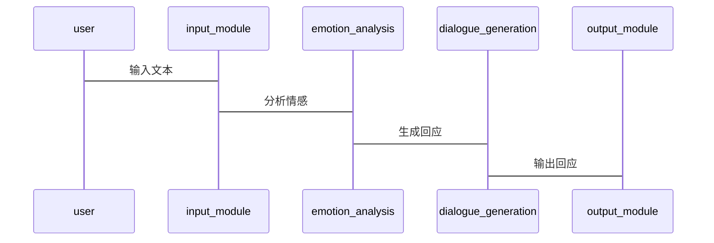

                 


# 情感智能对话AI Agent：LLM驱动的心理健康助手

> 关键词：情感智能对话，AI Agent，LLM，心理健康助手，对话系统，情感分析，大语言模型

> 摘要：本文探讨了情感智能对话AI Agent在心理健康领域的应用，详细介绍了LLM驱动的心理健康助手的核心概念、算法原理、系统架构以及项目实现。通过分析情感智能对话的关键技术，结合实际案例，展示了如何利用大语言模型构建高效的对话系统，为用户提供情感支持和心理健康服务。

---

# 第一部分: 情感智能对话AI Agent的背景与概念

## 第1章: 情感智能对话AI Agent概述

### 1.1 情感智能对话的定义与背景

#### 1.1.1 情感智能对话的定义
情感智能对话是指通过AI技术，理解用户的情感状态并生成相应的回应，从而实现情感支持和心理疏导的对话方式。它结合了自然语言处理（NLP）、情感分析和对话生成等技术，旨在提供个性化的心理健康服务。

#### 1.1.2 情感智能对话的发展背景
随着人工智能技术的快速发展，心理健康问题逐渐受到社会关注。传统的心理健康服务依赖于专业心理咨询师，但成本高、覆盖范围有限。AI技术的引入为大规模的心理健康服务提供了可能，情感智能对话AI Agent应运而生。

#### 1.1.3 情感智能对话的应用场景
- **心理咨询服务**：为用户提供情感支持和心理疏导。
- **健康监测**：通过分析对话内容，识别用户的情绪波动和潜在的心理问题。
- **教育辅助**：帮助学生缓解压力、改善情绪。
- **企业场景**：为员工提供心理健康支持，提升工作效率。

### 1.2 AI Agent的基本概念

#### 1.2.1 AI Agent的定义
AI Agent（智能代理）是一种能够感知环境、执行任务并做出决策的智能系统。它可以理解用户的需求，通过交互提供服务。

#### 1.2.2 AI Agent的核心特征
| 特征 | 描述 |
|------|------|
| 智能性 | 能够理解输入、生成输出，并做出决策。 |
| 反应性 | 能够实时响应用户的输入。 |
| 学习性 | 能够通过数据不断优化自身性能。 |
| 适应性 | 能够根据环境变化调整行为。 |

#### 1.2.3 AI Agent与传统对话系统的主要区别
| 对比维度 | AI Agent | 传统对话系统 |
|----------|----------|----------------|
| 情感理解 | 强大 | 较弱或无 |
| 自我学习 | 具备 | 无 |
| 个性化服务 | 高 | 较低 |

### 1.3 LLM驱动的心理健康助手

#### 1.3.1 LLM在心理健康领域的应用潜力
- **大规模服务**：LLM能够同时为大量用户提供心理健康服务。
- **个性化支持**：通过分析用户情感状态，提供个性化建议。
- **持续优化**：通过用户反馈不断优化对话策略。

#### 1.3.2 情感智能对话AI Agent的目标与价值
- **目标**：为用户提供高效、便捷的心理健康服务。
- **价值**：降低心理健康服务成本，扩大服务覆盖范围，帮助更多人获得心理支持。

#### 1.3.3 当前市场与技术挑战
- **市场**：心理健康需求激增，AI技术为解决资源不足提供了新思路。
- **技术**：如何平衡技术的复杂性和用户体验的简洁性是主要挑战。

---

## 第2章: 情感智能对话的核心概念与联系

### 2.1 情感智能的核心原理

#### 2.1.1 情感分析的基本概念
情感分析是通过自然语言处理技术，识别文本中的情感倾向（如积极、消极、中性）。

#### 2.1.2 情感推理的算法原理
情感推理基于深度学习模型，如LSTM和Transformer，能够理解上下文关系。

#### 2.1.3 情感记忆的机制
情感记忆通过记忆网络（Memory Network）记录用户的情感状态，用于后续对话。

### 2.2 对话系统的关键要素

#### 2.2.1 对话上下文的管理
- **上下文理解**：通过分析对话历史，理解当前对话的语境。
- **上下文记忆**：将对话历史存储在记忆网络中，供后续使用。

#### 2.2.2 对话策略的制定
- **策略生成**：基于当前对话内容和用户情感状态，生成合适的回应策略。
- **策略优化**：通过强化学习不断优化对话策略。

#### 2.2.3 对话生成的模型
- **生成模型**：使用LLM生成自然流畅的对话回应。

### 2.3 LLM在情感智能对话中的作用

#### 2.3.1 LLM的文本生成能力
- **文本生成**：通过Transformer模型生成高质量的对话文本。
- **情感表达**：能够准确表达情感，提升对话的亲和力。

#### 2.3.2 LLM的情感理解能力
- **情感分析**：通过预训练模型理解用户情感。
- **情感推理**：基于上下文进行情感推理。

#### 2.3.3 LLM的对话能力提升
- **对话流畅性**：通过LLM生成流畅的对话回应。
- **个性化表达**：根据用户情感状态调整对话语气和内容。

---

## 第3章: 情感智能对话的核心算法与模型

### 3.1 情感分析算法

#### 3.1.1 基于传统机器学习的情感分析
- **方法**：使用特征工程提取文本特征，训练分类器。
- **公式**：分类器输出概率 $P(y|x)$，其中 $y$ 是情感类别，$x$ 是文本特征。

#### 3.1.2 基于深度学习的情感分析
- **模型**：使用CNN、RNN或Transformer进行情感分类。
- **公式**：模型输出为 $P(y|x)$，其中 $y$ 是情感类别，$x$ 是输入文本。

#### 3.1.3 情感分析的挑战与改进方向
- **挑战**：情感表达的多样性和数据偏差。
- **改进**：引入情感记忆网络和上下文理解机制。

### 3.2 对话生成模型

#### 3.2.1 基于规则的对话生成
- **规则**：预定义对话规则，如问候语和常见问题的回答。

#### 3.2.2 基于统计模型的对话生成
- **模型**：使用马尔可夫链生成对话，基于当前词生成下一个词的概率。

#### 3.2.3 基于LLM的对话生成
- **模型**：使用Transformer模型生成对话文本。
- **公式**：生成概率 $P(w_{t+1}|w_1, ..., w_t)$，其中 $w_i$ 是生成的文本。

### 3.3 情感记忆与关联模型

#### 3.3.1 情感记忆的基本概念
- **记忆网络**：通过记忆网络存储用户情感状态和对话历史。

#### 3.3.2 基于记忆网络的情感关联
- **机制**：通过注意力机制选择相关记忆，生成情感关联的对话回应。

#### 3.3.3 情感记忆的优化方法
- **优化**：通过强化学习优化记忆网络的参数，提升情感关联的准确性。

---

## 第4章: 情感智能对话的系统架构与设计

### 4.1 系统架构概述

#### 4.1.1 系统模块划分
- **输入处理模块**：接收用户输入并进行预处理。
- **情感分析模块**：分析用户情感状态。
- **对话生成模块**：生成对话回应。
- **记忆网络模块**：存储对话历史和情感状态。

#### 4.1.2 模块之间的关系
- **输入处理模块** → 情感分析模块 → 对话生成模块 → 输出。

#### 4.1.3 系统整体流程
- 用户输入 → 预处理 → 情感分析 → 对话生成 → 输出。

### 4.2 系统功能设计

#### 4.2.1 用户输入处理模块
- **功能**：接收用户输入，提取关键信息。
- **实现**：使用正则表达式或关键词匹配提取情感倾向。

#### 4.2.2 情感分析与理解模块
- **功能**：分析用户情感状态，生成情感标签。
- **实现**：使用预训练的情感分析模型，如BERT。

#### 4.2.3 对话生成与反馈模块
- **功能**：根据情感状态生成对话回应。
- **实现**：使用LLM生成对话文本，并根据用户反馈优化回应策略。

### 4.3 系统接口设计

#### 4.3.1 用户端接口设计
- **输入接口**：文本输入框。
- **输出接口**：对话输出框。

#### 4.3.2 后台服务接口设计
- **输入接口**：接收用户输入的API。
- **输出接口**：返回对话回应的API。

#### 4.3.3 数据存储
- **数据库**：存储用户对话历史和情感状态。
- **数据格式**：JSON格式存储对话记录。

### 4.4 系统交互流程

#### 4.4.1 交互流程概述
1. 用户输入文本。
2. 系统预处理输入。
3. 系统分析情感状态。
4. 系统生成对话回应。
5. 系统输出对话回应。

#### 4.4.2 交互流程图


---

## 第5章: 项目实战

### 5.1 环境安装

#### 5.1.1 安装Python环境
```bash
python --version
pip install --upgrade pip
```

#### 5.1.2 安装依赖库
```bash
pip install numpy
pip install tensorflow
pip install transformers
```

### 5.2 系统核心实现

#### 5.2.1 情感分析模块实现
```python
from transformers import pipeline

emotion_pipeline = pipeline("text-classification", model="bert-base-uncased")
def analyze_emotion(text):
    result = emotion_pipeline(text)
    return result[0]['label']
```

#### 5.2.2 对话生成模块实现
```python
from transformers import AutoTokenizer, AutoModelForCausalLM

tokenizer = AutoTokenizer.from_pretrained("gpt2")
model = AutoModelForCausalLM.from_pretrained("gpt2")

def generate_response(text):
    inputs = tokenizer.encode(text, return_tensors="pt")
    outputs = model.generate(inputs, max_length=50)
    response = tokenizer.decode(outputs[0], skip_special_tokens=True)
    return response
```

#### 5.2.3 记忆网络模块实现
```python
class MemoryNetwork:
    def __init__(self):
        self.memory = []
    
    def add_memory(self, text):
        self.memory.append(text)
    
    def get_relevant_memory(self, current_text):
        # 简单实现，返回最新的记忆
        return self.memory[-1] if self.memory else ""
```

### 5.3 案例分析

#### 5.3.1 案例背景
用户输入：“我最近感到很焦虑，不知道该怎么办。”

#### 5.3.2 情感分析
```python
analyze_emotion("我最近感到很焦虑，不知道该怎么办。")  # 输出：'NEGATIVE'
```

#### 5.3.3 对话生成
```python
generate_response("我最近感到很焦虑，不知道该怎么办。")  # 输出："你可以尝试一些放松的技巧，比如深呼吸或冥想。"
```

### 5.4 项目小结

#### 5.4.1 项目总结
- **实现功能**：情感分析、对话生成和记忆网络。
- **技术亮点**：利用LLM生成高质量的对话回应。
- **优化方向**：引入强化学习优化对话策略。

---

## 第6章: 最佳实践与总结

### 6.1 最佳实践

#### 6.1.1 情感分析的优化
- 使用预训练模型提升情感分析的准确性。

#### 6.1.2 对话生成的优化
- 引入强化学习优化对话策略。

#### 6.1.3 记忆网络的优化
- 使用更复杂的记忆网络结构，如端到端记忆网络。

### 6.2 小结

#### 6.2.1 核心内容回顾
- 情感智能对话AI Agent的核心概念。
- LLM在心理健康领域的应用潜力。
- 系统架构与实现细节。

#### 6.2.2 总结与展望
- 总结：情感智能对话AI Agent为心理健康服务提供了新思路。
- 展望：未来将结合更多AI技术，提升系统的智能性和用户体验。

---

## 第7章: 注意事项与拓展阅读

### 7.1 注意事项

#### 7.1.1 数据隐私
- 必须遵守数据隐私法规，保护用户隐私。

#### 7.1.2 技术局限
- 当前技术仍存在情感理解的局限性，需结合专业心理咨询师进行优化。

#### 7.1.3 用户体验
- 确保系统交互的流畅性和用户体验的舒适性。

### 7.2 拓展阅读

#### 7.2.1 相关书籍
- 《Deep Learning》
- 《Natural Language Processing with PyTorch》

#### 7.2.2 相关论文
- "Attention Is All You Need"
- "BERT: Pre-training of Deep Bidirectional Transformers"

---

## 第8章: 思考与练习

### 8.1 思考题

#### 8.1.1 情感智能对话的核心技术有哪些？
- 情感分析、对话生成、记忆网络。

#### 8.1.2 LLM在情感智能对话中的作用是什么？
- 生成高质量的对话文本，理解用户情感。

#### 8.1.3 系统架构设计的关键点是什么？
- 模块划分、接口设计、交互流程。

### 8.2 练习题

#### 8.2.1 实现一个简单的对话生成模块
```python
def simple_dialogue_generation(text):
    return f"我理解您的感受。您提到的{parse_keyword(text)}，确实是一个值得重视的问题。"
```

#### 8.2.2 设计一个记忆网络
```python
class SimpleMemoryNetwork:
    def __init__(self):
        self.memory = {}
    
    def add_memory(self, user_id, text):
        self.memory[user_id] = text
    
    def get_memory(self, user_id):
        return self.memory.get(user_id, "")
```

---

## 附录: 代码实现

### 附录A: 情感分析模块实现

```python
from transformers import pipeline

emotion_pipeline = pipeline("text-classification", model="bert-base-uncased")

def analyze_emotion(text):
    result = emotion_pipeline(text)
    return result[0]['label']
```

### 附录B: 对话生成模块实现

```python
from transformers import AutoTokenizer, AutoModelForCausalLM

tokenizer = AutoTokenizer.from_pretrained("gpt2")
model = AutoModelForCausalLM.from_pretrained("gpt2")

def generate_response(text):
    inputs = tokenizer.encode(text, return_tensors="pt")
    outputs = model.generate(inputs, max_length=50)
    response = tokenizer.decode(outputs[0], skip_special_tokens=True)
    return response
```

### 附录C: 记忆网络模块实现

```python
class MemoryNetwork:
    def __init__(self):
        self.memory = []
    
    def add_memory(self, text):
        self.memory.append(text)
    
    def get_relevant_memory(self, current_text):
        return self.memory[-1] if self.memory else ""
```

---

## 参考文献

1. "BERT: Pre-training of Deep Bidirectional Transformers"，[论文链接](https://arxiv.org/abs/1810.0469)
2. "Attention Is All You Need"，[论文链接](https://arxiv.org/abs/1706.03798)
3. "Natural Language Processing with PyTorch"，[书籍链接](https://www.packtpub.com/list/)

---

# 结语

情感智能对话AI Agent为心理健康服务提供了新的可能性，通过LLM的强大能力，我们可以构建高效、便捷的心理健康助手。未来，随着技术的不断进步，情感智能对话系统将更加智能化和个性化，为更多人提供心理支持和健康服务。

