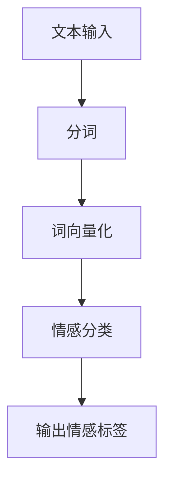
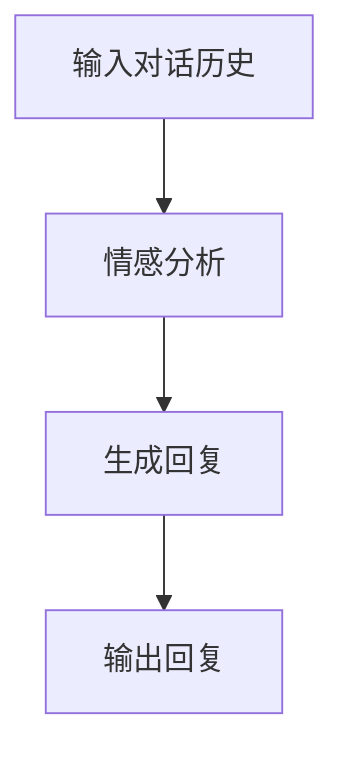
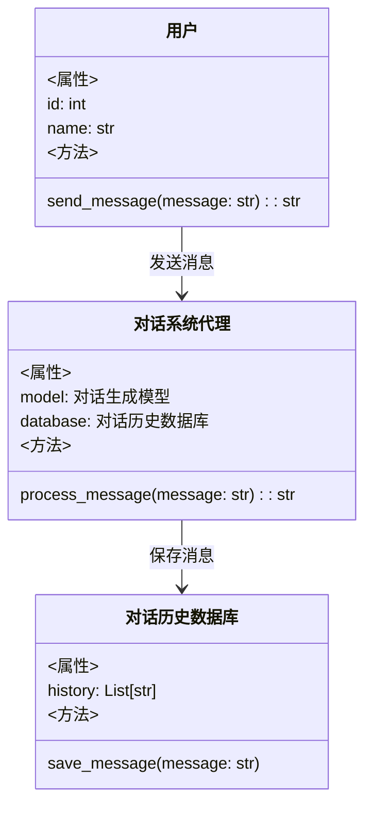
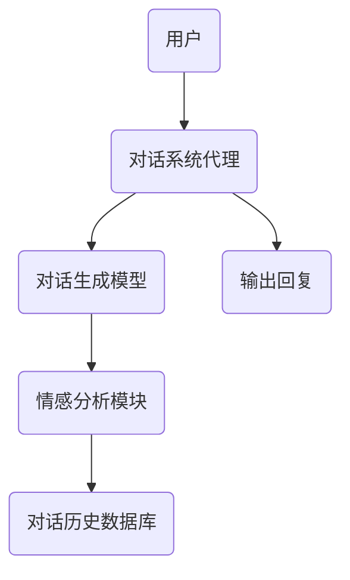
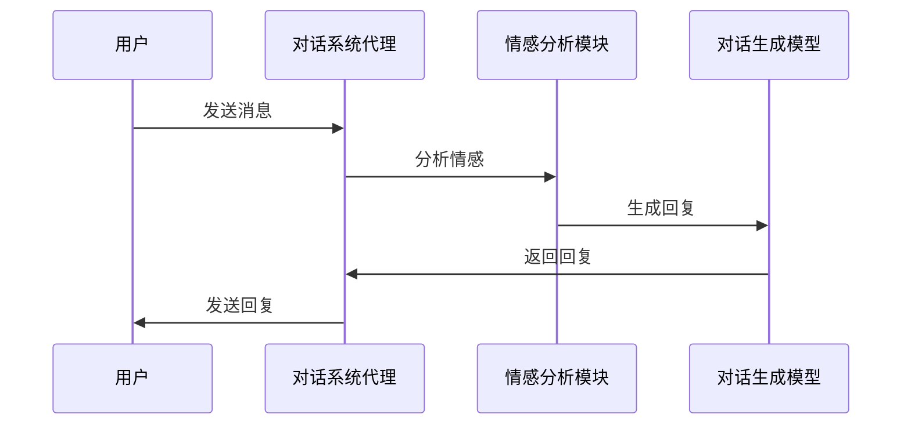

                 


```markdown
# {{情感智能对话系统AI Agent：LLM驱动的深度交互}}

> 关键词：{{情感智能对话系统、LLM、深度交互、情感计算、对话生成}}

> 摘要：{{本文将深入探讨情感智能对话系统的构建与实现，通过分析情感计算、意图识别和对话生成的核心技术，结合大规模语言模型（LLM）的应用，揭示如何通过深度交互提升对话系统的智能化水平。文章内容涵盖情感智能对话系统的背景、核心概念、算法原理、系统架构设计以及实际项目实现，旨在为读者提供全面的技术指导和实践参考。}}

---

## 第一部分: 情感智能对话系统背景与概念

### 第1章: 情感智能对话系统概述
#### 1.1 情感智能对话系统的定义与背景
##### 1.1.1 情感智能对话系统的定义
情感智能对话系统是一种能够理解和生成带有情感色彩的对话的智能系统，通过分析用户的情感倾向和意图，提供更自然、更贴近人类对话的交互体验。

##### 1.1.2 情感智能对话系统的发展历程
从早期的基于规则的对话系统到现代的基于深度学习的模型，情感智能对话系统经历了从简单到复杂的演变，逐步融入情感计算和自然语言处理技术。

##### 1.1.3 情感智能对话系统的应用场景
广泛应用于客服、教育、医疗、娱乐等领域，特别是在智能音箱、虚拟助手等产品中发挥重要作用。

#### 1.2 情感智能对话系统的核心要素
##### 1.2.1 对话历史记录
系统需要记录和分析对话历史，以理解上下文和用户情绪的变化。

##### 1.2.2 情感倾向分析
通过自然语言处理技术，识别用户表达的情感倾向，如正面、负面或中性。

##### 1.2.3 用户意图识别
准确识别用户的意图，以便系统能够生成符合用户需求的回应。

#### 1.3 情感智能对话系统的技术基础
##### 1.3.1 自然语言处理技术
包括分词、句法分析、语义理解等，为对话生成提供语言理解能力。

##### 1.3.2 情感计算与分析
通过情感计算技术，量化用户的情感倾向，为对话生成提供情感维度的输入。

##### 1.3.3 对话生成模型
基于预训练语言模型（如GPT）构建对话生成模型，结合情感信息提升对话的自然度和情感一致性。

---

### 第2章: 情感智能对话系统的背景与问题背景
#### 2.1 情感智能对话系统的背景
##### 2.1.1 当前对话系统的发展现状
从基于规则的传统对话系统到基于深度学习的生成式对话系统的演变过程。

##### 2.1.2 情感智能对话系统的必要性
传统对话系统在情感理解和生成方面存在不足，情感智能对话系统能够提供更自然、更贴近人类的交互体验。

##### 2.1.3 情感智能对话系统的边界与外延
明确情感智能对话系统的功能边界，如情感分析的深度、对话生成的灵活性等。

#### 2.2 情感智能对话系统的核心问题
##### 2.2.1 对话历史记录的处理
如何有效记录和利用对话历史，提升对话的相关性和连贯性。

##### 2.2.2 情感倾向的准确识别
如何通过技术手段准确识别用户的情感倾向，避免误判。

##### 2.2.3 对话生成的流畅性与情感一致性
如何在生成对话时保持流畅性，同时确保情感一致性。

#### 2.3 情感智能对话系统的概念结构
##### 2.3.1 情感智能对话系统的组成要素
包括输入模块、情感分析模块、对话生成模块和输出模块。

##### 2.3.2 系统的核心功能模块
对话历史管理、情感计算、意图识别、对话生成和输出。

##### 2.3.3 情感智能对话系统的整体架构
从输入到输出的完整流程，包括数据输入、处理、分析、生成和输出。

---

### 第3章: 情感智能对话系统的核心概念与联系
#### 3.1 情感智能对话系统的核心原理
##### 3.1.1 情感计算的基本原理
通过特征提取、情感分类和情感强度计算，量化用户的情感倾向。

##### 3.1.2 对话生成的数学模型
基于预训练语言模型的微调，结合情感信息进行对话生成。

##### 3.1.3 情感倾向分析的算法流程
从文本预处理到特征提取，再到分类器训练的完整流程。

#### 3.2 情感智能对话系统的核心概念对比
##### 3.2.1 对话历史记录与情感倾向分析的对比
| 对比维度 | 对话历史记录 | 情感倾向分析 |
|----------|--------------|---------------|
| 输入类型 | 文本序列      | 文本片段       |
| 输出类型 | 历史记录      | 情感标签       |
| 目标     | 维持对话上下文 | 理解用户情感   |

##### 3.2.2 情感倾向分析与对话生成的对比
| 对比维度 | 情感倾向分析 | 对话生成         |
|----------|--------------|-----------------|
| 输入类型 | 文本片段      | 对话历史记录 + 情感信息 |
| 输出类型 | 情感标签      | 对话回复         |
| 目标     | 理解用户情感  | 生成自然对话     |

##### 3.2.3 情感智能对话系统与其他对话系统的对比
| 对比维度       | 基于规则的对话系统 | 生成式对话系统 | 情感智能对话系统 |
|----------------|---------------------|-----------------|-------------------|
| 对话生成方式   | 固定规则           | 预训练模型微调 | 结合情感信息       |
| 情感处理能力   | 无或简单           | 无或有限       | 高度集成           |
| 对话流畅性     | 低                 | 中               | 高                 |

#### 3.3 情感智能对话系统的ER实体关系图
```mermaid
er
    actor: 用户
    agent: 对话系统代理
    message: 对话消息
    emotion: 情感倾向
    intent: 用户意图
    rule: 对话规则
    database: 对话历史数据库
    act

    actor --> message: 发送
    message --> emotion: 分析情感
    emotion --> intent: 确定意图
    intent --> rule: 应用规则
    rule --> database: 更新记录
    database --> agent: 提供历史信息
    agent --> message: 生成回复
```

---

## 第4章: 情感智能对话系统的算法原理
### 4.1 情感计算算法原理
#### 4.1.1 情感计算的数学模型
使用文本表示模型（如词嵌入）和分类模型（如SVM、神经网络）进行情感分类。

#### 4.1.2 情感计算的流程图


#### 4.1.3 情感计算的Python代码示例
```python
import numpy as np
from sklearn.svm import SVC

# 假设X为文本向量，y为情感标签（0表示负面，1表示正面）
model = SVC()
model.fit(X, y)
# 预测情感
y_pred = model.predict(X_test)
```

#### 4.1.4 情感计算的数学公式
$$ \text{损失函数} = \text{交叉熵损失} = -\sum_{i} y_i \log p(y_i) + (1 - y_i)\log(1 - p(y_i)) $$

### 4.2 对话生成算法原理
#### 4.2.1 对话生成的数学模型
基于预训练语言模型（如GPT）的微调，结合情感信息进行对话生成。

#### 4.2.2 对话生成的流程图


#### 4.2.3 对话生成的Python代码示例
```python
import torch
from transformers import GPT2LMHeadModel, GPT2Tokenizer

# 初始化模型
model = GPT2LMHeadModel.from_pretrained('gpt2')
tokenizer = GPT2Tokenizer.from_pretrained('gpt2')

# 生成对话回复
input_ids = tokenizer.encode("用户：我今天心情很好", return_tensors='pt')
input_ids = input_ids.to(torch.device('cuda'))
output = model.generate(input_ids, max_length=50)
response = tokenizer.decode(output[0], skip_special_tokens=True)
print(response)
```

#### 4.2.4 对话生成的数学公式
$$ p(y|x) = \text{softmax}(Wx + b) $$

---

## 第5章: 情感智能对话系统的系统分析与架构设计
### 5.1 系统问题场景介绍
#### 5.1.1 系统目标
构建一个能够理解和生成情感化对话的智能系统，支持多轮对话和情感反馈。

#### 5.1.2 系统功能
包括情感分析、意图识别、对话生成和历史记录管理。

### 5.2 系统架构设计
#### 5.2.1 领域模型类图


#### 5.2.2 系统架构图


#### 5.2.3 接口设计
##### 输入接口
```python
def process_message(message: str) -> str:
    pass
```

##### 输出接口
```python
def generate_response(message: str, history: List[str]) -> str:
    pass
```

#### 5.2.4 系统交互流程图


---

## 第6章: 情感智能对话系统的项目实战
### 6.1 环境安装与配置
#### 6.1.1 安装Python
```bash
python --version
```

#### 6.1.2 安装依赖库
```bash
pip install numpy torch transformers
```

### 6.2 系统核心实现
#### 6.2.1 情感分析模块实现
```python
import torch
from transformers import BertTokenizer, BertForSequenceClassification

# 初始化情感分析模型
model = BertForSequenceClassification.from_pretrained('bert-base')
tokenizer = BertTokenizer.from_pretrained('bert-base')

def analyze_emotion(text: str) -> int:
    inputs = tokenizer(text, return_tensors='pt')
    outputs = model(**inputs)
    logits = outputs.logits
    return torch.argmax(logits).item()
```

#### 6.2.2 对话生成模块实现
```python
from transformers import GPT2LMHeadModel, GPT2Tokenizer

# 初始化对话生成模型
model = GPT2LMHeadModel.from_pretrained('gpt2')
tokenizer = GPT2Tokenizer.from_pretrained('gpt2')

def generate_response(message: str, history: List[str]) -> str:
    full_input = "对话历史：" + " ".join(history) + "\n用户消息：" + message
    input_ids = tokenizer.encode(full_input, return_tensors='pt')
    output = model.generate(input_ids, max_length=50)
    return tokenizer.decode(output[0], skip_special_tokens=True)
```

#### 6.2.3 系统集成与测试
编写主程序，整合情感分析和对话生成模块，进行功能测试。

### 6.3 项目案例分析
#### 6.3.1 案例背景
用户与系统进行多轮对话，系统根据用户情感和意图生成合适的回复。

#### 6.3.2 对话记录与分析
```plaintext
用户：我今天心情很好
系统：太好了！有什么我可以帮你的吗？
用户：我需要写一篇关于情感智能对话系统的文章
系统：好的，我可以帮助你分析情感智能对话系统的实现细节。
```

#### 6.3.3 系统输出与总结
分析对话过程中的情感变化和意图识别准确性，总结系统的表现。

### 6.4 项目小结
总结项目实现的关键点，包括情感分析模块的准确性、对话生成的流畅性以及系统的整体架构设计。

---

## 第7章: 情感智能对话系统的总结与展望
### 7.1 总结
回顾全文，总结情感智能对话系统的核心技术、实现方法和实际应用。

### 7.2 未来展望
探讨情感智能对话系统的未来发展方向，如多模态对话、情感记忆机制等。

### 7.3 最佳实践Tips
#### 7.3.1 系统设计
建议在系统设计时充分考虑对话历史的存储和管理，确保情感分析的准确性。

#### 7.3.2 技术实现
推荐使用预训练语言模型结合情感计算技术，提升对话生成的自然度和情感一致性。

#### 7.3.3 项目实施
在项目实施过程中，建议进行充分的测试和优化，确保系统的稳定性和用户体验。

---

## 第8章: 附录
### 8.1 参考文献
列出本文中引用的相关技术资料、论文和工具文档。

### 8.2 工具与库
介绍本文中使用的主要工具和库，如Python、TensorFlow、Transformers等。

### 8.3 代码仓库
提供本文涉及的代码仓库链接，方便读者获取和学习。

---

以上是《情感智能对话系统AI Agent：LLM驱动的深度交互》的文章目录大纲结构，希望对您有所帮助！

