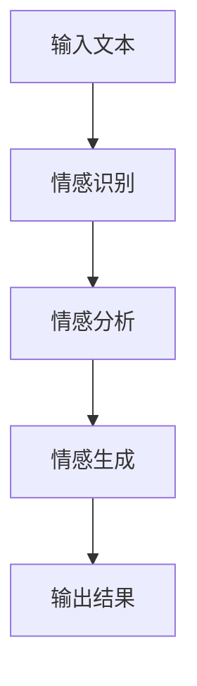
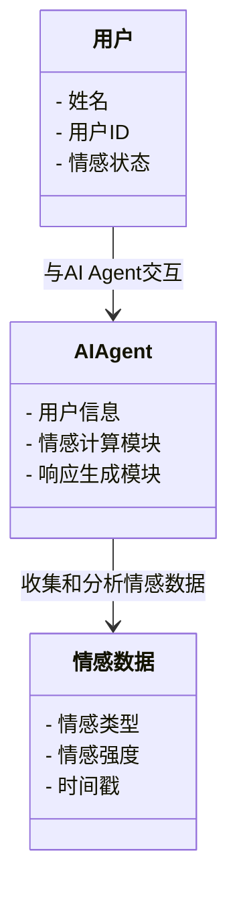
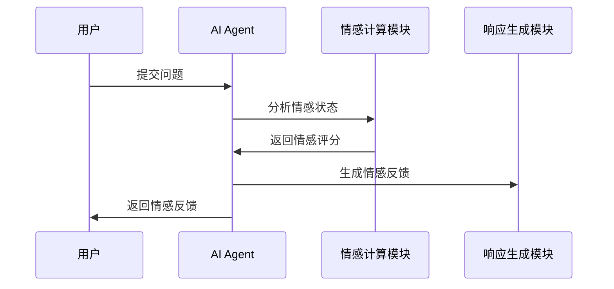

                 


# 情感计算在AI Agent中的应用：增强LLM的EQ

## 关键词：情感计算、AI Agent、LLM、EQ增强、自然语言处理、人工智能

## 摘要：情感计算是一种结合人工智能和心理学的技术，通过分析和理解人类情感，增强LLM（大型语言模型）的情商（EQ），从而提升AI Agent在人机交互中的表现。本文从情感计算的基本概念出发，深入探讨其在AI Agent中的应用，结合具体案例和数学模型，详细讲解情感计算的算法原理、系统架构设计及项目实战，最终总结情感计算在增强LLM EQ中的最佳实践。

---

## 第一部分：情感计算与AI Agent的背景介绍

### 第1章：情感计算的基本概念

#### 1.1 情感计算的定义与背景

- **情感计算的定义**：情感计算（Affective Computing）是研究计算机系统如何识别、理解和模拟人类情感的一门交叉学科，旨在通过技术手段捕捉和分析情感信息，从而实现更自然的人机交互。

- **情感计算的背景**：随着AI技术的发展，单纯依赖逻辑推理的AI系统已无法满足人们对智能化服务的需求。情感计算的引入，使得AI Agent能够理解并回应人类的情感需求，从而提升用户体验。

- **情感计算与AI Agent的关系**：AI Agent通过情感计算技术，能够识别用户的情感状态，并根据情感反馈调整自身的响应策略，从而提供更贴心的服务。

---

#### 1.2 情感计算的核心要素

| 核心要素         | 描述                                       |
|------------------|------------------------------------------|
| 情感识别         | 通过文本、语音或面部表情识别用户的情感状态。 |
| 情感分析         | 对情感数据进行分类和理解，如正面、负面或中性。 |
| 情感生成         | 根据情感分析结果生成符合情感需求的响应。   |

#### 1.3 情感计算的挑战与机遇

- **挑战**：
  - 情感数据的多样性和模糊性。
  - 如何在不同文化背景下准确识别情感。
  - 情感计算的实时性和准确性之间的平衡。

- **机遇**：
  - 提升AI Agent的用户体验。
  - 拓展情感计算在教育、医疗、客服等领域的应用。

---

## 第二部分：情感计算的核心概念与联系

### 第2章：情感计算的核心原理

#### 2.1 情感计算的原理概述

- **情感计算的基本原理**：通过收集和分析用户的情感数据（如文本、语音、面部表情等），利用自然语言处理和机器学习技术，识别和分类用户的情感状态，并生成相应的反馈。

- **情感计算的关键技术**：
  - 情感识别：基于文本的情感分析（如情感词典、深度学习模型）。
  - 情感生成：基于情感分类结果生成符合情感需求的响应。

#### 2.2 情感计算与传统LLM的对比

| 特性              | 传统LLM                     | 增强情感计算的LLM                |
|-------------------|-----------------------------|---------------------------------|
| 核心能力          | 逻辑推理和语言生成         | 逻辑推理、语言生成 + 情感识别与生成 |
| 用户交互方式      | 纯文本交互                 | 情感感知与情感反馈               |
| 优势              | 高效处理大规模文本数据     | 提供更贴近人类情感的交互体验     |
| 局限性            | 缺乏情感理解能力             | 计算复杂度高，对实时性要求高     |

#### 2.3 情感计算的ER实体关系图

```mermaid
er
    actor: 用户
    agent: AI Agent
    emotion: 情感数据
    relation: 情感计算关系
    actor -|> agent: 与AI Agent交互
    agent -|> emotion: 收集情感数据
    emotion -|> relation: 分析情感关系
```

---

## 第三部分：情感计算的算法原理

### 第3章：情感计算的算法流程

#### 3.1 情感计算的处理流程



#### 3.2 情感计算的数学模型

- **情感概率模型**：$$P(\text{情感} | \text{输入}) = \frac{\text{输入中情感词的频率}}{\text{总词数}}$$

- **情感评分公式**：$$\text{情感评分} = \sum (\text{情感词权重} \times \text{情感词出现次数})$$

#### 3.3 情感计算的代码实现

```python
def calculate_emotion_score(text):
    # 情感词权重表
    emotion_weights = {
        'happy': 0.8,
        'sad': -0.6,
        'angry': -0.9,
        'excited': 0.7
    }
    # 计算情感评分
    score = 0
    for word in text.split():
        if word in emotion_weights:
            score += emotion_weights[word]
    return score
```

---

## 第四部分：系统分析与架构设计方案

### 第4章：情感计算的系统架构设计

#### 4.1 问题场景介绍

- **场景描述**：设计一个基于情感计算的智能客服系统，帮助用户解决情感化问题（如投诉处理、情感支持等）。

#### 4.2 系统功能设计



#### 4.3 系统架构设计


#### 4.4 系统接口设计

- **接口描述**：
  - 输入接口：用户输入的文本或语音。
  - 输出接口：AI Agent的情感反馈响应。

#### 4.5 系统交互流程



---

## 第五部分：项目实战

### 第5章：情感计算在智能客服中的应用

#### 5.1 环境安装

- **工具与库**：
  - Python 3.8+
  - NLTK、spaCy（自然语言处理库）
  - Scikit-learn（机器学习库）
  - Flask（Web框架）

#### 5.2 系统核心实现

```python
# 情感计算模块
from sklearn.feature_extraction.text import TfidfVectorizer
from sklearn.svm import SVC

def train_emotion_classifier(X_train, y_train):
    vectorizer = TfidfVectorizer()
    X_vec = vectorizer.fit_transform(X_train)
    clf = SVC()
    clf.fit(X_vec, y_train)
    return clf, vectorizer

# 响应生成模块
def generate_emotional_response(emotion, context):
    response_map = {
        'happy': "看起来你心情很好，有什么我可以帮助你的吗？",
        'sad': "我能理解你现在的心情，有什么我可以为你做的吗？",
        'angry': "请冷静，我会尽力帮你解决问题。",
        'excited': "太好了！有什么我可以立即为你做的吗？"
    }
    return response_map.get(emotion, "抱歉，我暂时无法理解你的情感状态。")
```

#### 5.3 项目小结

- **项目总结**：通过情感计算模块的引入，AI Agent能够更好地理解用户情感状态，提供更贴心的服务。
- **代码实现**：展示了情感计算在实际项目中的应用，包括情感分类模型的训练和情感反馈的生成。

---

## 第六部分：最佳实践与小结

### 第6章：情感计算的最佳实践

#### 6.1 小结

- 情感计算的核心在于准确识别和理解用户情感，同时生成符合情感需求的反馈。
- 在实际应用中，需要结合具体场景设计合适的情感计算模型。

#### 6.2 注意事项

- **数据隐私**：情感数据涉及用户隐私，需严格遵守数据保护法规。
- **模型泛化能力**：情感计算模型需要在不同场景下保持良好的泛化能力。
- **实时性与准确性**：在实时交互中，需平衡计算的实时性和结果的准确性。

#### 6.3 拓展阅读

- 建议阅读相关论文和书籍，深入理解情感计算的数学模型和应用场景。

---

## 总结

情感计算作为人工智能领域的重要分支，正在逐步改变人机交互的方式。通过增强LLM的EQ，AI Agent能够更好地理解用户情感需求，提供更优质的服务。本文从理论到实践，全面剖析了情感计算在AI Agent中的应用，为读者提供了丰富的技术细节和实战经验。未来，随着技术的不断发展，情感计算将在更多领域发挥重要作用。

