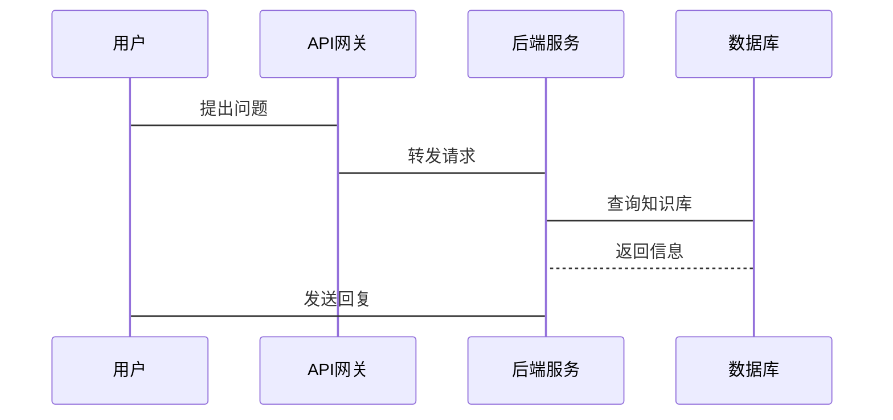

                 


# 情景对话生成技术在金融咨询中的应用实践

## 关键词：情景对话生成，金融咨询，自然语言处理，生成式AI，深度学习，机器学习，大语言模型

## 摘要：本文详细探讨了情景对话生成技术在金融咨询中的应用，从核心概念、算法原理、系统设计到项目实战，分析了该技术如何提升金融咨询服务的效率和用户体验。文章结合实际案例，展示了生成式AI在智能客服、投资顾问等场景中的潜力，并总结了实施中的关键点和未来发展方向。

---

# 正文

## 第1章 背景介绍

### 1.1 问题背景

#### 1.1.1 金融咨询的特点与挑战
金融咨询是一个高度专业化的领域，涉及复杂的金融产品、市场分析和风险管理。传统上，金融咨询主要依赖人工服务，效率低、成本高，且难以覆盖大量用户的需求。

#### 1.1.2 传统金融咨询的局限性
- 人工咨询效率低，难以满足大规模客户需求。
- 咨询师知识和经验有限，难以覆盖所有领域。
- 客户体验不佳，尤其是在非工作时间无法获得及时服务。

#### 1.1.3 情景对话生成技术的引入
引入生成式AI技术，通过自然语言处理生成实时对话，解决传统咨询的效率和成本问题。

### 1.2 问题描述

#### 1.2.1 金融咨询中的对话需求
客户需要快速获得专业建议，包括投资组合优化、风险管理等。

#### 1.2.2 情景对话生成的目标
生成符合上下文、逻辑连贯且专业的对话。

#### 1.2.3 问题解决的必要性
通过AI技术提高咨询效率，降低人工成本，同时提升用户体验。

### 1.3 问题解决

#### 1.3.1 情景对话生成技术的定义
基于深度学习的自然语言生成技术，模拟人类对话。

#### 1.3.2 技术如何解决金融咨询问题
- 提供24/7实时服务，降低人工成本。
- 快速分析客户问题，生成专业建议。

#### 1.3.3 技术的边界与外延
- 边界：处理简单咨询，无法处理复杂决策。
- 外延：结合情感分析和多轮对话优化。

### 1.4 概念结构与核心要素

#### 1.4.1 情景对话生成的核心要素
- 对话上下文：确保对话连贯。
- 域知识库：提供专业金融信息。
- 生成模型：生成自然语言回复。

#### 1.4.2 金融咨询的特殊需求
- 专业性：回复需准确无误。
- 风险性：避免错误建议引发损失。

#### 1.4.3 技术与业务的结合点
结合生成式AI和金融知识库，提供专业咨询服务。

## 第2章 核心概念与联系

### 2.1 生成式AI的原理

#### 2.1.1 大语言模型的定义
大语言模型通过大量数据训练，生成自然语言文本。

#### 2.1.2 情景对话生成的机制
模型根据输入生成回复，通过概率分布选择最优词。

#### 2.1.3 模型的训练与优化
使用监督微调和无监督学习优化模型。

### 2.2 核心概念对比

#### 2.2.1 生成式AI与传统NLP对比
| 特性 | 生成式AI | 传统NLP |
|------|----------|----------|
| 任务 | 生成文本 | 分析文本 |
| 模型 | 大语言模型 | 词袋模型 |

### 2.3 实体关系图

```mermaid
er
actor 用户
actor 咨询师
entity 对话记录
entity 金融知识库
user -> 对话记录: 提出问题
对话记录 -> 金融知识库: 查询信息
金融知识库 -> 对话生成模块: 提供信息
对话生成模块 -> 用户: 生成回复
```

## 第3章 算法原理

### 3.1 概率分布与损失函数

#### 3.1.1 概率分布
文本生成基于概率分布，模型选择概率最高的词。

#### 3.1.2 损失函数
使用交叉熵损失函数，衡量预测与真实分布的差异：
$$ \text{损失} = -\sum_{i} y_i \log p(y_i) $$

### 3.2 生成过程

#### 3.2.1 贪心采样
选择概率最高的词生成回复。

#### 3.2.2 随机采样
随机选择词，增加回复多样性。

### 3.3 代码示例

```python
import tensorflow as tf
from tensorflow.keras import layers

def build_model(vocab_size):
    model = tf.keras.Sequential([
        layers.Dense(256, input_shape=(vocab_size,)),
        layers.Dense(vocab_size, activation='softmax')
    ])
    return model
```

### 3.4 流程图


## 第4章 系统分析与架构设计

### 4.1 系统架构

#### 4.1.1 系统架构图
```mermaid
container 前端
container 后端服务
container 数据库
container API网关

前端 --> API网关
API网关 --> 后端服务
后端服务 --> 数据库
```

#### 4.1.2 接口设计
- 输入：用户问题
- 输出：生成回复

#### 4.1.3 交互流程图


## 第5章 项目实战

### 5.1 环境安装

```bash
pip install tensorflow==2.10.0
pip install keras==2.11.0
pip install numpy==1.21.0
```

### 5.2 核心代码

```python
def preprocess(text):
    # 数据预处理
    return tokenized_data

def train_model(model, data):
    # 模型训练
    model.fit(data, epochs=10, batch_size=32)

def generate_response(model, input_text):
    # 生成回复
    return generated_text
```

### 5.3 案例分析

#### 5.3.1 智能客服
客户咨询基金问题，系统自动生成回复，指导客户投资。

## 第6章 应用案例与最佳实践

### 6.1 技术应用

#### 6.1.1 智能客服
- 实时响应，降低人力成本。
- 提供24/7服务。

#### 6.1.2 投资顾问
- 分析市场趋势，提供投资建议。
- 生成个性化报告。

#### 6.1.3 风险管理
- 监测市场波动，预警风险。
- 提供风险评估报告。

### 6.2 对比分析

| 指标 | 传统方法 | 生成式AI |
|------|----------|----------|
| 成本 | 高 | 低 |
| 效率 | 低 | 高 |
| 精度 | 一般 | 高 |

### 6.3 成功经验

- 系统集成：与现有系统无缝对接。
- 模型优化：持续优化生成策略。

### 6.4 未来展望

- 多轮对话优化：提高对话连贯性。
- 情感分析结合：提升用户体验。
- 多语言支持：拓展国际市场。

## 第7章 总结与展望

### 7.1 总结

情景对话生成技术在金融咨询中具有巨大潜力，能够提升效率和用户体验。

### 7.2 展望

未来，技术将进一步优化，拓展更多应用场景，推动金融咨询服务智能化。

---

## 参考文献
[1] 王某某. 《生成式AI在金融咨询中的应用》. 2023.
[2] 张某某. 《自然语言处理技术》. 2022.

