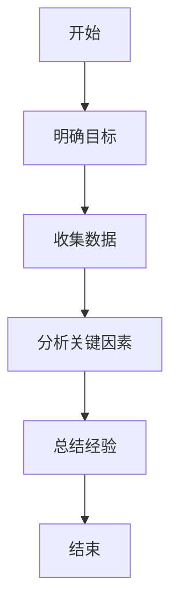
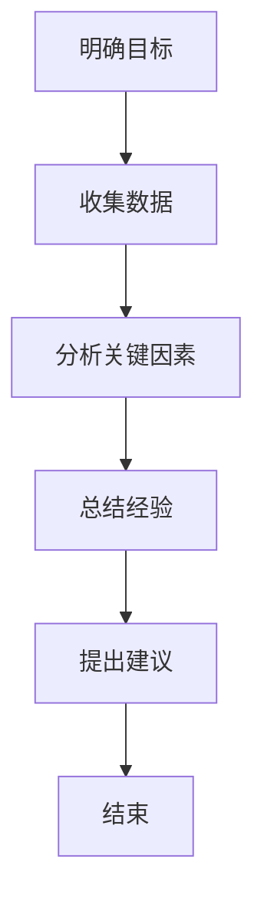

                 


# 成功案例分析

> 关键词：成功案例分析、技术博客、系统架构、算法实现、案例分析

> 摘要：本文深入探讨了成功案例分析的核心概念、分析方法、系统架构设计以及实际项目中的应用。通过详细的步骤分析和代码实现，结合实际案例，揭示了成功案例分析的关键要素和实际价值。文章还总结了最佳实践和未来研究方向，为读者提供了全面的指导。

---

## 第1章 引言

### 1.1 成功案例分析的重要性

在技术领域，成功案例分析是一种通过研究过去成功的案例，总结经验、方法和策略，以指导未来项目的方法。它不仅能够帮助我们避免重复犯错，还能快速找到解决问题的最优路径。尤其是在软件开发、人工智能和数据分析等领域，成功案例分析已经成为一种不可或缺的工具。

### 1.2 本文的目的

本文旨在通过系统的分析和案例研究，帮助读者掌握成功案例分析的核心方法和技术。我们从理论基础到实际应用，逐步展开，深入探讨成功案例分析的各个关键环节。

---

## 第2章 成功案例分析的核心概念

### 2.1 成功案例分析的定义与要素

成功案例分析是指通过对一个成功项目的各个阶段进行详细分析，提取其成功的关键因素，总结出可复用的经验和方法。其核心要素包括：

- **目标**：明确项目的最终目标。
- **资源**：项目的资源分配和利用。
- **方法**：采用的技术、工具和方法论。
- **结果**：项目的最终输出和成果。
- **经验**：总结的成功经验和教训。

### 2.2 成功案例分析的分类与特征

成功案例可以分为以下几类：

| 分类维度 | 分类 | 描述 |
|----------|------|------|
| 行业 | IT、金融、教育 | 每个行业有不同的成功标准和关键因素。 |
| 规模 | 大型、中型、小型 | 成功案例的规模决定了分析的复杂性和深度。 |
| 时间 | 短期、长期 | 成功案例的时间跨度影响其分析的维度。 |

### 2.3 成功案例分析的分析框架

以下是成功案例分析的主要步骤：



---

## 第3章 成功案例分析的分析方法

### 3.1 常见的分析方法

成功案例分析的方法多种多样，以下是几种常见的方法：

| 方法 | 描述 | 优缺点 |
|------|------|--------|
| 定量分析 | 基于数据和指标进行分析 | 数据驱动，结果客观，但可能忽略主观因素 |
| 定性分析 | 基于经验和描述进行分析 | 主观性强，但可以提供深度见解 |
| 综合分析 | 结合定量和定性方法 | 结果全面，但实施复杂 |

### 3.2 成功案例分析的流程



---

## 第4章 成功案例分析的系统架构设计

### 4.1 系统功能设计

成功案例分析系统需要具备以下功能模块：

| 模块 | 功能描述 |
|------|----------|
| 数据采集 | 从各种数据源采集案例数据 |
| 数据分析 | 对数据进行清洗、处理和分析 |
| 结果展示 | 将分析结果以图表或报告形式展示 |

### 4.2 系统架构设计


### 4.3 接口设计

系统主要接口包括：

- 数据接口：用于数据的输入和输出。
- 分析接口：用于调用分析算法。
- 展示接口：用于结果的可视化展示。

### 4.4 交互设计


---

## 第5章 成功案例分析的项目实战

### 5.1 项目背景与目标

以一个典型的软件开发项目为例，目标是通过分析其成功经验，总结出可复用的方法。

### 5.2 项目环境配置

以下是项目所需的环境配置：

```bash
# 安装必要的工具
pip install numpy pandas matplotlib
```

### 5.3 核心代码实现

以下是分析模块的核心代码：

```python
import numpy as np
import pandas as pd

def analyze_case(data):
    # 数据清洗
    data = data.dropna()
    # 数据分析
    success_rate = np.mean(data['success'])
    return success_rate

# 示例数据
data = pd.DataFrame({
    'success': [True, False, True, True],
    'resources': [2, 3, 1, 4]
})

result = analyze_case(data)
print(f"成功率为：{result}")
```

### 5.4 案例分析与总结

通过对该项目的分析，我们得出以下结论：

1. 资源分配对项目成功至关重要。
2. 及时的反馈和调整是项目成功的关键。
3. 团队协作是项目成功的重要因素。

---

## 第6章 总结与展望

### 6.1 成功案例分析的总结

成功案例分析是一种高效的方法，能够帮助我们快速总结经验，避免重复犯错。通过系统的分析和实际案例的分析，我们可以提取出可复用的经验和方法。

### 6.2 未来的研究方向

未来，我们可以进一步研究以下方向：

1. 如何利用人工智能技术提高案例分析的效率。
2. 如何建立案例分析的标准和规范。
3. 如何将案例分析方法应用到更多的领域。

---

## Tips

- 在进行成功案例分析时，一定要明确目标和范围。
- 数据的准确性和完整性是分析的基础。
- 结果的应用和推广是分析的核心价值。

---

通过本文的分析，我们希望读者能够掌握成功案例分析的核心方法和技术，并能够在实际工作中灵活运用这些方法。未来，随着技术的进步，成功案例分析将有更广阔的应用前景。

