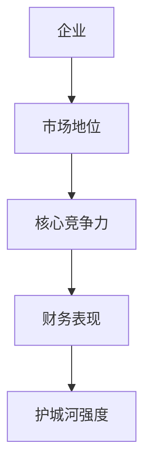
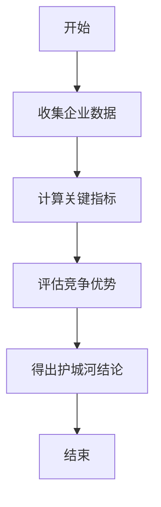
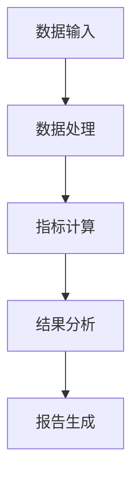
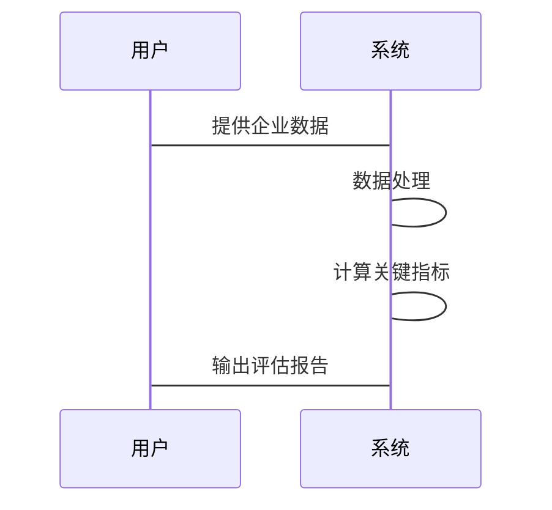

                 


# 戴维·多德的护城河评估体系

> 关键词：护城河评估体系，竞争优势，企业价值，戴维·多德，财务指标，投资分析

> 摘要：护城河是企业在市场竞争中建立的核心竞争优势，戴维·多德的护城河评估体系通过分析企业的财务表现、市场地位和核心竞争力，帮助企业识别和构建可持续的竞争优势。本文系统地介绍该体系的背景、核心概念、算法原理、系统架构设计以及实际应用案例，帮助读者掌握如何在实际中应用这一评估体系，以提升企业的长期价值和市场竞争力。

---

## 第1章: 护城河评估体系的背景介绍

### 1.1 护城河概念的提出

#### 1.1.1 企业竞争优势的定义
企业竞争优势是指企业在市场中相对于竞争对手的独特优势，这些优势可以是成本优势、技术优势、品牌优势、资源优势等。竞争优势是企业在长期发展中能否持续盈利的关键。

#### 1.1.2 护城河概念的提出背景
护城河（Moat）是商业术语，源自城堡的防御工事，象征企业在市场竞争中建立的防御性优势。戴维·多德（David Dodd）在20世纪提出护城河的概念，强调企业通过建立竞争优势，防止竞争对手侵蚀其市场份额和利润。

#### 1.1.3 护城河与企业长期价值的关系
护城河决定了企业的长期价值。具有强大护城河的企业能够在市场中保持领先地位，抵御竞争压力，从而为股东创造持续的超额回报。

### 1.2 多德的护城河评估体系的提出

#### 1.2.1 戴维·多德的生平简介
戴维·多德是美国著名的投资分析师和经济学家，他的研究对现代投资理论有重要影响。他提出的护城河概念在投资分析中被广泛应用，帮助投资者识别具有长期竞争优势的企业。

#### 1.2.2 护城河评估体系的核心思想
多德的护城河评估体系强调通过分析企业的财务表现、市场地位和核心竞争力，评估其在市场中的防御能力。他认为，只有具有强大护城河的企业才能在长期竞争中脱颖而出。

#### 1.2.3 体系在投资分析中的应用
护城河评估体系被广泛应用于投资分析，帮助投资者识别具有长期增长潜力的企业。通过分析企业的护城河宽度，投资者可以更好地评估其投资价值。

### 1.3 护城河评估体系的核心要素

#### 1.3.1 核心竞争力的定义
核心竞争力是企业在市场中与众不同的能力，例如技术创新、成本优势或独特的商业模式。

#### 1.3.2 市场地位的衡量指标
市场地位包括市场份额、品牌影响力和客户忠诚度等指标。强大的市场地位是护城河的重要组成部分。

#### 1.3.3 财务表现与护城河的关系
财务表现，如ROE（净资产收益率）和ROIC（投资资本回报率），是衡量企业护城河的重要指标。高财务表现通常意味着企业具有强大的竞争优势。

---

## 第2章: 护城河评估体系的核心概念与联系

### 2.1 核心概念原理

#### 2.1.1 护城河的五项核心要素
1. **成本优势**：企业通过规模经济或技术优势降低成本。
2. **技术优势**：企业掌握独特的技术或专利。
3. **品牌影响力**：强大的品牌能够吸引客户并抵御竞争对手。
4. **客户忠诚度**：客户对企业产品或服务的高度依赖。
5. **市场进入壁垒**：阻止新进入者进入市场的障碍。

#### 2.1.2 财务指标在护城河评估中的作用
财务指标是评估护城河的重要工具，通过分析企业的盈利能力、资本回报率等指标，可以判断其竞争优势的强弱。

#### 2.1.3 竞争优势的动态变化
竞争优势并非一成不变，企业需要不断创新和适应市场变化，以维持其护城河。

### 2.2 核心概念属性特征对比表格

| 护城河要素       | 描述                       |
|------------------|--------------------------|
| 成本优势         | 企业通过规模经济降低成本   |
| 技术优势         | 企业掌握独特的技术或专利   |
| 品牌影响力       | 强大的品牌能够吸引客户     |
| 客户忠诚度       | 客户对企业产品或服务的高度依赖 |
| 市场进入壁垒     | 阻止新进入者进入市场的障碍 |

### 2.3 ER实体关系图架构



### 2.4 本章小结
本章介绍了护城河评估体系的核心概念，包括五项核心要素和财务指标的作用。通过对比表格和实体关系图，展示了护城河要素之间的关系。

---

## 第3章: 护城河评估体系的算法原理

### 3.1 算法原理概述

#### 3.1.1 护城河评估的逻辑框架
1. 收集企业数据，包括财务数据和市场数据。
2. 计算关键财务指标，如ROE和ROIC。
3. 分析企业的市场地位和核心竞争力。
4. 综合评估企业的护城河强度。

#### 3.1.2 多德模型的算法流程
1. 数据收集与预处理。
2. 计算关键财务指标。
3. 评估竞争优势。
4. 得出护城河结论。

#### 3.1.3 算法的输入与输出
- 输入：企业的财务数据和市场数据。
- 输出：企业的护城河强度评估结果。

### 3.2 算法流程图



### 3.3 算法实现的数学模型

#### 3.3.1 核心公式推导
$$ROIC = \frac{净利润}{投入资本} \times 100\%$$

#### 3.3.2 公式详细解释
$$ROE = \frac{净利润}{平均股东权益} \times 100\%$$

#### 3.3.3 示例计算
假设某企业净利润为100万元，投入资本为500万元，则ROIC为20%。

#### 3.3.4 代码实现
```python
def calculate_roic(net_profit, invested_capital):
    return (net_profit / invested_capital) * 100
```

### 3.4 本章小结
本章详细介绍了护城河评估体系的算法原理，包括流程图、数学公式和代码实现。通过这些工具，可以系统地评估企业的护城河强度。

---

## 第4章: 护城河评估体系的系统分析与架构设计

### 4.1 问题场景介绍

#### 4.1.1 护城河评估的典型场景
- 投资者评估目标企业的投资价值。
- 企业管理层分析自身竞争优势。
- 企业战略规划中的竞争优势分析。

#### 4.1.2 系统分析的目标
- 建立一个系统化的评估框架。
- 提供准确的财务指标分析。
- 识别企业的竞争优势。

#### 4.1.3 系统分析的范围
- 数据输入：企业的财务数据和市场数据。
- 数据处理：数据清洗和预处理。
- 指标计算：计算ROE、ROIC等关键指标。
- 结果分析：评估竞争优势和护城河强度。

### 4.2 系统架构设计

#### 4.2.1 系统功能模块划分
- 数据输入模块：收集企业数据。
- 数据处理模块：清洗和预处理数据。
- 指标计算模块：计算关键财务指标。
- 结果分析模块：评估竞争优势。
- 报告生成模块：输出评估结果。

#### 4.2.2 使用 Mermaid 绘制的系统架构图



### 4.3 接口设计与交互

#### 4.3.1 系统接口定义
- 输入接口：接收企业的财务数据和市场数据。
- 输出接口：输出评估结果报告。

#### 4.3.2 使用 Mermaid 绘制的交互序列图



### 4.4 本章小结
本章详细介绍了护城河评估体系的系统架构设计，包括功能模块划分和系统架构图。通过系统化的分析，可以更高效地评估企业的护城河强度。

---

## 第5章: 护城河评估体系的项目实战

### 5.1 项目介绍

#### 5.1.1 项目背景
以某制造企业为例，评估其护城河强度，分析其竞争优势。

### 5.2 项目核心实现

#### 5.2.1 环境安装与配置
安装必要的数据分析工具，如Python和Pandas库。

#### 5.2.2 数据收集与预处理
收集企业的财务数据和市场数据，清洗数据并进行预处理。

#### 5.2.3 代码实现
```python
import pandas as pd

def calculate_roic(net_profit, invested_capital):
    return (net_profit / invested_capital) * 100

# 数据预处理
data = pd.read_csv('企业数据.csv')
data = data.dropna()

# 计算ROIC
data['ROIC'] = calculate_roic(data['净利润'], data['投入资本'])
```

#### 5.2.4 代码应用解读与分析
通过计算ROIC，评估企业的投资资本回报率，分析其竞争优势。

### 5.3 实际案例分析

#### 5.3.1 案例背景
以某制造企业为例，分析其护城河强度。

#### 5.3.2 数据分析与结果解读
计算ROIC和ROE，分析企业的财务表现和竞争优势。

### 5.4 项目小结
本章通过实际案例展示了如何应用护城河评估体系，帮助企业识别竞争优势，提升长期价值。

---

## 第6章: 最佳实践、小结与注意事项

### 6.1 最佳实践

#### 6.1.1 数据源的选择
选择可靠的数据源，确保数据的准确性和完整性。

#### 6.1.2 指标分析的动态性
定期更新数据，动态评估企业的竞争优势。

### 6.2 小结
护城河评估体系是一个系统化的工具，通过分析企业的财务表现、市场地位和核心竞争力，帮助企业识别竞争优势，提升长期价值。

### 6.3 注意事项

#### 6.3.1 数据质量的重要性
数据质量直接影响评估结果的准确性。

#### 6.3.2 指标的局限性
护城河评估体系依赖于财务指标，可能存在局限性。

#### 6.3.3 实施中的常见问题
- 数据获取困难。
- 指标计算复杂。
- 结果解读困难。

### 6.4 拓展阅读
推荐相关书籍和文献，帮助读者深入理解护城河评估体系。

---

## 第7章: 总结与展望

### 7.1 总结
护城河评估体系是一个重要的工具，帮助企业识别竞争优势，提升长期价值。

### 7.2 展望
未来，护城河评估体系将更加智能化和数据化，帮助企业更好地应对市场竞争。

---

## 参考文献
- 多德，戴维. 《护城河评估体系》
- 其他相关文献和书籍

---

通过以上详细的目录大纲和内容，您可以开始撰写完整的护城河评估体系的技术博客文章。希望这些内容能为您提供清晰的指导和参考！

