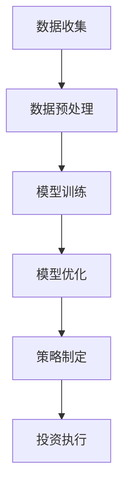

                 

# 《戴维·德雷曼的对比优势投资法》

---

## 关键词：
戴维·德雷曼，对比优势投资法，价值投资，套利机会，风险管理，投资策略，数学模型，系统架构

---

## 摘要：
本文系统介绍了戴维·德雷曼的对比优势投资法，从其核心概念、策略实施、数学模型到风险管理，全面解析了这一投资方法的独特性和实用性。文章通过详细阐述对比优势投资法的理论基础、算法实现、系统架构及实际案例，帮助读者理解如何在现代投资环境中运用这一方法实现超额收益。

---

## 正文：

### 第一部分：对比优势投资法概述

#### 第1章：对比优势投资法的核心概念

##### 1.1 对比优势投资法的定义与背景

- **对比优势投资法**是一种基于市场价差和价值偏离度的投资策略，通过比较不同市场、资产或时间段之间的差异，寻找套利机会或价值低估资产。
- **背景**：传统投资方法依赖于基本面分析或技术分析，但市场效率的提高使得传统方法的收益空间逐渐压缩。对比优势投资法通过识别市场无效性或价差，为投资者提供了新的收益来源。
- **核心要素**：
  - **市场比较**：跨市场、跨资产或跨时间段的比较。
  - **价值评估**：基于基本面或技术面的深度分析。
  - **套利机会**：利用价差或价值偏离进行短期或长期投资。

##### 1.2 对比优势投资法与传统投资方法的区别

- **传统投资方法**：依赖单一市场的基本面分析，注重长期价值。
- **对比优势投资法**：通过多市场、多资产的比较，寻找短期或长期的套利机会。
- **对比分析**：
  | 对比维度 | 传统投资法 | 对比优势投资法 |
  |----------|------------|-----------------|
  | 数据来源 | 单一市场   | 多市场、多资产  |
  | 分析方法 | 基本面分析 | 市场比较与套利   |
  | 投资期限 | 长期       | 短期与长期结合 |

##### 1.3 对比优势投资法的理论基础

- **经济学基础**：市场效率理论、套利定价理论。
- **行为金融学视角**：市场参与者的认知偏差可能导致市场无效性。
- **市场效率与无效性分析**：对比优势投资法依赖于市场的局部无效性，通过比较不同市场或资产的定价差异，寻找套利机会。

#### 第2章：对比优势投资法的核心策略

##### 2.1 对比优势投资法的三大支柱

- **市场比较法**：通过比较不同市场的价格差异，寻找套利机会。
- **价值评估法**：基于基本面分析，评估资产的内在价值。
- **套利机会识别法**：利用市场价差或价值偏离，进行短期或长期投资。

##### 2.2 对比优势投资法的实施步骤

- **确定投资目标**：明确投资市场、资产或时间段。
- **数据收集与分析**：收集相关市场数据，进行价差分析。
- **策略制定与执行**：根据分析结果，制定并执行投资策略。

##### 2.3 对比优势投资法的关键指标

- **市场价差分析**：比较不同市场的价格差异。
- **价值偏离度**：评估资产价格与内在价值的偏离程度。
- **套利空间评估**：判断套利机会的可行性和收益空间。

---

### 第二部分：对比优势投资法的数学模型与算法

#### 第3章：对比优势投资法的数学基础

##### 3.1 对比优势投资法的数学模型

- **对比优势评分公式**：
  $$对比优势评分 = \frac{市场价差}{标准差}$$
  其中，市场价差为不同市场或资产之间的价格差异，标准差为该价差的历史波动性。

- **投资组合优化公式**：
  $$最大收益 = \lambda \cdot 风险调整收益$$
  其中，λ为风险偏好系数，风险调整收益为经过风险调整后的预期收益。

##### 3.2 对比优势投资法的算法实现

- **数据预处理**：清洗和标准化数据，确保数据的可比性。
- **模型训练**：基于历史数据，训练对比优势评分模型。
- **算法优化**：通过参数调整和模型优化，提高预测准确性。

##### 3.3 对比优势投资法的算法流程图

---

### 第三部分：对比优势投资法的系统分析与架构设计

#### 第4章：系统架构设计

##### 4.1 系统功能设计

- **数据采集模块**：实时采集多市场、多资产的数据。
- **数据分析模块**：进行市场价差分析和价值评估。
- **策略制定模块**：基于分析结果，制定投资策略。
- **风险管理模块**：评估和控制投资风险。

##### 4.2 系统架构图

---

### 第四部分：对比优势投资法的项目实战

#### 第5章：实际案例分析

##### 5.1 案例背景

- **市场选择**：A股与港股的同股同价比较。
- **数据收集**：收集A股和港股的同股价格数据。
- **分析与策略制定**：发现价差，制定套利策略。

##### 5.2 项目实施

- **数据预处理**：清洗和标准化数据。
- **模型训练**：训练对比优势评分模型。
- **策略执行**：根据模型结果，执行套利交易。

##### 5.3 项目总结

- **收益分析**：套利交易的收益与风险。
- **经验总结**：市场选择、数据质量、模型准确性对投资结果的影响。

---

### 第五部分：对比优势投资法的最佳实践

#### 第6章：最佳实践与小结

##### 6.1 最佳实践

- **数据源选择**：选择可靠、实时的数据源。
- **模型优化**：定期更新模型，提高预测准确性。
- **风险控制**：设置止损点，控制投资风险。
- **系统维护**：定期检查系统运行状态，确保数据流畅通。

##### 6.2 小结

对比优势投资法通过市场比较和套利机会识别，为投资者提供了新的投资思路。本文详细介绍了对比优势投资法的核心概念、数学模型、系统架构及实际案例，为读者提供了全面的理论和实践指导。

---

### 附录

#### 附录A：对比优势投资法的数学公式汇总

- 对比优势评分公式：
  $$对比优势评分 = \frac{市场价差}{标准差}$$
- 投资组合优化公式：
  $$最大收益 = \lambda \cdot 风险调整收益$$

#### 附录B：对比优势投资法的算法流程图

---

### 结语

对比优势投资法是一种创新的投资策略，通过市场比较和套利机会识别，帮助投资者在复杂多变的市场中寻找超额收益。本文通过系统的分析和详细的案例讲解，为读者提供了全面的理论和实践指导，希望对投资领域的专业人士和爱好者有所帮助。

