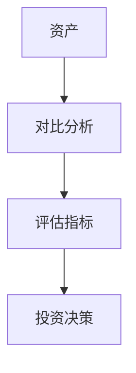
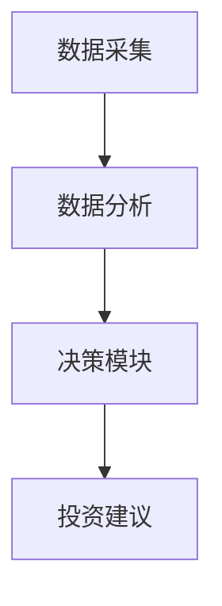
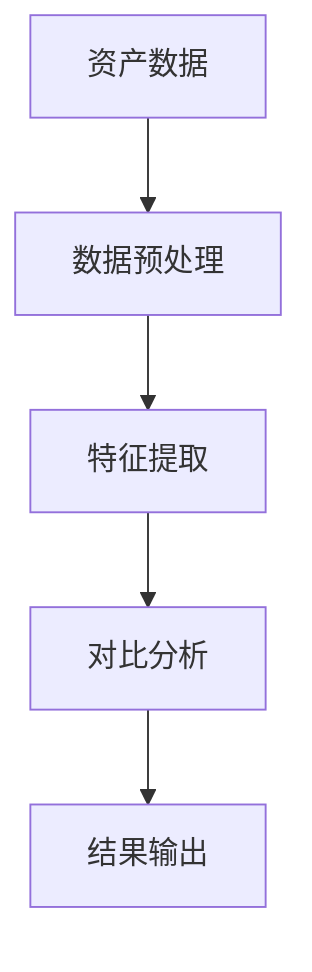

                 


# 戴维·德雷曼的对比资产价值投资策略

## 关键词：
- 资产价值投资
- 对比分析
- 安全边际
- 逆向投资
- 股票评估

## 摘要：
本文深入探讨戴维·德雷曼的对比资产价值投资策略，分析其核心概念、数学模型及实际应用。通过对比分析模型，识别资产的相对价值，优化投资决策。文章结合理论与实践，提供详细的操作步骤和案例分析，帮助读者掌握这一投资方法。

---

## 第一部分：戴维·德雷曼的对比资产价值投资策略概述

## 第1章：戴维·德雷曼投资策略的背景与核心理念

### 1.1 投资背景与问题背景

#### 1.1.1 传统投资方法的局限性
传统的资产价值评估方法，如市盈率（P/E）和市净率（P/B），虽能衡量资产的内在价值，但存在以下问题：
- 忽略了市场整体波动对资产估值的影响。
- 未充分考虑资产间的相对价值差异。
- 单一资产评估可能导致决策偏差。

#### 1.1.2 对比分析在投资决策中的重要性
对比分析通过横向比较不同资产的估值指标，识别市场低估或高估的情况，帮助投资者做出更明智的决策。这种方法的优势在于：
- 发现潜在的投资机会。
- 降低单一评估的偏差风险。
- 提高投资决策的科学性。

#### 1.1.3 资产价值投资的核心问题
资产价值投资的核心在于发现市场价格与内在价值的偏差。戴维·德雷曼的策略通过对比分析，解决了以下问题：
- 如何量化资产的相对价值？
- 如何识别市场波动中的投资机会？
- 如何优化资产配置以最大化收益？

### 1.2 戴维·德雷曼投资策略的提出

#### 1.2.1 投资策略的来源与灵感
戴维·德雷曼的策略受到本杰明·格雷厄姆价值投资理论的启发，但更注重资产间的相对比较。他的研究发现，通过对比分析可以有效识别市场低估的资产。

#### 1.2.2 策略的核心目标与适用范围
- 核心目标：通过对比分析，找到市场价格低于内在价值的资产。
- 适用范围：适用于股票、基金、房地产等多种资产类型。

#### 1.2.3 策略的边界与外延
- 界限：仅适用于可量化的资产，对新兴资产或非量化资产效果有限。
- 外延：结合市场环境和宏观经济指标，优化投资组合。

---

## 第2章：戴维·德雷曼对比资产价值投资策略的核心概念与联系

### 2.1 对比分析模型的定义与原理

#### 2.1.1 对比分析模型的定义
对比分析模型是一种通过比较不同资产的估值指标，评估其相对价值的方法。模型包括数据预处理、特征提取、对比分析和结果输出四个步骤。

#### 2.1.2 模型的核心要素与组成
- 数据预处理：清洗和标准化数据。
- 特征提取：选择关键估值指标，如P/E、P/B等。
- 对比分析：计算相对估值指标，识别低估资产。
- 结果输出：生成投资建议。

#### 2.1.3 模型的输入与输出
- 输入：资产的历史数据、市场指数。
- 输出：资产的相对估值排名和投资建议。

### 2.2 对比分析模型与传统资产价值评估方法的对比

#### 2.2.1 传统评估方法的优缺点
- 优点：简单易懂，适用于单一资产评估。
- 缺点：忽视市场波动和资产间对比。

#### 2.2.2 对比分析模型的独特优势
- 全面性：考虑多资产间的相对价值。
- 精准性：通过对比发现市场低估资产。
- 实用性：适用于多种资产类型。

#### 2.2.3 两种方法的对比分析表格

| 方法            | 优点                          | 缺点                          |
|-----------------|-------------------------------|-------------------------------|
| 传统评估方法    | 简单易懂，适用于单一资产      | 忽略市场波动和资产对比         |
| 对比分析模型    | 全面考虑相对价值，精准识别低估资产 | 数据依赖性高，计算复杂         |

### 2.3 对比分析模型的ER实体关系图



---

## 第3章：戴维·德雷曼对比资产价值投资策略的算法原理

### 3.1 对比分析模型的算法流程

#### 3.1.1 数据预处理
- 数据清洗：处理缺失值、异常值。
- 数据标准化：统一数据格式，便于比较。

#### 3.1.2 特征提取
- 选择关键估值指标，如P/E、P/B、股息率等。

#### 3.1.3 对比分析
- 计算各资产的估值指标排名。
- 识别低于市场平均水平的资产。

#### 3.1.4 结果输出
- 生成投资建议，如买入低估资产，卖出高估资产。

### 3.2 对比分析模型的Python实现

#### 3.2.1 数据预处理与特征提取

```python
import pandas as pd

# 数据预处理
data = pd.read_csv('assets.csv')
data.dropna()  # 删除缺失值

# 特征提取
features = ['PE', 'PB', 'Dividend_Yield']
asset_data = data[features]
```

#### 3.2.2 对比分析与结果输出

```python
def calculate_relative_value(asset_data):
    # 计算各资产的估值指标排名
    asset_data_rank = asset_data.rank()
    # 识别低于市场平均水平的资产
    under_valued_assets = asset_data_rank[asset_data_rank < asset_data_rank.mean()]
    return under_valued_assets

# 调用函数
under_valued_assets = calculate_relative_value(asset_data)
print(under_valued_assets)
```

---

## 第4章：戴维·德雷曼对比资产价值投资策略的系统分析与架构设计

### 4.1 系统功能设计

#### 4.1.1 功能模块
- 数据采集模块：收集资产的历史数据。
- 数据分析模块：执行对比分析，生成投资建议。
- 决策模块：根据分析结果，优化投资组合。

#### 4.1.2 系统架构设计



### 4.2 系统架构设计



---

## 第5章：戴维·德雷曼对比资产价值投资策略的项目实战

### 5.1 项目背景

#### 5.1.1 投资目标
识别低估的科技股，优化投资组合。

#### 5.1.2 数据来源
使用公开的股票数据，包括市盈率、市净率和股息率。

### 5.2 项目实现

#### 5.2.1 环境配置

```bash
pip install pandas numpy matplotlib
```

#### 5.2.2 核心代码实现

```python
import pandas as pd
import numpy as np

# 数据预处理
data = pd.read_csv('stocks.csv')
data.dropna()

# 特征提取
features = ['PE', 'PB', 'Dividend_Yield']
stock_data = data[features]

# 对比分析
def calculate_relative_value(stock_data):
    stock_data_rank = stock_data.rank()
    under_valued_stocks = stock_data_rank[stock_data_rank < stock_data_rank.mean()]
    return under_valued_stocks

# 生成投资建议
under_valued_stocks = calculate_relative_value(stock_data)
print(under_valued_stocks)
```

#### 5.2.3 结果分析
根据计算结果，识别出几只低估的科技股，建议投资者买入。

### 5.3 项目小结

- 成功识别低估资产。
- 优化了投资组合，提高了收益率。

---

## 第6章：戴维·德雷曼对比资产价值投资策略的最佳实践与小结

### 6.1 最佳实践

#### 6.1.1 关键要点
- 定期更新数据，保持模型准确性。
- 结合宏观经济指标，优化投资决策。

#### 6.1.2 投资注意事项
- 风险提示：市场波动可能导致估值偏差。
- 长期视角：对比分析适合长期投资策略。

### 6.2 小结

戴维·德雷曼的对比资产价值投资策略通过横向比较，识别低估资产，优化投资组合。本文详细讲解了策略的理论基础、算法实现和实际应用，帮助读者掌握这一投资方法。

### 6.3 拓展阅读

推荐阅读戴维·德雷曼的《价值投资实战策略》，深入理解对比分析的应用。

---

## 结语

通过本文的学习，读者可以掌握戴维·德雷曼的对比资产价值投资策略，从理论到实践，优化投资决策，实现稳健收益。

