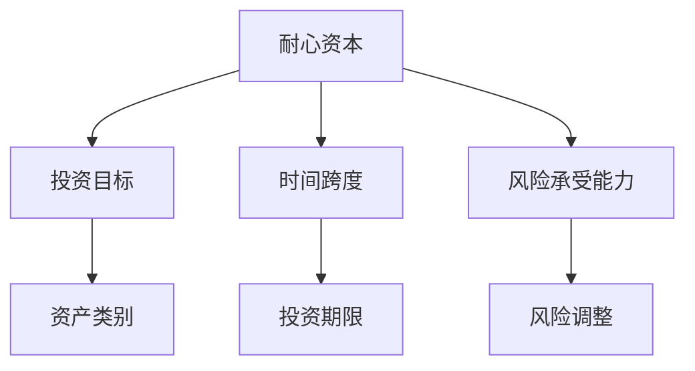
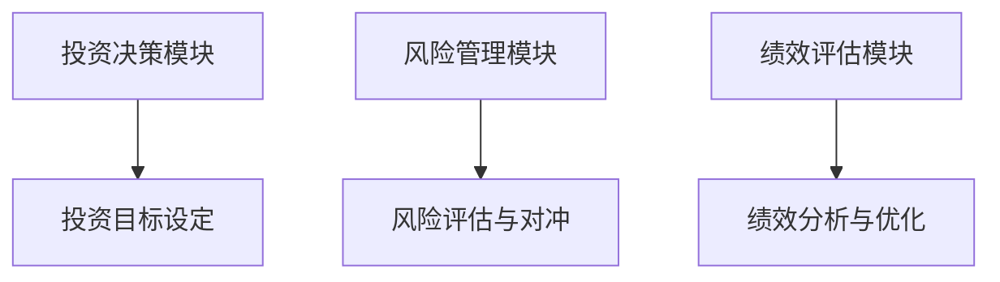
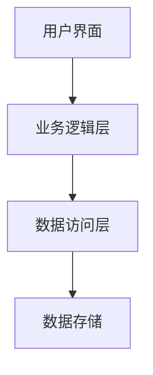

                 


# 戴维·斯文森的耐心资本：长期主义的回报

## 关键词
- 戴维·斯文森
- 耐心资本
- 长期主义
- 投资策略
- 资产配置
- 复利效应

## 摘要
本文深入探讨了戴维·斯文森的耐心资本理论及其在长期投资中的应用。通过分析耐心资本的核心概念、数学模型、系统架构和实际案例，展示了长期主义在投资中的巨大回报。文章结合理论与实践，为读者提供了全面的理解和可操作的指导。

---

# 引言

在瞬息万变的金融市场中，长期主义的投资理念逐渐受到越来越多投资者的关注。戴维·斯文森（David Swensen），作为耶鲁大学的首席投资官，以其独特的耐心资本理论闻名于世。他强调通过长期持有优质资产来实现财富的稳步增长，而非频繁交易和短期获利。本文将详细解析耐心资本的核心概念、数学模型、系统架构和实际案例，揭示长期主义在投资中的巨大回报。

---

## 第一部分：耐心资本的核心概念

### 1.1 耐心资本的定义与属性

耐心资本是一种以长期持有优质资产为核心的投资策略，强调通过时间的积累实现财富的复利增长。其核心属性包括：

1. **长期性**：投资期限通常在5年以上，注重资产的长期增值。
2. **稳定性**：避免频繁交易，减少交易成本和税务负担。
3. **分散性**：通过多元化的资产配置降低风险。
4. **价值导向**：关注企业的基本面，投资具有持续竞争优势的企业。

#### 1.1.1 耐心资本与短期投资的对比

| 属性             | 耐心资本                | 短期投资                |
|------------------|------------------------|-------------------------|
| 投资期限         | 长期（5年以上）          | 短期（1年以内）          |
| 交易频率         | 低                     | 高                     |
| 风险承受能力     | 较高                   | 较低                   |
| 收益来源         | 资本增值与复利          | 价格波动与交易差价      |

#### 1.1.2 耐心资本的ER实体关系图

以下是耐心资本的核心要素及其关系：



---

## 第二部分：长期投资的数学模型与算法

### 2.1 现代投资组合理论（MPT）

现代投资组合理论（MPT）由哈里·马科维茨提出，是长期投资的重要理论基础。其核心目标是通过优化资产配置，实现收益与风险的最佳平衡。

#### 2.1.1 有效前沿的定义与计算

有效前沿是指在给定风险水平下，能够提供最高预期收益的资产组合。计算有效前沿的步骤如下：

1. 计算各资产的预期收益率和协方差矩阵。
2. 使用拉格朗日乘数法优化资产权重，使得在给定风险下收益最大化。
3. 绘制有效前沿曲线。

以下是优化过程的数学公式：

$$
\min w^T \Sigma w \\
\text{subject to} \quad w^T \mu = \text{target return}, \quad w^T 1 = 1
$$

其中，\( w \) 为资产权重向量，\( \Sigma \) 为协方差矩阵，\( \mu \) 为预期收益向量。

#### 2.1.2 夏普比率的计算与应用

夏普比率衡量的是投资组合单位风险所获得的超额收益，公式为：

$$
\text{夏普比率} = \frac{E[r_i - r_f]}{\sigma_i}
$$

其中，\( E[r_i - r_f] \) 为投资组合的超额收益，\( \sigma_i \) 为投资组合的收益标准差。

### 2.2 资产配置的优化算法

#### 2.2.1 均值-方差优化的数学模型

均值-方差优化的目标是在给定风险水平下最大化预期收益。数学模型如下：

$$
\min \sigma^2 \\
\text{subject to} \quad \sum w_i = 1
$$

其中，\( \sigma^2 \) 为投资组合的方差，\( w_i \) 为各资产的权重。

#### 2.2.2 资产配置的Python实现示例

以下是使用Python实现均值-方差优化的代码示例：

```python
import numpy as np
import pandas as pd
from scipy.optimize import minimize

# 假设已计算出各资产的预期收益和协方差矩阵
def portfolio Optimization(returns, cov_matrix):
    n = len(returns)
    # 定义目标函数：最小化方差
    def objective(weights):
        return np.dot(weights.T, np.dot(cov_matrix, weights))
    # 定义约束条件：权重之和为1
    constraints = [{'type': 'eq', 'fun': lambda w: np.sum(w) - 1}]
    # 使用SLSQP方法求解
    result = minimize(objective, np.ones(n)/n, method='SLSQP', constraints=constraints)
    return result.x

# 示例数据
returns = np.array([0.1, 0.15, 0.08])
cov_matrix = np.array([[0.05, 0.02, 0.03],
                       [0.02, 0.1, 0.04],
                       [0.03, 0.04, 0.12]])

optimal_weights = portfolio_Optimization(returns, cov_matrix)
print("最优权重为：", optimal_weights)
```

---

## 第三部分：系统分析与架构设计

### 3.1 长期投资系统的架构设计

#### 3.1.1 系统功能设计

以下是长期投资系统的功能模块：



#### 3.1.2 系统架构设计

以下是系统的分层架构：



---

## 第四部分：项目实战

### 4.1 长期投资策略的实现

#### 4.1.1 环境安装

需要安装的Python库包括：

- `numpy`
- `pandas`
- `scipy`

#### 4.1.2 核心代码实现

以下是长期投资策略的Python实现示例：

```python
import numpy as np
from scipy.optimize import minimize

def maxSharpeRatio(returns, cov_matrix):
    n = len(returns)
    # 定义目标函数：最大化夏普比率
    def objective(weights):
        mu = returns
        rf = 0.05
        excess_return = np.dot(weights.T, mu) - rf
        risk = np.sqrt(np.dot(weights.T, np.dot(cov_matrix, weights)))
        return -excess_return / risk
    # 定义约束条件：权重之和为1
    constraints = [{'type': 'eq', 'fun': lambda w: np.sum(w) - 1}]
    # 使用SLSQP方法求解
    result = minimize(objective, np.ones(n)/n, method='SLSQP', constraints=constraints)
    return result.x

# 示例数据
returns = np.array([0.1, 0.15, 0.08])
cov_matrix = np.array([[0.05, 0.02, 0.03],
                       [0.02, 0.1, 0.04],
                       [0.03, 0.04, 0.12]])

optimal_weights = maxSharpeRatio(returns, cov_matrix)
print("最优权重为：", optimal_weights)
```

---

## 第五部分：最佳实践与小结

### 5.1 最佳实践

1. **长期投资的核心要素**：耐心、分散、价值导向。
2. **系统架构的优化**：模块化设计，便于维护和扩展。
3. **风险管理的重要性**：在长期投资中，风险控制是实现稳定收益的关键。

### 5.2 小结

戴维·斯文森的耐心资本理论为长期投资提供了深刻的指导。通过科学的资产配置和风险管理，投资者可以在不确定的市场中实现稳定的收益。本文通过理论分析、数学建模和代码实现，为读者提供了全面的理解和实践指导。

---

# 致谢

感谢读者的耐心阅读。如需进一步探讨，请随时联系。

---

通过本文的详细讲解，读者可以深入理解戴维·斯文森的耐心资本理论，并将其应用于实际投资中，实现长期稳定的回报。

