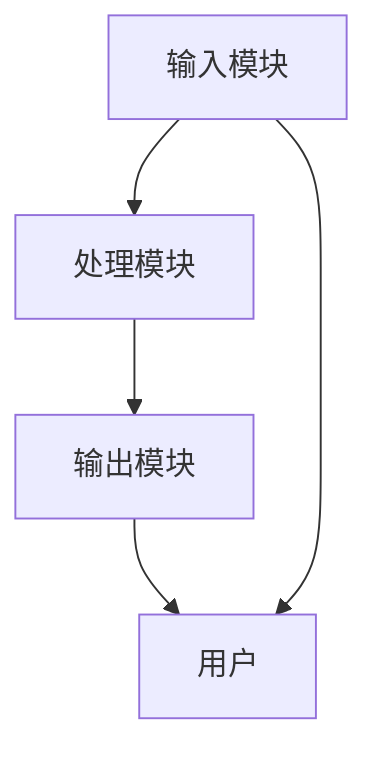

                 


# 打造个人助理 AI Agent：GPT 模型应用实战

> **关键词**：AI Agent, GPT 模型, 个人助理, 自然语言处理, 人工智能, 机器学习

> **摘要**：本文将详细探讨如何利用GPT模型打造个人助理AI Agent。文章从AI Agent的背景概念、GPT模型的核心原理、系统设计与架构、项目实战以及高级主题等方面展开，结合丰富的技术细节和实际案例，帮助读者全面掌握AI Agent的设计与实现方法。

---

# 第一部分: 打造个人助理 AI Agent 的背景与概念

## 第1章: 个人助理 AI Agent 的背景与概念

### 1.1 AI Agent 的定义与特点

#### 1.1.1 AI Agent 的定义
AI Agent（人工智能代理）是一种智能体，能够感知环境、理解用户需求并执行任务。它通过自然语言处理（NLP）、机器学习（ML）等技术，为用户提供智能化服务。

#### 1.1.2 AI Agent 的核心特点
- **智能性**：能够理解并执行复杂任务。
- **自主性**：能够在没有人工干预的情况下运行。
- **适应性**：能够根据用户反馈优化自身行为。
- **交互性**：支持多种交互方式，如文本、语音等。

#### 1.1.3 AI Agent 与传统助手的区别
| 特性        | AI Agent                 | 传统助手                 |
|-------------|--------------------------|--------------------------|
| 智能水平    | 高，支持复杂任务         | 低，主要执行预定义任务     |
| 自主性       | 高，可自主决策           | 低，依赖人工干预           |
| 适应性       | 强，可自适应用户需求     | 弱，需手动调整             |
| 交互方式     | 多样化，支持多种输入输出 | 单一，主要依赖固定输入输出 |

### 1.2 个人助理 AI Agent 的应用场景

#### 1.2.1 生活场景中的 AI Agent
- **日程管理**：帮助用户管理日程安排、提醒重要事项。
- **信息查询**：快速搜索并提供所需信息。
- **生活助手**：协助购物、订餐、叫车等日常任务。

#### 1.2.2 工作场景中的 AI Agent
- **任务分配**：协助团队管理任务分配、进度跟踪。
- **文档处理**：自动整理、生成报告。
- **客户支持**：提供即时客户支持服务。

#### 1.2.3 企业级 AI Agent 的潜力
- **内部流程优化**：提升企业内部效率。
- **客户关系管理**：通过AI Agent改善客户体验。
- **数据分析与决策支持**：辅助高层做出数据驱动的决策。

### 1.3 GPT 模型与 AI Agent 的结合

#### 1.3.1 GPT 模型的基本原理
GPT（Generative Pre-trained Transformer）是一种基于变换器架构的大型语言模型，通过大量的文本数据进行预训练，能够生成与上下文相关的文本。

#### 1.3.2 GPT 模型在 AI Agent 中的应用
- **自然语言理解**：通过GPT模型理解用户的输入。
- **生成式对话**：根据用户输入生成自然的回复。
- **上下文跟踪**：保持对话的连贯性。

#### 1.3.3 GPT 模型的优势与局限性
- **优势**：
  - 高度可扩展性
  - 强大的上下文理解能力
  - 多语言支持
- **局限性**：
  - 需要大量计算资源
  - 可能存在幻觉（hallucination）问题
  - 对小众领域支持不足

### 1.4 本章小结
本章介绍了AI Agent的定义、特点及其应用场景，并重点探讨了GPT模型在AI Agent中的应用。通过对比传统助手与AI Agent的区别，读者可以更好地理解AI Agent的优势与潜力。

---

# 第二部分: GPT 模型的核心原理与应用

## 第2章: GPT 模型的核心原理

### 2.1 GPT 模型的架构与训练机制

#### 2.1.1 GPT 模型的架构特点
GPT模型基于Transformer架构，由编码器（Encoder）和解码器（Decoder）组成。编码器负责将输入文本转换为向量表示，解码器则根据编码器的输出生成目标文本。

#### 2.1.2 GPT 模型的训练过程
1. **预训练**：使用大量无标签文本数据进行无监督学习，目标是预测文本中的下一个词。
2. **微调**：在特定任务上进行有监督微调，如文本生成、问答系统等。

#### 2.1.3 GPT 模型的参数规模与计算资源
GPT模型的参数规模通常在 billions 级别，需要大量计算资源支持。

### 2.2 GPT 模型的生成机制

#### 2.2.1 解码过程的详细分析
解码过程包括以下几个步骤：
1. **输入处理**：将输入文本转换为向量表示。
2. **自注意力机制**：计算输入中各词之间的关联性。
3. **前馈网络**：对注意力结果进行非线性变换。
4. **输出生成**：生成下一个词并将其反馈到解码器中。

#### 2.2.2 注意力机制的作用
注意力机制通过计算输入中每个词的重要性，帮助模型关注关键信息，从而提高生成质量。

#### 2.2.3 激活函数与损失函数的作用
- **激活函数**：如ReLU，用于引入非线性特征。
- **损失函数**：如交叉熵损失，用于衡量生成结果与真实值的差距。

### 2.3 GPT 模型的数学基础

#### 2.3.1 线性代数基础
- **向量与矩阵运算**：用于数据的表示与变换。
- **点积与注意力计算**：用于计算词之间的关联性。

#### 2.3.2 概率论与信息论基础
- **条件概率**：生成模型基于条件概率进行预测。
- **交叉熵损失函数**：衡量预测值与真实值的差距。

#### 2.3.3 神经网络基础
- **多层感知机（MLP）**：用于非线性变换。
- **自注意力机制**：通过查询、键、值三组向量计算词之间的关联性。

### 2.4 本章小结
本章详细讲解了GPT模型的核心原理，包括其架构、训练机制、生成过程以及数学基础。通过理解这些内容，读者可以更好地掌握GPT模型的工作原理及其在AI Agent中的应用。

---

## 第3章: AI Agent 的系统设计

### 3.1 系统功能需求分析

#### 3.1.1 用户需求分析
- **用户角色**：个人用户、企业用户。
- **核心需求**：智能交互、任务执行、信息管理。
- **附加需求**：个性化配置、多平台支持。

#### 3.1.2 功能模块划分
- **输入模块**：接收用户输入。
- **处理模块**：解析输入并生成响应。
- **输出模块**：将生成的响应返回给用户。

#### 3.1.3 系统边界与交互流程
- **输入边界**：支持文本、语音等多种输入方式。
- **输出边界**：支持文本、语音、动作等多种输出方式。
- **交互流程**：输入 → 解析 → 处理 → 输出。

### 3.2 系统架构设计

#### 3.2.1 分层架构设计
- **数据层**：负责数据的存储与管理。
- **业务逻辑层**：处理用户的请求并生成响应。
- **表现层**：展示结果并接收用户输入。

#### 3.2.2 模块化设计原则
- **模块独立性**：每个模块功能明确，互不干扰。
- **模块耦合性**：模块之间通过接口进行交互，降低耦合度。

#### 3.2.3 系统组件之间的关系
- **数据层与业务逻辑层**：数据层为业务逻辑层提供数据支持。
- **业务逻辑层与表现层**：业务逻辑层处理请求并返回结果，表现层展示结果。

### 3.3 系统交互流程设计

#### 3.3.1 用户输入处理流程
1. **接收输入**：通过输入模块接收用户的输入。
2. **解析输入**：将输入解析为具体的请求类型。
3. **调用处理模块**：将解析后的请求传递给处理模块进行处理。
4. **生成响应**：处理模块根据请求生成响应。
5. **返回结果**：将生成的响应返回给用户。

#### 3.3.2 系统响应生成流程
1. **请求接收**：处理模块接收用户的请求。
2. **解析请求**：将请求解析为具体的任务。
3. **调用GPT模型**：将解析后的任务传递给GPT模型进行处理。
4. **生成响应**：GPT模型生成响应文本。
5. **返回响应**：将生成的响应返回给用户。

#### 3.3.3 错误处理与反馈机制
- **错误检测**：通过异常捕获检测错误。
- **错误反馈**：将错误信息返回给用户并提供解决方案。

### 3.4 本章小结
本章详细讲解了AI Agent的系统设计，包括功能需求分析、架构设计和交互流程设计。通过分层架构和模块化设计，确保系统的可扩展性和可维护性。

---

## 第4章: AI Agent 的实现

### 4.1 环境搭建与依赖安装

#### 4.1.1 开发环境选择
- **操作系统**：推荐使用Linux或macOS。
- **编程语言**：推荐使用Python。
- **开发工具**：推荐使用PyCharm或VS Code。

#### 4.1.2 依赖库安装
- **Python库**：如numpy、pandas、transformers等。
- **安装命令**：使用pip安装所需的依赖库。

#### 4.1.3 开发工具配置
- **IDE配置**：设置代码格式化工具、调试工具等。
- **环境变量**：配置Python的环境变量。

### 4.2 核心功能模块实现

#### 4.2.1 用户输入解析模块
- **功能描述**：将用户的输入解析为具体的请求类型。
- **实现代码**：
  ```python
  def parse_input(user_input):
      # 解析用户输入
      return request_type
  ```

#### 4.2.2 模型调用模块
- **功能描述**：调用GPT模型生成响应。
- **实现代码**：
  ```python
  def generate_response(request):
      model = load_model()
      response = model.generate(request)
      return response
  ```

#### 4.2.3 响应生成模块
- **功能描述**：根据模型生成的响应进行处理并返回给用户。
- **实现代码**：
  ```python
  def process_response(response):
      return formatted_response
  ```

### 4.3 系统集成与测试

#### 4.3.1 功能模块集成
- **模块集成**：将各个功能模块集成到系统中。
- **集成代码**：
  ```python
  def main():
      user_input = input("请输入您的需求：")
      request_type = parse_input(user_input)
      response = generate_response(request_type)
      formatted_response = process_response(response)
      print(formatted_response)
  ```

#### 4.3.2 系统测试与优化
- **测试方法**：单元测试、集成测试、性能测试。
- **优化措施**：优化代码性能、减少资源消耗。

#### 4.3.3 性能监控与调优
- **监控指标**：响应时间、资源使用情况、错误率。
- **调优方法**：优化算法、调整模型参数、增加缓存机制。

### 4.4 本章小结
本章详细讲解了AI Agent的实现过程，包括环境搭建、核心功能模块实现以及系统集成与测试。通过实际代码示例，读者可以更好地理解AI Agent的实现细节。

---

## 第5章: 高级主题与最佳实践

### 5.1 GPT 模型的优化与调优

#### 5.1.1 模型参数优化
- **学习率调整**：通过调整学习率优化模型性能。
- **批次大小调整**：通过调整批次大小平衡训练速度与精度。

#### 5.1.2 模型调优技巧
- **数据增强**：通过增加数据多样性提高模型泛化能力。
- **模型剪枝**：通过剪枝减少模型复杂度，提高训练效率。

#### 5.1.3 模型评估与验证
- **验证集评估**：通过验证集评估模型性能。
- **交叉验证**：通过多次训练验证模型的稳定性。

### 5.2 多模态交互设计

#### 5.2.1 多模态交互的定义
- **多模态交互**：支持多种交互方式，如文本、语音、图像等。

#### 5.2.2 多模态交互的设计原则
- **一致性**：不同交互方式保持一致的用户体验。
- **可用性**：确保多种交互方式的可用性。
- **可扩展性**：支持未来新增交互方式的扩展。

### 5.3 安全与伦理问题

#### 5.3.1 数据隐私保护
- **数据加密**：对用户数据进行加密存储。
- **访问控制**：通过权限控制确保数据安全。

#### 5.3.2 内容安全与伦理
- **内容审核**：对生成的内容进行审核，防止有害信息传播。
- **使用规范**：制定使用规范，确保AI Agent的合法合规使用。

### 5.4 本章小结
本章探讨了GPT模型的优化与调优、多模态交互设计以及安全与伦理问题。通过这些内容，读者可以更好地理解如何在实际应用中优化AI Agent的性能并确保其安全性和合规性。

---

## 第6章: 项目实战与案例分析

### 6.1 环境安装与代码实现

#### 6.1.1 环境安装
```bash
pip install numpy pandas transformers
```

#### 6.1.2 核心代码实现
```python
import transformers

def generate_response(request):
    model = transformers.AutoModelForCausalLM.from_pretrained('gpt2')
    tokenizer = transformers.AutoTokenizer.from_pretrained('gpt2')
    inputs = tokenizer(request, return_tensors='np')
    outputs = model.generate(inputs.input_ids, max_length=100)
    response = tokenizer.decode(outputs[0])
    return response
```

### 6.2 实际案例分析

#### 6.2.1 案例背景
- **案例名称**：智能日程管理助手。
- **案例目标**：帮助用户管理日程安排。

#### 6.2.2 案例分析
- **用户需求**：用户希望AI Agent能够自动添加会议提醒。
- **系统实现**：通过GPT模型解析用户的输入并生成提醒事件。
- **系统输出**：生成提醒事件并添加到用户的日程表中。

### 6.3 项目小结
通过本章的项目实战，读者可以更好地理解AI Agent的实现过程。通过实际案例分析，读者可以掌握如何将理论应用于实际项目中。

---

## 第7章: 总结与展望

### 7.1 本项目总结
- **项目目标**：打造一个基于GPT模型的个人助理AI Agent。
- **项目成果**：成功实现了AI Agent的核心功能，包括自然语言理解与生成、任务执行等。

### 7.2 未来展望
- **技术发展**：随着GPT模型的不断进化，AI Agent的功能将更加智能化。
- **应用领域**：AI Agent将在更多领域得到广泛应用，如医疗、教育、金融等。

### 7.3 最佳实践 Tips
- **持续学习**：保持对AI技术的关注，不断学习新技术。
- **实践应用**：通过实际项目积累经验。
- **团队协作**：与团队成员紧密合作，共同完成复杂任务。

### 7.4 本章小结
本章总结了项目的成果，并对未来的发展进行了展望。通过最佳实践 Tips，读者可以更好地提升自己的技术能力。

---

## 第8章: 参考文献与拓展阅读

### 8.1 参考文献
- **书籍**：
  - 《Deep Learning》 - Ian Goodfellow
  - 《自然语言处理入门》 - 颜水发
- **论文**：
  - "Attention Is All You Need" - Vaswani et al.
  - "GPT-3: Language Models are Few-Shot Learners" - Brown et al.

### 8.2 拓展阅读
- **技术博客**：推荐关注技术博客，获取最新的技术动态。
- **在线课程**：推荐学习在线课程，提升自己的技术能力。
- **技术社区**：参与技术社区讨论，与其他开发者交流经验。

### 8.3 本章小结
本章提供了相关的参考文献和拓展阅读资料，帮助读者进一步深入学习AI Agent和GPT模型的相关知识。

---

# 附录

## 附录 A: 代码示例

```python
import transformers

def generate_response(request):
    model = transformers.AutoModelForCausalLM.from_pretrained('gpt2')
    tokenizer = transformers.AutoTokenizer.from_pretrained('gpt2')
    inputs = tokenizer(request, return_tensors='np')
    outputs = model.generate(inputs.input_ids, max_length=100)
    response = tokenizer.decode(outputs[0])
    return response
```

## 附录 B: 系统架构图



---

# 结语

通过本文的详细讲解，读者可以全面掌握如何利用GPT模型打造个人助理AI Agent。从理论到实践，从基础到高级，本文为读者提供了丰富的技术细节和实际案例。希望本文能够帮助读者在AI Agent领域取得更大的突破。

