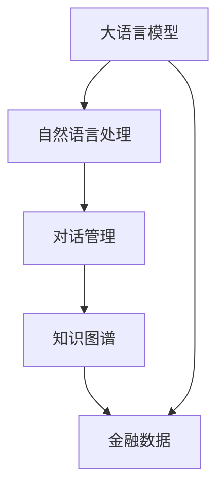
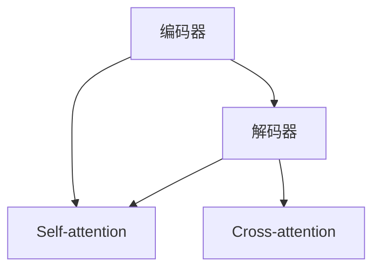
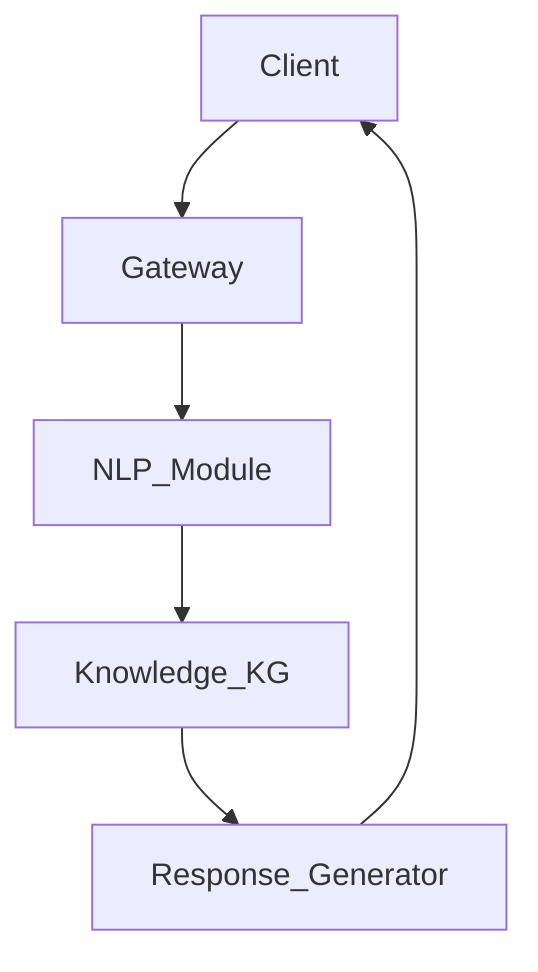

                 


# 打造智能化金融咨询聊天机器人

> 关键词：智能化金融咨询，聊天机器人，大语言模型，自然语言处理，对话管理，知识图谱

> 摘要：本文详细探讨了打造智能化金融咨询聊天机器人的全过程，从背景介绍到系统架构设计，再到项目实战与最佳实践，全面解析了构建这一系统的各个关键环节。通过理论与实践相结合的方式，本文为读者提供了从零开始构建智能化金融咨询聊天机器人的详细指南。

---

## 第一部分：背景介绍

### 第1章：智能化金融咨询的背景与挑战

#### 1.1 金融咨询行业的现状与痛点

随着金融市场的快速发展，投资者对金融服务的需求日益增长，传统的金融咨询模式逐渐暴露出效率低、成本高等问题。例如，传统模式中，客户需要通过电话或面对面的方式与顾问交流，这不仅耗时，而且难以满足大量客户的个性化需求。

此外，金融行业的复杂性也增加了咨询的难度。金融产品种类繁多，信息更新速度快，传统的咨询方式难以快速响应客户的问题，尤其是在市场波动剧烈的情况下，客户需要实时获取准确的信息，这对传统咨询模式提出了更高的要求。

#### 1.2 聊天机器人的发展与智能化转型

聊天机器人技术的进步为金融咨询行业带来了新的可能性。从早期的简单关键词匹配到现在的深度学习模型，聊天机器人在自然语言处理和对话管理方面取得了显著进展。特别是在大语言模型的推动下，机器人能够理解和生成更复杂的语言，从而提供更智能化的服务。

金融行业的智能化转型已成为趋势。通过引入聊天机器人，金融机构可以显著降低成本，提高服务效率，同时为客户提供更加便捷和个性化的体验。

#### 1.3 问题背景与目标

在金融咨询领域，客户通常需要获取实时的市场信息、投资建议、产品咨询等服务。传统的咨询方式不仅效率低下，而且难以覆盖大量客户。因此，如何利用技术手段提升咨询效率和质量，成为了金融机构面临的重要问题。

通过构建智能化金融咨询聊天机器人，可以实现以下目标：
1. 提供7×24小时的实时咨询服务。
2. 支持多语言、多渠道的客户交互。
3. 根据客户需求个性化推荐金融产品。
4. 实时更新和分析市场数据，提供准确的咨询。

#### 1.4 边界与外延

智能化金融咨询聊天机器人的边界主要集中在文本交互和基于规则的决策支持。虽然机器人可以提供多种服务，但目前在复杂决策、法律咨询等领域仍需人工辅助。外延则包括与第三方数据源的集成、多模态交互的支持（如语音和图像）等。

#### 1.5 核心要素组成

- **自然语言处理（NLP）**：用于理解和生成自然语言文本。
- **对话管理（DM）**：负责对话的流程控制和上下文管理。
- **知识图谱**：存储金融领域的专业知识和数据。
- **大语言模型**：提供强大的文本生成和理解能力。

---

## 第二部分：核心概念与联系

### 第2章：大语言模型与自然语言处理

#### 2.1 大语言模型的原理与特点

大语言模型通过大量的数据训练，能够理解和生成多种语言的文本。其核心在于Transformer架构，包括编码器和解码器两部分，能够捕捉文本中的上下文关系。

#### 2.2 自然语言处理的核心技术

- **词法分析**：包括分词、词性标注等。
- **句法分析**：分析句子的语法结构。
- **语义理解**：理解文本的深层含义。

#### 2.3 对话管理与知识图谱

对话管理通过状态跟踪和意图识别，确保对话的流畅性。知识图谱则为机器人提供专业知识支持，帮助其准确回答客户问题。

#### 2.4 核心概念关系图



---

## 第三部分：算法原理与数学模型

### 第3章：大语言模型的训练与优化

#### 3.1 模型训练流程

- 数据预处理：清洗和标注数据。
- 模型架构设计：选择适合的模型结构。
- 损失函数与优化：使用交叉熵损失和Adam优化器。

#### 3.2 基于 Transformer 的架构



数学模型：

损失函数：
$$ \mathcal{L} = -\frac{1}{N}\sum_{i=1}^{N}\log P(y_i|x_i) $$

优化算法：
$$ \theta_{t+1} = \theta_t - \eta \nabla_{\theta_t} \mathcal{L} $$

---

## 第四部分：系统分析与架构设计

### 第4章：系统架构设计

#### 4.1 项目介绍

构建一个支持多语言、多渠道的金融咨询聊天机器人。

#### 4.2 系统功能设计

- 用户交互模块：支持文本输入和输出。
- 数据处理模块：实时获取和分析金融数据。
- 知识库模块：存储金融知识和产品信息。

#### 4.3 系统架构图



---

## 第五部分：项目实战

### 第5章：环境安装与核心代码实现

#### 5.1 环境安装

安装必要的库：
```bash
pip install transformers torch numpy
```

#### 5.2 核心代码实现

```python
import torch
from transformers import AutoTokenizer, AutoModelForCausalLM

model_name = "gpt2"
tokenizer = AutoTokenizer.from_pretrained(model_name)
model = AutoModelForCausalLM.from_pretrained(model_name)

def generate_response(prompt):
    inputs = tokenizer.encode(prompt, return_tensors="pt")
    outputs = model.generate(inputs, max_length=50, do_sample=True)
    response = tokenizer.decode(outputs[0], skip_special_tokens=True)
    return response
```

---

## 第六部分：最佳实践

### 第6章：总结与展望

#### 6.1 小结

本文详细介绍了打造智能化金融咨询聊天机器人的全过程，从背景分析到系统实现，为读者提供了全面的指导。

#### 6.2 注意事项

在实际应用中，需注意数据安全和模型的可解释性问题。

#### 6.3 拓展阅读

推荐阅读相关领域的最新研究，如多模态对话系统和强化学习的应用。

---

通过以上步骤，我们可以系统地构建一个智能化的金融咨询聊天机器人，为用户提供高效、便捷的服务。

