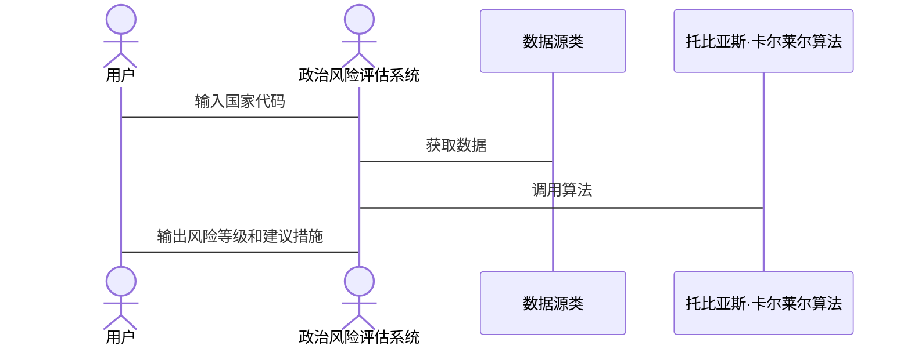

                 


# 托比亚斯·卡尔莱尔的政治风险评估模型

## 文章关键词
政治风险评估模型、托比亚斯·卡尔莱尔、算法原理、系统设计、项目实战

## 摘要
托比亚斯·卡尔莱尔的政治风险评估模型是一种基于多层次分析的政治风险量化方法。该模型通过构建政治风险的多维度评估体系，结合层次分析法（AHP）和贝叶斯网络，对政治风险进行定量分析和预测。本文从模型的背景、核心概念、算法原理、系统设计和项目实战等方面进行深入探讨，结合实际案例，详细阐述了托比亚斯·卡尔莱尔模型的理论基础和实践应用。

---

## 第一部分: 政治风险评估模型的背景与概念

### 第1章: 政治风险评估模型的定义与背景

#### 1.1 政治风险评估的定义
政治风险是指由于政治因素的变化对企业或项目的负面影响，包括政策变化、社会动荡、国际关系恶化等。政治风险评估是对这些潜在风险进行识别、量化和预测的过程。

#### 1.2 政治风险评估的背景
- 当前国际政治环境的不确定性增加，地缘政治冲突频发，政治风险成为企业全球化投资中的重要考量因素。
- 经济全球化与地缘政治的复杂关系使得企业需要更加精确地评估政治风险。
- 政治风险对企业投资决策的影响日益显著，尤其是在新兴市场和发展中国家。

#### 1.3 政治风险评估模型的发展现状
托比亚斯·卡尔莱尔提出的模型在政治风险评估领域具有创新性，其核心在于通过多层次分析和权重分配，实现对政治风险的精准量化。该模型在学术界和实践中得到了广泛应用。

#### 1.4 本章小结
政治风险评估是企业在全球化背景下必须面对的重要课题。托比亚斯·卡尔莱尔模型通过多层次分析和权重分配，为政治风险的量化提供了新的思路。

---

## 第二部分: 政治风险评估模型的核心概念与联系

### 第2章: 政治风险评估的核心概念

#### 2.1 政治风险的构成要素
- **政治稳定性**：政府更迭、政策变化的频率和幅度。
- **政策变化**：税收政策、贸易政策、外资政策等的变化。
- **社会动荡**：社会冲突、罢工、抗议活动等。
- **国际关系**：外交关系、贸易制裁、国际冲突等。

#### 2.2 政治风险评估的关键指标
- **经济政策风险**：货币贬值、税收政策变化。
- **法律与监管风险**：法律变更、监管力度变化。
- **安全与地缘政治风险**：恐怖主义、军事冲突。
- **政府能力与透明度**：政府效率、腐败水平。

#### 2.3 政治风险评估的逻辑框架
托比亚斯·卡尔莱尔模型通过构建一个多层次的逻辑框架，将上述风险因子进行权重分配和综合评估。其核心逻辑如下：
1. 确定风险因子的层次结构。
2. 对每个层次的风险因子进行权重计算。
3. 综合各层次的风险因子，计算总体风险指数。

### 第3章: 核心概念的联系与对比

#### 3.1 政治风险与经济风险的对比
- **政治风险的特殊性**：更多受到政策和政府行为的影响。
- **经济风险的关联性**：更多受到市场波动和经济周期的影响。
- **对投资的影响**：政治风险可能引发更大的系统性风险。

#### 3.2 政治风险与社会风险的对比
- **社会动荡对政治风险的影响**：社会动荡可能引发政治不稳定。
- **政治风险对社会稳定的影响**：政策变化可能引发社会不满。
- **相互作用**：两者相互影响，共同作用于企业的投资决策。

#### 3.3 核心概念的ER实体关系图
```mermaid
erDiagram
    actor 政治风险评估系统 {
        <属性>
        id : int
        风险因子 : string
        权重 : float
        风险指数 : float
    }
    actor 数据源 {
        <属性>
        国家代码 : string
        政治稳定性 : int
        政策变化 : int
        社会动荡 : int
        国际关系 : int
    }
    actor 评估结果 {
        <属性>
        风险等级 : string
        建议措施 : string
    }
    政治风险评估系统 --> 数据源 : 获取数据
    政治风险评估系统 --> 评估结果 : 输出结果
```

---

## 第三部分: 政治风险评估模型的算法原理

### 第4章: 托比亚斯·卡尔莱尔模型的算法原理

#### 4.1 模型的核心算法
托比亚斯·卡尔莱尔模型基于层次分析法（AHP）和贝叶斯网络，通过以下步骤进行风险评估：
1. 确定风险因子的层次结构。
2. 对每个层次的风险因子进行权重计算。
3. 综合各层次的风险因子，计算总体风险指数。

#### 4.2 模型的计算流程
1. 数据采集与处理：
   - 收集各国的政治稳定性、政策变化、社会动荡等数据。
2. 风险因子的权重计算：
   - 使用层次分析法（AHP）确定各层次风险因子的权重。
3. 风险指数的综合计算：
   - 根据权重和数据计算总体风险指数。

#### 4.3 模型的数学公式
风险指数计算公式：
$$ R = \sum_{i=1}^{n} w_i \cdot x_i $$
其中，$w_i$ 是第 $i$ 个风险因子的权重，$x_i$ 是第 $i$ 个风险因子的值。

贝叶斯网络公式：
$$ P(R|E) = \frac{P(E|R) \cdot P(R)}{P(E)} $$

---

## 第四部分: 系统分析与架构设计

### 第5章: 系统分析与架构设计

#### 5.1 系统功能设计
- 数据采集模块：收集各国的政治稳定性、政策变化等数据。
- 风险评估模块：基于托比亚斯·卡尔莱尔模型计算风险指数。
- 结果展示模块：输出风险等级和建议措施。

#### 5.2 系统架构设计
```mermaid
classDiagram
    class 政治风险评估系统 {
        + 国家代码 : string
        + 风险指数 : float
        + 风险等级 : string
        + 建议措施 : string
        - 数据源 : 数据源类
        - 风险评估算法 : 托比亚斯·卡尔莱尔算法
    }
    class 数据源类 {
        + 国家代码 : string
        + 政治稳定性 : int
        + 政策变化 : int
        + 社会动荡 : int
        + 国际关系 : int
    }
    class 托比亚斯·卡尔莱尔算法 {
        + 计算权重 : function
        + 计算风险指数 : function
    }
    政治风险评估系统 --> 数据源类 : 获取数据
    政治风险评估系统 --> 托比亚斯·卡尔莱尔算法 : 调用算法
```

#### 5.3 系统交互设计


---

## 第五部分: 项目实战

### 第6章: 项目实战

#### 6.1 环境安装
- 安装Python和相关库（numpy、pandas、scipy）。
- 安装Mermaid和相关工具。

#### 6.2 核心代码实现
```python
import numpy as np
from scipy import stats

def calculate_weights(criteria_matrix):
    # 计算权重
    n = len(criteria_matrix)
    weights = np.zeros(n)
    total = 0
    for i in range(n):
        row_sum = sum(criteria_matrix[i])
        total += row_sum
        weights[i] = row_sum
    weights = weights / total
    return weights

def calculate_risk_index(weights, data):
    # 计算风险指数
    risk_index = np.zeros(len(data))
    for i in range(len(data)):
        risk_index[i] = np.dot(weights, data[i])
    return risk_index

# 示例数据
criteria_matrix = [
    [1, 2, 3],
    [2, 1, 4],
    [3, 4, 1]
]
weights = calculate_weights(criteria_matrix)
data = [
    [3, 2, 4],
    [4, 3, 2],
    [2, 4, 3]
]
risk_index = calculate_risk_index(weights, data)
print("权重:", weights)
print("风险指数:", risk_index)
```

#### 6.3 案例分析
以某国家的政治风险评估为例，输入相关数据，计算风险指数，并输出风险等级和建议措施。

---

## 第六部分: 最佳实践

### 第7章: 最佳实践

#### 7.1 小结
- 托比亚斯·卡尔莱尔模型是一种有效的政治风险评估工具。
- 模型的核心在于多层次分析和权重分配。

#### 7.2 注意事项
- 数据的准确性和完整性是模型的关键。
- 需要定期更新模型参数和数据。

#### 7.3 拓展阅读
- 托比亚斯·卡尔莱尔的相关论文。
- 政治风险评估领域的最新研究。

---

## 结语
托比亚斯·卡尔莱尔的政治风险评估模型为企业的全球化投资提供了重要的理论和实践指导。通过多层次分析和权重分配，该模型能够帮助企业更精准地识别和量化政治风险，从而做出更加科学的投资决策。

