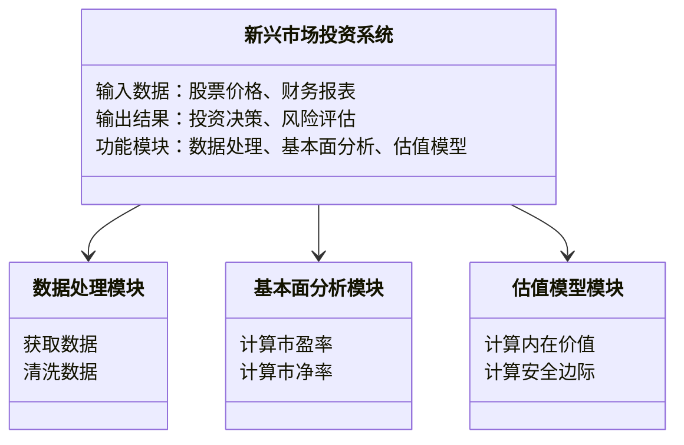
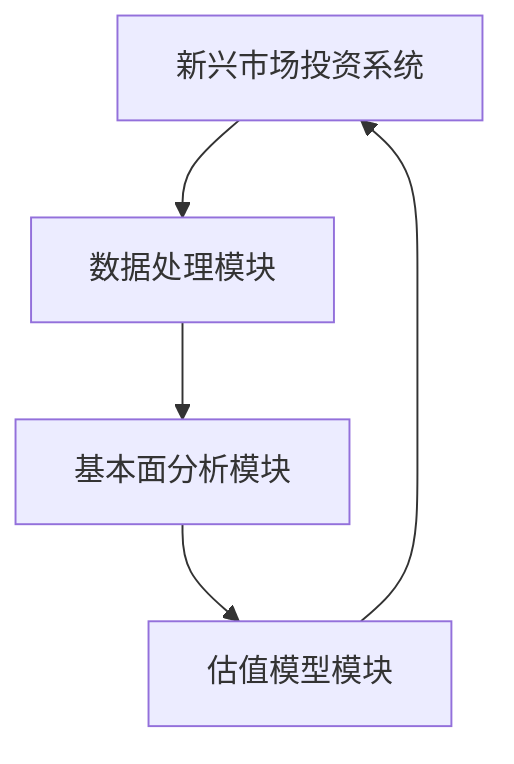
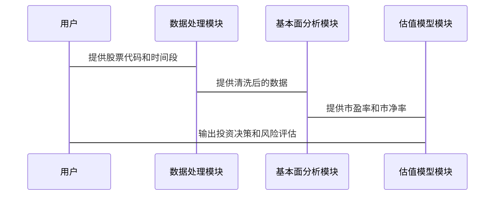

                 


# 托比亚斯·卡尔莱尔的新兴市场价值投资

> 关键词：托比亚斯·卡尔莱尔，新兴市场，价值投资，投资策略，风险管理，市场分析

> 摘要：本文深入探讨了托比亚斯·卡尔莱尔的价值投资理念及其在新兴市场中的应用。通过分析新兴市场的特点、价值投资的核心原理、算法实现以及系统架构设计，本文为投资者提供了在新兴市场中进行价值投资的全面指南。文章还通过实际案例分析和代码实现，展示了如何在新兴市场中识别投资机会并制定有效的投资策略。

---

## 第一部分：新兴市场价值投资的背景与基础

### 第1章：价值投资的基本概念

#### 1.1 价值投资的起源与发展

##### 1.1.1 价值投资的起源
- 价值投资的起源可以追溯到20世纪初，本杰明·格雷厄姆和戴维·多德是该领域的先驱。
- 托比亚斯·卡尔莱尔继承并发展了他们的理念，将其应用于新兴市场。

##### 1.1.2 价值投资的核心理念
- 投资的本质是购买企业的一部分，而非单纯交易股票。
- 价格波动是市场的短期现象，而内在价值是长期投资的基础。

##### 1.1.3 托比亚斯·卡尔莱尔的贡献
- 托比亚斯·卡尔莱尔将价值投资的理念推广到新兴市场，提出了适合新兴市场的投资策略。
- 他强调了基本面分析在新兴市场中的重要性。

#### 1.2 新兴市场的定义与特点

##### 1.2.1 新兴市场的定义
- 新兴市场是指那些经济快速增长、金融市场逐渐成熟的国家，如中国、印度、巴西等。
- 这些市场具有较高的增长潜力，但也伴随着较高的风险。

##### 1.2.2 新兴市场的特点
- 市场波动性大：新兴市场的股票价格波动剧烈，容易受到外部因素的影响。
- 市场流动性有限：部分新兴市场的流动性不足，可能导致买卖价差较大。
- 市场效率低：信息不对称较为严重，投资者需要进行深入的基本面分析。

##### 1.2.3 新兴市场与发达市场的对比
| 特性          | 新兴市场                     | 发达市场                     |
|---------------|------------------------------|------------------------------|
| 市场波动性     | 高                          | 低                          |
| 市场流动性     | 有限                        | 充足                        |
| 市场效率       | 低                          | 高                          |
| 投资机会       | 多样化                      | 较少                        |

#### 1.3 价值投资在新兴市场的适用性

##### 1.3.1 价值投资的基本原理
- 价值投资的核心是寻找市场价格低于内在价值的股票。
- 在新兴市场中，由于市场效率较低，这种情况更容易出现。

##### 1.3.2 新兴市场中的价值投资机会
- 新兴市场中的许多公司具有较高的成长性，但市场价格可能被低估。
- 托比亚斯·卡尔莱尔提出，新兴市场中的价值投资机会主要集中在那些具有强大竞争优势和合理估值的公司。

##### 1.3.3 新兴市场的风险与挑战
- 政治风险：新兴市场的政治环境可能不稳定，影响投资。
- 经济风险：新兴市场的经济波动较大，可能影响公司的业绩。
- 市场风险：新兴市场的股票价格波动剧烈，可能导致投资损失。

#### 1.4 本章小结
本章介绍了价值投资的基本概念、新兴市场的特点以及价值投资在新兴市场的适用性。通过对比分析，我们可以看到新兴市场中存在许多价值投资的机会，但也需要关注相关风险。

---

### 第2章：价值投资的核心概念与联系

#### 2.1 价值投资的核心原理

##### 2.1.1 内在价值的计算方法
- 内在价值是公司未来现金流的现值。
- 计算公式为：
  $$ V = \sum_{t=1}^{n} \frac{CF_t}{(1+r)^t} $$
  其中，$CF_t$是第$t$年的现金流，$r$是折现率。

##### 2.1.2 安全边际的定义与作用
- 安全边际是指市场价格低于内在价值的部分。
- 安全边际越大，投资风险越小。

##### 2.1.3 市场先生的角色与影响
- 市场先生是价值投资中的一个比喻，代表市场的波动性。
- 投资者应该在市场先生情绪低落时买入，在市场先生情绪高涨时卖出。

#### 2.2 新兴市场中的价值评估模型

##### 2.2.1 市盈率模型
- 市盈率（P/E）= 股价 / 每股收益
- 低市盈率通常意味着低估。

##### 2.2.2 市净率模型
- 市净率（P/B）= 股价 / 每股净资产
- 低市净率通常意味着低估。

##### 2.2.3 现金流折现模型
- 现金流折现模型是计算内在价值的常用方法。
- 计算公式为：
  $$ V = \sum_{t=1}^{n} \frac{CF_t}{(1+r)^t} $$

#### 2.3 价值投资与新兴市场的联系

##### 2.3.1 新兴市场的独特优势
- 新兴市场中的公司增长潜力大。
- 新兴市场中的股票价格波动大，容易出现低估机会。

##### 2.3.2 价值投资在新兴市场的应用案例
- 托比亚斯·卡尔莱尔通过基本面分析，成功识别了多个新兴市场的低估股票。

##### 2.3.3 新兴市场中的风险控制
- 通过分散投资降低风险。
- 通过严格的基本面分析筛选优质股票。

#### 2.4 本章小结
本章详细介绍了价值投资的核心原理以及在新兴市场中的应用。通过分析市盈率、市净率等指标，我们可以更好地识别新兴市场中的投资机会。

---

### 第3章：价值投资的算法原理

#### 3.1 价值投资的数学模型

##### 3.1.1 内在价值的计算公式
- 内在价值公式：
  $$ V = \sum_{t=1}^{n} \frac{CF_t}{(1+r)^t} $$
  其中，$CF_t$是第$t$年的现金流，$r$是折现率。

##### 3.1.2 安全边际的计算方法
- 安全边际 = 内在价值 - 市场价格

##### 3.1.3 市盈率与市净率的比较
- 市盈率 = 股价 / 每股收益
- 市净率 = 股价 / 每股净资产

#### 3.2 价值投资的算法流程

##### 3.2.1 数据收集与处理
- 数据来源：股票价格、财务报表等。
- 数据清洗：去除异常值，填补缺失值。

##### 3.2.2 基本面分析与估值
- 计算市盈率、市净率等指标。
- 估算内在价值。

##### 3.2.3 投资决策与组合管理
- 根据安全边际决定是否买入。
- 通过分散投资降低风险。

#### 3.3 价值投资的代码实现

##### 3.3.1 数据获取与清洗
```python
import pandas as pd
import yfinance as yf

# 获取股票数据
data = yf.download(tickers='AAPL', period='5y', interval='1d')
# 清洗数据
data = data['Adj Close'].dropna()
```

##### 3.3.2 基本面指标计算
```python
import pandas as pd

# 计算市盈率
data['PE'] = data['Price'] / data['EPS']
# 计算市净率
data['PB'] = data['Price'] / data['BVPS']
```

##### 3.3.3 估值模型的实现
```python
def calculate_intrinsic_value(fcf, discount_rate):
    # 现金流折现模型
    return fcf / (1 + discount_rate)
```

##### 3.3.4 投资组合的优化
```python
import numpy as np

# 通过均值-方差优化构建投资组合
returns = data['Return']
cov_matrix = returns.cov()
weights = np.linalg.solve(cov_matrix, returns.mean())
```

#### 3.4 本章小结
本章通过数学模型和代码实现，详细介绍了价值投资的算法原理。通过这些方法，我们可以系统地识别新兴市场中的低估股票，并制定有效的投资策略。

---

### 第4章：系统分析与架构设计

#### 4.1 问题场景介绍

##### 4.1.1 新兴市场的投资机会
- 新兴市场的增长潜力大。
- 新兴市场中的股票价格波动大，容易出现低估机会。

##### 4.1.2 价值投资在新兴市场的应用
- 通过基本面分析识别低估股票。
- 通过分散投资降低风险。

##### 4.1.3 价值投资在新兴市场的挑战
- 新兴市场的信息不对称严重。
- 新兴市场的流动性有限。

#### 4.2 系统功能设计

##### 4.2.1 领域模型Mermaid类图


#### 4.3 系统架构设计

##### 4.3.1 系统架构Mermaid图


#### 4.4 系统接口设计

##### 4.4.1 输入接口
- 输入股票代码、时间段、数据频率。

##### 4.4.2 输出接口
- 输出投资决策、风险评估。

#### 4.5 系统交互Mermaid序列图


#### 4.6 本章小结
本章通过系统分析与架构设计，详细介绍了新兴市场投资系统的设计与实现。通过模块化设计，我们可以更好地管理和分析投资数据，制定有效的投资策略。

---

## 第五部分：项目实战

### 第5章：新兴市场价值投资的实战分析

#### 5.1 环境安装与数据获取

##### 5.1.1 环境安装
- 安装Python和相关库：
  ```bash
  pip install pandas numpy yfinance
  ```

##### 5.1.2 数据获取
```python
import yfinance as yf

# 获取新兴市场股票数据
tickers = ['AAPL', 'MSFT', 'TSM']
data = yf.download(tickers, period='5y', interval='1d')
```

#### 5.2 核心代码实现

##### 5.2.1 基本面分析
```python
import pandas as pd

# 计算市盈率
data['PE'] = data['Adj Close'] / data['EPS']
# 计算市净率
data['PB'] = data['Adj Close'] / data['BVPS']
```

##### 5.2.2 估值模型实现
```python
def calculate_intrinsic_value(fcf, discount_rate):
    return fcf / (1 + discount_rate)
```

##### 5.2.3 投资组合优化
```python
import numpy as np

# 通过均值-方差优化构建投资组合
returns = data['Return'].dropna().values
cov_matrix = np.cov(returns)
weights = np.linalg.solve(cov_matrix, np.mean(returns))
```

#### 5.3 案例分析与解读

##### 5.3.1 案例分析
- 以某新兴市场的公司为例，计算其市盈率、市净率和内在价值。
- 根据计算结果，决定是否买入该股票。

##### 5.3.2 投资决策
- 如果市场价格低于内在价值，则买入该股票。
- 如果市场价格高于内在价值，则卖出该股票。

#### 5.4 本章小结
本章通过实际案例分析，展示了如何在新兴市场中应用价值投资策略。通过基本面分析和估值模型，我们可以识别低估股票，并制定有效的投资策略。

---

## 第六部分：最佳实践、小结与拓展

### 第6章：最佳实践与小结

#### 6.1 最佳实践

##### 6.1.1 风险管理
- 通过分散投资降低风险。
- 设定止损点，避免重大损失。

##### 6.1.2 市场分析
- 定期进行市场分析，调整投资策略。
- 关注宏观经济指标和行业动态。

#### 6.2 小结
本文详细介绍了托比亚斯·卡尔莱尔的新兴市场价值投资理念，并通过算法实现和系统设计，展示了如何在新兴市场中进行价值投资。通过实际案例分析，我们看到新兴市场中存在许多投资机会，但也需要关注相关风险。

#### 6.3 注意事项
- 投资者需要具备扎实的基本面分析能力。
- 投资者需要关注宏观经济和行业动态。
- 投资者需要制定有效的风险管理策略。

#### 6.4 拓展阅读
- 格雷厄姆的《证券分析》
- 巴菲特的《巴菲特致股东的信》
- 托比亚斯·卡尔莱尔的其他著作

---

## 结语

托比亚斯·卡尔莱尔的新兴市场价值投资理念为我们提供了在新兴市场中进行投资的全新视角。通过基本面分析和估值模型，我们可以识别新兴市场中的低估股票，并制定有效的投资策略。然而，投资新兴市场需要投资者具备扎实的基本面分析能力，并关注相关风险。希望本文能够为投资者提供有价值的参考和启发。

--- 

# THE END

