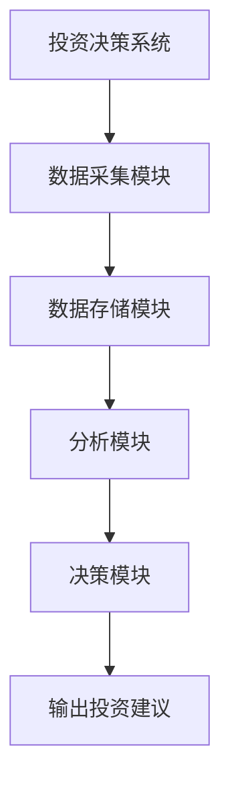

                 


# 托马斯·盖伊的高质量价值投资：寻找优质且低估的公司

## 关键词：托马斯·盖伊，价值投资，高质量企业，低估公司，现金流折现模型（DCF）

## 摘要：本文详细探讨了托马斯·盖伊的价值投资策略，重点分析了如何通过基本面分析和DCF模型寻找优质且低估的公司。文章从价值投资的背景、核心概念、算法原理到系统设计和实战案例，全面解析了这一投资方法，并提供了实用的数学模型和代码示例，帮助读者掌握高质量价值投资的技巧。

---

## 第一部分：价值投资的背景与核心理念

### 第1章：价值投资的起源与发展

#### 1.1 价值投资的起源
- **定义与核心理念**：价值投资是一种通过分析企业的内在价值，寻找市场价格低于内在价值的公司进行投资的方法。其核心在于长期持有优质企业，获得复利增长。
- **托马斯·盖伊的贡献**：盖伊提出了一套系统化的选股标准，强调企业质量、估值和成长性，并通过DCF模型进行估值。

#### 1.2 价值投资的基本原则
- **长期投资**：避免短期波动，关注企业长期价值。
- **安全边际**：买入价格低于内在价值，以降低风险。
- **选股标准**：质量（行业地位、财务健康、管理团队）、估值（市盈率、市净率）、成长性（收入和利润增长）。

---

## 第二部分：价值投资的核心工具与方法

### 第3章：基本面分析的核心要素

#### 3.1 财务报表分析
- **资产负债表**：分析企业的资产、负债和所有者权益，判断财务健康状况。
  - **流动资产**：现金、应收账款等，评估短期流动性。
  - **非流动资产**：长期投资、固定资产等，评估长期资产状况。
- **利润表**：分析收入和利润，判断盈利能力。
  - **营业收入**：企业核心业务收入。
  - **净利润**：扣除所有费用后的利润，反映盈利能力。
- **现金流量表**：分析现金流，判断企业财务健康状况。
  - **经营活动现金流**：企业日常运营产生的现金流，反映企业造血能力。

#### 3.2 估值方法
- **市盈率（P/E）**：股价除以每股收益，衡量股价高低。
  - 公式：$$ P/E = \frac{Price}{Earnings\ per\ share} $$
- **市净率（P/B）**：股价除以每股净资产，衡量股价相对于账面价值的高低。
  - 公式：$$ P/B = \frac{Price}{Book\ value\ per\ share} $$
- **现金流折现模型（DCF）**：通过折现未来现金流计算企业内在价值。
  - 步骤：预测未来现金流，确定贴现率，计算现值。

### 第4章：托马斯·盖伊的选股标准

#### 4.1 企业的质量标准
- **行业地位**：企业是否处于高增长行业，是否具备竞争优势。
- **财务健康**：低负债率、稳定的现金流、合理的利润率。
- **管理团队**：管理团队的能力和诚信，影响企业长期发展。

#### 4.2 企业的成长性
- **行业增长潜力**：选择处于增长行业的企业。
- **营收与利润增长**：分析过去几年的营收和利润增长率，判断企业成长性。
- **竞争优势**：企业是否有独特的竞争优势，如专利、品牌、技术等。

### 第5章：托马斯·盖伊的估值方法

#### 5.1 现金流折现模型（DCF）
- **基本原理**：DCF模型通过预测企业未来现金流，并将其折现为现值，计算企业内在价值。
- **公式**：$$ Intrinsic\ Value = \sum_{t=1}^{n} \frac{CF_t}{(1 + r)^t} + \frac{TV}{(1 + r)^n} $$
  - \( CF_t \)：第t年的自由现金流。
  - \( r \)：折现率，通常使用WACC（加权平均资本成本）。
  - \( TV \)：终值，即永续年的现金流。

#### 5.2 市盈率与市净率的比较
- **市盈率**：适用于利润稳定的公司，尤其是成长型企业。
- **市净率**：适用于资产-heavy的公司，如银行、房地产。
- **比较**：市盈率关注收益，市净率关注资产价值，DCF模型则综合考虑未来现金流。

---

## 第三部分：算法与数学模型

### 第6章：现金流折现模型（DCF）的算法实现

#### 6.1 DCF模型的流程
- **数据收集**：收集企业的财务报表、行业数据。
- **假设与预测**：预测未来5年的现金流，假设增长率逐渐趋近于行业平均水平。
- **计算WACC**：使用CAPM计算权益资本成本，结合债务成本计算WACC。
- **折现与估值**：将未来现金流折现，计算内在价值。

#### 6.2 Python代码实现DCF模型
```python
import numpy as np
import pandas as pd

# 示例数据：假设某公司未来5年的现金流和终值
CF = [100, 120, 140, 160, 180]  # 未来5年的现金流（万元）
WACC = 0.08  # 折现率
TV = 200  # 终值（永续年现金流）

# 计算现值
PV = 0
for t in range(len(CF)):
    PV += CF[t] / (1 + WACC)**(t + 1)

# 计算终值现值
PV_TV = TV / (1 + WACC)**5

# 内在价值
intrinsic_value = PV + PV_TV
print(f"内在价值：{intrinsic_value:.2f} 万元")
```

---

## 第四部分：系统分析与架构设计

### 第7章：投资决策系统的设计

#### 7.1 系统功能设计
- **数据采集模块**：收集企业财务数据、行业数据。
- **分析模块**：包括基本面分析、DCF估值。
- **决策模块**：根据估值结果，生成投资建议。

#### 7.2 系统架构设计


#### 7.3 接口与交互设计
- **API接口**：数据接口、分析接口。
- **用户界面**：输入企业名称，输出估值结果和投资建议。

---

## 第五部分：项目实战

### 第8章：实战案例分析

#### 8.1 项目环境与数据准备
- **环境配置**：安装Python、Pandas、NumPy。
- **数据来源**：使用公开的财务数据，如Yahoo Finance。

#### 8.2 代码实现
```python
import pandas as pd
import yfinance as yf

# 下载财务数据
msft = yf.Ticker("AAPL")
df = msft.info

# 假设现金流预测
CF = [100, 120, 140, 160, 180]
WACC = 0.08
TV = 200

# 计算内在价值
PV = sum([CF[t] / (1 + WACC)**(t + 1) for t in range(len(CF))])
PV_TV = TV / (1 + WACC)**5
intrinsic_value = PV + PV_TV

print(f"AAPL的内在价值为：{intrinsic_value:.2f} 元")
```

#### 8.3 案例分析
- **公司选择**：选择一家具有成长性的公司，如科技公司。
- **分析过程**：分析财务报表，计算DCF模型，得出内在价值。
- **决策建议**：如果内在价值高于当前股价，建议买入。

---

## 第六部分：最佳实践与注意事项

### 第9章：投资中的注意事项

#### 9.1 风险控制
- **市场风险**：避免过度集中，分散投资。
- **数据风险**：确保数据准确，避免错误分析。
- **模型局限性**：DCF模型假设未来现金流可预测，实际可能波动。

#### 9.2 最佳实践
- **持续学习**：关注行业动态，更新分析方法。
- **保持纪律**：严格执行投资计划，避免情绪化决策。
- **定期复盘**：评估投资结果，总结经验教训。

---

## 结语

托马斯·盖伊的价值投资策略强调长期持有优质企业，寻找低估的投资机会。通过基本面分析和DCF模型，投资者可以更准确地评估企业内在价值，做出明智的投资决策。希望本文能为读者提供有价值的见解，帮助他们在投资领域取得成功。

---

通过以上目录和内容安排，文章结构清晰，逻辑严谨，涵盖了从理论到实践的各个方面，确保读者能够全面理解托马斯·盖伊的高质量价值投资策略，并在实际操作中加以应用。

