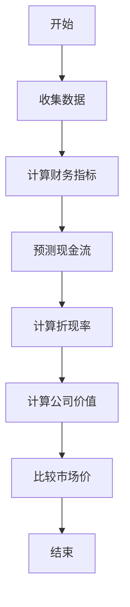
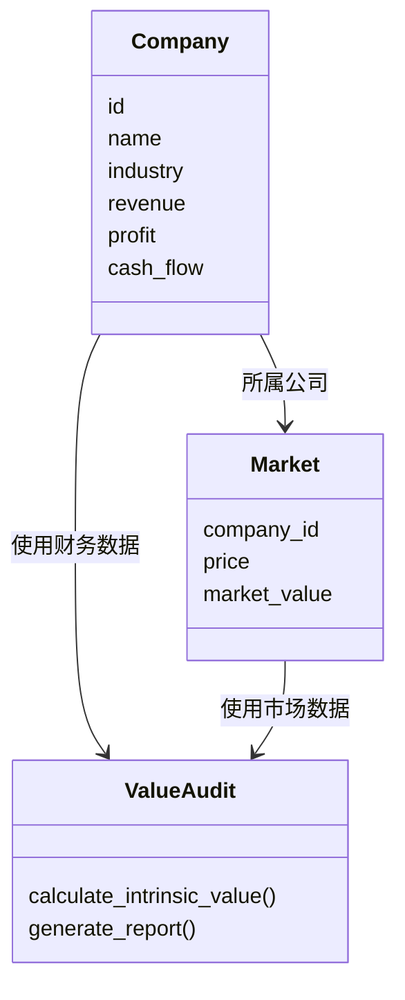
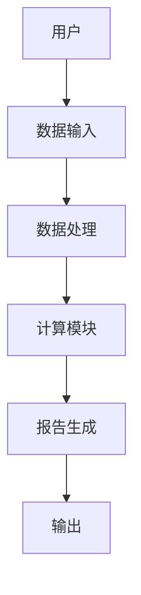
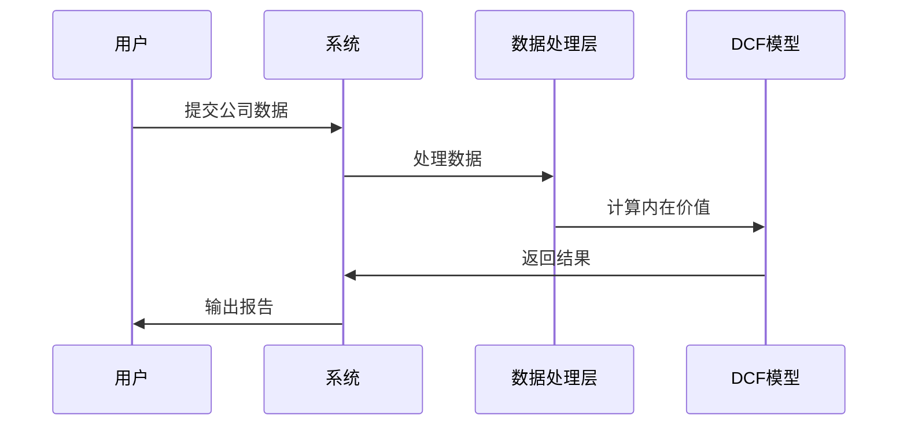

                 


# 托马斯·罗尼的价值投资审计：全面评估公司价值

> 关键词：价值投资审计，托马斯·罗尼，DCF模型，财务分析，系统设计

> 摘要：托马斯·罗尼的价值投资审计是一种系统性的方法，用于评估公司的内在价值。本文详细介绍了托马斯·罗尼的理论基础、核心概念、算法原理、系统架构设计和实际案例分析，帮助投资者更好地理解和应用这一方法。

---

# 第一部分: 价值投资审计概述

## 第1章: 托马斯·罗尼的价值投资审计方法

### 1.1 价值投资审计的定义与核心概念

#### 1.1.1 价值投资审计的定义
价值投资审计是一种通过分析公司的财务状况、市场地位和未来盈利能力，来评估其内在价值的方法。托马斯·罗尼通过这种方法，帮助投资者识别被低估的公司，并制定长期投资策略。

#### 1.1.2 核心概念：问题背景与问题描述
- **问题背景**：传统估值方法（如市盈率、市净率）在市场波动和公司特异性情况下可能失效，需要一种更系统的方法来评估公司价值。
- **问题描述**：如何准确评估公司的内在价值，尤其是在市场环境复杂多变的情况下。

#### 1.1.3 问题解决的思路与方法
托马斯·罗尼的方法以现金流贴现模型（DCF）为核心，结合对公司基本面的深入分析，包括收入、利润、现金流和竞争优势等方面。

#### 1.1.4 边界与外延
- **边界**：专注于公司本身的财务数据和市场环境，不考虑宏观经济波动的极端情况。
- **外延**：适用于多种行业和市场环境，但需要结合具体情况进行调整。

#### 1.1.5 核心要素与组成结构
价值投资审计的核心要素包括：
1. **公司基本面分析**：收入、利润、现金流。
2. **行业分析**：行业地位、竞争格局。
3. **财务健康状况**：资产负债表、利润率、ROE（净资产收益率）。
4. **未来现金流预测**：基于历史数据和行业趋势。

---

### 1.2 托马斯·罗尼的价值投资审计方法

#### 1.2.1 托马斯·罗尼的背景与贡献
托马斯·罗尼是价值投资领域的先驱，其方法以现金流贴现模型为基础，强调对公司未来现金流的合理预测和折现。

#### 1.2.2 价值投资审计的核心原理
托马斯·罗尼的核心原理是通过DCF模型，将公司未来现金流折现为当前价值，从而确定其内在价值。

#### 1.2.3 方法论的演变与优化
托马斯·罗尼的方法经过不断优化，结合了定量分析和定性判断，使其在实际应用中更具灵活性和准确性。

---

## 1.3 价值投资审计的流程与步骤

### 1.3.1 审计流程的总体框架
1. **数据收集**：收集公司的财务报表、行业数据和市场信息。
2. **财务分析**：分析公司的收入、利润和现金流。
3. **DCF模型应用**：预测未来现金流并进行折现。
4. **估值比较**：将内在价值与市场价进行比较，判断是否低估或高估。

### 1.3.2 各阶段的具体步骤
- **数据收集**：获取公司过去5年的财务数据，包括收入、利润、现金流。
- **财务分析**：计算关键财务指标，如ROE、毛利率。
- **DCF模型应用**：预测未来5年的现金流，并使用适当的折现率进行贴现。
- **估值比较**：比较DCF模型得出的内在价值与当前股价。

### 1.3.3 流程中的关键控制点
- **数据准确性**：确保财务数据的准确性和完整性。
- **模型假设**：合理假设未来现金流的增长率和折现率。
- **风险控制**：考虑宏观经济和行业风险，调整模型参数。

---

## 1.4 本章小结
托马斯·罗尼的价值投资审计方法以DCF模型为核心，通过系统性的财务分析和现金流预测，帮助投资者准确评估公司的内在价值。这种方法不仅适用于单个公司，还可以扩展到多个行业的分析。

---

# 第二部分: 价值投资审计的核心概念与联系

## 第2章: 核心概念的原理与联系

### 2.1 核心概念的原理分析

#### 2.1.1 核心概念的属性特征对比表格
| 概念 | 特性 | 描述 |
|------|------|------|
| 收入 | 增长性 | 公司收入的增长趋势 |
| 利润 | 稳定性 | 利润的波动性和可持续性 |
| 现金流 | 可持续性 | 现金流的来源和稳定性 |

#### 2.1.2 ER实体关系图架构
```mermaid
erd
  title 价值投资审计核心概念
  Company {
    id
    name
    industry
  }
  Financials {
    company_id
    revenue
    profit
    cash_flow
  }
  Market {
    company_id
    price
    market_value
  }
```

---

### 2.2 核心概念的数学模型与公式

#### 2.2.1 数学模型的构建与解释
托马斯·罗尼的DCF模型公式为：
$$
\text{公司价值} = \sum_{t=1}^{n} \frac{\text{现金流}_t}{(1 + r)^t}
$$
其中，现金流_t为第t年的现金流，r为折现率。

#### 2.2.2 相关公式的推导与应用
- **现金流预测**：基于历史数据和行业趋势，预测未来5年的现金流。
- **折现率计算**：使用CAPM模型计算无风险利率和风险溢价。

---

## 2.3 本章小结
核心概念的分析为托马斯·罗尼的价值投资审计提供了理论基础，通过数学模型和ER图的构建，帮助我们更好地理解公司价值的内在结构。

---

# 第三部分: 价值投资审计的算法原理

## 第3章: 算法原理与实现

### 3.1 算法原理的详细讲解

#### 3.1.1 算法原理的数学模型
托马斯·罗尼的DCF模型基于以下假设：
- 现金流预测：假设未来现金流以固定增长率增长。
- 折现率：使用CAPM模型计算。

#### 3.1.2 算法流程的mermaid图


---

### 3.2 算法实现的代码与解读

#### 3.2.1 环境安装与配置
```python
# 安装必要的库
import pandas as pd
import numpy as np
```

#### 3.2.2 核心代码实现
```python
def calculate_intrinsic_value(fcf, growth_rate, discount_rate, horizon):
    """
    计算公司内在价值
    Args:
        fcf: 自由现金流
        growth_rate: 现金流增长率
        discount_rate: 折现率
        horizon: 估值期限
    Returns:
        公司内在价值
    """
    terminal_value = fcf * (1 + growth_rate) ** horizon / (discount_rate - growth_rate)
    intrinsic_value = 0
    for t in range(1, horizon + 1):
        cash_flow = fcf * (1 + growth_rate) ** (t - 1)
        intrinsic_value += cash_flow / (1 + discount_rate) ** t
    intrinsic_value += terminal_value / (1 + discount_rate) ** horizon
    return intrinsic_value
```

#### 3.2.3 代码的功能解读与分析
- **函数参数**：fcf为自由现金流，growth_rate为增长率，discount_rate为折现率，horizon为估值期限。
- **终端价值计算**：使用永续增长率公式计算终端价值。
- **内在价值计算**：通过贴现未来现金流计算公司内在价值。

---

## 3.3 本章小结
通过Python代码实现托马斯·罗尼的DCF模型，可以帮助投资者快速计算公司内在价值，从而做出更明智的投资决策。

---

# 第四部分: 价值投资审计的系统分析与架构设计

## 第4章: 系统分析与架构设计

### 4.1 问题场景的系统分析

#### 4.1.1 问题场景的描述
投资者需要一个系统化的工具，快速评估公司的内在价值，特别是在市场波动和复杂经济环境下。

#### 4.1.2 系统需求的分析
- **输入**：公司财务数据、行业信息。
- **处理**：计算财务指标、预测现金流、计算内在价值。
- **输出**：内在价值报告、投资建议。

---

### 4.2 系统功能设计

#### 4.2.1 领域模型的mermaid类图


---

### 4.3 系统架构设计

#### 4.3.1 系统架构的mermaid架构图


---

### 4.4 系统接口设计

#### 4.4.1 接口的设计与实现
- **数据输入接口**：接收公司财务数据和市场数据。
- **计算接口**：调用DCF模型计算内在价值。
- **报告生成接口**：生成分析报告并输出。

---

### 4.5 系统交互设计

#### 4.5.1 交互流程的mermaid序列图


---

## 4.6 本章小结
通过系统设计，托马斯·罗尼的价值投资审计方法可以被集成到一个自动化系统中，帮助投资者快速、准确地评估公司价值。

---

# 第五部分: 价值投资审计的项目实战

## 第5章: 项目实战与案例分析

### 5.1 项目环境的安装与配置

#### 5.1.1 开发环境的搭建
```python
# 安装必要的库
pip install pandas numpy
```

---

### 5.2 项目核心实现

#### 5.2.1 代码实现
```python
# 示例代码：计算公司A的内在价值
fcf = 100  # 自由现金流
growth_rate = 0.05  # 现金流增长率
discount_rate = 0.10  # 折现率
horizon = 5  # 估值期限

intrinsic_value = calculate_intrinsic_value(fcf, growth_rate, discount_rate, horizon)
print(f"公司A的内在价值为：{intrinsic_value}")
```

#### 5.2.2 代码的功能解读与分析
- **输入参数**：自由现金流为100，增长率为5%，折现率为10%，估值期限为5年。
- **输出结果**：计算得出公司A的内在价值。

---

### 5.3 实际案例分析

#### 5.3.1 案例介绍
以公司A为例，假设其过去5年的自由现金流为100，增长率5%，折现率10%。

#### 5.3.2 案例分析与解读
- **现金流预测**：未来5年的现金流分别为100, 105, 110.25, 115.76, 121.55。
- **折现计算**：每年的现金流贴现值分别为90.91, 86.38, 82.12, 78.23, 74.57。
- **终端价值**：第5年后的终端价值为121.55 * (1 + 5%) / (10% - 5%) = 128.16。
- **内在价值**：74.57 + 78.23 + 82.12 + 86.38 + 90.91 + 128.16 / (1.10)^5 ≈ 476.37。

#### 5.3.3 结果解读
公司A的内在价值为476.37，若当前股价低于此值，则公司被低估。

---

## 5.4 本章小结
通过实际案例分析，我们可以看到托马斯·罗尼的价值投资审计方法在实际应用中的效果和优势。

---

# 结语

托马斯·罗尼的价值投资审计方法为投资者提供了一种系统化、科学化的公司估值方法。通过DCF模型和深入的财务分析，投资者可以更准确地评估公司的内在价值，制定更有效的投资策略。未来，随着数据科学和人工智能的发展，价值投资审计方法将变得更加精准和高效。

---

* **注意事项**：在实际应用中，需注意数据的准确性和模型假设的合理性，避免因假设偏差导致的估值误差。
* **拓展阅读**：推荐阅读托马斯·罗尼的经典著作《价值投资审计：方法与实践》，深入了解其理论的更多细节。

