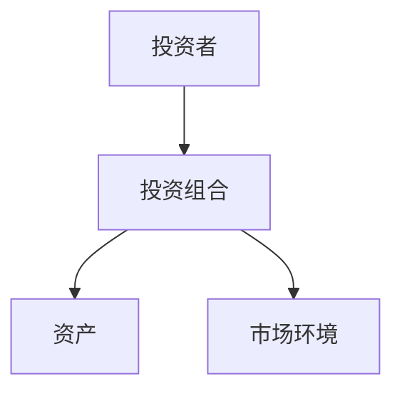
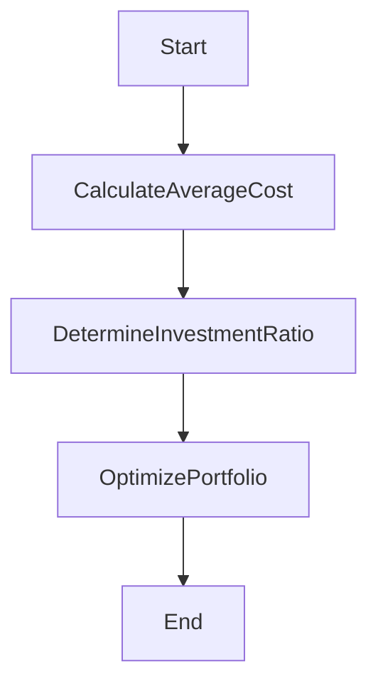
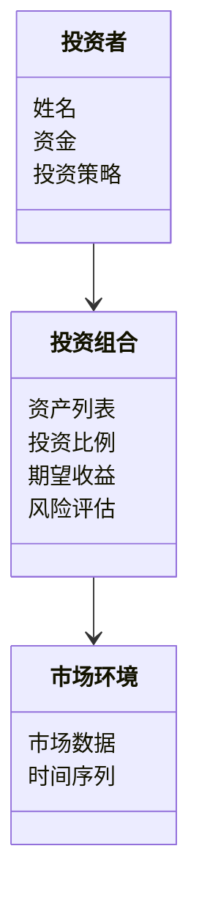
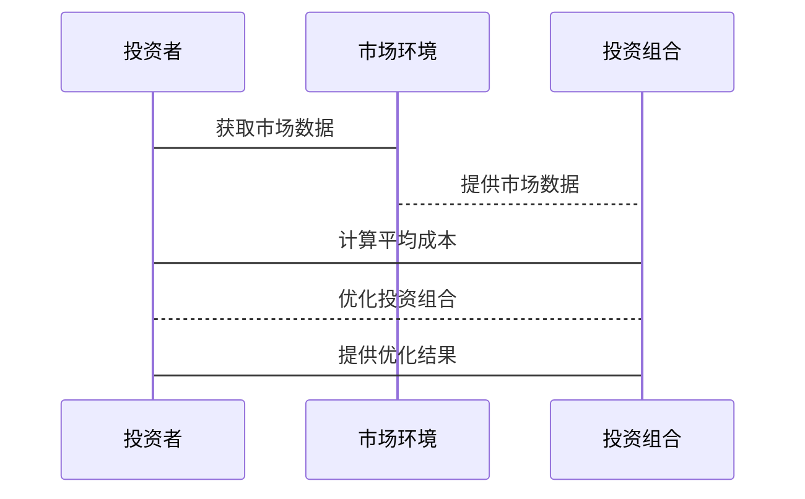

                 


# 托马斯·罗的价值平均策略

## 关键词：
- 价值平均策略
- 投资策略
- 托马斯·罗
- 投资组合优化
- 风险管理

## 摘要：
托马斯·罗的价值平均策略是一种通过平均成本法优化投资组合的策略，旨在降低投资风险并提高长期收益。本文详细解析了该策略的核心概念、数学模型、算法原理，并通过实际案例和系统设计展示了其应用。文章还提供了代码实现和系统架构设计，帮助读者全面理解并应用该策略。

---

# 第一部分：价值平均策略的背景与核心概念

## 第1章：价值平均策略的背景与核心概念

### 1.1 投资的基本概念
- 1.1.1 投资的基本定义
  - 投资是将资金投入到资产中，以期获得收益的过程。
  - 投资的目标包括资本增值、收入获取和资产保值。

- 1.1.2 投资的基本原理
  - 投资的本质是通过配置资产实现资源的最优利用。
  - 投资需要考虑时间价值、风险偏好和市场环境。

- 1.1.3 投资的目标与风险
  - 投资目标：实现资产增值。
  - 投资风险：包括市场风险、流动性风险和信用风险。

### 1.2 托马斯·罗的背景与价值平均策略
- 1.2.1 托马斯·罗的简介
  - 托马斯·罗是投资领域的重要人物，专注于优化投资组合和风险管理。
  - 他提出的价值平均策略旨在通过平均成本法降低投资风险。

- 1.2.2 价值平均策略的提出背景
  - 传统投资策略的局限性：过于依赖市场预测，风险集中。
  - 价值平均策略的提出：通过分散投资降低风险，实现长期稳定的收益。

- 1.2.3 价值平均策略的核心思想
  - 等额分摊：将资金分批投入，降低市场波动的影响。
  - 平均成本：通过分批投资，降低整体投资成本。

### 1.3 价值平均策略的基本原理
- 1.3.1 价值平均策略的定义
  - 价值平均策略是一种通过等额分批投资，降低投资成本的策略。
  - 适用于长期投资，尤其在市场波动较大时效果显著。

- 1.3.2 价值平均策略的核心要素
  - 投资金额：固定的金额，定期投入。
  - 投资频率：定期定额，分散投资。
  - 投资期限：长期持有，复利效应。

- 1.3.3 价值平均策略与传统投资策略的对比
  | 对比维度 | 价值平均策略 | 传统投资策略 |
  |----------|--------------|---------------|
  | 投资方式 | 分批投资      | 一次性投资    |
  | 风险控制 | 较低          | 较高          |
  | 收益稳定性 | 较高          | 较不稳定      |

### 1.4 价值平均策略的实际应用案例
- 1.4.1 案例一：某投资者的实践
  - 投资者定期定额投资，分批购买股票或基金。
  - 通过市场波动，降低平均成本，实现收益最大化。

- 1.4.2 案例二：机构投资者的应用
  - 机构通过价值平均策略优化资产配置，降低整体风险。
  - 在市场下跌时，分批买入，摊低成本。

- 1.4.3 案例三：个人投资者的体验
  - 个人投资者通过定期定额投资，实现长期稳定的收益。
  - 减少市场波动对投资组合的影响。

## 1.5 本章小结
- 本章介绍了投资的基本概念和价值平均策略的背景。
- 分析了价值平均策略的核心思想和与传统策略的对比。
- 通过实际案例展示了策略的应用效果。

---

# 第二部分：价值平均策略的核心概念与数学模型

## 第2章：价值平均策略的核心概念

### 2.1 价值平均策略的数学模型
- 2.1.1 投资组合的定义
  - 投资组合是将资金分配到不同资产的组合，以实现风险与收益的平衡。

- 2.1.2 投资组合的期望收益与风险
  - 期望收益：投资组合的平均收益。
  - 风险：投资组合的波动性，通常用方差或标准差衡量。

- 2.1.3 价值平均策略的数学表达式
  - 分批投资，每次投资金额相同，间隔时间相同。
  - 投资总额为N次投资，每次金额为A，总金额为N×A。
  - 投资成本为每次购买的价格的平均值。

### 2.2 价值平均策略的属性特征对比
| 对比维度 | 价值平均策略 | 传统投资策略 |
|----------|--------------|---------------|
| 确定性 | 较高          | 较低          |
| 短期与长期 | 长期为主      | 短期为主      |
| 风险与收益 | 收益稳定，风险较低 | 收益高，风险高 |

### 2.3 价值平均策略的ER实体关系图


### 2.4 价值平均策略的算法原理


## 第3章：价值平均策略的数学模型

### 3.1 投资组合的期望收益与风险
- 3.1.1 期望收益的计算公式
  $$E(r) = \sum_{i=1}^{n} w_i r_i$$
  其中，\(w_i\) 是资产i的投资比例，\(r_i\) 是资产i的期望收益。

- 3.1.2 风险的衡量指标
  $$Var(r) = \sum_{i=1}^{n} w_i^2 \sigma_i^2 + 2\sum_{i<j} w_i w_j \sigma_i \sigma_j \rho_{ij}$$
  其中，\(\sigma_i\) 是资产i的波动率，\(\rho_{ij}\) 是资产i和资产j的相关系数。

### 3.2 价值平均策略的优化模型
- 优化目标：最大化投资组合的期望收益，同时最小化风险。
  $$\text{Maximize } E(r) - \lambda \times Var(r)$$
  其中，\(\lambda\) 是风险厌恶系数。

- 约束条件：
  $$\sum_{i=1}^{n} w_i = 1$$
  $$w_i \geq 0 \quad \forall i$$

### 3.3 价值平均策略的实施步骤
- 确定投资金额和频率。
- 计算每期的平均成本。
- 优化投资组合，调整投资比例。

---

# 第三部分：价值平均策略的系统分析与设计

## 第4章：价值平均策略的系统分析与架构设计

### 4.1 问题场景介绍
- 投资者希望在市场波动中，通过价值平均策略优化投资组合。
- 系统需要实现投资策略的模拟、优化和结果分析。

### 4.2 系统功能设计


### 4.3 系统架构设计
```mermaid
context ValueAveragingStrategy {
    投资者
    投资组合
    市场环境
    +接口：计算平均成本
    +接口：优化投资组合
}
```

### 4.4 系统接口设计
- 计算平均成本接口：
  - 输入：投资金额，投资频率，市场数据。
  - 输出：平均成本。

- 优化投资组合接口：
  - 输入：投资比例，市场环境。
  - 输出：优化后的投资组合。

### 4.5 系统交互设计


---

# 第四部分：价值平均策略的项目实战

## 第5章：价值平均策略的项目实战

### 5.1 环境安装
- 安装Python和相关库（pandas, numpy, matplotlib）。

### 5.2 代码实现
```python
import pandas as pd
import numpy as np

def value_averaging_strategy(initial_amount, period, frequency, assets):
    total_investments = period * frequency
    average_cost = initial_amount / total_investments
    optimized_portfolio = {}
    for asset in assets:
        optimized_portfolio[asset] = average_cost * frequency
    return optimized_portfolio

# 示例
initial_amount = 100000
period = 5  # 年
frequency = 12  # 每月投资
assets = ['股票', '债券', '房地产']

result = value_averaging_strategy(initial_amount, period, frequency, assets)
print("优化后的投资组合:", result)
```

### 5.3 代码应用解读
- 示例代码实现了价值平均策略的基本功能。
- 输入参数包括初始金额、投资期限、投资频率和资产列表。
- 输出为优化后的投资组合，每种资产的投资金额相同。

### 5.4 实际案例分析
- 案例：某投资者投资10万元，5年，每月定投，资产包括股票、债券和房地产。
- 计算结果：每种资产投资金额为100000 / (5*12) ≈ 1666.67元。

### 5.5 项目小结
- 价值平均策略通过分批投资，优化了投资组合的成本。
- 代码实现简单，但需要根据实际情况调整参数。

---

# 第五部分：价值平均策略的最佳实践

## 第6章：价值平均策略的最佳实践

### 6.1 最佳实践
- 确定合理的投资金额和频率。
- 定期审视和调整投资组合。
- 结合市场环境灵活应用策略。

### 6.2 小结
- 价值平均策略是一种有效的投资方法，适用于长期投资。
- 通过合理配置和定期调整，可以实现稳定的收益。

### 6.3 注意事项
- 风险提示：市场波动可能导致实际收益低于预期。
- 适用场景：长期投资，波动性较大的市场。
- 禁忌：频繁交易，过度分散。

### 6.4 拓展阅读
- 推荐书籍：《价值投资实战策略》。
- 推荐文章：《投资策略的数学建模》。

---

# 第六部分：总结

## 第7章：总结
- 价值平均策略通过分批投资，优化了投资组合的成本。
- 本文详细讲解了策略的核心概念、数学模型和系统设计。
- 提供了代码实现和实际案例，帮助读者理解和应用策略。
- 注意市场波动和策略调整，以实现最佳投资效果。

