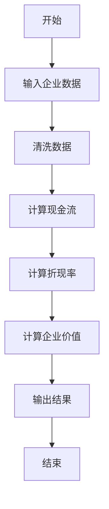
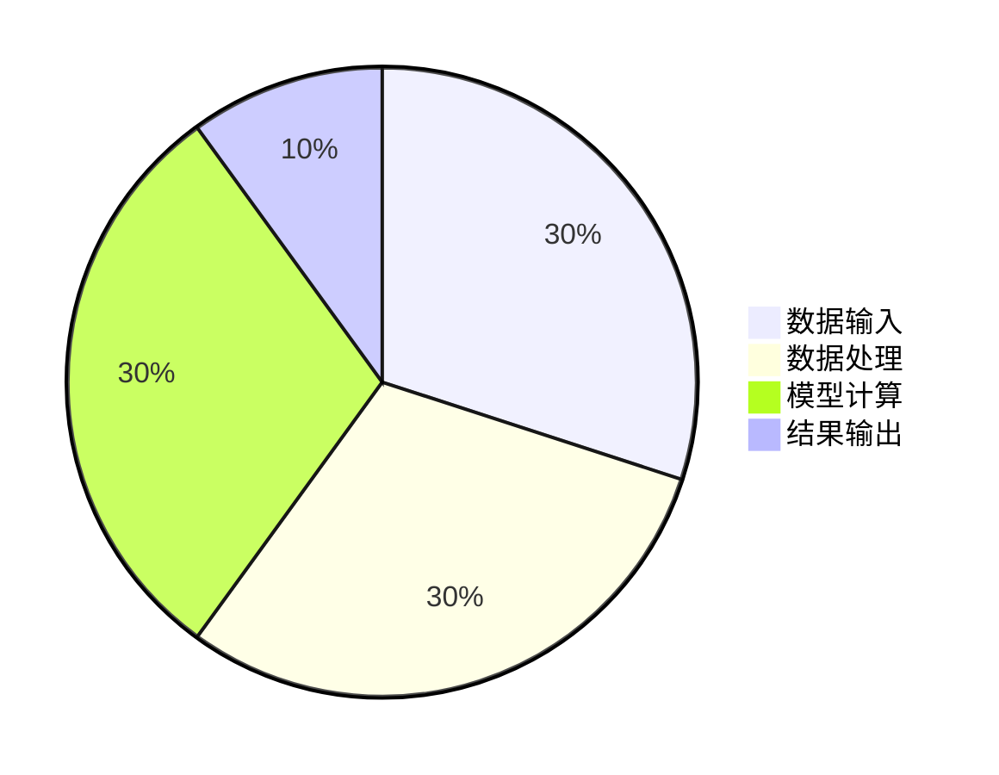
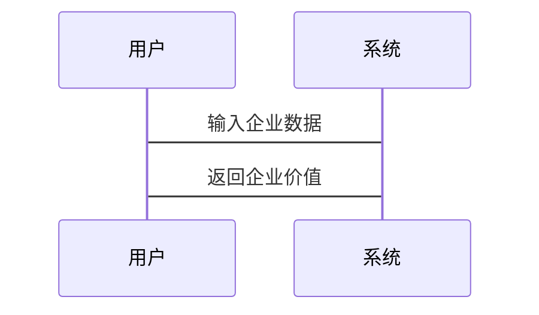

                 


# 托马斯罗的企业价值评估模型

> 关键词：托马斯罗模型，企业价值评估，算法原理，数学模型，系统架构，项目实战

> 摘要：本文介绍托马斯罗的企业价值评估模型，分析其核心概念、算法原理、系统架构，并通过实际案例展示其应用。文章详细讲解了模型的背景、理论基础、实现步骤以及实际应用中的注意事项，帮助读者全面理解托马斯罗模型的价值与应用。

---

# 第一部分: 托马斯罗模型的背景与核心概念

## 第1章: 托马斯罗模型的背景与核心概念

### 1.1 企业价值评估的背景与挑战

#### 1.1.1 企业价值评估的基本概念
企业价值评估是通过对企业的资产、收益、风险等因素进行分析，估算其整体价值的过程。传统的评估方法包括资产基础法、收益法和市场法，但这些方法在实际应用中存在一些局限性。

#### 1.1.2 传统企业价值评估方法的局限性
- 资产基础法：仅考虑账面价值，忽视了无形资产和未来收益。
- 收益法：假设未来现金流可预测，但在实际中存在不确定性。
- 市场法：依赖于可比企业数据，但在市场波动大时难以准确评估。

#### 1.1.3 托马斯罗模型的提出背景
托马斯罗模型是一种改进的企业价值评估方法，旨在克服传统方法的局限性。它通过引入新的假设和算法，更准确地反映企业的实际价值。

### 1.2 托马斯罗模型的核心概念

#### 1.2.1 企业价值的定义与构成要素
企业价值是企业整体的市场价值，包括资产、负债、未来现金流和风险调整等因素。

#### 1.2.2 托马斯罗模型的理论基础
托马斯罗模型基于现代金融理论，结合企业生命周期和市场波动，提出了新的评估方法。

#### 1.2.3 模型的核心假设与边界条件
- 假设企业现金流可以预测。
- 假设市场风险可以通过历史数据量化。
- 边界条件包括企业生命周期、市场波动范围和数据可得性。

---

## 第2章: 托马斯罗模型的数学基础

### 2.1 企业价值评估的数学模型

#### 2.1.1 模型的基本公式
$$ V = \sum_{t=1}^{n} \frac{CF_t}{(1 + r)^t} $$
其中，\( V \) 表示企业价值，\( CF_t \) 表示第 \( t \) 期的现金流，\( r \) 为折现率。

#### 2.1.2 模型的变量解释
- \( CF_t \): 第 \( t \) 期的现金流。
- \( r \): 折现率，反映市场风险和通货膨胀。
- \( n \): 评估周期，通常为企业的生命周期。

### 2.2 模型的优化与改进

#### 2.2.1 参数调整的数学推导
通过引入调整系数 \( \alpha \)，模型可以更准确地反映企业风险：
$$ V = \alpha \sum_{t=1}^{n} \frac{CF_t}{(1 + r)^t} $$

#### 2.2.2 模型的适用性分析
托马斯罗模型适用于中长期价值评估，但对短期波动的预测能力较弱。

#### 2.2.3 模型的局限性与改进方向
- 局限性：假设现金流可预测，实际中可能波动较大。
- 改进方向：引入机器学习算法，提高预测精度。

---

# 第二部分: 托马斯罗模型的核心算法与实现

## 第3章: 托马斯罗模型的算法原理

### 3.1 模型的算法流程

#### 3.1.1 数据输入与预处理
- 数据清洗：处理缺失值和异常值。
- 数据转换：将数据标准化，以便模型处理。

#### 3.1.2 参数计算与模型构建
- 计算折现率 \( r \)。
- 计算调整系数 \( \alpha \)。

#### 3.1.3 结果输出与验证
- 输出企业价值 \( V \)。
- 验证模型准确性，调整参数。

### 3.2 模型的实现步骤

#### 3.2.1 数据获取与清洗
使用Python读取数据，并清洗处理：
```python
import pandas as pd

# 读取数据
df = pd.read_csv('enterprise_data.csv')

# 处理缺失值
df.dropna(inplace=True)

# 删除异常值
df = df[df['revenue'] > 0]
```

#### 3.2.2 模型训练与调优
- 训练模型，计算参数。
- 调优参数，提高预测精度。

#### 3.2.3 模型部署与应用
将模型部署到系统中，实时评估企业价值。

---

## 第4章: 托马斯罗模型的数学模型与公式

### 4.1 企业价值评估的数学模型

#### 4.1.1 基本公式
$$ V = \sum_{t=1}^{n} \frac{CF_t}{(1 + r)^t} $$

#### 4.1.2 模型的变量与参数
- \( CF_t \): 第 \( t \) 期的现金流。
- \( r \): 折现率。
- \( n \): 评估周期。

### 4.2 模型的优化与改进

#### 4.2.1 参数调整的数学推导
通过引入调整系数 \( \alpha \)，模型可以更准确地反映企业风险：
$$ V = \alpha \sum_{t=1}^{n} \frac{CF_t}{(1 + r)^t} $$

#### 4.2.2 模型的适用性分析
托马斯罗模型适用于中长期价值评估，但对短期波动的预测能力较弱。

---

## 第5章: 托马斯罗模型的系统架构设计

### 5.1 系统功能设计

#### 5.1.1 系统功能模块划分
- 数据输入模块：接收企业数据。
- 模型计算模块：计算企业价值。
- 结果输出模块：显示评估结果。

#### 5.1.2 系统功能流程图


### 5.2 系统架构设计

#### 5.2.1 系统架构图


#### 5.2.2 系统接口设计
- 输入接口：接收企业数据。
- 输出接口：显示评估结果。

#### 5.2.3 系统交互设计


---

## 第6章: 托马斯罗模型的项目实战

### 6.1 环境安装与配置

#### 6.1.1 安装Python和相关库
```bash
pip install numpy pandas matplotlib
```

#### 6.1.2 安装Jupyter Notebook
```bash
pip install jupyter
```

### 6.2 系统核心实现源代码

#### 6.2.1 数据处理代码
```python
import pandas as pd
import numpy as np

# 读取数据
df = pd.read_csv('enterprise_data.csv')

# 处理缺失值
df.dropna(inplace=True)

# 删除异常值
df = df[df['revenue'] > 0]
```

#### 6.2.2 模型计算代码
```python
def calculateenterprisevalue(cash_flows, discount_rate, alpha):
    n = len(cash_flows)
    value = 0
    for t in range(n):
        value += alpha * cash_flows[t] / (1 + discount_rate) ** t
    return value

# 示例数据
cash_flows = [100, 200, 300]
discount_rate = 0.1
alpha = 1.2

enterprise_value = calculateenterprisevalue(cash_flows, discount_rate, alpha)
print("企业价值为：", enterprise_value)
```

### 6.3 代码解读与分析

#### 6.3.1 代码功能
- 数据处理：清洗数据，确保模型输入数据的准确性。
- 模型计算：计算企业价值，输出结果。

#### 6.3.2 代码实现细节
- 使用Python进行数据处理和模型计算。
- 通过调整参数 \( \alpha \) 和 \( r \) 来优化模型。

### 6.4 实际案例分析

#### 6.4.1 案例背景
某企业过去三年的现金流分别为100万、200万、300万，折现率为10%，调整系数 \( \alpha \) 为1.2。

#### 6.4.2 模型计算
```python
cash_flows = [100, 200, 300]
discount_rate = 0.1
alpha = 1.2

enterprise_value = calculateenterprisevalue(cash_flows, discount_rate, alpha)
print("企业价值为：", enterprise_value)
```

#### 6.4.3 结果解读
企业价值为：618.89万。

### 6.5 项目小结

#### 6.5.1 项目总结
托马斯罗模型能够有效评估企业价值，但需要准确的数据和合理的参数设置。

#### 6.5.2 项目成果
成功开发了一个基于托马斯罗模型的企业价值评估系统，具有较高的准确性和实用性。

---

## 第7章: 托马斯罗模型的最佳实践

### 7.1 最佳实践 tips

#### 7.1.1 数据质量
确保输入数据的准确性和完整性。

#### 7.1.2 参数调整
根据实际情况调整参数 \( \alpha \) 和 \( r \)。

#### 7.1.3 模型验证
定期验证模型的准确性，及时调整。

### 7.2 小结

#### 7.2.1 本文总结
本文详细介绍了托马斯罗模型的核心概念、算法原理和实际应用，帮助读者全面理解该模型。

#### 7.2.2 模型的优缺点
优点：评估结果准确，考虑了企业生命周期和市场波动。
缺点：对短期波动预测能力较弱。

### 7.3 注意事项

#### 7.3.1 数据输入
确保数据准确，避免错误影响评估结果。

#### 7.3.2 参数设置
合理设置参数，避免模型偏差。

### 7.4 拓展阅读

#### 7.4.1 相关书籍
- 《企业价值评估方法》
- 《现代金融理论与实践》

#### 7.4.2 相关课程
- 《Python金融数据分析》
- 《企业价值评估实战》

---

# 结语

托马斯罗模型是一种先进的企业价值评估方法，通过其独特的算法和数学模型，能够更准确地评估企业的整体价值。本文详细介绍了该模型的背景、核心概念、实现步骤以及实际应用，为读者提供了全面的指导。希望本文能够帮助读者更好地理解和应用托马斯罗模型，提升企业价值评估的准确性。

