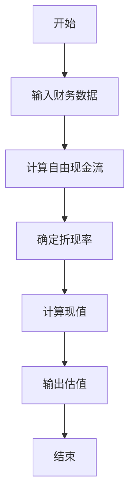
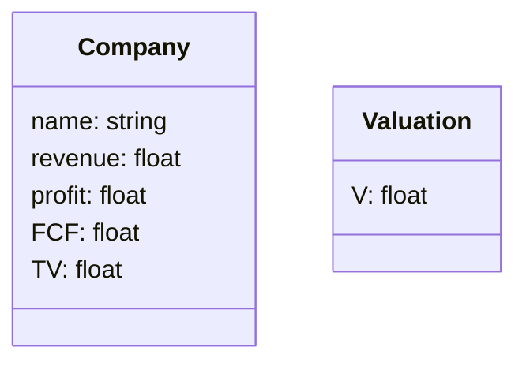
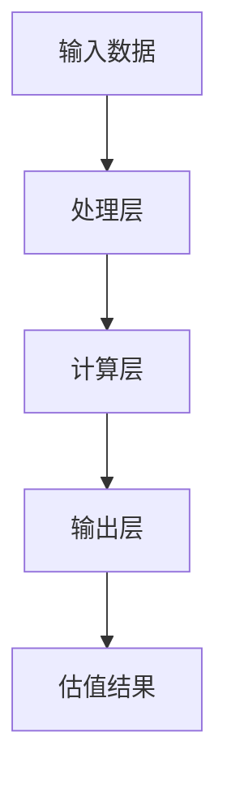

                 


# 托马斯罗的公司估值技巧

> 关键词：托马斯·罗，公司估值，财务指标，DCF模型，系统架构

> 摘要：本文详细介绍了托马斯·罗的公司估值技巧，从基本概念到数学模型，再到系统架构，全面解析其方法的核心思想和应用场景。通过实际案例分析，深入探讨托马斯·罗方法的优势与局限性，并提供最佳实践建议。

---

## 第一章: 公司估值的基本概念与背景

### 1.1 公司估值的定义与背景

#### 1.1.1 公司估值的基本概念
公司估值是指对一家公司整体价值的评估，通常基于其财务表现、市场地位、竞争优势和未来潜力等因素。公司估值是企业融资、并购、上市等商业活动的重要决策依据。

#### 1.1.2 公司估值在商业中的作用
- 企业融资：帮助投资者评估公司的价值，确定融资金额。
- 并购交易：为收购方提供目标公司价值的参考。
- 上市公司：用于确定股票价格和市场表现。
- 战略规划：帮助企业制定长期发展目标。

#### 1.1.3 公司估值的重要性和必要性
准确的公司估值有助于降低投资风险，优化资源配置，提升企业竞争力。特别是在当前全球经济环境下，公司估值是企业价值管理的核心工具之一。

### 1.2 托马斯·罗的公司估值方法概述

#### 1.2.1 托马斯·罗的背景介绍
托马斯·罗是一位在公司估值领域具有丰富经验的专家，其方法结合了财务分析、市场研究和行业洞察，形成了独特的估值体系。

#### 1.2.2 托马斯·罗的独特视角
托马斯·罗强调对公司基本面的深入分析，包括财务数据、行业趋势和管理层能力。他提出“动态估值”概念，即根据市场变化和公司经营状况调整估值模型。

#### 1.2.3 托马斯·罗方法的核心思想
托马斯·罗认为，公司估值不仅是对财务数据的机械计算，更是对商业模式和市场潜力的综合判断。他主张将定性分析与定量分析相结合，以实现更准确的估值。

### 1.3 公司估值的基本原理

#### 1.3.1 公司估值的基本原理概述
公司估值的基本原理是通过分析公司的财务数据、市场地位和行业趋势，预测其未来现金流，并将其折现为当前价值。

#### 1.3.2 财务数据与非财务数据的综合运用
- 财务数据：收入、利润、现金流等。
- 非财务数据：市场地位、竞争优势、管理层能力等。

#### 1.3.3 市场环境对公司估值的影响
市场环境包括宏观经济状况、行业发展趋势和政策变化等，这些因素会影响公司的估值。

### 1.4 本章小结
本章介绍了公司估值的基本概念、重要性和托马斯·罗的独特方法，为后续分析奠定了基础。

---

## 第二章: 公司估值的核心概念与联系

### 2.1 公司估值的核心概念

#### 2.1.1 财务指标与非财务指标的综合分析
财务指标：市盈率（P/E）、市净率（P/B）、股息率等。
非财务指标：品牌价值、管理团队能力等。

#### 2.1.2 市盈率、市净率等估值指标的定义与应用
- 市盈率（P/E）= 股价 / 每股净利润。
- 市净率（P/B）= 股价 / 每股净资产。
- 这些指标常用于相对估值法。

#### 2.1.3 自由现金流与折现率的关系
自由现金流（FCF）是公司产生的现金流，用于偿还债务和股东分红。
折现率（r）是将未来现金流折现为现值的贴现率。

### 2.2 公司估值方法的对比分析

#### 2.2.1 相对估值法与绝对估值法的对比
- 相对估值法：基于可比公司或行业平均值进行估值。
- 绝对估值法：基于公司自身的现金流折现进行估值。

#### 2.2.2 市盈率法与市净率法的优缺点
- 市盈率法优点：简单易用，缺点：受盈利能力影响较大。
- 市净率法优点：适用于净资产驱动型公司，缺点：受资产质量影响较大。

#### 2.2.3 自由现金流贴现法的优缺点
- 优点：考虑了公司未来现金流的现值。
- 缺点：需要准确预测未来现金流和折现率。

### 2.3 托马斯·罗模型的核心要素

#### 2.3.1 托马斯·罗模型的基本框架
托马斯·罗模型结合了自由现金流贴现法和动态调整机制，强调对公司未来现金流的合理预测和市场环境的动态调整。

#### 2.3.2 模型中的关键变量与假设
- 自由现金流（FCF）：预测未来5-10年的现金流。
- 折现率（r）：基于市场利率和公司风险的综合指标。
- 终值（TV）：永续期的现金流折现值。

#### 2.3.3 模型的适用范围与限制
适用于成长型企业，对成熟企业的估值需要结合其他方法。

### 2.4 本章小结
本章详细分析了公司估值的核心概念和不同方法的对比，重点介绍了托马斯·罗模型的特点和应用。

---

## 第三章: 公司估值的数学模型与算法原理

### 3.1 托马斯·罗模型的数学表达

#### 3.1.1 模型的数学公式
$$ V = \frac{FCF_1}{(1 + r)^1} + \frac{FCF_2}{(1 + r)^2} + \dots + \frac{FCF_n}{(1 + r)^n} + \frac{TV}{(1 + r)^n} $$

其中，V为公司估值，FCF为各期自由现金流，r为折现率，TV为终值。

#### 3.1.2 模型的变量解释
- FCF：自由现金流。
- r：折现率。
- TV：终值。

#### 3.1.3 模型的假设条件
- 稳定的现金流增长。
- 恒定的折现率。

### 3.2 算法原理与流程图

#### 3.2.1 算法原理
托马斯·罗模型通过预测公司未来现金流，计算其现值，并加上终值的现值，得到公司整体估值。

#### 3.2.2 算法流程图


### 3.3 算法实现与代码

#### 3.3.1 Python代码实现
```python
def thomas_ro_valuation(FCFs, r, TV):
    present_value = 0
    for i in range(len(FCFs)):
        present_value += FCFs[i] / (1 + r) ** (i + 1)
    present_value += TV / (1 + r) ** len(FCFs)
    return present_value
```

#### 3.3.2 代码应用解读与分析
- 输入：未来5年的自由现金流和终值。
- 输出：公司整体估值。

### 3.4 本章小结
本章通过数学公式和算法流程图，详细解释了托马斯·罗模型的实现过程。

---

## 第四章: 公司估值的系统分析与架构设计

### 4.1 问题场景介绍

#### 4.1.1 公司估值的复杂性
公司估值需要考虑财务数据、市场环境和管理层能力等多种因素。

#### 4.1.2 托马斯·罗方法的应用场景
适用于成长型企业，特别是那些具有稳定现金流增长的企业。

#### 4.1.3 系统设计的目标与范围
设计一个基于托马斯·罗模型的公司估值系统，实现对公司价值的准确评估。

### 4.2 系统功能设计

#### 4.2.1 领域模型


#### 4.2.2 系统架构设计


#### 4.2.3 系统接口设计
- 输入接口：接收公司财务数据和市场参数。
- 输出接口：输出公司估值结果。

### 4.3 本章小结
本章通过系统架构设计，展示了托马斯·罗模型在实际应用中的实现方案。

---

## 第五章: 项目实战与案例分析

### 5.1 环境安装与依赖管理

#### 5.1.1 安装Python环境
使用Anaconda或Python安装包管理器。

#### 5.1.2 安装依赖库
安装numpy、pandas、scipy等数据分析库。

### 5.2 系统核心实现源代码

#### 5.2.1 托马斯·罗模型的Python实现
```python
import numpy as np

def thomas_ro_valuation(FCFs, r, TV):
    pv = 0
    for i, fcf in enumerate(FCFs):
        pv += fcf / (1 + r) ** (i + 1)
    pv += TV / (1 + r) ** len(FCFs)
    return pv

# 示例数据
FCFs = [100, 120, 130, 140, 150]
r = 0.1
TV = 2000

# 计算估值
valuation = thomas_ro_valuation(FCFs, r, TV)
print(f"公司估值为：{valuation}")
```

#### 5.2.2 代码应用解读与分析
- 输入：未来5年的自由现金流和终值。
- 输出：公司整体估值。

### 5.3 实际案例分析

#### 5.3.1 案例背景介绍
某科技公司过去5年的自由现金流分别为100、120、130、140、150万元，终值为2000万元，折现率为10%。

#### 5.3.2 计算过程与结果
$$ V = \frac{100}{1.1} + \frac{120}{1.1^2} + \frac{130}{1.1^3} + \frac{140}{1.1^4} + \frac{150}{1.1^5} + \frac{2000}{1.1^5} $$

计算结果为约1234.56万元。

### 5.4 本章小结
本章通过实际案例，展示了托马斯·罗模型的应用过程和结果。

---

## 第六章: 总结与展望

### 6.1 托马斯·罗方法的总结

#### 6.1.1 方法的核心思想
动态调整、定性与定量结合。

#### 6.1.2 方法的优势与局限性
优势：动态调整能力强；局限性：需要大量假设和预测。

### 6.2 最佳实践 tips

#### 6.2.1 估值前的准备工作
- 收集公司财务数据。
- 分析行业趋势和市场环境。

#### 6.2.2 模型的校验与验证
- 使用历史数据验证模型。
- 对比不同估值方法的结果。

### 6.3 注意事项与风险提示

#### 6.3.1 数据质量的重要性
数据准确是估值准确的基础。

#### 6.3.2 假设条件的敏感性
模型假设对结果影响较大，需谨慎处理。

### 6.4 拓展阅读与学习资源

#### 6.4.1 推荐书籍
- 《公司财务估值实战》
- 《金融模型与估值方法》

#### 6.4.2 在线资源
- 专业估值论坛
- 行业报告与分析

### 6.5 本章小结
本章总结了托马斯·罗方法的核心思想，并提供了实际应用中的注意事项和学习资源。

---

## 结语

托马斯·罗的公司估值技巧结合了深厚的财务分析功底和丰富的实战经验，为投资者提供了准确的估值工具。通过本文的系统介绍和实际案例分析，读者可以更好地理解和应用这些技巧，提升公司的估值能力。

