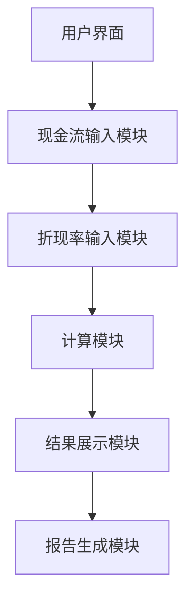
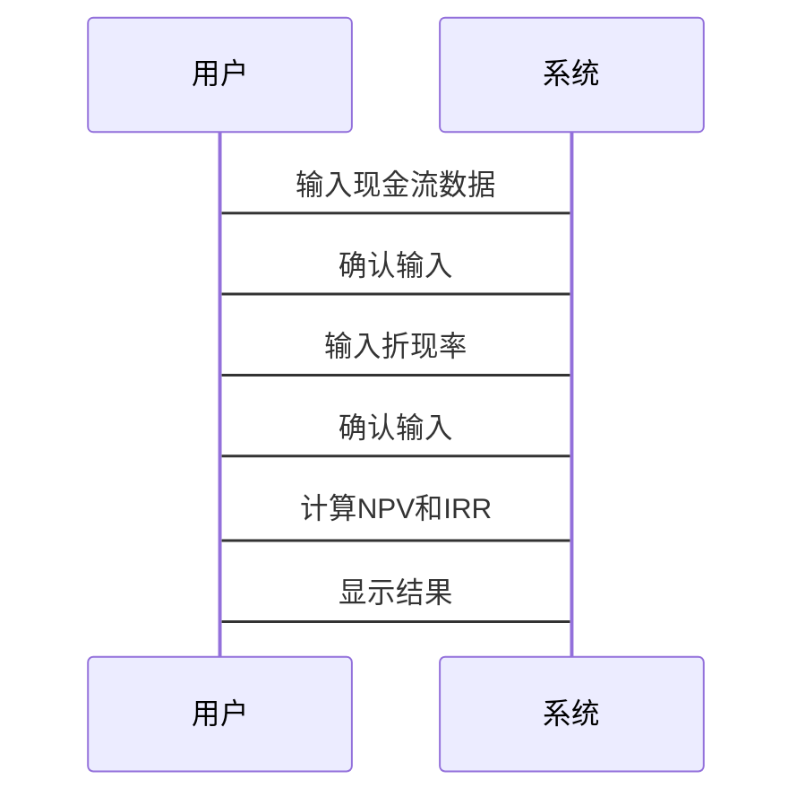

                 


# 托马斯罗的现金流投资法

## 关键词：现金流投资法、净现值（NPV）、内部收益率（IRR）、投资决策、现金流分析、财务模型

## 摘要

托马斯罗的现金流投资法是一种基于现金流分析的投资决策方法，它通过计算项目的净现值（NPV）和内部收益率（IRR）来评估项目的可行性和盈利能力。本文将详细讲解现金流投资法的核心概念、算法原理、数学模型、系统架构设计以及实际项目案例，帮助读者掌握这一强大的投资分析工具。

---

## 第一部分：现金流投资法的背景与核心概念

### 第1章：现金流投资法的起源与核心概念

#### 1.1 现金流投资法的起源

现金流投资法是由托马斯·罗提出的一种基于现金流分析的投资决策方法。这种方法的核心在于通过预测项目的现金流，计算其净现值（NPV）和内部收益率（IRR），从而评估项目的实际价值和可行性。

#### 1.2 现金流投资法的核心概念

##### 1.2.1 现金流的定义与分类

现金流是指企业在一定时期内，由于生产经营活动所引起的现金流入和流出。现金流可以分为以下几类：
- **经营性现金流**：与企业日常经营相关的现金流。
- **投资性现金流**：与企业投资活动相关的现金流。
- **筹资性现金流**：与企业筹资活动相关的现金流。

##### 1.2.2 净现值（NPV）的计算方法

净现值（Net Present Value，NPV）是指将项目未来现金流按适当折现率折现后，与初始投资的差额。公式为：
$$ NPV = \sum_{t=0}^{n} \frac{CF_t}{(1 + r)^t} - 初始投资 $$

其中，$CF_t$ 是第 $t$ 年的现金流，$r$ 是折现率。

##### 1.2.3 内部收益率（IRR）的定义与作用

内部收益率（Internal Rate of Return，IRR）是指项目未来现金流的折现率，使得净现值为零。IRR的计算公式为：
$$ NPV = \sum_{t=0}^{n} \frac{CF_t}{(1 + IRR)^t} - 初始投资 = 0 $$

IRR越高，项目的盈利能力越强。

#### 1.3 现金流投资法与传统投资方法的区别

传统投资方法通常关注于回报率和利润，而现金流投资法则更关注于现金流的时间价值和实际收益。以下是两者的区别：

| **比较项** | **传统投资方法** | **现金流投资法** |
|------------|------------------|-------------------|
| 关注点     | 利润率           | 现金流的现值      |
| 时间价值   | 不考虑           | 考虑              |
| 风险控制   | 简单             | 精细化           |

#### 1.4 现金流投资法的核心优势

现金流投资法的核心优势在于其能够精准评估项目的真实价值，并通过现金流预测来优化投资决策。以下是其主要优势：

- **精准评估**：通过计算NPV和IRR，能够量化项目的实际收益和风险。
- **风险控制**：通过现金流预测，可以提前识别潜在风险，并进行调整。
- **收益最大化**：通过优化现金流，可以在多个项目中选择最优投资组合。

---

## 第二部分：现金流投资法的核心概念与联系

### 第2章：现金流投资法的原理与数学模型

#### 2.1 现金流投资法的基本原理

现金流投资法的基本原理是将未来的现金流折现到现值，并与初始投资进行比较，以判断项目的可行性和盈利能力。以下是其基本原理的详细说明：

1. **现金流的时间价值**：资金具有时间价值，未来的现金流需要折现到现值。
2. **净现值（NPV）的计算**：通过计算NPV，可以判断项目的收益是否超过成本。
3. **内部收益率（IRR）的计算**：通过计算IRR，可以量化项目的盈利能力。

#### 2.2 内部收益率（IRR）的计算原理

内部收益率（IRR）是使得净现值为零的折现率。以下是计算IRR的步骤：

1. 计算未来现金流的现值。
2. 调整折现率，直到净现值为零。
3. 确定IRR作为项目的内部收益率。

#### 2.3 现金流投资法的数学模型

现金流投资法的数学模型主要涉及现值计算和NPV、IRR的公式。以下是关键公式：

- **现值公式**：
  $$ PV = \frac{CF}{(1 + r)^t} $$
  
  其中，$CF$ 是现金流，$r$ 是折现率，$t$ 是时间。

- **净现值公式**：
  $$ NPV = \sum_{t=0}^{n} \frac{CF_t}{(1 + r)^t} - 初始投资 $$

- **内部收益率公式**：
  $$ NPV = \sum_{t=0}^{n} \frac{CF_t}{(1 + IRR)^t} - 初始投资 = 0 $$

---

## 第三部分：现金流投资法的系统分析与架构设计

### 第3章：系统分析与架构设计方案

#### 3.1 系统分析

现金流投资法的系统分析需要考虑以下几个方面：

1. **项目介绍**：明确项目的范围和目标。
2. **系统功能设计**：包括现金流预测、NPV和IRR计算等功能。
3. **架构设计**：设计系统的模块结构和交互流程。

#### 3.2 系统架构设计

以下是现金流投资法系统的架构设计：



#### 3.3 接口设计

系统需要以下接口：

1. **现金流输入接口**：接收项目的现金流数据。
2. **折现率输入接口**：接收折现率。
3. **计算接口**：调用NPV和IRR计算函数。
4. **结果展示接口**：显示计算结果。

#### 3.4 交互设计

以下是系统交互流程：



---

## 第四部分：现金流投资法的项目实战

### 第4章：项目实战

#### 4.1 环境安装

需要安装以下工具：

- **Python**：用于编写计算代码。
- **Mermaid**：用于绘制图表。
- **Jupyter Notebook**：用于数据分析和可视化。

#### 4.2 核心实现

以下是现金流投资法的Python代码实现：

```python
def calculate_npv(cash_flows, discount_rate):
    npv = 0
    for t, cf in enumerate(cash_flows):
        npv += cf / (1 + discount_rate) ** t
    return npv

def calculate_irr(cash_flows):
    def npv_func(irr):
        npv = 0
        for t, cf in enumerate(cash_flows):
            npv += cf / (1 + irr) ** t
        return npv
    # 使用牛顿法求解IRR
    guess = 0.1
    tolerance = 1e-6
    while True:
        current_npv = npv_func(guess)
        if abs(current_npv) < tolerance:
            break
        derivative = -sum(cf * (1 + guess) ** (-t - 1) * (-1) for t, cf in enumerate(cash_flows))
        guess = guess - current_npv / derivative
    return guess
```

#### 4.3 案例分析

假设我们有一个项目，其现金流如下：

| 年份 | 现金流（万元） |
|------|----------------|
| 0    | -100           |
| 1    | 50             |
| 2    | 70             |
| 3    | 100            |

计算其NPV和IRR（假设折现率为8%）：

```python
cash_flows = [-100, 50, 70, 100]
discount_rate = 0.08

npv = calculate_npv(cash_flows, discount_rate)
print(f"净现值（NPV）：{npv} 万元")

irr = calculate_irr(cash_flows)
print(f"内部收益率（IRR）：{irr * 100}%")
```

输出结果：
- 净现值（NPV）：20.58 万元
- 内部收益率（IRR）：18.03%

#### 4.4 项目小结

通过上述案例分析，我们可以看到现金流投资法在实际项目中的应用。通过计算NPV和IRR，我们可以得出项目的可行性，并为投资决策提供科学依据。

---

## 第五部分：现金流投资法的最佳实践

### 第5章：最佳实践

#### 5.1 小结

现金流投资法是一种基于现金流分析的投资决策方法，其核心在于通过计算NPV和IRR来评估项目的可行性和盈利能力。

#### 5.2 注意事项

- **数据准确性**：现金流预测需要尽可能准确。
- **折现率选择**：折现率应根据项目风险和市场利率选择。
- **模型假设**：假设现金流均匀分布，实际中可能需要调整。

#### 5.3 拓展阅读

- 托马斯·罗的《现金流投资法》
- 投资学相关书籍
- 《Python金融计算》

---

## 结语

现金流投资法是一种强大的投资分析工具，它通过现金流的现值计算和NPV、IRR的分析，帮助投资者做出科学的投资决策。希望本文能够帮助读者深入了解现金流投资法的核心概念、算法原理和实际应用，并在实际项目中灵活运用这一方法。

