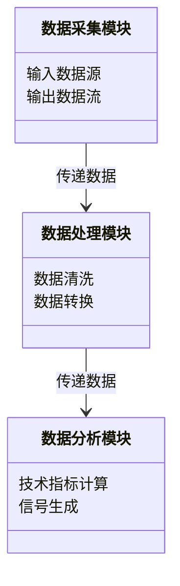

                 


# 技术分析在高波动市场中的应用

> 关键词：技术分析，高波动市场，算法，风险管理，交易系统，数学模型

> 摘要：本文详细探讨了技术分析在高波动市场中的应用，从基本概念、核心算法、系统架构到实战案例，层层剖析，揭示了技术分析在复杂市场环境中的独特价值和实现方法。

---

## 第1章: 技术分析的基本概念与背景

### 1.1 技术分析的定义与核心要素

技术分析是一种通过分析历史价格和交易数据来预测未来市场价格走势的方法。其核心假设包括：价格反映所有信息、价格走势具有趋势性、历史模式会重复出现。

#### 1.1.1 技术分析的定义

技术分析是通过研究金融资产的历史价格、交易量等数据，利用图表和指标来预测未来价格走势的一种分析方法。它基于以下三个假设：
1. 价格反映所有信息：市场价格已经反映了所有相关信息。
2. 历史模式会重复：历史价格形态和模式会在未来重复出现。
3. 市场价格走势具有趋势性：价格会沿趋势方向运动。

#### 1.1.2 技术分析的核心要素

- **价格**：价格是技术分析的核心，包括开盘价、收盘价、最高价和最低价。
- **交易量**：交易量反映了市场的活跃程度，是价格变动的验证指标。
- **时间**：时间因素决定了价格走势的节奏和周期。

### 1.2 高波动市场的特点与挑战

高波动市场是指市场价格波动剧烈、涨跌幅度大、频率高的市场环境。这种市场环境对技术分析提出了更高的要求，同时也带来了更大的挑战。

#### 1.2.1 高波动市场的定义

高波动市场是指市场价格在短时间内出现大幅波动的市场环境。其波动性通常用标准差或波动率来衡量。

#### 1.2.2 高波动市场的常见特征

- **波动率高**：市场价格在短时间内出现大幅波动。
- **趋势变化快**：价格趋势容易发生突然反转。
- **交易量大**：高波动市场通常伴随着高交易量。

#### 1.2.3 高波动市场中的交易风险

高波动市场中的交易风险主要体现在：
1. **流动性风险**：市场波动剧烈时，可能难以以合理价格迅速买卖资产。
2. **价格风险**：价格波动可能导致较大的损失。
3. **策略失效风险**：传统技术分析策略在高波动市场中可能失效。

### 1.3 技术分析在高波动市场中的重要性

#### 1.3.1 技术分析的优势

- **实时性**：技术分析可以实时跟踪市场价格变化。
- **可操作性**：技术分析提供明确的买卖信号。
- **适应性**：技术分析可以根据市场环境调整策略。

#### 1.3.2 技术分析在高波动市场中的应用价值

- **捕捉短期趋势**：技术分析可以帮助交易者捕捉高波动市场中的短期趋势。
- **风险管理**：通过技术分析，交易者可以更好地管理市场波动带来的风险。
- **策略优化**：技术分析可以为交易策略提供科学依据。

#### 1.3.3 技术分析的局限性

- **高波动市场的不可预测性**：技术分析依赖于历史数据，但高波动市场中的价格波动往往难以预测。
- **策略失效风险**：在高波动市场中，某些技术指标可能会失效。

---

## 第2章: 技术分析的核心概念与联系

### 2.1 技术分析的核心原理

技术分析的核心原理是通过研究价格走势和交易量，预测未来价格走势。其核心思想是市场行为反映所有信息，价格走势具有趋势性，历史模式会重复出现。

#### 2.1.1 价格与时间的关系

价格与时间的关系是技术分析的基础。通过分析价格走势的时间序列数据，交易者可以识别价格趋势和形态。

#### 2.1.2 技术指标的核心属性

技术指标是技术分析的重要工具，具有以下核心属性：
1. **滞后性**：技术指标是基于历史数据计算的，具有滞后性。
2. **可量化**：技术指标可以通过数学公式量化。
3. **可组合**：技术指标可以组合使用，形成复杂的交易策略。

#### 2.1.3 技术分析的三大假设

1. **市场行为反映所有信息**：市场价格已经反映了所有相关信息。
2. **价格走势具有趋势性**：价格走势具有趋势性，交易者可以通过趋势交易获利。
3. **历史模式会重复出现**：历史价格形态和模式会重复出现。

### 2.2 技术分析的核心概念对比

#### 2.2.1 技术指标与基本面分析的对比

| 对比维度 | 技术分析 | 基本面分析 |
|----------|----------|------------|
| 分析依据 | 历史价格和交易量 | 公司基本面、行业动态等 |
| 分析目的 | 预测价格走势 | 评估资产内在价值 |
| 适用场景 | 短期价格预测 | 长期投资决策 |

#### 2.2.2 不同技术指标的特征对比

| 技术指标 | 描述 | 优缺点 |
|----------|------|--------|
| 移动平均线（MA） | 基于价格的平均值，用于识别价格趋势 | 稳定性高，但反应较慢 |
| 相对强弱指数（RSI） | 衡量价格超买或超卖状态 | 灵敏度高，但容易产生虚假信号 |
| 移动平均收敛散度（MACD） | 用于识别价格趋势和趋势强度 | 综合性强，但需要结合其他指标使用 |

#### 2.2.3 技术分析与统计套利的联系

技术分析与统计套利的联系主要体现在：
1. **数据驱动**：两者都依赖于历史数据。
2. **量化方法**：两者都采用量化方法进行分析。
3. **风险管理**：两者都注重风险管理。

### 2.3 技术分析的实体关系图

#### 2.3.1 技术分析的ER图

```mermaid
erDiagram
    actor 交易者 {
        string 账户
        string 资产
    }
    actor 交易系统 {
        string 指标
        string 信号
    }
    actor 市场数据 {
        string 价格
        string 交易量
    }
    交易者 --> 交易系统 : 输入指令
    交易系统 --> 市场数据 : 获取数据
    交易系统 --> 交易者 : 输出信号
```

#### 2.3.2 价格与交易量的关系图


#### 2.3.3 技术指标与市场情绪的关系


---

## 第3章: 技术分析的算法原理与数学模型

### 3.1 移动平均线（MA）算法

#### 3.1.1 MA算法的原理

移动平均线（MA）是一种简单有效的技术指标，用于平滑价格数据，识别价格趋势。

#### 3.1.2 MA算法的数学模型

$$ MA_t = \frac{1}{n} \sum_{i=1}^{n} P_{t-i} $$

其中，$P_{t-i}$ 是第 $t-i$ 时刻的价格，$n$ 是计算移动平均的天数。

#### 3.1.3 MA算法的实现流程

1. 收集历史价格数据。
2. 计算指定周期内的平均价格。
3. 绘制移动平均线图表。
4. 根据移动平均线的走势和交叉情况生成交易信号。

#### 3.1.4 MA算法的优缺点

- 优点：简单易懂，稳定性高。
- 缺点：反应较慢，容易错过交易机会。

### 3.2 相对强弱指数（RSI）算法

#### 3.2.1 RSI算法的原理

相对强弱指数（RSI）用于衡量价格的超买或超卖状态。

#### 3.2.2 RSI算法的数学模型

$$ RSI_t = \frac{100}{1 + \frac{A}{B}} $$

其中，$A$ 是上涨幅度的平均值，$B$ 是下跌幅度的平均值。

#### 3.2.3 RSI算法的实现流程

1. 计算一定周期内的上涨幅度和下跌幅度的平均值。
2. 计算RSI值。
3. 根据RSI值判断市场是否处于超买或超卖状态。
4. 生成交易信号。

#### 3.2.4 RSI算法的优缺点

- 优点：灵敏度高，能够及时发现超买或超卖信号。
- 缺点：容易产生虚假信号，尤其是在高波动市场中。

### 3.3 移动平均收敛散度（MACD）算法

#### 3.3.1 MACD算法的原理

MACD用于识别价格趋势和趋势强度，由两条移动平均线（EMA）及其差值构成。

#### 3.3.2 MACD算法的数学模型

$$ MACD_t = EMA_{12} - EMA_{26} $$
$$ Signal_t = EMA_{9}(MACD) $$

其中，$EMA_{12}$ 和 $EMA_{26}$ 分别是12天和26天的指数移动平均线，$Signal_t$ 是MACD的9天指数移动平均线。

#### 3.3.3 MACD算法的实现流程

1. 计算12天和26天的EMA。
2. 计算MACD线和信号线。
3. 根据MACD线和信号线的交叉情况生成交易信号。

#### 3.3.4 MACD算法的优缺点

- 优点：综合性强，能够反映价格趋势和趋势强度。
- 缺点：在高波动市场中，信号可能不够清晰。

---

## 第4章: 技术分析的系统交易策略

### 4.1 系统交易策略的定义与分类

系统交易策略是指基于预设规则和模型的自动交易策略。根据交易目标的不同，系统交易策略可以分为趋势跟踪型、均值回归型和统计套利型。

#### 4.1.1 系统交易策略的定义

系统交易策略是基于数学模型和算法的自动交易策略，通常包括信号生成、信号验证和交易执行三个环节。

#### 4.1.2 系统交易策略的分类

1. **趋势跟踪型**：基于价格趋势的交易策略。
2. **均值回归型**：基于价格回归均值的交易策略。
3. **统计套利型**：基于统计套利模型的交易策略。

### 4.2 系统交易策略的信号生成

#### 4.2.1 技术指标的组合应用

在高波动市场中，单一技术指标的信号可能不够稳定，因此需要将多个技术指标进行组合应用。

#### 4.2.2 多重时间框架的分析

在高波动市场中，价格走势可能在不同时间框架下表现出不同的趋势，因此需要结合多个时间框架进行分析。

#### 4.2.3 基于机器学习的信号生成

随着人工智能技术的发展，基于机器学习的信号生成方法在高波动市场中逐渐受到关注。

### 4.3 系统交易策略的信号验证

#### 4.3.1 回测分析

回测分析是指对交易策略的历史表现进行测试，以验证其有效性。

#### 4.3.2 纸盘交易

纸盘交易是指在模拟环境下进行交易，以验证交易策略在实际市场中的表现。

#### 4.3.3 信号优化

信号优化是指通过调整技术指标的参数和组合方式，优化交易信号的准确性。

### 4.4 系统交易策略的交易执行

#### 4.4.1 自动化交易系统

自动化交易系统是指基于预设规则的自动交易系统，通常包括信号生成、信号验证和交易执行三个环节。

#### 4.4.2 手动交易策略

手动交易策略是指由交易者根据技术分析信号进行决策的交易策略。

#### 4.4.3 系统交易的风险管理

风险管理是系统交易策略的重要组成部分，包括头寸规模控制、止损设置和风险分散等。

---

## 第5章: 技术分析的系统架构设计

### 5.1 系统架构设计的背景与目标

系统架构设计是技术分析系统的核心部分，其目标是实现技术分析算法的高效运行和稳定执行。

#### 5.1.1 系统架构设计的背景

技术分析系统的复杂性要求我们采用模块化的系统架构设计，以提高系统的可维护性和可扩展性。

#### 5.1.2 系统架构设计的目标

1. **模块化**：将系统划分为功能独立的模块，便于维护和扩展。
2. **高可用性**：确保系统在高波动市场中的稳定运行。
3. **高效性**：提高系统的运行效率，减少延迟。

### 5.2 系统功能设计

#### 5.2.1 领域模型设计

领域模型是系统功能设计的核心，包括数据采集、数据处理、数据分析和信号生成等功能模块。



#### 5.2.2 系统架构设计

系统架构设计包括数据层、业务逻辑层和表示层三个层次。


#### 5.2.3 接口设计

系统接口设计包括数据接口和交易接口两部分。

---

## 第6章: 技术分析的项目实战

### 6.1 项目实战的背景与目标

项目实战是技术分析系统开发的重要组成部分，通过实际案例分析，验证技术分析策略的有效性。

#### 6.1.1 项目实战的背景

在高波动市场中，技术分析策略的应用需要经过严格的测试和验证。

#### 6.1.2 项目实战的目标

1. **验证策略的有效性**：通过实际案例分析，验证技术分析策略在高波动市场中的有效性。
2. **优化策略参数**：根据实际案例分析结果，优化技术分析策略的参数。
3. **总结经验教训**：总结项目实战中的经验教训，为后续项目提供参考。

### 6.2 项目核心实现

#### 6.2.1 环境安装

1. 安装Python编程环境。
2. 安装数据采集和数据分析库（如Pandas、Matplotlib、NumPy等）。

#### 6.2.2 核心代码实现

以下是一个基于MACD指标的交易策略实现代码：

```python
import pandas as pd
import matplotlib.pyplot as plt

# 计算EMA
def compute_ema(close_prices, n):
    return close_prices.ewm(span=n, adjust=False).mean()

# 计算MACD
def compute_macd(close_prices):
    ema12 = compute_ema(close_prices, 12)
    ema26 = compute_ema(close_prices, 26)
    macd = ema12 - ema26
    signal = compute_ema(macd, 9)
    return macd, signal

# 计算交易信号
def generate_signals(macd, signal):
    signals = []
    for i in range(len(macd)):
        if macd[i] > signal[i]:
            signals.append(1)
        elif macd[i] < signal[i]:
            signals.append(-1)
        else:
            signals.append(0)
    return signals

# 主函数
def main():
    # 获取数据
    data = pd.read_csv('market_data.csv')
    close_prices = data['Close']
    # 计算MACD
    macd, signal = compute_macd(close_prices)
    # 生成信号
    signals = generate_signals(macd, signal)
    # 绘制图表
    plt.figure(figsize=(12, 6))
    plt.plot(close_prices, label='Close Price')
    plt.plot(macd, label='MACD')
    plt.plot(signal, label='Signal Line')
    plt.legend()
    plt.show()

if __name__ == '__main__':
    main()
```

#### 6.2.3 代码应用解读与分析

1. **数据获取**：从CSV文件中读取市场数据。
2. **计算EMA**：分别计算12天和26天的指数移动平均线。
3. **计算MACD**：计算MACD线和信号线。
4. **生成信号**：根据MACD线和信号线的交叉情况生成交易信号。
5. **绘制图表**：绘制价格、MACD和信号线的图表。

### 6.3 实际案例分析

#### 6.3.1 案例背景

选择一个高波动市场，如加密货币市场，作为案例进行分析。

#### 6.3.2 案例分析

通过实际数据分析，验证基于MACD指标的交易策略在高波动市场中的表现。

#### 6.3.3 案例总结

总结案例分析结果，优化交易策略参数，为后续项目提供参考。

### 6.4 项目小结

通过项目实战，我们验证了技术分析策略在高波动市场中的应用价值，同时也发现了策略优化的方向。

---

## 第7章: 技术分析的最佳实践与总结

### 7.1 技术分析的最佳实践

#### 7.1.1 风险管理

在高波动市场中，风险管理是技术分析策略的重要组成部分，包括头寸规模控制、止损设置和风险分散等。

#### 7.1.2 交易策略优化

根据市场环境和策略表现，不断优化交易策略参数，提高策略的有效性。

#### 7.1.3 系统维护

定期维护交易系统，确保系统稳定运行，及时修复系统漏洞。

### 7.2 技术分析的总结与展望

#### 7.2.1 技术分析的总结

技术分析是一种有效的市场分析工具，尤其在高波动市场中具有独特价值。

#### 7.2.2 技术分析的展望

随着人工智能和大数据技术的发展，技术分析将在高波动市场中发挥更大的作用，未来的研究方向包括算法优化、系统自动化和风险管理等方面。

---

## 结语

技术分析在高波动市场中的应用是一个复杂而有趣的话题，本文通过详细分析技术分析的基本概念、算法原理、系统架构设计和项目实战，揭示了技术分析在高波动市场中的独特价值和实现方法。希望本文能够为技术分析的研究和应用提供有价值的参考。

--- 

### 附录

- **附录A**: 常用技术指标公式汇总
- **附录B**: 系统架构设计详细文档
- **附录C**: 项目实战代码与数据

