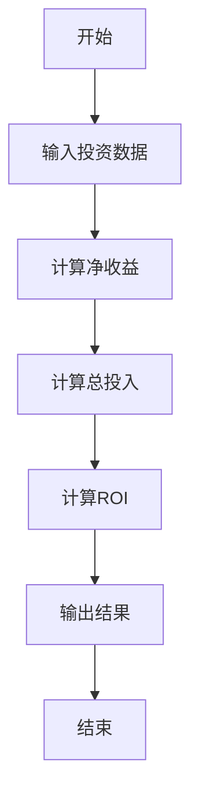
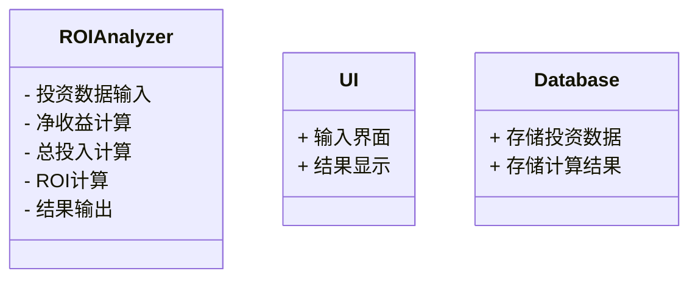
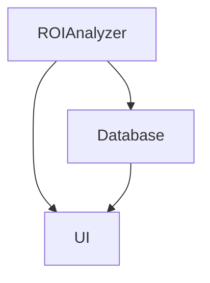

                 


# 投资回报率分析工具

> 关键词：投资回报率（ROI）、分析工具、净现值（NPV）、投资评估、项目管理、财务分析

> 摘要：本文深入探讨了投资回报率（ROI）分析工具的设计与应用。从ROI的基本概念到其计算方法，再到工具的实现与系统架构，最后通过实际案例展示工具的使用。文章旨在帮助读者理解如何通过ROI分析工具优化投资决策，提升项目管理效率。

---

## 第1章：投资回报率（ROI）的基本概念

### 1.1 ROI的定义与背景

#### 1.1.1 投资回报率的基本概念
投资回报率（ROI）是衡量投资项目收益与投入之间关系的重要指标。它通过计算净收益与总投入的比率，帮助决策者评估投资的价值。ROI公式如下：

$$ ROI = \frac{净收益}{总投入} \times 100\% $$

#### 1.1.2 ROI在商业决策中的重要性
ROI是企业制定投资策略、评估项目可行性的重要依据。它不仅帮助确定项目的盈利能力，还能用于比较不同投资方案的优劣，优化资源配置。

#### 1.1.3 ROI的应用场景与范围
ROI广泛应用于企业战略规划、项目投资评估、资产配置等领域。例如，在资本预算决策中，ROI常用于评估新项目的可行性。

#### 1.1.4 ROI分析工具的发展现状
随着数据分析技术的发展，ROI分析工具逐渐从简单的手动计算转向自动化、智能化的系统分析，为企业提供更高效、精准的投资决策支持。

---

### 1.2 ROI的核心要素

#### 1.2.1 收益的定义与计算方法
收益包括项目带来的所有现金流入，需考虑时间价值。例如，使用净现值（NPV）计算时，未来收益需按现值计算。

#### 1.2.2 投入的定义与计算方法
投入包括初始投资和后续追加投资，需考虑资金的时间成本。

#### 1.2.3 时间因素在ROI计算中的作用
时间影响现金流的现值，需使用适当的折现率进行调整。

#### 1.2.4 ROI与相关概念的区别
- ROI与净现值（NPV）的区别在于，ROI是相对指标，而NPV是绝对指标。
- ROI不直接反映投资的时间周期，而NPV考虑了时间因素。

---

## 第2章：ROI计算的数学模型与公式

### 2.1 ROI的数学公式与模型

#### 2.1.1 ROI的计算公式
$$ ROI = \frac{净收益}{总投入} \times 100\% $$

#### 2.1.2 ROI与时间价值的关系
考虑时间价值时，ROI需结合净现值（NPV）计算公式：

$$ NPV = \sum_{t=1}^{n} \frac{CF_t}{(1 + r)^t} - 初始投入 $$

其中，$CF_t$为第t年的现金流，$r$为折现率。

#### 2.1.3 ROI与投资周期的关联
投资周期影响现金流的分布，长周期项目需考虑更多年份的收益与投入。

#### 2.1.4 ROI的动态计算模型
动态ROI模型考虑了资金的时间价值，适用于长期投资评估。

---

## 第3章：ROI分析工具的算法实现

### 3.1 ROI计算的算法流程

#### 3.1.1 ROI计算流程


#### 3.1.2 ROI分析工具的Python实现
```python
def calculate_roi(net_profit, total_investment):
    return (net_profit / total_investment) * 100

# 示例使用
net_profit = 100000
total_investment = 500000
roi = calculate_roi(net_profit, total_investment)
print(f"ROI: {roi}%")
```

---

## 第4章：系统分析与架构设计

### 4.1 系统功能设计

#### 4.1.1 系统功能模块


#### 4.1.2 系统架构设计


---

## 第5章：项目实战

### 5.1 ROI分析工具的安装与配置

#### 5.1.1 环境安装
安装Python和必要的库（如numpy、pandas）。

#### 5.1.2 工具安装
通过pip安装ROI分析工具。

### 5.2 核心代码实现

#### 5.2.1 ROI计算代码
```python
import numpy as np

def calculate_roi(net_profit, total_investment):
    return (net_profit / total_investment) * 100

# 示例数据
net_profit = np.array([100000, 150000, 200000])
total_investment = 500000
roi = calculate_roi(net_profit, total_investment)
print(f"ROI: {roi}%")
```

---

## 第6章：最佳实践与小结

### 6.1 最佳实践
- 确保数据的准确性和完整性。
- 结合NPV等其他指标进行综合评估。
- 定期更新和优化工具。

### 6.2 小结
本文详细介绍了投资回报率分析工具的设计与应用，从理论到实践，帮助读者掌握如何利用工具优化投资决策。

### 6.3 注意事项
- ROI分析工具需结合实际业务场景使用。
- 注意时间因素对ROI的影响。

### 6.4 拓展阅读
推荐学习净现值（NPV）和内部收益率（IRR）的相关知识，以更全面地进行投资评估。

---

## 附录

### 附录A：ROI分析工具安装指南
详细指导如何安装和配置ROI分析工具。

### 附录B：API文档
提供ROI分析工具的API接口说明。

### 附录C：参考文献
列出本文引用的主要文献和资料。

---

通过本文的学习，读者将能够理解投资回报率分析工具的核心原理，并掌握如何在实际项目中应用这些工具，从而做出更明智的投资决策。

