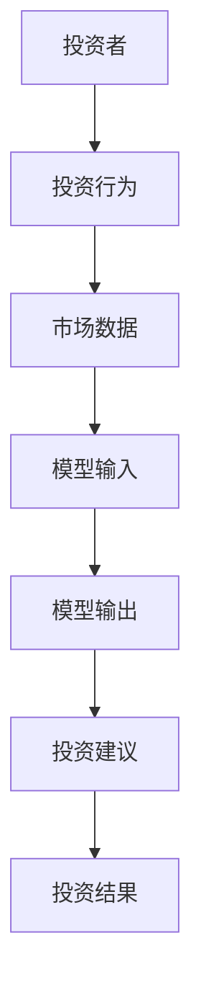
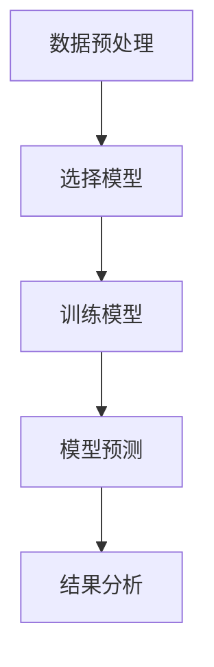
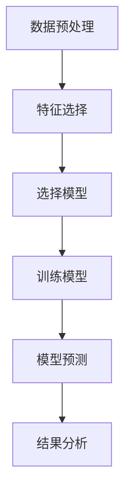

                 


# 第一部分: 投资理财智能助手的机器学习模型管理背景

## 第1章: 投资理财智能助手概述

### 1.1 问题背景

#### 1.1.1 投资理财领域的痛点
在当前的金融市场上，投资者面临着信息过载、市场波动剧烈以及投资选择多样化的挑战。传统的投资理财工具往往依赖于人工分析，效率低下且难以满足个性化需求。投资者需要一种能够实时分析市场数据、提供个性化建议的工具，以帮助他们做出更明智的投资决策。

#### 1.1.2 机器学习在投资理财中的应用潜力
机器学习技术可以通过分析历史数据和市场趋势，预测未来的价格走势，识别投资机会和风险。此外，机器学习还可以用于客户画像、需求分析和个性化推荐，从而提升投资理财服务的效率和精准度。

#### 1.1.3 智能助手的定义与目标
投资理财智能助手是一种基于机器学习技术的辅助工具，旨在为投资者提供实时的市场分析、个性化投资建议和风险评估。其目标是通过自动化和智能化的方式，帮助投资者优化投资组合，提高投资收益，降低投资风险。

### 1.2 问题描述

#### 1.2.1 投资者的需求分析
投资者需要快速获取市场信息、进行投资决策和管理投资组合。然而，市场数据复杂多样，投资者往往缺乏足够的知识和时间来处理这些信息。因此，他们需要一种能够简化投资决策过程、提供个性化建议的工具。

#### 1.2.2 传统投资理财工具的局限性
传统投资理财工具依赖于人工分析，存在效率低、成本高、个性化不足等问题。此外，传统工具难以实时适应市场变化，无法满足投资者对快速决策的需求。

#### 1.2.3 机器学习模型在投资理财中的应用场景
机器学习模型可以用于市场预测、风险评估、投资组合优化和客户画像等领域。通过机器学习，投资者可以更准确地预测市场趋势，识别潜在风险，并制定个性化的投资策略。

### 1.3 问题解决思路

#### 1.3.1 机器学习模型的核心优势
机器学习模型可以通过大数据分析和模式识别，发现传统方法难以察觉的市场规律。此外，机器学习模型可以实时更新，适应市场的动态变化，提供及时的投资建议。

#### 1.3.2 模型管理的必要性
模型管理是确保机器学习模型长期有效运行的关键。通过模型管理，可以实现模型的版本控制、性能监控和优化，从而保证模型的准确性和稳定性。

#### 1.3.3 智能助手的功能架构
智能助手的功能架构包括数据采集、模型训练、模型部署和用户交互模块。数据采集模块负责收集市场数据和用户信息；模型训练模块负责训练和优化模型；模型部署模块负责将模型部署到实际应用中；用户交互模块负责与用户进行互动，提供投资建议。

### 1.4 边界与外延

#### 1.4.1 模型管理的边界
模型管理的边界包括模型训练、部署和监控。模型管理不涉及数据采集和用户交互，这些功能由其他模块负责。

#### 1.4.2 智能助手的功能边界
智能助手的功能边界包括市场分析、投资建议和风险评估。智能助手不直接进行投资操作，而是为投资者提供决策支持。

#### 1.4.3 相关领域的外延
相关领域的外延包括大数据分析、人工智能和金融科技。智能助手的应用可以扩展到更多的金融领域，如风险管理、信贷评估和金融产品设计。

### 1.5 概念结构与核心要素

#### 1.5.1 核心概念的层次结构
投资理财智能助手的层次结构包括投资者、市场数据、模型管理、投资建议和投资结果。投资者通过市场数据和模型管理，获得投资建议，并根据建议进行投资，最终实现投资结果。

#### 1.5.2 核心要素的定义与关系
核心要素包括投资者、市场数据、模型管理、投资建议和投资结果。投资者是智能助手的使用主体，市场数据是模型训练的输入，模型管理是智能助手的核心功能，投资建议是模型管理的输出，投资结果是投资者决策的最终体现。

#### 1.5.3 模型管理的流程框架
模型管理的流程包括数据预处理、模型训练、模型部署和模型监控。数据预处理是将市场数据转换为模型输入格式；模型训练是通过算法优化模型参数；模型部署是将模型应用到实际场景中；模型监控是实时监测模型性能并进行优化。

## 第2章: 核心概念与联系

### 2.1 模型管理的核心原理

#### 2.1.1 模型训练与部署
模型训练是通过算法优化模型参数，使其能够准确预测市场趋势。模型部署是将训练好的模型应用到实际场景中，为投资者提供实时的投资建议。

#### 2.1.2 模型监控与优化
模型监控是实时监测模型的性能，发现异常并进行优化。模型优化是通过调整算法参数或更换算法，提高模型的预测准确性。

#### 2.1.3 模型版本控制
模型版本控制是通过记录每个模型的版本信息，确保在出现问题时可以回滚到之前的版本。版本控制有助于管理和维护多个模型版本，避免因模型更新导致的系统崩溃。

### 2.2 核心概念属性对比表

| 概念       | 模型训练 | 模型部署 | 模型监控 |
|------------|----------|----------|----------|
| 数据输入   | 训练数据 | API请求 | 性能指标 |
| 核心任务   | 优化参数 | 提供预测 | 监测状态 |
| 输出结果   | 模型权重 | 预测结果 | 优化建议 |

### 2.3 ER实体关系图



---

# 第二部分: 投资理财智能助手的机器学习模型管理方法

## 第3章: 算法原理

### 3.1 时间序列预测算法

#### 3.1.1 算法流程



#### 3.1.2 算法实现

```python
import numpy as np
import pandas as pd
from sklearn.model_selection import train_test_split
from sklearn.metrics import mean_squared_error
from sklearn.ensemble import RandomForestRegressor

# 数据预处理
data = pd.read_csv('market_data.csv')
X = data[['open', 'high', 'low', 'volume']]
y = data['close']

# 划分训练集和测试集
X_train, X_test, y_train, y_test = train_test_split(X, y, test_size=0.2, random_state=42)

# 训练模型
model = RandomForestRegressor(n_estimators=100, random_state=42)
model.fit(X_train, y_train)

# 预测
y_pred = model.predict(X_test)

# 评估
mse = mean_squared_error(y_test, y_pred)
print(f'均方误差: {mse}')
```

### 3.2 分类算法

#### 3.2.1 算法流程



#### 3.2.2 算法实现

```python
import numpy as np
import pandas as pd
from sklearn.model_selection import train_test_split
from sklearn.metrics import accuracy_score
from sklearn.svm import SVC

# 数据预处理
data = pd.read_csv('market_data.csv')
X = data[['open', 'high', 'low', 'volume', 'close']]
y = data['label']

# 划分训练集和测试集
X_train, X_test, y_train, y_test = train_test_split(X, y, test_size=0.2, random_state=42)

# 训练模型
model = SVC(C=1.0, kernel='rb

