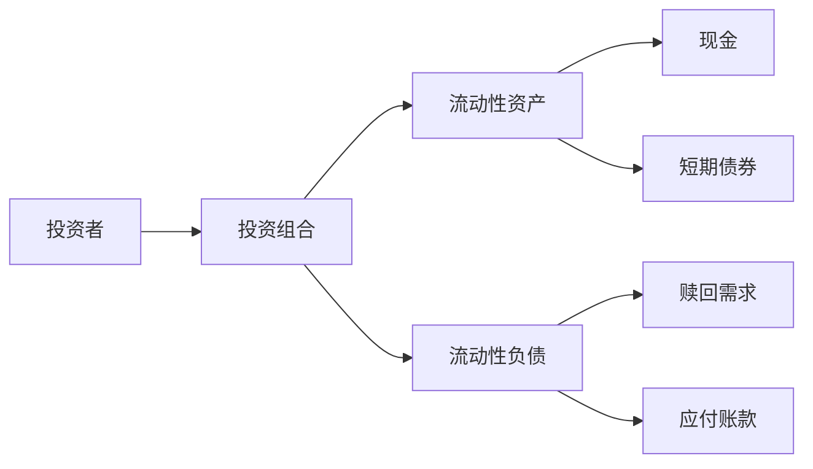

                 


# 投资组合流动性管理：在市场压力下保持灵活性

## 关键词：投资组合、流动性管理、市场压力、风险管理、资产配置、流动性资产、投资组合优化

## 摘要：  
在金融市场中，流动性管理是投资组合管理的核心挑战之一。尤其是在市场压力下，投资组合的流动性管理至关重要，以确保在极端市场条件下能够灵活调整投资策略，降低风险并实现稳健的投资回报。本文将系统地探讨投资组合流动性管理的理论与实践，结合实际案例分析和数学模型，为投资者提供在市场压力下保持投资组合流动性的有效策略。

---

## 第1章: 投资组合流动性管理概述

### 1.1 投资组合流动性管理的核心概念  
流动性管理是指在投资组合中合理配置流动性资产和非流动性资产，以应对市场波动、投资者赎回需求或突发性资金需求的过程。其核心目标是确保在需要时能够快速变现资产，避免因流动性不足而导致的投资损失或违约风险。

#### 1.1.1 什么是流动性  
流动性指的是资产在不损失价值的情况下快速变现的能力。在投资组合中，流动性资产通常包括现金、短期债券等，而非流动性资产则包括长期股权或房地产等。  

#### 1.1.2 流动性管理的目标  
- 保障投资组合在市场压力下的变现能力；  
- 平衡流动性资产与非流动性资产的比例，以实现风险与收益的最优匹配；  
- 应对投资者的赎回需求或突发性资金需求。  

#### 1.1.3 流动性管理的边界与外延  
流动性管理的边界在于如何在追求收益的同时，确保资产的流动性。其外延涉及资产配置、风险管理、市场分析等多个方面。

### 1.2 流动性管理的重要性  
流动性管理在投资组合中的重要性体现在以下几个方面：  
1. **风险管理**：在市场下跌或资产价格波动时，流动性管理能够确保投资者能够及时变现，避免进一步损失。  
2. **投资策略的灵活性**：通过合理配置流动性资产，投资者可以在市场机会出现时迅速调整投资组合，抓住潜在收益。  
3. **应对投资者需求**：对于机构投资者而言，流动性管理是应对投资者赎回需求的关键手段。  

---

## 第2章: 流动性管理的核心概念与联系

### 2.1 流动性相关核心概念  
在流动性管理中，需要关注以下几个核心概念：  

#### 2.1.1 流动性资产  
流动性资产是指能够在较短时间内以合理价格变现的资产，如现金、短期国债、高等级债券等。  

#### 2.1.2 流动性负债  
流动性负债是指投资组合中需要在短期内偿还的债务，包括投资者的赎回需求和应付账款等。  

#### 2.1.3 流动性缺口  
流动性缺口是指在一定时间范围内，投资组合的流动性负债超过流动性资产的情况。  

### 2.2 核心概念的属性特征对比  
表2.1: 流动性相关概念的特征对比  

| 概念         | 定义                               | 属性特征                           |
|--------------|------------------------------------|------------------------------------|
| 流动性资产    | 能够快速变现的资产                 | 变现能力强、风险低                 |
| 流动性负债    | 需要在短期内偿还的债务             | 赎回需求高、流动性风险大           |
| 流动性缺口    | 流动性负债超过流动性资产的情况       | 可能导致资产被迫出售、投资组合受损 |

### 2.3 ER实体关系图  
图2.1: 流动性管理的实体关系图  



---

## 第3章: 流动性压力测试的算法原理

### 3.1 流动性压力测试的流程  
流动性压力测试是评估投资组合在极端市场条件下应对流动性需求能力的重要工具。其流程通常包括以下几个步骤：  
1. **情景假设**：设定极端市场条件，如市场崩盘、流动性枯竭等。  
2. **资产变现能力评估**：分析投资组合中各资产的变现能力。  
3. **流动性缺口计算**：计算在给定情景下，投资组合的流动性缺口。  
4. **应对策略模拟**：模拟应对流动性缺口的策略，如出售非流动性资产或寻求外部融资。  

#### 图3.1: 流动性压力测试的流程图  


### 3.2 算法原理的数学模型  
流动性压力测试的数学模型通常基于概率统计和风险价值（VaR）模型。  

#### 图3.2: 流动性压力测试的算法流程图  


### 3.3 代码实现  
以下是一个简单的流动性压力测试的Python代码示例：  

```python
import numpy as np
import pandas as pd

# 示例数据：投资组合的资产和负债
assets = [100, 200, 300]  # 流动性资产
liabilities = [150, 250]   # 流动性负债

# 计算流动性缺口
liquidity_gap = sum(liabilities) - sum(assets)
print(f"流动性缺口为：{liquidity_gap}")

# 压力测试情景：市场下跌20%
market_scenario = np.random.normal(0, 0.2, 1000)
assets_after_market = [a * (1 - market_scenario[i]) for i, a in enumerate(assets)]
liabilities_after_market = [l * (1 + market_scenario[i]) for i, l in enumerate(liabilities)]

# 计算新的流动性缺口
new_liquidity_gap = sum(liabilities_after_market) - sum(assets_after_market)
print(f"压力测试后的流动性缺口为：{new_liquidity_gap}")
```

---

## 第4章: 系统分析与架构设计方案

### 4.1 问题场景介绍  
在市场压力下，投资组合的流动性管理需要应对以下问题：  
1. 市场波动导致资产价格下跌，影响流动性资产的变现能力。  
2. 投资者赎回需求激增，可能导致流动性负债超过流动性资产。  

### 4.2 系统功能设计  
系统需要具备以下功能模块：  
- 实时监控：跟踪投资组合的流动性状况。  
- 风险评估：评估市场波动对流动性的影响。  
- 应对策略：制定应对流动性缺口的策略。  

#### 图4.1: 投资组合流动性管理的领域模型类图  


### 4.3 系统架构设计  
系统架构采用分层设计，包括数据层、业务逻辑层和用户界面层。  

#### 图4.2: 投资组合流动性管理系统的架构图  


---

## 第5章: 项目实战

### 5.1 环境安装  
需要安装Python、Pandas、NumPy等工具，用于数据处理和分析。

### 5.2 核心代码实现  
以下代码实现一个简单的流动性压力测试模型：  

```python
import numpy as np
import pandas as pd

# 示例数据：投资组合的资产和负债
assets = [100, 200, 300]
liabilities = [150, 250]

# 计算流动性缺口
liquidity_gap = sum(liabilities) - sum(assets)
print(f"初始流动性缺口：{liquidity_gap}")

# 模拟市场下跌情景
market_scenario = np.random.normal(0, 0.2, 1000)
assets_after_market = [a * (1 - market_scenario[i]) for a in assets]
liabilities_after_market = [l * (1 + market_scenario[i]) for l in liabilities]

# 计算新的流动性缺口
new_liquidity_gap = sum(liabilities_after_market) - sum(assets_after_market)
print(f"市场下跌情景下的流动性缺口：{new_liquidity_gap}")
```

### 5.3 案例分析  
以2008年金融危机为例，分析投资组合在市场压力下的流动性管理策略。通过数据模拟和案例分析，展示如何通过流动性管理应对市场危机。

---

## 第6章: 最佳实践与总结

### 6.1 最佳实践 Tips  
- 定期评估投资组合的流动性状况，及时调整资产配置。  
- 在市场压力下，优先变现非流动性资产，降低流动性缺口。  
- 与投资者保持良好沟通，管理赎回需求。  

### 6.2 本章小结  
本文系统地探讨了投资组合流动性管理的核心概念、算法原理和实践应用。通过案例分析和数学模型，展示了如何在市场压力下保持投资组合的流动性，实现稳健投资。

### 6.3 拓展阅读  
- 《流动性风险管理：理论与实践》  
- 《压力测试方法论》  
- 《投资组合优化与风险管理》  

---

## 第7章: 数学模型与公式详解

### 7.1 流动性压力测试的数学模型  
流动性压力测试通常基于概率统计和风险价值（VaR）模型。  

#### 图7.1: 流动性压力测试的数学模型  


### 7.2 关键公式解析  
以下是一些关键公式：  

1. **流动性缺口计算公式**：  
   $$ \text{流动性缺口} = \sum (\text{流动性负债}) - \sum (\text{流动性资产}) $$  

2. **压力测试下的VaR计算公式**：  
   $$ \text{VaR} = \text{投资组合价值} \times \text{置信水平} $$  

### 7.3 举例说明  
假设一个投资组合的流动性资产为$300万，流动性负债为$250万，其流动性缺口为：  
$$ \text{流动性缺口} = 250万 - 300万 = -50万 $$  
在市场压力下，假设资产价值下跌10%，负债上升5%，新的流动性缺口为：  
$$ \text{新的流动性缺口} = (250万 \times 1.05) - (300万 \times 0.9) = 262.5万 - 270万 = -7.5万 $$  

---

通过以上分析，我们可以看到，流动性管理是投资组合风险管理中的核心环节。在市场压力下，合理的流动性管理策略能够帮助投资者降低风险，确保投资组合的稳健运作。

