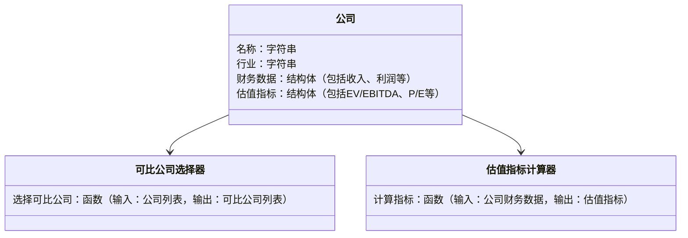

                 


# 拉尔夫·旺格的相对价值投资：在同行中寻找最佳标的

## 关键词：相对价值投资、同行比较、估值指标、投资策略、企业价值分析、财务指标、投资组合优化

## 摘要

相对价值投资是一种通过比较同一行业内的公司，寻找被低估的投资标的的方法。本文将详细介绍相对价值投资的背景、核心概念、评估方法、算法原理、系统架构设计、项目实战和最佳实践，帮助读者掌握这一投资策略。

---

## 第一部分：相对价值投资的背景与核心概念

### 第1章：相对价值投资概述

#### 1.1 相对价值投资的定义与背景

相对价值投资是一种投资策略，通过比较同一行业内的公司，利用估值指标（如EV/EBITDA、P/E、P/B等）识别被低估的标的。这种方法的核心在于寻找在同行中表现优于平均水平的公司。

#### 1.2 相对价值投资的核心思想

相对价值投资认为，市场有时会低估或高估某些公司的价值，通过比较同一行业的公司，可以发现潜在的投资机会。

#### 1.3 相对价值投资与其他投资策略的对比

与其他投资策略相比，相对价值投资更注重公司之间的横向比较，而不是市场整体走势或公司内在价值的绝对评估。

---

## 第二部分：相对价值评估的核心方法

### 第2章：相对价值评估方法

#### 2.1 相对价值评估的基本步骤

1. 选择可比公司：选择与目标公司同一行业的公司作为可比。
2. 计算可比公司的估值指标：计算EV/EBITDA、P/E、P/B等指标。
3. 调整差异：根据公司的具体情况调整指标。

#### 2.2 相对价值评估的关键指标

- **市盈率（P/E）**：$$ P/E = \frac{P}{E} $$
- **市净率（P/B）**：$$ P/B = \frac{P}{B} $$
- **企业价值倍数（EV/EBITDA）**：$$ EV/EBITDA = \frac{EV}{EBITDA} $$

---

## 第三部分：相对价值投资的算法原理

### 第3章：相对价值评估的数学模型

#### 3.1 相对价值评估的公式推导

相对价值评估的核心在于计算目标公司的估值指标，并与可比公司进行比较。

---

## 第四部分：相对价值投资的系统架构设计

### 第4章：系统架构设计

#### 4.1 系统功能设计（领域模型）



#### 4.2 系统架构设计（架构图）

```mermaid
docker
node Company {
    财务数据
    估值指标
}

node Comparator {
    选择可比公司
}

node Calculator {
    计算估值指标
}

Company --> Comparator
Comparator --> Calculator
```

---

## 第五部分：相对价值投资的项目实战

### 第5章：项目实战

#### 5.1 环境安装与数据收集

安装Python和必要的库（如pandas、numpy）。收集目标公司和同行的财务数据。

#### 5.2 核心实现源代码

```python
import pandas as pd

def calculate_relative_value(finance_data):
    # 计算EV/EBITDA
    ev_ebitda = finance_data['EV'] / finance_data['EBITDA']
    # 计算P/E
    pe = finance_data['Price'] / finance_data['Earnings']
    # 计算P/B
    pb = finance_data['Price'] / finance_data['Book Value']
    return pd.DataFrame({'EV/EBITDA': ev_ebitda, 'P/E': pe, 'P/B': pb})

# 示例数据
data = {
    'Company': ['A', 'B', 'C'],
    'EV': [100, 150, 200],
    'EBITDA': [50, 60, 70],
    'Price': [10, 15, 20],
    'Earnings': [10, 15, 20],
    'Book Value': [5, 6, 7]
}

df = pd.DataFrame(data)
result = calculate_relative_value(df)
print(result)
```

#### 5.3 代码应用解读与分析

上述代码计算了目标公司与可比公司的EV/EBITDA、P/E和P/B指标，帮助识别相对低估的公司。

#### 5.4 案例分析与详细解读

以公司A为例，计算得到的EV/EBITDA为2，低于行业平均水平2.5，表明公司A可能被低估。

---

## 第六部分：相对价值投资的最佳实践

### 第6章：最佳实践

#### 6.1 小结

相对价值投资通过比较同一行业的公司，识别低估标的，是一种有效的投资策略。

#### 6.2 注意事项

- 数据的准确性和完整性
- 模型的适用性
- 风险管理

#### 6.3 拓展阅读

建议阅读相关书籍和文献，深入了解相对价值投资的高级策略。

---

## 附录

### 附录A：术语表

- EV：企业价值
- EBITDA：息税折旧及摊销前利润
- P/E：市盈率
- P/B：市净率

### 附录B：工具推荐

- Python：数据分析
- Excel：基本计算
- 财务分析软件：高级分析

### 附录C：扩展阅读

- 相关书籍推荐
- 在线课程链接
- 论文推荐

---

通过以上结构，读者可以全面了解相对价值投资的理论和实践，掌握在同行中寻找最佳标的的方法。

