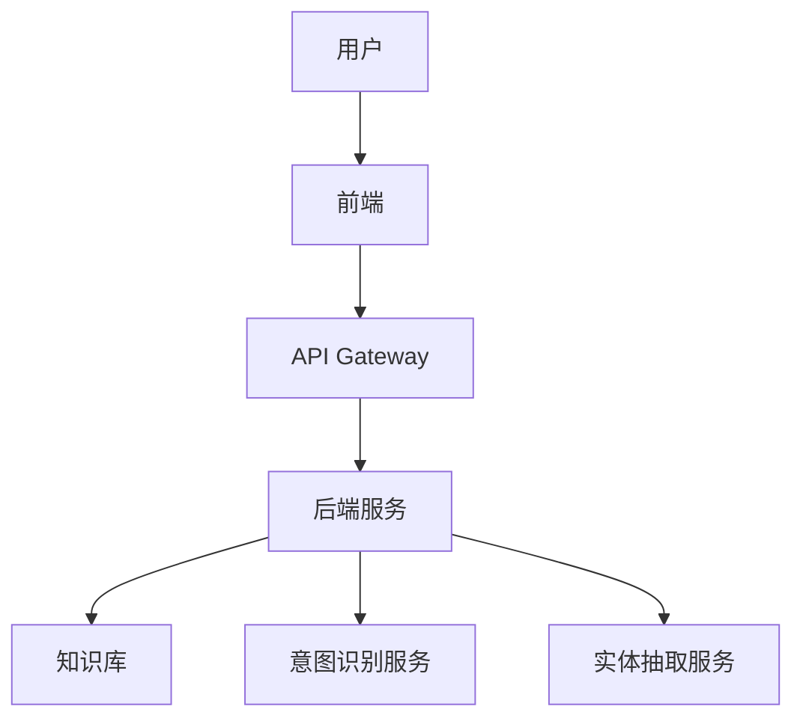
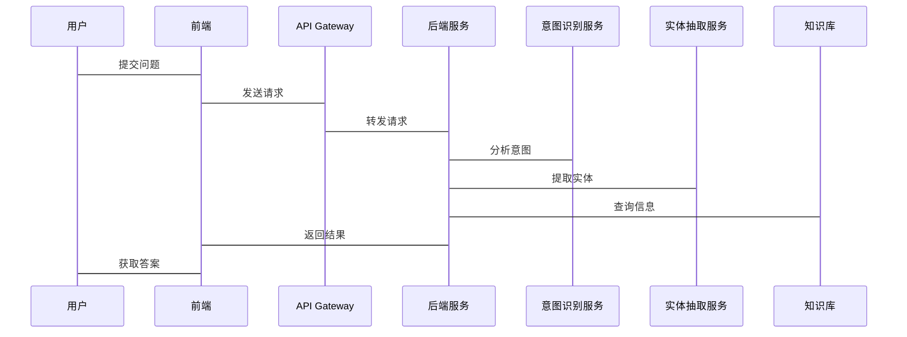

                 


# 持续集成与部署：AI Agent的开发流程优化

## 关键词：
持续集成、持续部署、AI Agent、开发流程优化、系统架构、算法原理、项目实战

## 摘要：
本文详细探讨了如何利用持续集成与部署的方法优化AI Agent的开发流程。通过系统化的分析，本文首先介绍了持续集成与部署的基本概念和AI Agent的核心概念，然后深入讲解了相关算法原理和系统架构设计。接着，通过具体的项目实战，展示了如何在实际开发中应用这些方法，并提供了最佳实践和注意事项。最后，本文总结了持续集成与部署在AI Agent开发中的重要性，并展望了未来的发展方向。

---

## 第一章：持续集成与部署概述

### 1.1 持续集成与部署的背景与意义

#### 1.1.1 软件开发的演进与挑战
现代软件开发面临着快速迭代和高质量交付的双重挑战。传统开发模式往往导致代码集成困难、测试效率低下，难以满足市场需求。持续集成与部署（CI/CD）作为一种高效的方法，通过自动化构建、测试和部署，显著提升了开发效率和代码质量。

#### 1.1.2 持续集成与部署的核心概念
持续集成（CI）强调频繁地将代码合并到主分支，并通过自动化工具进行构建和测试，以确保代码的正确性。持续部署（CD）则在CI的基础上，进一步自动化应用的部署过程，确保每个代码变更都能快速、安全地交付到生产环境。

#### 1.1.3 AI Agent在现代开发中的作用
AI Agent作为智能系统的核心组件，负责感知环境、处理任务并做出决策。其开发过程同样需要高效的开发流程，持续集成与部署在其中起到了关键作用，确保AI Agent的代码能够快速迭代和稳定发布。

### 1.2 本书的目标与结构
本书旨在帮助读者理解并掌握持续集成与部署在AI Agent开发中的应用，提供从理论到实践的全面指导。全书共分为七章，涵盖从基础概念到实际应用的各个方面。

---

## 第二章：持续集成与部署的基本概念

### 2.1 持续集成的定义与特点

#### 2.1.1 持续集成的定义
持续集成是一种软件开发实践，通过频繁地将代码集成到主分支，并自动化运行测试，以快速发现和修复集成问题。

#### 2.1.2 持续集成的核心特点
- 频繁集成：每天多次将代码合并到主分支。
- 自动化测试：通过CI工具自动运行单元测试、集成测试等。
- 快速反馈：开发人员能迅速得知代码集成的结果。

#### 2.1.3 持续集成与传统集成的区别
传统的集成方式可能导致代码冲突和测试遗漏，而持续集成通过自动化工具解决了这些问题，确保每次集成都是干净和可靠的。

### 2.2 持续部署的定义与流程

#### 2.2.1 持续部署的定义
持续部署是持续集成的延伸，强调自动化地将代码部署到生产环境，通过逐步交付的方式降低风险。

#### 2.2.2 持续部署的典型流程
1. 构建：将代码编译为可执行的artifact。
2. 测试：自动化测试确保artifact的质量。
3. 部署：通过自动化工具将artifact部署到目标环境。

#### 2.2.3 持续部署的优势与挑战
优势包括快速交付、风险降低和反馈及时；挑战则包括复杂环境的配置和回滚策略的制定。

### 2.3 持续集成与部署的工具链

#### 2.3.1 Jenkins
Jenkins是一个流行的CI/CD工具，支持多种插件扩展，广泛应用于持续集成和部署流程。

#### 2.3.2 GitHub Actions
GitHub Actions是GitHub提供的CI/CD服务，支持在代码仓库中定义工作流，自动化执行构建、测试和部署任务。

#### 2.3.3 Docker
Docker是一种容器化技术，通过容器化应用，确保不同环境下的部署一致性，简化了持续部署的过程。

#### 2.3.4 CI/CD Pipeline的构建与管理
CI/CD Pipeline定义了从代码提交到部署的整个流程，通常包括构建、测试、验证、部署等多个阶段，通过图形化界面进行配置和管理。

---

## 第三章：AI Agent的核心概念

### 3.1 AI Agent的定义与分类

#### 3.1.1 AI Agent的定义
AI Agent（智能代理）是一种能够感知环境、执行任务并做出决策的智能系统，通常用于自动化处理特定问题。

#### 3.1.2 AI Agent的主要分类
- **简单反射式Agent**：基于当前感知做出简单反应。
- **基于模型的反射式Agent**：维护环境模型，用于决策和规划。
- **目标驱动的Agent**：根据目标选择最优动作。
- **效用驱动的Agent**：通过最大化效用来做出决策。

#### 3.1.3 各类AI Agent的特点与应用场景
简单反射式Agent适用于环境简单、反应迅速的任务；目标驱动的Agent适合复杂任务，如路径规划和资源分配。

### 3.2 AI Agent的架构与交互

#### 3.2.1 AI Agent的架构
AI Agent通常由感知层、推理层和执行层组成，分别负责环境感知、决策推理和任务执行。

#### 3.2.2 AI Agent的交互流程
1. 感知环境：通过传感器或API获取环境信息。
2. 推理决策：基于感知信息进行推理，制定行动计划。
3. 执行任务：通过执行器或API与环境交互，完成任务。

#### 3.2.3 AI Agent的开发流程
AI Agent的开发通常包括需求分析、设计、实现、测试和部署等阶段。

---

## 第四章：持续集成与部署的算法原理

### 4.1 持续集成的算法原理

#### 4.1.1 版本控制与分支策略
使用Git进行版本控制，推荐采用Feature Branch工作流，每个功能开发完成后合并到主分支。

#### 4.1.2 CI Pipeline的构建过程
1. 提交代码：开发人员将代码提交到Feature分支。
2. 触发构建：代码合并到主分支后，触发CI工具进行构建和测试。
3. 反馈结果：CI工具将测试结果通知开发人员，确保代码质量。

#### 4.1.3 自动化测试的实现
使用单元测试、集成测试和端到端测试覆盖代码的各个层面，确保每次集成的代码是正确的。

### 4.2 持续部署的算法原理

#### 4.2.1 构建与验证
通过CI工具生成可部署的artifact，并进行验证测试，确保artifact的正确性。

#### 4.2.2 部署与回滚
采用蓝绿部署或 Canary 部署策略，确保新版本上线后能够快速回滚，降低风险。

#### 4.2.3 监控与反馈
部署完成后，通过监控工具实时跟踪应用的运行状态，及时发现并解决问题。

### 4.3 持续集成与部署的数学模型

#### 4.3.1 CI Pipeline的数学模型
可以将CI Pipeline建模为一个状态机，每个状态代表一个阶段（如构建、测试、部署），状态转移由触发条件决定。

#### 4.3.2 CD Pipeline的数学模型
CD Pipeline同样可以建模为状态机，但状态转移通常基于CI的结果和环境配置。

---

## 第五章：AI Agent的系统架构设计

### 5.1 系统架构的介绍

#### 5.1.1 项目介绍
假设我们正在开发一个智能客服AI Agent，用于处理用户的咨询和问题。

#### 5.1.2 领域模型
领域模型包括用户、对话历史、知识库、意图识别、实体抽取等核心组件。

#### 5.1.3 系统架构图
使用Mermaid图展示系统架构，包括前端、后端、数据库和第三方服务等模块。

### 5.2 系统架构设计

#### 5.2.1 系统架构图


#### 5.2.2 接口设计
系统通过RESTful API进行交互，前端调用后端服务，后端服务调用第三方NLP服务。

#### 5.2.3 交互序列图


### 5.3 系统架构的优化

#### 5.3.1 微服务架构
将系统拆分为多个微服务，每个服务负责特定功能，如意图识别、实体抽取等。

#### 5.3.2 容器化部署
使用Docker容器化每个服务，通过Kubernetes进行编排，确保系统的弹性和可扩展性。

---

## 第六章：项目实战

### 6.1 环境安装

#### 6.1.1 安装Jenkins
通过Jenkins官网下载安装包，按照文档完成安装和配置。

#### 6.1.2 安装Docker
在系统中安装Docker，配置Docker Hub账号，确保能够拉取镜像。

#### 6.1.3 安装Git
安装Git工具，配置全局用户名和邮箱，确保版本控制的正常进行。

### 6.2 核心代码实现

#### 6.2.1 后端服务实现
使用Python编写后端服务，集成NLP库如spaCy进行意图识别和实体抽取。

#### 6.2.2 前端实现
使用React框架编写前端界面，实现用户与AI Agent的交互。

#### 6.2.3 CI/CD Pipeline实现
在Jenkins中配置CI/CD Pipeline，集成Git、Docker和Jenkinsfile，实现自动化构建、测试和部署。

### 6.3 代码解读与分析

#### 6.3.1 后端服务代码
```python
from flask import Flask
from spacy.lang.zh import Chinese

app = Flask(__name__)
nlp = Chinese()

@app.route('/analyze', methods=['POST'])
def analyze():
    data = request.json
    text = data['text']
    doc = nlp(text)
    # 提取意图和实体
    return jsonify({'intent': '...', 'entities': '...'})
```

#### 6.3.2 Jenkinsfile
```groovy
pipeline {
    agent any
    stages {
        stage('Build') {
            steps {
                git 'origin/master'
                sh 'docker build -t ai-agent .'
            }
        }
        stage('Test') {
            steps {
                sh 'docker run -it ai-agent /test.sh'
            }
        }
        stage('Deploy') {
            steps {
                sh 'docker tag ai-agent:latest'
                sh 'docker push ai-agent:latest'
            }
        }
    }
}
```

### 6.4 实际案例分析

#### 6.4.1 案例背景
某电商公司开发智能客服AI Agent，希望通过持续集成与部署优化开发流程，提高交付效率。

#### 6.4.2 实施过程
1. 配置Jenkins Pipeline，实现自动化构建和测试。
2. 使用Docker容器化服务，确保环境一致性。
3. 部署到Kubernetes集群，实现弹性伸缩和高可用性。

#### 6.4.3 实施效果
- 提交次数增加，每次集成时间缩短。
- 测试覆盖率提高，代码质量显著提升。
- 部署时间减少，交付周期缩短。

---

## 第七章：持续集成与部署的最佳实践

### 7.1 优化策略

#### 7.1.1 频繁集成
鼓励开发人员频繁提交代码，至少每天集成一次，确保代码的稳定性。

#### 7.1.2 使用自动化工具
选择适合的CI/CD工具，配置好Pipeline，减少人工干预。

#### 7.1.3 实施单元测试
编写高质量的单元测试，确保每次集成的代码是正确的。

### 7.2 注意事项

#### 7.2.1 环境一致性
确保开发、测试和生产环境一致性，避免环境差异导致的问题。

#### 7.2.2 安全性
在持续部署过程中，确保敏感信息的安全，避免泄露。

#### 7.2.3 监控与日志
部署监控工具，实时跟踪应用运行状态，及时发现并解决问题。

### 7.3 拓展阅读

#### 7.3.1 CI/CD工具
推荐学习Jenkins、GitHub Actions和CircleCI等工具的高级用法。

#### 7.3.2 微服务架构
深入学习微服务架构的设计原则和实现方法，提升系统的可扩展性和可维护性。

---

## 第八章：总结与展望

### 8.1 总结
持续集成与部署是优化AI Agent开发流程的重要方法，通过自动化构建、测试和部署，显著提升了开发效率和代码质量。本文从理论到实践，详细讲解了如何在AI Agent开发中应用持续集成与部署的方法。

### 8.2 未来展望
随着AI技术的不断发展，持续集成与部署在AI Agent开发中的应用将更加广泛。未来，我们可以期待更智能化的CI/CD工具和更高效的部署策略，进一步提升开发效率和系统性能。

---

通过本文的系统讲解和实际案例分析，读者可以全面掌握持续集成与部署在AI Agent开发中的应用方法，并在实际项目中加以应用，实现高效的开发流程和高质量的交付成果。

