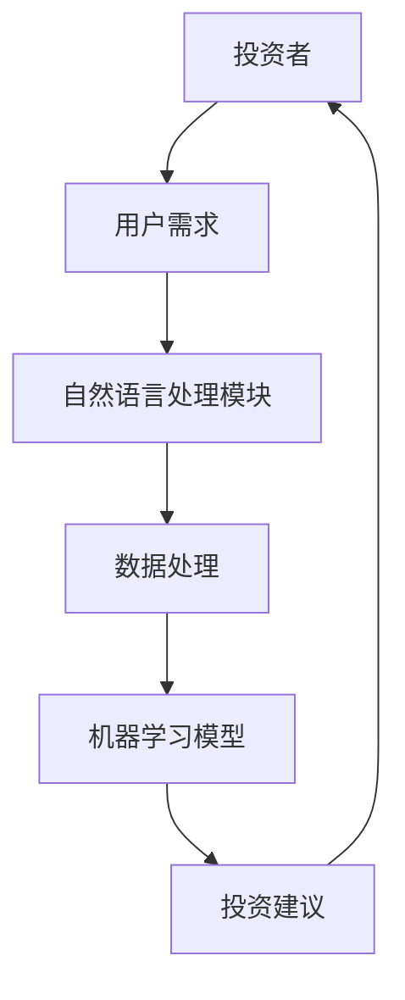
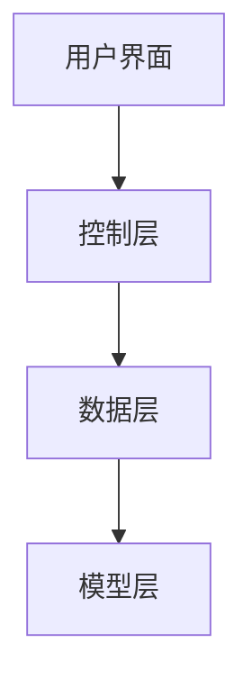

                 


# 探索下一代投资理财智能助手的发展方向

## 关键词：智能助手、投资理财、自然语言处理、机器学习、大数据分析、系统架构

## 摘要：  
随着人工智能技术的飞速发展，投资理财智能助手正在成为金融领域的重要工具。本文将深入探讨下一代投资理财智能助手的发展方向，涵盖其核心技术、系统架构、项目实现及未来趋势。通过分析自然语言处理、机器学习和大数据分析等技术，结合实际案例，为读者提供全面的视角，帮助投资者和开发者更好地理解和应用这些技术。

---

## 第一部分: 投资理财智能助手的背景与现状

### 第1章: 投资理财智能助手的背景介绍

#### 1.1 投资理财的现状与挑战

##### 1.1.1 投资理财的定义与分类  
投资理财是指通过合理配置资金，以实现资产增值的行为。根据投资对象的不同，可以分为股票、基金、债券、房地产等多种形式。随着金融市场的复杂化，投资者需要更加高效和精准的工具来辅助决策。

##### 1.1.2 当前投资理财的主要问题  
- 信息过载：金融市场数据繁多，投资者难以快速筛选有用信息。  
- 风险预测不足：传统投资工具难以准确预测市场波动。  
- 个性化需求未满足：不同投资者的风险承受能力和收益目标差异较大，现有工具难以提供个性化建议。

##### 1.1.3 智能化投资理财的需求与趋势  
随着人工智能技术的进步，投资者对智能化工具的需求日益增加。智能助手可以通过实时数据分析、个性化推荐和风险预警，帮助投资者做出更明智的决策。

#### 1.2 智能助手在投资理财中的作用

##### 1.2.1 智能助手的基本概念  
智能助手是一种基于人工智能技术的工具，能够通过自然语言处理、机器学习等技术，为用户提供投资建议、市场分析和风险预警等服务。

##### 1.2.2 智能助手在投资理财中的应用场景  
- **信息筛选**：帮助用户快速获取有价值的投资信息。  
- **风险评估**：通过大数据分析和机器学习模型，评估投资风险。  
- **个性化推荐**：根据用户的投资目标和风险偏好，推荐适合的理财产品。

##### 1.2.3 智能助手的核心优势与价值  
- **高效性**：快速处理海量数据，提供实时反馈。  
- **精准性**：通过机器学习模型，提高投资建议的准确性。  
- **个性化服务**：根据用户需求，提供定制化投资方案。

#### 1.3 问题背景与目标

##### 1.3.1 投资者的核心需求  
- 实时市场分析  
- 个性化投资建议  
- 风险预警和管理  

##### 1.3.2 现有投资工具的局限性  
- 信息更新不及时  
- 缺乏个性化服务  
- 风险预测能力有限  

##### 1.3.3 智能助手的目标与边界  
目标：提供高效、精准的投资建议，帮助投资者实现资产增值。边界：专注于投资辅助，不直接参与交易决策。

#### 1.4 核心概念与联系

##### 1.4.1 核心概念的定义与属性  
| 核心概念 | 定义 | 属性 |
|----------|------|------|
| 自然语言处理 | 通过计算机技术理解与生成人类语言 | 实时性、准确性 |
| 机器学习 | 基于数据训练模型，进行预测与决策 | 高效性、自适应性 |
| 大数据分析 | 从海量数据中提取有价值的信息 | 全面性、实时性 |

##### 1.4.2 核心概念之间的关系  
自然语言处理（NLP）负责理解用户需求和处理文本数据，机器学习（ML）利用NLP提取的特征进行投资预测，大数据分析（BD）为ML提供丰富的训练数据。

##### 1.4.3 实体关系图  


---

## 第二部分: 智能助手的核心技术与算法原理

### 第2章: 自然语言处理技术在智能助手中的应用

#### 2.1 自然语言处理的原理与算法

##### 2.1.1 NLP的基本原理  
NLP通过文本预处理、特征提取和模型训练，实现对自然语言的智能理解。

##### 2.1.2 常见的NLP算法及其特点  
| 算法 | 描述 | 优点 |
|------|------|------|
| TF-IDF | 统计文本中关键词的频率 | 简单高效 |
| Word2Vec | 将单词映射为向量 | 捕捉单词语义 |
| Transformer | 基于自注意力机制的模型 | 高效准确 |

##### 2.1.3 NLP在智能助手中的应用案例  
- 股票新闻分析：通过NLP分析新闻文本，预测股票价格走势。

#### 2.2 机器学习与深度学习在投资理财中的应用

##### 2.2.1 机器学习的基本原理  
机器学习通过训练数据，构建预测模型，用于投资风险评估和收益预测。

##### 2.2.2 深度学习的核心算法  
- **LSTM**：适用于时间序列数据的预测。  
- **Transformer**：用于处理长文本数据。

##### 2.2.3 投资预测的数学模型  
$$ y = \beta_0 + \beta_1x_1 + \beta_2x_2 + \epsilon $$  
其中，$y$ 是预测收益，$x_i$ 是输入特征，$\beta_i$ 是模型参数。

#### 2.3 大数据分析与投资决策

##### 2.3.1 数据分析的基本方法  
- 数据清洗：去除无效数据。  
- 数据特征提取：提取关键特征变量。

##### 2.3.2 大数据在投资决策中的作用  
通过分析历史数据和市场趋势，优化投资策略。

##### 2.3.3 数据挖掘与预测模型  
使用聚类分析和回归模型，挖掘数据中的潜在规律。

---

### 第3章: 系统功能设计与实现

#### 3.1 系统功能模块划分

##### 3.1.1 用户界面模块  
- 用户登录与注册  
- 信息查询与展示  

##### 3.1.2 数据处理模块  
- 数据清洗与预处理  
- 数据特征提取  

##### 3.1.3 智能分析模块  
- 文本分析与情感分析  
- 投资风险预测  

##### 3.1.4 投资建议模块  
- 个性化推荐  
- 风险预警  

#### 3.2 系统架构设计

##### 3.2.1 分层架构设计  


##### 3.2.2 微服务架构设计  
```mermaid
graph TD
    User[用户] --> API Gateway[网关]
    API Gateway --> Service1[服务1]
    API Gateway --> Service2[服务2]
```

##### 3.2.3 数据流与交互流程  
用户输入查询请求，系统通过API Gateway分发请求，后端服务处理数据并返回结果。

#### 3.3 系统接口设计

##### 3.3.1 API接口定义  
- GET /users：获取用户信息  
- POST /predict：提交预测请求  

##### 3.3.2 接口调用流程  
用户发起请求 → 网关分发 → 服务处理 → 返回结果。

##### 3.3.3 接口安全设计  
- 使用JWT进行身份验证  
- HTTPS加密传输  

#### 3.4 系统交互流程设计

##### 3.4.1 用户登录与注册  
用户输入用户名和密码 → 系统验证 → 返回登录结果。

##### 3.4.2 数据输入与处理  
用户提交查询请求 → 系统处理数据 → 返回分析结果。

##### 3.4.3 智能分析与反馈  
系统根据模型预测结果，生成投资建议并反馈给用户。

---

## 第三部分: 项目实战与案例分析

### 第4章: 项目环境搭建与核心实现

#### 4.1 开发环境的安装与配置

##### 4.1.1 Python环境的安装  
安装Python 3.x，并配置虚拟环境。

##### 4.1.2 第三方库的安装  
- 使用 pip 安装numpy、pandas、transformers等库。

##### 4.1.3 开发工具的配置  
配置IDE（如PyCharm）的Python解释器和调试环境。

#### 4.2 核心功能的实现

##### 4.2.1 自然语言处理模块的实现  
使用Transformers库，训练文本分类模型。

##### 4.2.2 机器学习模型的训练与部署  
使用Scikit-learn训练回归模型，并部署为RESTful API。

##### 4.2.3 数据分析模块  
编写Python脚本，读取数据并生成可视化图表。

---

## 第四部分: 总结与展望

### 第5章: 总结与未来展望

#### 5.1 小结  
智能助手通过自然语言处理、机器学习和大数据分析，为投资理财提供了高效、精准的解决方案。

#### 5.2 注意事项  
- 数据隐私问题需要重视。  
- 模型需要定期更新以适应市场变化。  

#### 5.3 拓展阅读  
推荐阅读《Python机器学习实战》和《深度学习入门》等书籍，深入理解相关技术。

---

通过以上步骤，我们详细探讨了下一代投资理财智能助手的发展方向，涵盖了从技术原理到系统实现的全过程。希望这篇文章能为投资者和开发者提供有价值的参考和启示。

