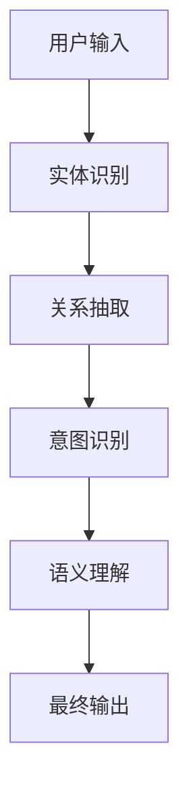
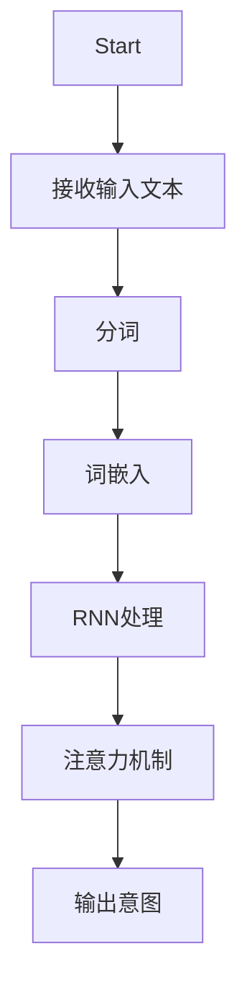
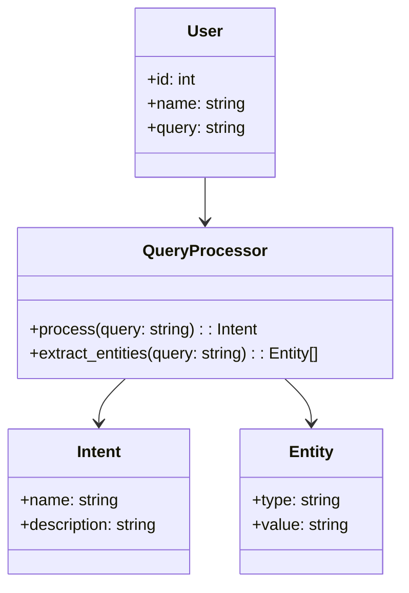
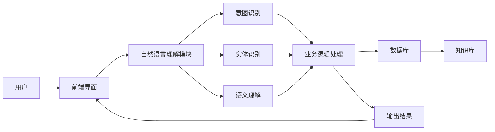

                 


# 提升客户服务质量：NLU技术的应用

> **关键词**: 自然语言理解, 客户服务质量, NLU技术, 人工智能, 语义理解, 意图识别, 客户体验

> **摘要**: 本文探讨了自然语言理解（NLU）技术在提升客户服务质量中的应用。通过分析NLU的核心概念、算法原理、系统设计及实际案例，本文详细阐述了NLU如何帮助企业和客户建立更高效的沟通渠道，从而提升客户满意度和忠诚度。文章还提供了基于Python的NLU系统实现示例，帮助读者更好地理解和应用这一技术。

---

# 第一部分: 提升客户服务质量：NLU技术的应用背景

## 第1章: 自然语言理解（NLU）概述

### 1.1 NLU的基本概念

#### 1.1.1 自然语言理解的定义
自然语言理解（Natural Language Understanding, NLU）是人工智能（AI）领域的重要分支，旨在让计算机能够理解人类的自然语言输入（如文本或语音），并从中提取有用的信息或意图。NLU的核心目标是将人类语言转化为计算机可处理的结构化数据。

#### 1.1.2 NLU的核心目标
- **意图识别**: 确定用户输入的主要目的（例如，用户是在查询产品信息还是投诉问题）。
- **实体识别**: 从文本中提取关键信息（例如，时间、地点、人名、公司名等）。
- **语义理解**: 理解文本的深层含义，而不仅仅是表面的词语组合。

#### 1.1.3 NLU与NLP的关系
NLU是自然语言处理（NLP）的一个子领域，NLP包括更广泛的任务，如文本生成、翻译、信息提取等。NLU专注于理解输入文本的含义，而NLP则更广泛地处理语言数据。

---

### 1.2 NLU技术的发展历程

#### 1.2.1 从规则驱动到数据驱动
早期的NLU技术主要基于规则，通过手动编写规则来处理特定场景的语言输入。随着机器学习和深度学习的发展，NLU逐渐转向数据驱动的方法，利用大量标注数据训练模型。

#### 1.2.2 深度学习的引入
深度学习的兴起为NLU带来了革命性的变化。基于神经网络的模型（如循环神经网络RNN和变换器模型Transformer）能够更好地捕捉语言的上下文关系和语义信息。

#### 1.2.3 当前NLU技术的主流方向
当前，NLU技术主要基于深度学习模型，尤其是预训练语言模型（如BERT、GPT）的应用，使得NLU在复杂语境下的理解能力显著提升。

---

### 1.3 NLU在提升客户服务质量中的作用

#### 1.3.1 客户服务中的常见问题
- **信息查询延迟**: 用户提出问题后需要长时间等待回复。
- **理解错误**: 人工客服无法准确理解用户的语言输入，导致沟通不畅。
- **情绪不满**: 用户感受到被忽视或误解，导致投诉增加。

#### 1.3.2 NLU如何解决这些问题
- **实时理解**: NLU技术能够快速解析用户的输入，提供即时反馈。
- **准确识别意图**: NLU能够准确理解用户的意图，减少理解错误。
- **情绪分析**: 通过语义理解技术，NLU能够识别用户的情绪，提供更贴心的服务。

#### 1.3.3 提升客户满意度的直接效果
- **缩短响应时间**: NLU技术使客服系统能够快速处理用户请求。
- **提高准确性**: 准确的理解能力减少了误解和错误。
- **增强客户体验**: 通过情绪分析和个性化服务，提升客户的整体体验。

---

### 1.4 NLU与其他技术的结合

#### 1.4.1 NLU与机器学习的结合
- NLU模型通常基于机器学习算法（如支持向量机、随机森林）进行训练和优化。
- 机器学习提供了从数据中学习模式的能力，而NLU则负责理解语言输入。

#### 1.4.2 NLU与大数据分析的结合
- 大数据分析技术可以结合NLU，从海量客户咨询数据中提取模式和趋势，帮助优化客户服务流程。
- 通过大数据分析，NLU模型可以不断优化，提升准确性和理解能力。

#### 1.4.3 NLU与智能客服系统的整合
- NLU技术是智能客服系统的核心驱动力，能够实现自动化的客户咨询和问题解决。
- 通过与智能客服系统的整合，NLU技术能够显著提高客户服务质量，降低成本。

---

## 1.5 本章小结
本章介绍了自然语言理解（NLU）的基本概念、发展历程及其在提升客户服务质量中的重要作用。NLU技术通过实时理解、准确识别意图和情绪分析，显著提升了客户服务的效率和满意度。接下来的章节将深入探讨NLU的核心原理、算法实现及其在系统设计中的具体应用。

---

# 第二部分: NLU技术的核心概念与原理

## 第2章: NLU的核心原理

### 2.1 信息抽取

#### 2.1.1 实体识别
- **定义**: 从文本中提取出具体的人名、地名、组织名、时间等实体信息。
- **实现方法**: 基于规则的实体识别和基于模型的实体识别（如CRF、RNN）。
- **案例**: 从用户输入“请帮我查询2023年10月的订单”中提取“2023年10月”作为时间实体。

#### 2.1.2 关系抽取
- **定义**: 识别文本中实体之间的关系（例如，“张三购买了产品A”中的“购买”关系）。
- **实现方法**: 使用句法分析和语义分析技术，结合上下文信息进行关系推理。

#### 2.1.3 意见抽取
- **定义**: 从文本中提取用户的主观评价或情感倾向。
- **实现方法**: 基于情感分析模型（如词袋模型、TF-IDF）进行情感分类。

---

### 2.2 语义理解

#### 2.2.1 词义消歧
- **定义**: 解决词语的多义性问题，例如“银行”可以指金融机构或河流。
- **实现方法**: 基于上下文信息和语境分析，选择最合适的词语解释。

#### 2.2.2 上下文理解
- **定义**: 理解文本中词语的上下文关系，捕捉隐含信息。
- **实现方法**: 使用循环神经网络（RNN）或变换器模型（Transformer）进行上下文建模。

#### 2.2.3 隐含信息的推理
- **定义**: 从文本中推导出未明确表达的信息。
- **实现方法**: 基于知识图谱和逻辑推理技术，构建隐含信息的推理模型。

---

### 2.3 意图识别

#### 2.3.1 基于规则的意图识别
- **定义**: 通过预定义的规则和模式匹配，识别用户的意图。
- **实现方法**: 使用正则表达式或关键词匹配技术。
- **优缺点**: 简单易实现，但灵活性差，难以处理复杂场景。

#### 2.3.2 基于机器学习的意图识别
- **定义**: 通过训练数据学习用户输入与意图之间的映射关系。
- **实现方法**: 使用分类算法（如SVM、随机森林）或深度学习模型（如RNN、CNN）。
- **优缺点**: 灵活性高，能够处理复杂场景，但需要大量标注数据。

#### 2.3.3 基于深度学习的意图识别
- **定义**: 基于预训练语言模型（如BERT、GPT）进行意图识别。
- **实现方法**: 使用微调预训练模型或构建自定义模型。
- **优缺点**: 高准确性和鲁棒性，但计算资源消耗较大。

---

### 2.4 NLU核心原理的总结
NLU技术的核心在于将自然语言输入转化为结构化信息，这一过程涉及信息抽取、语义理解、意图识别等多个步骤。通过结合规则驱动和数据驱动的方法，NLU能够实现对复杂语言输入的准确理解和处理。

---

## 第2.5 实体关系图与算法流程图

### 2.5.1 实体关系图（Mermaid）


### 2.5.2 算法流程图（Mermaid）


---

## 2.6 本章小结
本章详细介绍了NLU技术的核心概念，包括信息抽取、语义理解、意图识别等关键步骤。通过结合规则驱动和数据驱动的方法，NLU能够实现对自然语言输入的准确理解和处理。接下来的章节将从算法原理、系统设计和实际案例等方面，进一步探讨NLU技术的应用。

---

## 第3章: NLU算法原理与实现

### 3.1 算法原理

#### 3.1.1 基于规则的NLU算法
- **原理**: 通过预定义的规则和模式匹配，识别用户的意图和实体。
- **优缺点**: 简单易实现，但灵活性差，难以处理复杂场景。

#### 3.1.2 基于机器学习的NLU算法
- **原理**: 使用分类算法（如SVM、随机森林）或深度学习模型（如RNN、CNN）对标注数据进行训练，学习用户输入与意图之间的映射关系。
- **优缺点**: 灵活性高，能够处理复杂场景，但需要大量标注数据。

#### 3.1.3 基于深度学习的NLU算法
- **原理**: 基于预训练语言模型（如BERT、GPT）进行意图识别，通过微调或构建自定义模型实现。
- **优缺点**: 高准确性和鲁棒性，但计算资源消耗较大。

---

### 3.2 算法实现

#### 3.2.1 Python代码实现
以下是一个基于深度学习的意图识别模型的Python代码示例：

```python
import tensorflow as tf
from tensorflow.keras import layers

# 数据预处理
def preprocess(data):
    # 分词、归一化处理
    pass

# 模型构建
def build_model():
    model = tf.keras.Sequential()
    model.add(layers.Embedding(input_dim= vocab_size, output_dim= embed_dim))
    model.add(layers.LSTM(64, return_sequences=True))
    model.add(layers.Dense(2, activation='softmax'))
    model.compile(optimizer='adam', loss='sparse_categorical_crossentropy', metrics=['accuracy'])
    return model

# 模型训练
def train_model(model, X_train, y_train, epochs=10):
    model.fit(X_train, y_train, epochs=epochs, batch_size=32, validation_split=0.2)

# 模型推理
def predict(model, input_sequence):
    prediction = model.predict(input_sequence)
    return prediction
```

---

### 3.3 算法数学模型与公式

#### 3.3.1 概率模型
- **贝叶斯公式**: 
  $$ P(y|x) = \frac{P(x|y)P(y)}{P(x)} $$
  其中，$y$是意图类别，$x$是输入文本。

#### 3.3.2 深度学习模型
- **RNN模型**: 
  $$ h_t = \tanh(W_{hh}h_{t-1} + W_{xh}x_t + b_h) $$
  $$ y_t = W_{hy}h_t + b_y $$
  其中，$h_t$是隐藏层状态，$y_t$是输出层预测。

---

## 3.4 本章小结
本章详细探讨了NLU技术的算法原理与实现，包括基于规则、机器学习和深度学习的多种方法。通过Python代码示例和数学公式推导，读者可以更好地理解NLU技术的核心算法。接下来的章节将从系统设计和实际应用的角度，进一步探讨NLU技术的应用。

---

# 第三部分: NLU技术在客户服务质量提升中的应用

## 第4章: 系统分析与架构设计

### 4.1 项目介绍

#### 4.1.1 问题场景
- **背景**: 一家电子商务公司希望优化其客户服务系统，提高客户满意度。
- **目标**: 利用NLU技术实现自动化的客户咨询和问题解决。

---

### 4.2 系统功能设计

#### 4.2.1 领域模型（Mermaid类图）


---

#### 4.2.2 系统架构设计（Mermaid架构图）


---

#### 4.2.3 系统接口设计
- **输入接口**: 用户输入文本或语音。
- **输出接口**: 系统返回意图、实体和语义理解结果。
- **交互流程**: 用户输入 -> 系统处理 -> 系统输出。

---

## 4.3 本章小结
本章通过系统设计和架构实现，展示了NLU技术在客户服务质量提升中的具体应用。通过类图和架构图，读者可以清晰理解系统的功能模块和交互流程。

---

## 第5章: 项目实战

### 5.1 环境安装与配置

#### 5.1.1 安装Python和相关库
```bash
pip install numpy
pip install tensorflow
pip install scikit-learn
pip install spacy
```

#### 5.1.2 安装spaCy和中文分词模型
```bash
pip install spacy
python -m spacy download zh_core_web_sm
```

---

### 5.2 核心代码实现

#### 5.2.1 分词与实体识别
```python
import spacy

nlp = spacy.load("zh_core_web_sm")

def extract_entities(text):
    doc = nlp(text)
    entities = []
    for ent in doc.ents:
        entities.append({"text": ent.text, "label": ent.label_})
    return entities

# 示例
text = "请帮我查询2023年10月的订单"
print(extract_entities(text))
```

#### 5.2.2 意图识别
```python
from tensorflow.keras.models import Sequential
from tensorflow.keras.layers import Dense, LSTM, Embedding

def build_model(vocab_size, embed_dim):
    model = Sequential()
    model.add(Embedding(vocab_size, embed_dim, input_length=max_len))
    model.add(LSTM(64, return_sequences=True))
    model.add(Dense(2, activation='softmax'))
    model.compile(optimizer='adam', loss='sparse_categorical_crossentropy', metrics=['accuracy'])
    return model

# 示例
vocab_size = 10000
embed_dim = 100
max_len = 100
model = build_model(vocab_size, embed_dim)
```

---

### 5.3 项目小结
通过本章的项目实战，读者可以了解NLU技术在实际应用中的具体实现步骤。从环境配置到核心代码实现，再到结果分析，整个过程展示了NLU技术在提升客户服务质量中的巨大潜力。

---

## 第6章: 最佳实践与总结

### 6.1 最佳实践

#### 6.1.1 数据质量的重要性
- 确保训练数据的多样性和代表性。
- 处理数据中的噪声和偏差。

#### 6.1.2 模型调优的技巧
- 使用交叉验证和网格搜索优化模型参数。
- 调整模型结构以适应具体任务需求。

#### 6.1.3 实际应用中的注意事项
- 定期更新模型以适应语言的变化和新数据的引入。
- 处理用户隐私和数据安全问题。

---

### 6.2 小结
本文从NLU技术的核心概念、算法原理到实际应用，全面探讨了NLU技术在提升客户服务质量中的作用。通过理论分析和实践案例，读者可以深入理解NLU技术的优势和应用价值。

---

### 6.3 注意事项
- 在实际应用中，需注意数据质量和模型调优。
- 处理复杂场景时，建议结合多种技术（如知识图谱、强化学习）进行优化。

---

### 6.4 拓展阅读
- **推荐书籍**: 
  - 《自然语言处理入门》
  - 《深度学习实战》
- **推荐博客**: 
  - TensorFlow中文社区
  - PyTorch官方文档

---

# 结语

通过本文的探讨，我们深入了解了NLU技术在提升客户服务质量中的重要应用。从核心概念到算法实现，从系统设计到项目实战，NLU技术展示了其在优化客户服务流程和提升客户满意度方面的巨大潜力。未来，随着NLU技术的不断发展，客户服务质量的提升将更加智能化和高效化。

--- 

**THE END**

