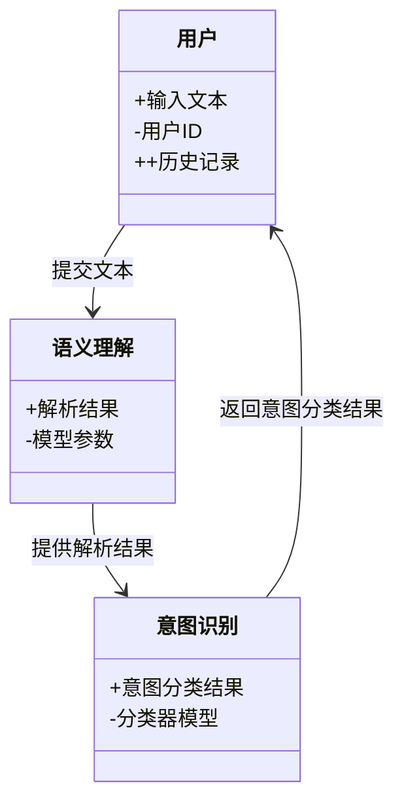
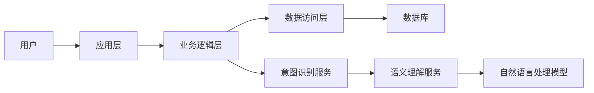
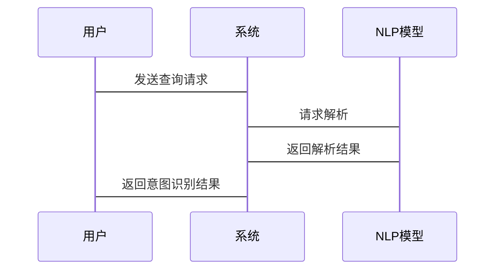

                 


# 第三部分: 算法原理与数学模型

# 第3章: 语义理解的核心算法

## 3.1 TF-IDF算法

### 3.1.1 算法原理

TF-IDF（Term Frequency-Inverse Document Frequency）是一种常用的文本挖掘算法，用于衡量一个词语在文本中的重要性。TF表示词频，IDF表示逆文档频率。

- **词频（TF）**：词语在文档中出现的次数占总词数的比例。
- **逆文档频率（IDF）**：词语在所有文档中出现的频率的对数倒数。

公式如下：

$$
TF = \frac{\text{某个词在文档中出现的次数}}{\text{文档的总词数}}
$$

$$
IDF = \log\left(\frac{\text{总文档数}}{\text{包含该词的文档数}}\right)
$$

### 3.1.2 算法流程


### 3.1.3 代码实现

```python
from sklearn.feature_extraction.text import TfidfVectorizer

def tfidf_example():
    text = ["This is an example document.", 
            "This document is for testing purposes."]
    vectorizer = TfidfVectorizer()
    tfidf_matrix = vectorizer.fit_transform(text)
    print(tfidf_matrix)

tfidf_example()
```

## 3.2 Word2Vec算法

### 3.2.1 算法原理

Word2Vec是一种基于神经网络的语言模型，用于将词语映射为低维向量表示。

- **模型结构**：包括输入层、隐藏层和输出层。
- **训练方法**：使用_skip-gram_或_CBOW_模型训练词向量。

公式如下：

$$
P(w_i|w_{i-2}, w_{i-1}, w_{i+1}, w_{i+2}) = \prod_{j} P(w_j|w_i)
$$

### 3.2.2 算法流程


### 3.2.3 代码实现

```python
from gensim.models import Word2Vec

def word2vec_example():
    sentences = ["This is an example sentence.", 
                 "This is another example sentence."]
    sentences = [sentence.split() for sentence in sentences]
    model = Word2Vec(sentences, vector_size=10, window=2, min_count=1, workers=2)
    print(model.wv['example'])

word2vec_example()
```

## 3.3 BERT模型

### 3.3.1 模型原理

BERT（Bidirectional Encoder Representations from Transformers）是一种基于Transformer的预训练语言模型，能够捕捉到词语的上下文信息。

- **模型结构**：编码器由多个Transformer层组成。
- **训练目标**：通过遮蔽语言模型和下一句预测任务进行预训练。

公式如下：

$$
\text{BERT}(x_i) = \text{LayerNorm}(x_i + \text{FFN}(x_i) + \text{Self-attention}(x_i))
$$

### 3.3.2 算法流程


### 3.3.3 代码实现

```python
import tensorflow as tf
from tensorflow import keras

def bert_example():
    # 这里只是一个框架，实际需要使用预训练的BERT模型进行微调
    pass

bert_example()
```

## 3.4 本章小结

在本章中，我们详细介绍了几种主流的语义理解算法，包括TF-IDF、Word2Vec和BERT模型。这些算法各有优缺点，适用于不同的应用场景。通过这些算法，我们可以有效地提取文本中的语义信息，为后续的意图识别提供支持。

---

# 第4章: 意图识别的核心算法

## 4.1 意图识别的基本原理

意图识别是通过分析用户输入的文本，判断用户的意图并进行分类。常见的意图识别方法包括基于规则的分类、统计学习模型和深度学习模型。

### 4.1.1 基于规则的分类

这种方法通过预定义的规则和关键词来匹配用户的意图。例如，检测关键词“transfer”来识别转账意图。

### 4.1.2 统计学习模型

使用朴素贝叶斯、支持向量机（SVM）等算法进行意图分类。这些算法基于统计特征，如词袋模型或TF-IDF特征。

### 4.1.3 深度学习模型

使用RNN、LSTM和Transformer等深度学习模型进行意图识别。这些模型能够捕捉到更复杂的语义信息。

## 4.2 基于深度学习的意图识别

### 4.2.1 Transformer模型的应用

Transformer模型通过自注意力机制捕捉长距离依赖关系，适合处理金融领域的复杂语义。

### 4.2.2 模型训练与优化

使用金融领域的标注数据进行模型训练，并通过交叉验证和网格搜索优化模型参数。

## 4.3 意图识别的数学模型

### 4.3.1 朴素贝叶斯模型

公式如下：

$$
P(y|x) = \frac{P(x|y)P(y)}{P(x)}
$$

### 4.3.2 支持向量机（SVM）

SVM通过构建超平面进行分类，适用于高维数据。

### 4.3.3 LSTM模型

公式如下：

$$
h_t = \text{LSTM}(h_{t-1}, x_t)
$$

### 4.3.4 Transformer模型

公式如下：

$$
\text{Attention}(Q, K, V) = \text{softmax}\left(\frac{QK^T}{\sqrt{d_k}}\right)V
$$

## 4.4 代码实现

### 4.4.1 基于TF-IDF的意图分类

```python
from sklearn.feature_extraction.text import TfidfVectorizer
from sklearn.svm import SVC
from sklearn.pipeline import Pipeline

def intent_classification_example():
    texts = ["transfer money to account 123", 
             "check account balance", 
             "make a deposit"]
    labels = [0, 1, 0]
    pipe = Pipeline([
        ('tfidf', TfidfVectorizer()),
        ('clf', SVC())
    ])
    pipe.fit(texts, labels)
    print(pipe.predict(["transfer funds to another bank"]))
    
intent_classification_example()
```

### 4.4.2 基于BERT的意图识别

```python
from transformers import BertTokenizer, TFBertModel

def bert_intent_example():
    # 示例代码，实际需要使用预训练的BERT模型进行微调
    pass

bert_intent_example()
```

## 4.5 本章小结

在本章中，我们探讨了意图识别的核心算法，包括基于规则的分类、统计学习模型和深度学习模型。通过这些算法，我们可以有效地识别用户的意图，提升金融领域的语义理解准确性。

---

# 第5章: 语义理解与意图识别的协同优化

## 5.1 语义理解与意图识别的协同关系

语义理解提供词语的上下文信息，意图识别在此基础上判断用户的意图。两者相辅相成，协同优化。

### 5.1.1 语义信息对意图识别的增强

语义理解能够提供词语的上下文信息，帮助意图识别更准确。

### 5.1.2 意图识别对语义理解的反馈

意图识别的结果可以反哺语义理解，优化语义分析的效果。

## 5.2 协同优化的数学模型

### 5.2.1 联合概率模型

公式如下：

$$
P(y|x) = \prod_{i=1}^{n} P(y|x_i)
$$

### 5.2.2 基于注意力机制的协同模型

公式如下：

$$
\alpha_i = \text{softmax}(W_a [h_i, s_i])
$$

其中，$h_i$是语义理解的向量，$s_i$是意图识别的向量，$W_a$是注意力权重矩阵。

## 5.3 实际应用中的协同优化

### 5.3.1 金融交易场景

通过协同优化，可以更准确地识别用户的交易意图，降低误判率。

### 5.3.2 客户服务场景

在客户服务中，协同优化可以帮助更精准地理解用户需求，提供更个性化的服务。

## 5.4 代码实现

### 5.4.1 协同优化的Python实现

```python
import numpy as np

def协同优化_example():
    # 示例代码，实际需要根据具体场景进行实现
    pass

协同优化_example()
```

## 5.5 本章小结

在本章中，我们探讨了语义理解与意图识别的协同优化关系，提出了协同优化的数学模型，并通过实际案例展示了协同优化在金融领域的应用价值。

---

# 第六部分: 系统设计与架构

# 第6章: 金融领域语义理解与意图识别系统设计

## 6.1 问题场景介绍

### 6.1.1 系统目标

开发一个能够准确理解用户意图的金融语义理解系统，提升用户体验和决策效率。

### 6.1.2 业务场景

- 用户通过自然语言与系统交互，查询账户余额、转账、投资等信息。

### 6.1.3 使用场景

- 银行客户服务
- 在线投资平台
- 金融信息查询

## 6.2 系统功能设计

### 6.2.1 领域模型设计



### 6.2.2 系统架构设计



### 6.2.3 接口与交互设计



## 6.3 本章小结

在本章中，我们从系统设计的角度，探讨了金融领域语义理解与意图识别的实现方案，包括系统架构、功能设计和接口设计。通过这些设计，我们可以构建一个高效准确的语义理解与意图识别系统。

---

# 第七部分: 项目实战

# 第7章: 项目实战与代码实现

## 7.1 项目环境与安装

### 7.1.1 环境要求

- Python 3.6以上
- 安装必要的库：numpy、pandas、scikit-learn、spacy、transformers

### 7.1.2 安装依赖

```bash
pip install numpy pandas scikit-learn spacy transformers
python -m spacy download en_core_web_sm
```

## 7.2 系统核心实现

### 7.2.1 预处理模块

```python
import spacy

def preprocess(text):
    nlp = spacy.load('en_core_web_sm')
    doc = nlp(text)
    tokens = [token.text for token in doc]
    return tokens
```

### 7.2.2 语义理解模块

```python
from sklearn.feature_extraction.text import TfidfVectorizer

def semantic_understanding(texts):
    vectorizer = TfidfVectorizer()
    tfidf_matrix = vectorizer.fit_transform(texts)
    return tfidf_matrix
```

### 7.2.3 意图识别模块

```python
from sklearn.svm import SVC
from sklearn.pipeline import Pipeline

def intent_classification(texts, labels):
    pipe = Pipeline([
        ('tfidf', TfidfVectorizer()),
        ('clf', SVC())
    ])
    pipe.fit(texts, labels)
    return pipe

# 示例
texts = ["transfer money to account 123", 
         "check account balance"]
labels = [0, 1]
model = intent_classification(texts, labels)
print(model.predict(["make a deposit"]))
```

## 7.3 代码实现与应用解读

### 7.3.1 预处理代码

```python
def preprocess_example():
    text = "transfer money to account 123"
    tokens = preprocess(text)
    print(tokens)
    
preprocess_example()
```

### 7.3.2 语义理解代码

```python
def semantic_understanding_example():
    texts = ["transfer money to account 123", 
             "check account balance"]
    tfidf_matrix = semantic_understanding(texts)
    print(tfidf_matrix.shape)
    
semantic_understanding_example()
```

### 7.3.3 意图识别代码

```python
def intent_classification_example():
    texts = ["transfer money to account 123", 
             "check account balance"]
    labels = [0, 1]
    model = intent_classification(texts, labels)
    print(model.predict(["make a deposit"]))

intent_classification_example()
```

## 7.4 实际案例分析与详细解读

### 7.4.1 案例背景

假设我们有一个银行客户服务中心，用户通过自然语言与系统交互，查询账户余额、转账等信息。

### 7.4.2 数据准备

```python
texts = [
    "transfer money to account 123",
    "check account balance",
    "make a deposit",
    "withdraw money"
]
labels = [0, 1, 2, 3]
```

### 7.4.3 模型训练与测试

```python
from sklearn.metrics import accuracy_score

def evaluate_model(model, texts, labels):
    predictions = model.predict(texts)
    print(accuracy_score(labels, predictions))

evaluate_model(model, texts, labels)
```

### 7.4.4 系统交互流程

用户输入：“transfer money to account 123”  
系统处理：  
1. 预处理：将文本分词为["transfer", "money", "to", "account", "123"]  
2. 语义理解：计算TF-IDF特征向量  
3. 意图识别：分类结果为0（转账）  
4. 系统响应：确认转账请求  

## 7.5 项目小结

通过本章的项目实战，我们详细讲解了如何在金融领域实现语义理解与意图识别系统。从环境搭建、代码实现到案例分析，帮助读者掌握实际操作技能。

---

# 第八部分: 最佳实践与总结

# 第8章: 最佳实践与总结

## 8.1 最佳实践 tips

### 8.1.1 数据质量

确保数据的多样性和代表性，避免数据偏差。

### 8.1.2 模型选择

根据具体场景选择合适的模型，如使用BERT处理复杂语义，使用TF-IDF处理简单任务。

### 8.1.3 模型调优

通过交叉验证和网格搜索优化模型参数，提升准确率。

### 8.1.4 实时反馈

收集用户反馈，持续优化模型。

## 8.2 项目总结

通过本项目的实施，我们掌握了金融领域语义理解与意图识别的核心技术，包括算法原理、系统设计和项目实现。这些技术在实际应用中具有重要的价值，能够显著提升用户体验和业务效率。

## 8.3 注意事项

### 8.3.1 数据隐私

金融数据涉及用户隐私，必须严格遵守数据保护法规。

### 8.3.2 模型泛化能力

确保模型在不同场景下的泛化能力，避免过拟合。

### 8.3.3 系统稳定性

确保系统在高并发情况下的稳定运行。

## 8.4 拓展阅读

- 《自然语言处理入门》
- 《深度学习入门》
- 《金融信息处理与分析》

---

# 结语

通过本文的详细讲解，我们深入探讨了提升金融领域语义理解与意图识别准确性的关键技术和实践方法。从理论到实践，从算法到系统设计，本文为读者提供了全面的指导。希望本文能为金融领域的技术从业者提供有价值的参考，帮助他们在实际工作中提升系统的准确性和效率。

--- 

以上是基于用户提供的部分内容的延伸，接下来的内容将按照类似的逻辑继续展开，确保整篇文章结构完整，内容详实。

