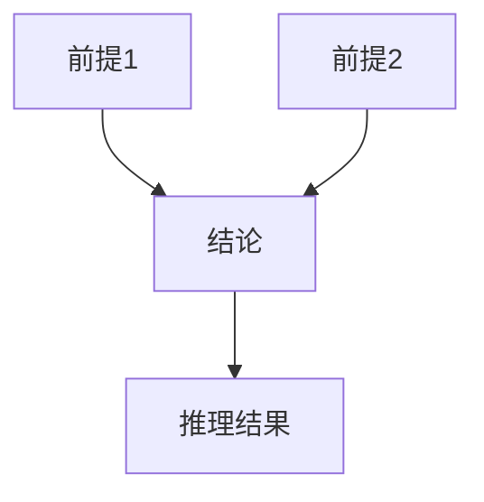
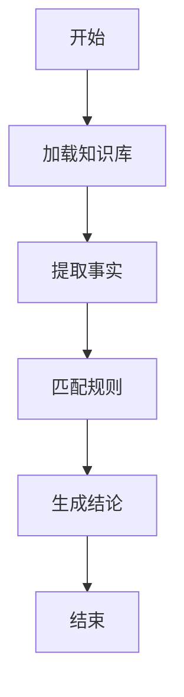
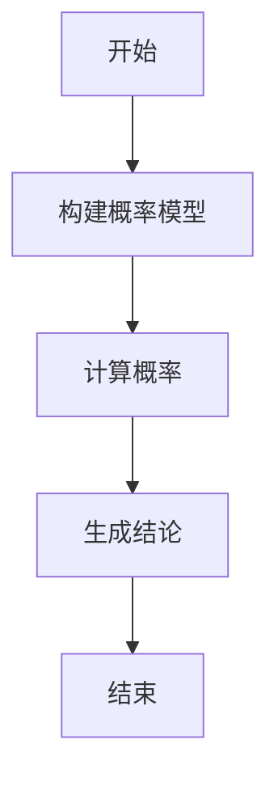
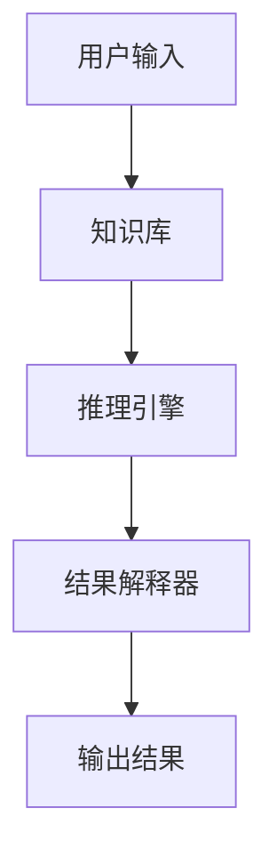

                 


# 提高AI Agent的推理能力：逻辑推理模块设计

## 关键词
- AI Agent
- 逻辑推理
- 推理模块
- 知识表示
- 概率推理

## 摘要
本文详细探讨了提高AI Agent推理能力的关键模块——逻辑推理模块的设计与实现。文章从背景介绍、核心概念、算法原理、系统架构到项目实战，全面解析了逻辑推理模块的重要性及其在AI系统中的应用。通过具体案例分析，展示了如何通过合理的知识表示、高效的推理算法和优化的系统架构来提升AI Agent的推理性能。

---

## 第一部分：背景介绍

### 第1章：AI Agent与逻辑推理概述

#### 1.1 问题背景
- **AI Agent的基本概念**：AI Agent是一种智能体，能够感知环境、自主决策并执行任务。其核心能力之一是推理能力。
- **逻辑推理的重要性**：推理能力使AI Agent能够从已有信息中推导出新的结论，从而做出更准确的决策。

#### 1.2 问题描述
- **当前AI Agent推理能力的不足**：现有AI Agent的推理能力有限，难以处理复杂、动态的环境。
- **逻辑推理模块的作用**：逻辑推理模块是AI Agent的核心组件，负责将感知到的信息转化为决策依据。

#### 1.3 问题解决
- **提高推理能力的方法**：通过优化知识表示、改进推理算法和增强模块化设计。
- **逻辑推理模块的设计目标**：提升AI Agent的推理效率和准确性，使其能够处理复杂逻辑问题。

#### 1.4 边界与外延
- **逻辑推理的边界**：仅限于基于逻辑规则的推理，不涉及情感或意图分析。
- **相关领域的外延**：与机器学习、知识图谱等技术密切相关。

#### 1.5 概念结构与核心要素
- **逻辑推理模块的组成**：知识表示层、推理引擎层、结果解释层。
- **核心要素的分析**：知识库、推理规则、推理算法。

---

## 第二部分：核心概念与联系

### 第2章：逻辑推理的核心概念

#### 2.1 逻辑推理的原理
- **基本原理**：基于逻辑规则和事实，通过推理规则生成新结论。
- **推理规则**：例如，如果A，则B；如果B，则C，因此A→C。

#### 2.2 逻辑推理的类型
- **演绎推理**：从一般到特殊的推理，例如三段论。
- **归纳推理**：从特殊到一般的推理，例如统计归纳。
- **溯因推理**：从结果推导原因，例如逆向推理。

#### 2.3 概念属性特征对比
| 类型   | 描述                        | 优点             | 缺点             |
|--------|-----------------------------|------------------|------------------|
| 演绎推理 | 从一般到特殊                | 结论确定性高      | 需要完整的前提 |
| 归纳推理 | 从特殊到一般                | 适用于大数据     | 结论概率性       |
| 溯因推理 | 从结果推导原因              | 适用于诊断问题   | 结论可能性       |

#### 2.4 ER实体关系图


---

## 第三部分：算法原理讲解

### 第3章：逻辑推理算法

#### 3.1 基于规则的推理算法
- **工作原理**：基于预定义的规则，对事实进行匹配和推理。
- **算法流程图**

- **Python代码示例**
```python
def inference_system(fact_base, rules):
    for rule in rules:
        if rule['premise'] in fact_base:
            return rule['conclusion']
    return None
```

#### 3.2 概率推理算法
- **贝叶斯网络**：通过概率分布进行推理，适用于不确定性的推理。
- **算法流程图**

- **数学模型和公式**
  - 条件概率公式：$P(A|B) = \frac{P(B|A)P(A)}{P(B)}$
  - 贝叶斯定理：$$P(A|B) = \frac{P(B|A)P(A)}{P(B)}$$

---

## 第四部分：系统分析与架构设计

### 第4章：系统分析与架构设计

#### 4.1 问题场景介绍
- **AI Agent的应用场景**：智能助手、自动驾驶、医疗诊断等。

#### 4.2 系统功能设计
- **知识表示**：将知识以符号形式存储。
- **推理引擎**：根据规则和事实进行推理。
- **结果解释**：将推理结果转化为可理解的形式。

#### 4.3 系统架构设计


#### 4.4 接口设计与交互
- **输入接口**：接收用户输入或传感器数据。
- **输出接口**：返回推理结果或执行指令。

---

## 第五部分：项目实战

### 第5章：项目实战

#### 5.1 环境安装
- **安装Python和相关库**：如numpy、pandas、scikit-learn。

#### 5.2 核心代码实现
```python
def knowledge_representation(facts, rules):
    # 知识表示
    knowledge = {'facts': facts, 'rules': rules}
    return knowledge

def inference_engine(knowledge):
    # 推理引擎
    for rule in knowledge['rules']:
        if rule['premise'] in knowledge['facts']:
            return rule['conclusion']
    return None
```

#### 5.3 案例分析
- **医疗诊断案例**：基于症状推理疾病。
  - 知识表示：症状与疾病的映射关系。
  - 推理过程：匹配症状，生成诊断结论。

#### 5.4 项目总结
- **成功经验**：模块化设计提高了扩展性。
- **改进方向**：引入动态规则更新，增强适应性。

---

## 第六部分：最佳实践

### 第6章：最佳实践

#### 6.1 小结
- **核心要点**：逻辑推理模块的设计需要结合知识表示、算法选择和系统架构优化。
- **注意事项**：确保知识库的准确性和推理规则的合理性。

#### 6.2 注意事项
- **知识表示的准确性**：影响推理结果的正确性。
- **算法选择的合理性**：根据场景选择合适的推理算法。

#### 6.3 拓展阅读
- **推荐书籍**：《逻辑推理与人工智能》
- **推荐论文**：《基于概率的逻辑推理模型研究》

---

## 总结
通过本文的详细讲解，读者可以系统地了解AI Agent逻辑推理模块的设计与实现方法。从背景介绍到项目实战，从理论分析到代码实现，本文为读者提供了一个全面的学习框架，帮助他们提升AI Agent的推理能力。

