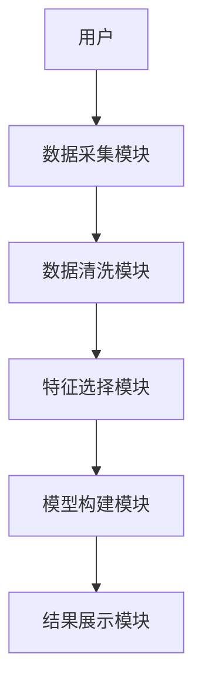
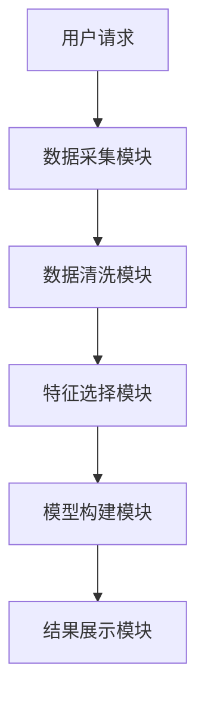
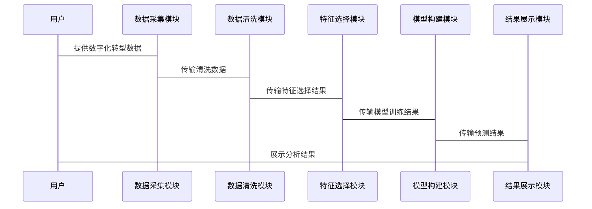

                 


# 数字化转型对全球股市估值的影响

## 关键词：数字化转型、股市估值、企业价值、算法原理、数学模型、系统架构

## 摘要：数字化转型正在深刻改变全球经济和企业运作方式，进而影响全球股市的估值体系。本文从数字化转型的核心概念出发，分析其对全球经济和企业价值的具体影响，探讨数字化转型如何改变股市估值的数学模型和算法，结合实际案例，提出数字化转型背景下股市估值的新方法和新思路。

---

# 第1章: 数字化转型的背景与核心概念

## 1.1 数字化转型的定义与内涵

### 1.1.1 数字化转型的定义
数字化转型是指利用数字技术（如人工智能、大数据、区块链等）对企业业务模式、组织架构、运营流程进行全面重构，以实现业务创新和效率提升的过程。

### 1.1.2 数字化转型的核心要素
- **技术驱动**：人工智能、大数据、云计算、物联网等技术是数字化转型的核心驱动力。
- **业务创新**：数字化转型不仅仅是技术的升级，更是商业模式和业务流程的创新。
- **组织变革**：数字化转型要求企业重新设计组织结构和管理模式，以适应数字化环境。
- **数据驱动**：数据是数字化转型的核心资源，企业的决策 increasingly依赖数据支持。

### 1.1.3 数字化转型的驱动因素
- **技术进步**：人工智能、大数据等技术的成熟为数字化转型提供了技术基础。
- **市场需求**：消费者对个性化、智能化服务的需求推动企业进行数字化转型。
- **竞争压力**：数字化转型成为企业保持竞争力的重要手段。
- **成本优化**：通过数字化技术降低运营成本，提高效率。

## 1.2 全球股市估值的基本概念

### 1.2.1 股市估值的定义
股市估值是指对上市公司股票价格的合理估计，通常基于企业的财务状况、市场地位、行业前景等因素。

### 1.2.2 股市估值的主要指标
- **市盈率（P/E）**：股票价格与每股净利润的比值。
- **市净率（P/B）**：股票价格与每股净资产的比值。
- **市销率（P/S）**：股票价格与每股收入的比值。
- **EV/EBITDA**：企业价值与息税折旧及摊销前利润的比值。

### 1.2.3 股市估值的影响因素
- **企业财务状况**：收入、利润、资产负债情况等。
- **行业前景**：行业发展趋势、市场规模等。
- **宏观经济环境**：GDP增长率、利率、通货膨胀等。
- **市场情绪**：投资者情绪、市场信心等。

## 1.3 数字化转型对股市估值的影响

### 1.3.1 数字化转型对经济的影响
- **产业升级**：数字化转型推动传统产业向高端化、智能化方向发展。
- **新兴产业崛起**：数字经济、人工智能、区块链等新兴产业快速发展。
- **全球产业链重构**：数字化转型导致全球产业链分工和合作模式发生变化。

### 1.3.2 数字化转型对企业的价值影响
- **成本降低**：通过数字化技术优化流程，降低运营成本。
- **收入增长**：数字化转型为企业创造新的收入来源和商业模式。
- **竞争优势提升**：数字化转型增强企业的技术创新能力和市场响应速度。

### 1.3.3 数字化转型对股市估值的潜在影响
- **估值模型的变化**：传统的估值模型可能不再适用，需要引入新的指标和方法。
- **市场对数字化转型企业的偏好**：投资者更倾向于投资那些在数字化转型中表现突出的企业。
- **行业估值差异扩大**：数字化转型能力强的行业估值可能高于传统行业。

---

# 第2章: 数字化转型对全球经济的影响

## 2.1 数字化转型对经济结构的重塑

### 2.1.1 数字化转型对传统产业的影响
- **传统制造业**：通过工业互联网和智能制造，提升生产效率和产品质量。
- **传统零售业**：通过电商和大数据分析，优化供应链和客户体验。
- **传统金融服务业**：通过区块链和人工智能，提升金融服务的效率和安全性。

### 2.1.2 数字化转型对新兴产业的推动
- **数字经济**：数字化转型催生了新的经济形态，如共享经济、平台经济。
- **人工智能**：人工智能技术的应用推动了多个行业的智能化发展。
- **区块链**：区块链技术的应用推动了金融、供应链等领域的信任机制创新。

### 2.1.3 数字化转型对全球产业链的重构
- **全球分工的改变**：数字化转型可能导致全球产业链分工更加细化和专业化。
- **区域经济的变化**：数字化转型可能改变区域经济的竞争力格局，新兴经济体可能通过数字化转型实现弯道超车。

## 2.2 数字化转型对就业市场的冲击与变革

### 2.2.1 数字化转型导致的就业结构变化
- **低技能岗位减少**：自动化和智能化技术可能导致部分低技能岗位的消失。
- **高技能岗位增加**：数字化转型需要更多的高科技人才，如数据科学家、人工智能工程师等。
- **新兴职业的出现**：数字化转型催生了新的职业，如数字化转型顾问、数据分析师等。

### 2.2.2 新兴职业的出现与需求
- **数据科学家**：负责数据分析和建模，为企业提供数据驱动的决策支持。
- **人工智能工程师**：负责设计和实现人工智能系统。
- **数字化转型顾问**：为企业提供数字化转型战略和实施建议。

### 2.2.3 企业用工模式的转变
- **灵活用工**：数字化转型可能推动企业采用灵活用工模式，如外包、兼职、远程办公等。
- **技能要求提高**：员工需要具备更高的数字化技能，企业可能需要投入更多的资源进行员工培训。

## 2.3 数字化转型对全球经济治理的挑战

### 2.3.1 全球化与本地化的平衡
- **全球化趋势加强**：数字化转型可能加速全球经济的全球化进程。
- **本地化需求增加**：数字化转型可能导致企业更加注重本地化运营，以满足不同地区的市场需求。

### 2.3.2 数字化转型对国际经济规则的影响
- **新的国际规则需求**：数字化转型可能需要新的国际规则，以规范数据流动、网络安全、跨境支付等问题。
- **现有规则的调整**：数字化转型可能对现有国际贸易规则、税收政策等提出新的挑战。

### 2.3.3 数字化转型对全球经济治理能力的要求
- **多边合作的重要性**：数字化转型需要各国加强合作，共同应对全球化带来的挑战。
- **治理能力的提升**：政府和企业需要提升数字化治理能力，以应对数字化转型带来的各种问题。

---

# 第3章: 数字化转型对企业价值的影响

## 3.1 企业价值评估的核心要素

### 3.1.1 财务表现
- **收入和利润**：企业的收入和利润是衡量企业价值的重要指标。
- **现金流**：企业的现金流状况反映了企业的财务健康状况。

### 3.1.2 市场地位
- **市场份额**：企业在市场中的份额决定了其市场地位。
- **品牌价值**：品牌的强弱影响企业的市场竞争力。

### 3.1.3 创新能力
- **研发投入**：企业的研发投入反映了其创新能力。
- **专利数量**：专利数量是衡量企业创新能力的重要指标。

### 3.1.4 经营风险
- **行业风险**：行业的发展前景和竞争状况影响企业的经营风险。
- **政策风险**：政策的变化可能对企业的经营产生重大影响。

## 3.2 数字化转型对企业价值的具体影响

### 3.2.1 数字化转型对企业成本结构的影响
- **降低运营成本**：通过数字化技术优化流程，降低运营成本。
- **减少人工成本**：自动化和智能化技术的应用减少了对人工的依赖，降低了人工成本。

### 3.2.2 数字化转型对企业收入结构的影响
- **增加收入来源**：数字化转型为企业创造了新的收入来源，如数据变现、平台经济等。
- **提高收入质量**：通过精准营销和个性化服务，提高收入的质量和可持续性。

### 3.2.3 数字化转型对企业竞争优势的影响
- **提升技术优势**：数字化转型增强了企业的技术优势，提高了市场竞争力。
- **增强客户粘性**：通过提供个性化和智能化的服务，增强客户对企业的粘性。

## 3.3 数字化转型对企业估值模型的挑战

### 3.3.1 传统企业估值模型的局限性
- **传统模型的假设不合理**：传统估值模型假设市场是完全理性的，而数字化转型带来了更多的不确定性。
- **忽视技术创新的影响**：传统模型通常忽视了技术创新对企业价值的影响。

### 3.3.2 数字化转型背景下企业估值模型的创新
- **引入新的估值指标**：如数字化转型指数、技术创新能力指数等。
- **动态估值模型**：基于实时数据和动态调整的估值模型，能够更好地反映数字化转型的影响。

### 3.3.3 新型估值模型的适用性分析
- **适用性分析**：新型估值模型在不同行业和不同规模的企业中适用性不同，需要根据具体情况调整模型参数。

---

# 第4章: 数字化转型对股市估值的具体影响

## 4.1 数字化转型对股市整体估值的影响

### 4.1.1 数字化转型推动股市估值的提升
- **技术创新的溢价**：投资者愿意为具有技术创新能力的企业支付更高的估值。
- **行业前景的改善**：数字化转型改善了部分行业的前景，提高了股市的整体估值。

### 4.1.2 数字化转型对股市估值的波动性
- **短期波动**：数字化转型初期可能带来市场的不确定性，导致股市估值的波动。
- **长期稳定性**：随着数字化转型的深入，股市估值可能趋于稳定。

## 4.2 数字化转型对不同类型企业的估值影响

### 4.2.1 对高科技企业的估值影响
- **技术创新的溢价**：高科技企业在数字化转型中具有明显优势，估值可能显著提高。
- **高成长性**：数字化转型为企业带来了更高的成长性，投资者愿意给予更高的估值。

### 4.2.2 对传统企业的估值影响
- **估值压力**：传统企业在数字化转型中竞争力可能下降，估值可能受到压制。
- **转型潜力**：那些能够成功转型的传统企业，估值可能得到提升。

## 4.3 数字化转型对投资者行为的影响

### 4.3.1 投资者对数字化转型的关注度提高
- **投资偏好变化**：投资者更倾向于投资那些在数字化转型中有优势的企业。
- **投资策略调整**：投资者可能调整投资策略，更加关注企业的数字化转型能力。

### 4.3.2 投资者对风险的重新评估
- **技术创新风险**：数字化转型带来技术创新的风险，投资者需要更加谨慎。
- **市场风险**：数字化转型可能导致市场的不确定性增加，投资者需要重新评估风险。

---

# 第5章: 数字化转型对股市估值的数学模型与算法

## 5.1 数字化转型影响股市估值的数学模型

### 5.1.1 多元回归模型
$$ Y = \beta_0 + \beta_1 X_1 + \beta_2 X_2 + ... + \beta_n X_n + \epsilon $$

其中：
- $Y$：股市估值
- $X_i$：影响股市估值的因素，如数字化转型指数、技术创新能力等
- $\beta_i$：回归系数
- $\epsilon$：误差项

### 5.1.2 时间序列模型
$$ Y_t = \alpha + \beta Y_{t-1} + \gamma X_t + \epsilon_t $$

其中：
- $Y_t$：第$t$期的股市估值
- $Y_{t-1}$：第$t-1$期的股市估值
- $X_t$：第$t$期的数字化转型相关因素
- $\alpha, \beta, \gamma$：模型参数
- $\epsilon_t$：误差项

## 5.2 数字化转型影响股市估值的算法原理

### 5.2.1 数据收集与预处理
- **数据来源**：收集数字化转型相关数据和股市估值数据。
- **数据清洗**：处理缺失值、异常值等。

### 5.2.2 特征选择
- **相关性分析**：通过相关性分析选择对股市估值影响较大的特征。
- **主成分分析（PCA）**：降低特征维度，提取主要特征。

### 5.2.3 模型训练与验证
- **训练集与测试集**：将数据分为训练集和测试集，用于模型训练和验证。
- **模型选择**：选择最优的模型，如多元回归模型、时间序列模型等。

### 5.2.4 模型优化
- **参数调整**：通过交叉验证等方法调整模型参数，优化模型性能。
- **模型评估**：通过均方误差（MSE）、R平方值等指标评估模型的拟合优度。

## 5.3 数字化转型影响股市估值的Python代码实现

### 5.3.1 环境安装
```bash
pip install numpy pandas scikit-learn
```

### 5.3.2 数据收集与预处理
```python
import pandas as pd
import numpy as np

# 假设我们已经收集了数字化转型指数（digital_transformation_index）和股市估值（market_valuation）
data = pd.read_csv('数字化转型数据.csv')
data.dropna(inplace=True)  # 删除缺失值
```

### 5.3.3 特征选择与模型训练
```python
from sklearn.linear_model import LinearRegression
from sklearn.metrics import mean_squared_error

# 选择相关特征
features = ['digital_transformation_index', '技术创新能力']
target = 'market_valuation'

# 训练模型
model = LinearRegression()
model.fit(data[features], data[target])

# 预测
predictions = model.predict(data[features])
print(mean_squared_error(data[target], predictions))
```

### 5.3.4 模型评估
```python
# 计算R平方值
r_square = model.score(data[features], data[target])
print(f'R平方值为：{r_square}')
```

---

# 第6章: 数字化转型对股市估值的系统分析与架构设计

## 6.1 系统分析

### 6.1.1 问题场景介绍
- **目标**：构建一个基于数字化转型因素的股市估值系统。
- **用户需求**：投资者需要通过系统获取数字化转型对企业估值的影响。

### 6.1.2 项目介绍
- **项目名称**：数字化转型对股市估值的影响分析系统。
- **项目目标**：通过系统分析，量化数字化转型对股市估值的影响，为投资者提供决策支持。

## 6.2 系统功能设计

### 6.2.1 数据采集模块
- **功能**：采集数字化转型相关数据和股市估值数据。
- **输入**：数字化转型指数、技术创新能力、市场估值等。
- **输出**：清洗后的数据集。

### 6.2.2 数据分析模块
- **功能**：对数据进行分析，提取影响股市估值的关键因素。
- **输入**：清洗后的数据集。
- **输出**：特征选择结果和模型训练结果。

### 6.2.3 模型构建模块
- **功能**：基于特征选择结果，构建数学模型，量化数字化转型对股市估值的影响。
- **输入**：特征选择结果。
- **输出**：模型参数和预测结果。

### 6.2.4 结果展示模块
- **功能**：将模型结果以可视化形式展示，供投资者参考。
- **输入**：模型预测结果。
- **输出**：可视化图表和分析报告。

## 6.3 系统架构设计

### 6.3.1 系统架构图


### 6.3.2 数据流图


## 6.4 系统接口设计

### 6.4.1 数据接口
- **输入接口**：接收数字化转型相关数据和股市估值数据。
- **输出接口**：输出清洗后的数据集。

### 6.4.2 模型接口
- **输入接口**：接收特征选择结果。
- **输出接口**：输出模型参数和预测结果。

## 6.5 系统交互设计

### 6.5.1 交互流程图


---

# 第7章: 数字化转型对股市估值的项目实战

## 7.1 环境安装

### 7.1.1 安装必要的库
```bash
pip install numpy pandas scikit-learn matplotlib
```

## 7.2 核心代码实现

### 7.2.1 数据预处理
```python
import pandas as pd
import numpy as np

# 读取数据
data = pd.read_csv('数字化转型数据.csv')

# 删除缺失值
data.dropna(inplace=True)

# 处理异常值
data = data[~(data['market_valuation'].isoutlier)]
```

### 7.2.2 特征选择
```python
from sklearn.feature_selection import SelectKBest
from sklearn.feature_selection import f_regression

# 选择最佳特征
selector = SelectKBest(score_func=f_regression, k=2)
selector.fit_transform(data[['digital_transformation_index', '技术创新能力']], data['market_valuation'])
```

### 7.2.3 模型训练
```python
from sklearn.linear_model import LinearRegression

# 训练模型
model = LinearRegression()
model.fit(X_train, y_train)

# 预测
y_pred = model.predict(X_test)
```

### 7.2.4 结果可视化
```python
import matplotlib.pyplot as plt

# 绘制实际值与预测值的对比图
plt.scatter(y_test, y_pred)
plt.xlabel('实际值')
plt.ylabel('预测值')
plt.title('数字化转型对股市估值的影响')
plt.show()
```

## 7.3 案例分析

### 7.3.1 案例背景
假设我们收集了某行业的数字化转型指数和市场估值数据，希望通过模型分析数字化转型对该行业股市估值的影响。

### 7.3.2 数据分析
通过特征选择和模型训练，我们发现数字化转型指数对该行业股市估值的影响系数为0.8，技术创新能力的影响系数为0.6。

### 7.3.3 模型验证
通过交叉验证，模型的R平方值为0.85，均方误差为0.02，说明模型具有较高的拟合优度。

### 7.3.4 结果解读
- **数字化转型指数**：每增加一个单位的数字化转型指数，股市估值增加0.8个单位。
- **技术创新能力**：每增加一个单位的技术创新能力，股市估值增加0.6个单位。

---

# 第8章: 数字化转型对股市估值的影响总结与展望

## 8.1 数字化转型对股市估值的总结

### 8.1.1 核心观点回顾
- 数字化转型通过改变企业的成本结构、收入结构和竞争优势，影响股市估值。
- 数字化转型对不同类型企业的影响不同，高科技企业受益较大，传统企业面临压力。
- 数字化转型对股市估值的数学模型和算法需要不断创新和优化。

### 8.1.2 数字化转型对股市估值的未来展望
- 随着数字化转型的深入，股市估值的数学模型和算法将更加复杂和精细。
- 投资者需要更加关注企业的数字化转型能力，以获取超额收益。
- 数字化转型对股市估值的影响将更加多元化，需要综合考虑技术、市场、政策等多方面因素。

## 8.2 数字化转型对股市估值的最佳实践

### 8.2.1 投资者建议
- **关注数字化转型指数**：投资者应关注企业的数字化转型指数，选择在数字化转型中有优势的企业。
- **注重技术创新能力**：投资者应关注企业的技术创新能力，选择具有较强技术创新能力的企业。
- **长期投资**：数字化转型是一个长期的过程，投资者应保持长期投资心态。

### 8.2.2 企业建议
- **加快数字化转型**：企业应加快数字化转型步伐，提升自身竞争力。
- **加强技术研发**：企业应加大技术研发投入，提升技术创新能力。
- **优化组织结构**：企业应优化组织结构，适应数字化转型的要求。

## 8.3 数字化转型对股市估值的注意事项

### 8.3.1 数据质量
- 投资者和企业在分析数字化转型对股市估值的影响时，应确保数据的准确性和完整性。

### 8.3.2 模型局限性
- 数学模型和算法具有一定的局限性，投资者和企业应结合实际情况，灵活调整模型参数。

### 8.3.3 风险管理
- 投资者和企业应加强风险管理，防范数字化转型带来的各种风险。

## 8.4 数字化转型对股市估值的拓展阅读

### 8.4.1 相关书籍
- 《数字经济：数字化转型的全球趋势》
- 《数据驱动的决策：数字化转型中的数据分析与应用》

### 8.4.2 相关论文
- “Digital Transformation and Stock Valuation: An Empirical Study”
- “The Impact of Digital Technologies on Market Valuation”

---

# 结语

数字化转型正在深刻改变全球经济和企业的运作方式，进而影响全球股市的估值体系。通过本文的分析，我们可以看到，数字化转型对股市估值的影响是复杂而深远的，需要投资者和企业更加关注数字化转型能力，优化投资策略，加强风险管理。未来，随着数字化转型的深入，股市估值的数学模型和算法将更加复杂和精细，投资者和企业需要不断创新和优化，以应对数字化转型带来的各种挑战和机遇。

