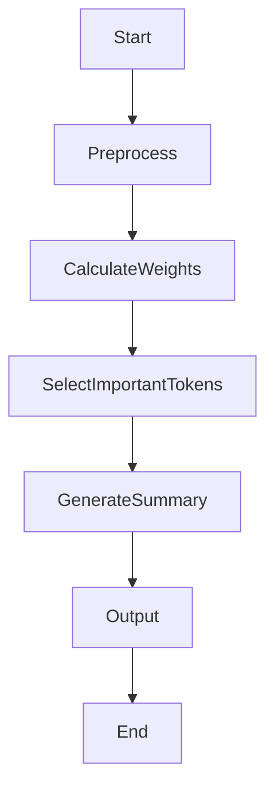
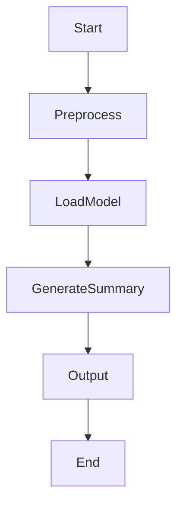

                 


# 文本摘要：让AI Agent提炼关键信息

> 关键词：文本摘要、AI Agent、信息提取、算法原理、系统架构

> 摘要：文本摘要作为自然语言处理中的重要技术，通过AI Agent提炼关键信息，帮助用户快速获取内容核心。本文系统阐述文本摘要的核心概念、算法原理、系统架构，并通过实战项目展示如何实现高效的文本摘要系统。

---

## 第一部分：文本摘要背景与基础

### 第1章：文本摘要概述

#### 1.1 文本摘要的定义与背景
- **1.1.1 什么是文本摘要**
  文本摘要是指从一段或多段文本中提炼出核心信息，生成一个简洁、准确的摘要。它是自然语言处理（NLP）领域的重要任务，广泛应用于新闻阅读、学术研究、信息检索等领域。

- **1.1.2 文本摘要的应用场景**
  - 新闻标题生成：从长篇新闻中提取关键信息，生成简洁的标题。
  - 学术论文摘要：帮助研究人员快速了解论文的核心内容。
  - 信息检索：通过摘要快速筛选相关文献。
  - 智能客服：自动提取用户问题的核心信息，生成响应。

- **1.1.3 AI Agent在文本摘要中的作用**
  AI Agent通过自然语言处理技术，自动提取文本中的关键信息，生成摘要，从而提高信息处理效率。

#### 1.2 文本摘要的技术演变
- **1.2.1 传统文本摘要方法**
  - 基于规则的提取：通过预定义的规则或关键词提取摘要。
  - 基于统计的提取：利用词频、句法结构等统计特征生成摘要。
  - 缺点：依赖人工规则，难以处理复杂语义。

- **1.2.2 基于AI的文本摘要发展**
  - 基于深度学习的生成式模型：如Transformer、BERT等模型，生成更自然流畅的摘要。
  - 大语言模型的应用：利用GPT系列模型生成高质量摘要。
  - 优势：能够理解上下文，生成更符合语义的摘要。

- **1.2.3 当前主流技术与趋势**
  - 多模态摘要：结合文本、图像等多模态信息生成摘要。
  - 可解释性摘要：生成可追溯的摘要，便于用户理解。
  - 实时摘要：在流式数据中实时生成摘要，应用于实时新闻、社交媒体监控等领域。

#### 1.3 文本摘要的核心问题
- **1.3.1 关键信息提取的挑战**
  - 信息冗余：如何识别冗余信息，提取核心内容。
  - 语义理解：如何准确理解文本的语义，避免信息损失。
  - 上下文依赖：如何处理上下文相关的信息。

- **1.3.2 文本摘要的边界与外延**
  - 简洁性：摘要应简明扼要，避免冗长。
  - 准确性：摘要应准确反映原文内容，避免误解。
  - 可读性：摘要应流畅自然，便于阅读理解。

- **1.3.3 核心要素与组成结构**
  - 输入文本：包括文本内容、文本长度、文本类型等。
  - 提取策略：基于规则、统计或深度学习的方法。
  - 摘要生成：生成摘要的格式、长度、语种等。

---

## 第二部分：文本摘要的核心概念与联系

### 第2章：文本摘要的核心概念

#### 2.1 输入与输出
- **2.1.1 输入文本的类型与特点**
  - 单文本：单段落或单篇文本的摘要。
  - 多文本：多篇文本的联合摘要。
  - 长文本：长篇文本的摘要，如书籍、报告等。

- **2.1.2 输出摘要的格式与要求**
  - 文本摘要：生成的文本内容。
  - 标题：生成的标题或主题。
  - 其他形式：如标签、关键词等。

- **2.1.3 输入输出关系的实体关系图（ER图）**
  下图展示了输入文本与输出摘要的关系：

  ```mermaid
  graph TD
    InputText --> Abstract
    InputText --> Title
    Abstract --> Output
    Title --> Output
  ```

  其中，`InputText`表示输入文本，`Abstract`表示摘要，`Title`表示标题，`Output`表示输出结果。

#### 2.2 算法与模型
- **2.2.1 基于提取的文本摘要算法**
  - 提取式摘要：从原文中选择重要句子或词语，直接生成摘要。
  - 基于TF-IDF：计算关键词权重，选择重要词语生成摘要。

- **2.2.2 基于生成的文本摘要模型**
  - 生成式摘要：利用语言模型生成新的文本，表达原文的核心内容。
  - 基于Transformer的模型：如BERT、GPT等，生成高质量的摘要。

- **2.2.3 算法与模型的对比分析**
  下表对比了基于提取和生成的文本摘要算法：

  | 对比维度 | 提取式摘要 | 生成式摘要 |
  |----------|------------|------------|
  | 实现难度 | 较低       | 较高       |
  | 摘要质量 | 简洁准确   | 更符合语义 |
  | 适用场景 | 短文本摘要 | 长文本摘要 |

  生成式摘要在质量上更优，但实现难度较大，适合处理复杂语义的长文本。

#### 2.3 评估与优化
- **2.3.1 文本摘要的评估指标**
  - 基准指标：
    - Recall：摘要内容是否覆盖原文主要信息。
    - Precision：摘要内容是否准确无误。
    - BLEU：基于n-gram的相似度评估。
    - ROUGE：基于ROUGE的召回率评估。

  - 综合指标：
    - F1分数：平衡Precision和Recall。
    - Meteor：综合语义相似度和词汇匹配。

- **2.3.2 不同算法的性能对比**
  下图展示了不同算法在摘要任务中的性能对比：

  ```mermaid
  graph TD
    Algorithm1 --> Recall: 0.8
    Algorithm1 --> Precision: 0.75
    Algorithm2 --> Recall: 0.9
    Algorithm2 --> Precision: 0.85
  ```

  其中，Algorithm1为提取式摘要，Algorithm2为生成式摘要。

- **2.3.3 优化策略与实现路径**
  - 数据增强：通过数据清洗、数据扩充提高模型性能。
  - 模型调优：优化模型超参数，提升摘要质量。
  - 多任务学习：结合其他任务（如翻译、问答）提升摘要能力。

---

## 第三部分：文本摘要的算法原理

### 第3章：基于提取的文本摘要算法

#### 3.1 算法原理
- **3.1.1 算法的基本原理**
  提取式摘要通过计算文本中关键词的权重，选择重要句子或词语生成摘要。
  - TF-IDF：计算词频-逆文档频率，选择高权重的词语。
  - TextRank：基于图的算法，通过句子之间的相似度计算重要句子。

- **3.1.2 算法的数学模型**
  - TF-IDF公式：
    $$ TF-IDF(t) = \frac{\text{词}t\text{在文档中的频率}}{\log(1 + \text{文档数中包含}t\text{的文档数})} $$
  - TextRank公式：
    $$ \text{score}(s_i) = \sum_{s_j} \frac{\text{similarity}(s_i, s_j)}{\sum \text{similarity}(s_j, s_k)} $$

- **3.1.3 算法的实现步骤**
  1. 预处理文本，分词、去除停用词。
  2. 计算关键词或句子的权重。
  3. 根据权重选择重要句子或词语，生成摘要。

#### 3.2 算法流程图
下图展示了基于提取的文本摘要算法的流程：



#### 3.3 代码实现
- **环境安装与配置**
  ```bash
  pip install numpy jieba
  ```

- **核心代码实现**
  ```python
  import jieba
  import numpy as np

  def preprocess(text):
      # 分词
      words = jieba.lcut(text)
      return words

  def calculate_weights(words, doc_count):
      # 计算TF-IDF权重
      tfidf = {}
      for word in words:
          tfidf[word] = tfidf.get(word, 0) + 1
      for word in tfidf:
          tfidf[word] /= len(words)
          tfidf[word] *= np.log(doc_count + 1) - np.log(tfidf[word] + 1)
      return tfidf

  def select_important_tokens(tfidf, threshold=0.2):
      # 根据权重选择重要词语
      important_words = [word for word, weight in tfidf.items() if weight > threshold]
      return important_words

  def generate_summary(text, doc_count):
      words = preprocess(text)
      tfidf = calculate_weights(words, doc_count)
      important_words = select_important_tokens(tfidf)
      summary = ' '.join(important_words)
      return summary

  text = "这是一段示例文本，用于演示提取式摘要算法。"
  doc_count = 10
  print(generate_summary(text, doc_count))
  ```

- **代码解读与优化建议**
  - 代码实现了一个简单的提取式摘要算法，基于TF-IDF计算关键词权重。
  - 可以通过调整阈值`threshold`来控制摘要长度。
  - 优化建议：结合TextRank算法，提升句子级别的摘要效果。

### 第4章：基于生成的文本摘要模型

#### 4.1 模型原理
- **4.1.1 模型的基本原理**
  生成式摘要利用语言模型生成新的文本，表达原文的核心内容。
  - Transformer模型：编码器-解码器结构，生成流畅的摘要。
  - BERT模型：基于预训练语言模型，生成高质量摘要。

- **4.1.2 模型的数学模型**
  - Transformer解码器公式：
    $$ \text{Decoder}(x) = \text{Self-attention}(x) + \text{Cross-attention}(x, \text{Encoder}(x)) $$

  - BERT模型：
    $$ \text{BERT}(x) = \text{Multi-head Attention}(x) + \text{Positional Wises}(x) $$

- **4.1.3 模型的实现步骤**
  1. 预处理文本，生成输入格式。
  2. 加载预训练模型，进行微调。
  3. 生成摘要，输出结果。

#### 4.2 模型流程图
下图展示了基于生成的文本摘要模型的流程：



#### 4.3 代码实现
- **环境安装与配置**
  ```bash
  pip install transformers
  ```

- **核心代码实现**
  ```python
  from transformers import BartTokenizer, BartForConditionalGeneration

  def generate_summary_with_bart(text):
      model_name = "facebook/bart-large-cnn"
      tokenizer = BartTokenizer.from_pretrained(model_name)
      model = BartForConditionalGeneration.from_pretrained(model_name)

      inputs = tokenizer([text], max_length=1024, truncation=True, return_tensors='pt')
      outputs = model.generate(inputs.input_ids, length_penalty=2.0)
      summary = tokenizer.decode(outputs[0], skip_special_tokens=True)
      return summary

  text = "这是一段示例文本，用于演示生成式摘要算法。"
  print(generate_summary_with_bart(text))
  ```

- **代码解读与优化建议**
  - 代码实现了基于BART模型的生成式摘要。
  - 可以通过调整`length_penalty`参数控制生成摘要的长度。
  - 优化建议：结合其他语言模型（如GPT）提升摘要质量。

---

## 第四部分：文本摘要的系统分析与架构设计

### 第4章：系统分析与架构设计

#### 4.1 问题场景介绍
- **系统目标**：构建一个高效的文本摘要系统，支持多种输入格式，生成高质量的摘要。
- **用户角色**：系统管理员、普通用户、开发者。
- **关键业务流程**：文本输入、摘要生成、结果输出。

#### 4.2 项目介绍
- **项目名称**：智能文本摘要系统。
- **项目目标**：实现高效的文本摘要功能，支持多种语言和格式。
- **项目范围**：支持单文本和多文本摘要，提供API接口。

#### 4.3 系统功能设计
- **领域模型（类图）**
  下图展示了系统的领域模型：

  ```mermaid
  classDiagram
      class TextInput {
          content : String
          length : Int
      }
      class AbstractGenerator {
          generate_summary(textInput) : String
      }
      class SummaryOutput {
          content : String
          title : String
      }
      TextInput --> AbstractGenerator
      AbstractGenerator --> SummaryOutput
  ```

- **系统架构设计**
  下图展示了系统的架构设计：

  ```mermaid
  architecture
      Client
      Service Layer
      Database
      API Gateway
  ```

- **系统接口设计**
  - 输入接口：接收文本内容和参数。
  - 输出接口：返回摘要内容和标题。
  - API接口：提供RESTful API，供外部调用。

- **系统交互流程图**
  下图展示了系统的交互流程：

  ```mermaid
  sequenceDiagram
      User --> API Gateway: 提交文本内容
      API Gateway --> Service Layer: 请求处理
      Service Layer --> Database: 获取预训练模型
      Service Layer --> AbstractGenerator: 生成摘要
      AbstractGenerator --> Database: 保存摘要结果
      Service Layer --> User: 返回摘要内容
  ```

---

## 第五部分：项目实战

### 第5章：项目实战

#### 5.1 环境安装与配置
- **安装依赖**
  ```bash
  pip install transformers numpy jieba
  ```

- **创建项目结构**
  ```
  text_summarization/
      src/
          __init__.py
          preprocess.py
          model.py
          app.py
      requirements.txt
  ```

#### 5.2 系统核心实现源代码

##### 5.2.1 preprocess.py
```python
import jieba

def preprocess(text):
    words = jieba.lcut(text)
    return words
```

##### 5.2.2 model.py
```python
from transformers import BartTokenizer, BartForConditionalGeneration

class TextSummarizer:
    def __init__(self):
        self.tokenizer = BartTokenizer.from_pretrained("facebook/bart-large-cnn")
        self.model = BartForConditionalGeneration.from_pretrained("facebook/bart-large-cnn")

    def summarize(self, text):
        inputs = self.tokenizer([text], max_length=1024, truncation=True, return_tensors='pt')
        outputs = self.model.generate(inputs.input_ids, length_penalty=2.0)
        summary = self.tokenizer.decode(outputs[0], skip_special_tokens=True)
        return summary
```

##### 5.2.3 app.py
```python
from flask import Flask, request, jsonify
from preprocess import preprocess
from model import TextSummarizer

app = Flask(__name__)
summarizer = TextSummarizer()

@app.route('/summarize', methods=['POST'])
def summarize():
    data = request.json
    text = data['text']
    summary = summarizer.summarize(text)
    return jsonify({'summary': summary})

if __name__ == '__main__':
    app.run(debug=True)
```

#### 5.3 代码应用解读与分析
- **preprocess.py**：实现文本预处理功能，包括分词、去除停用词等。
- **model.py**：实现文本摘要模型，基于BART模型生成摘要。
- **app.py**：构建RESTful API，接收文本请求，返回摘要结果。

#### 5.4 实际案例分析和详细讲解剖析
- **案例1**：新闻标题生成
  - 输入文本：一篇长篇新闻报道。
  - 摘要结果：生成简洁的新闻标题。

- **案例2**：学术论文摘要
  - 输入文本：一篇学术论文。
  - 摘要结果：生成论文摘要，供研究人员快速阅读。

#### 5.5 项目小结
- **项目总结**：通过实战项目，展示了文本摘要系统的设计与实现。
- **代码解读**：详细解读了系统核心代码，包括预处理、模型训练和API实现。
- **案例分析**：通过具体案例，展示了系统的实际应用场景。

---

## 第六部分：总结与展望

### 第6章：总结与展望

#### 6.1 最佳实践 tips
- **选择合适的算法**：根据具体场景选择提取式或生成式摘要算法。
- **优化模型性能**：通过数据增强、模型调优提升摘要质量。
- **结合领域知识**：在特定领域中，结合领域知识提升摘要准确性。

#### 6.2 小结
- 本文系统介绍了文本摘要的核心概念、算法原理和系统架构。
- 通过实战项目展示了如何实现高效的文本摘要系统。
- 总结了文本摘要的关键技术和实际应用中的注意事项。

#### 6.3 注意事项
- **数据隐私**：处理敏感数据时，需注意数据隐私和安全。
- **模型调优**：根据具体需求，调整模型参数，优化摘要效果。
- **多语言支持**：扩展系统支持多语言摘要，提升适用性。

#### 6.4 拓展阅读
- **相关书籍**：《自然语言处理入门》、《深度学习实战》。
- **技术文档**：Hugging Face的Transformers库文档。
- **学术论文**：阅读相关领域的最新论文，了解前沿技术。

---

通过以上思考和分析，我们可以看到，文本摘要技术在AI Agent中的应用具有广阔前景。未来，随着深度学习技术的发展，文本摘要系统将更加智能化、个性化，为用户提供更高效的信息处理体验。

