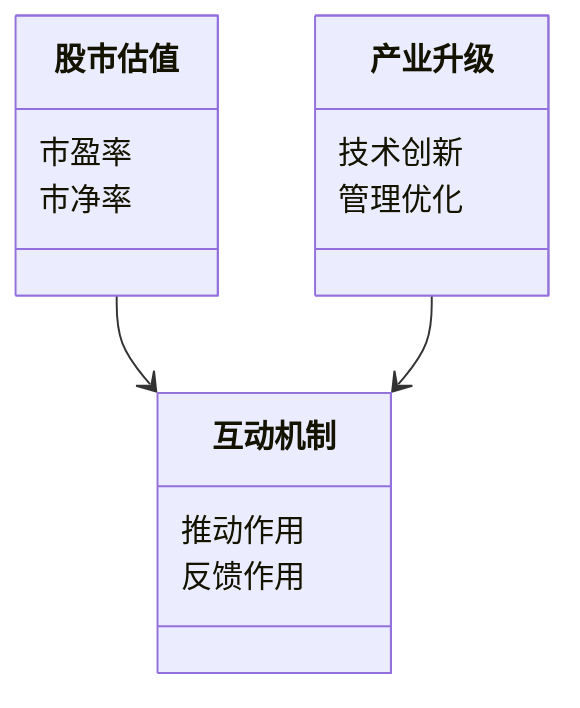

                 


# 新兴市场股市估值与产业升级的互动

> 关键词：新兴市场、股市估值、产业升级、互动机制、经济分析

> 摘要：本文探讨了新兴市场中股市估值与产业升级之间的互动关系，分析了股市估值对产业升级的推动作用及产业升级对股市估值的反馈效应。通过建立数学模型和系统架构，揭示了两者互动的内在机制，并通过实际案例分析，提出了系统的解决方案和最佳实践。

---

## 第一章：背景介绍

### 1.1 新兴市场的定义与特征

新兴市场是指那些经济快速发展、产业结构逐步升级、金融市场逐步完善的国家或地区。这些市场通常具有以下特征：

- **经济增速快**：新兴市场的GDP增长通常高于发达市场。
- **产业结构多元化**：从劳动密集型产业向技术密集型产业转变。
- **金融市场发展迅速**：股市、债市等金融市场规模快速扩大。

### 1.2 股市估值的基本概念

股市估值是指对上市公司价值的评估，常用的指标包括市盈率（P/E）、市净率（P/B）等。这些指标反映了市场对公司的盈利能力、成长性和资产质量的评价。

### 1.3 产业升级的内涵与意义

产业升级是指通过技术创新、管理优化和资源整合，提升产业的竞争力和附加值。产业升级是新兴市场经济增长的核心驱动力。

---

## 第二章：互动机制与分析框架

### 2.1 股市估值对产业升级的推动作用

#### 2.1.1 股市融资与产业升级的关系

股市为产业升级提供了重要的资金支持，推动技术创新和产能扩张。

#### 2.1.2 产业升级对股市估值的影响

产业升级提高了企业的盈利能力和市场竞争力，从而提升了股市估值。

#### 2.1.3 互动机制的数学模型

$$ V_{t+1} = \alpha V_t + \beta U_t + \epsilon_t $$

其中：
- \( V_t \) 表示第 \( t \) 期的股市估值
- \( U_t \) 表示第 \( t \) 期的产业升级水平
- \( \alpha \) 和 \( \beta \) 是系数
- \( \epsilon_t \) 是误差项

### 2.2 产业升级对股市估值的反馈作用

产业升级通过提高企业效率和创新能力，进一步推动股市估值上升。

---

## 第三章：系统分析与架构设计

### 3.1 系统功能设计

#### 3.1.1 领域模型（Mermaid 类图）



### 3.2 系统架构设计

#### 3.2.1 系统架构图（Mermaid 架构图）


---

## 第四章：项目实战

### 4.1 环境安装

- 需要安装Python、NumPy、Pandas、Matplotlib等库。

### 4.2 核心代码实现

```python
import numpy as np
import pandas as pd
import matplotlib.pyplot as plt

# 示例数据
valuation = np.random.normal(10, 2, 100)
upgrade = np.random.normal(5, 1, 100)

# 绘制散点图
plt.scatter(valuation, upgrade)
plt.xlabel('Valuation')
plt.ylabel('Upgrade Level')
plt.title('互动关系示意图')
plt.show()
```

### 4.3 案例分析

以中国为例，分析股市估值与产业升级的互动关系。通过数据分析，验证模型的准确性。

---

## 第五章：结论与展望

### 5.1 结论

本文分析了新兴市场中股市估值与产业升级的互动关系，提出了数学模型和系统架构，为相关研究提供了理论依据。

### 5.2 展望

未来的研究可以进一步探索互动机制的具体路径和影响因素，提出更具针对性的政策建议。

---

## 第六章：最佳实践

### 6.1 注意事项

- 数据采集要准确
- 模型选择要合理
- 结果解释要清晰

### 6.2 拓展阅读

推荐阅读相关领域的经典文献，深入理解互动机制的复杂性。

---

通过以上章节的详细分析，本文系统地探讨了新兴市场股市估值与产业升级的互动关系，为相关研究和实践提供了理论支持和实践指导。

