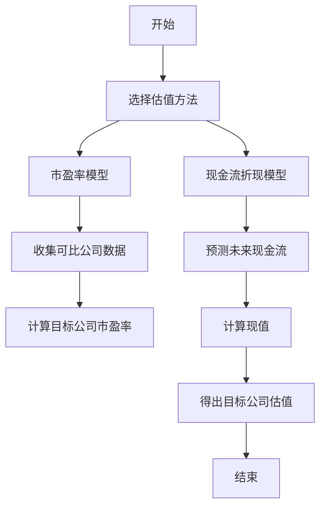
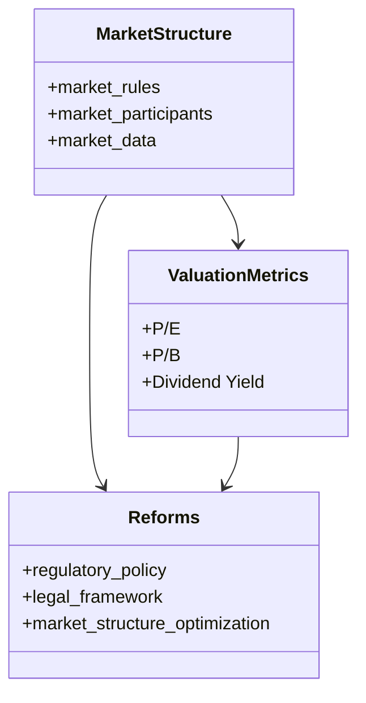
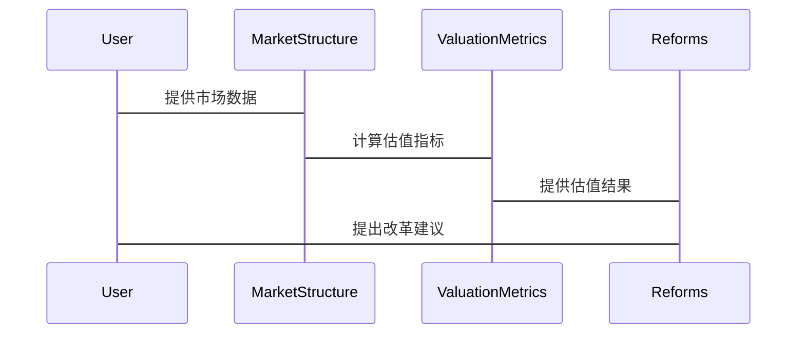

                 


# 新兴市场股市估值与制度改革的互动

## 关键词：
新兴市场、股市估值、制度改革、市盈率、市净率、互动机制

## 摘要：
本文探讨了新兴市场股市估值与制度改革之间的互动关系。通过分析股市估值的核心指标和制度改革的关键因素，揭示了制度改革如何影响股市估值，以及股市估值如何反馈推动制度改革。文章结合实际案例，详细阐述了互动机制，并提出了优化建议，为投资者和政策制定者提供了有价值的参考。

---

# 第1章: 新兴市场的定义与特点

## 1.1 新兴市场的定义
### 1.1.1 新兴市场的概念
新兴市场是指那些经济增长迅速、但尚未完全工业化或资本化的国家或地区。这些市场通常位于发展中国家，具有较高的增长潜力，但同时也面临诸多挑战，如基础设施不完善、法律法规不健全等。

### 1.1.2 新兴市场的基本特征
- **经济快速增长**：新兴市场通常具有较高的GDP增长率。
- **人口年轻化**：新兴市场国家的年轻人比例较高，劳动力资源丰富。
- **产业结构转型**：从劳动密集型产业向高附加值产业转型。
- **金融市场不完善**：与发达市场相比，新兴市场的金融体系较为薄弱，监管机制有待完善。

### 1.1.3 新兴市场与发达市场的区别
| **特征**       | **新兴市场**               | **发达市场**               |
|----------------|---------------------------|---------------------------|
| 经济增长率     | 较高                      | 较低或稳定                |
| 人均收入       | 中等或较低                | 高                        |
| 金融市场成熟度 | 不完善                   | 成熟且规范                |
| 投资风险       | 较高                      | 较低                      |

---

## 1.2 股市估值的基本概念
### 1.2.1 股市估值的定义
股市估值是指通过对市场整体或个股的分析，评估其内在价值或市场表现的过程。它是投资者进行投资决策的重要依据。

### 1.2.2 股市估值的主要方法
1. **相对估值法**：通过比较同类股票的估值指标，如市盈率（P/E）和市净率（P/B）。
2. **绝对估值法**：基于现金流折现模型（DCF）等方法，评估股票的内在价值。
3. **技术分析法**：通过分析价格走势和成交量变化，预测市场趋势。

### 1.2.3 股市估值的指标体系
- **市盈率（P/E）**：市价除以每股收益，反映了市场对每股收益的估值。
- **市净率（P/B）**：市价除以每股净资产，适用于评估资产密集型行业的公司。
- **股息率（Dividend Yield）**：股息与股价的比率，反映了投资回报率。

---

## 1.3 制度改革的定义与目标
### 1.3.1 制度改革的定义
制度改是指对市场规则、监管框架、法律法规等进行调整和优化，以提升市场效率、保护投资者利益、促进市场健康发展。

### 1.3.2 制度改革的主要目标
- **提高市场透明度**：通过加强信息披露，减少信息不对称。
- **保护投资者权益**：通过完善监管机制，防止市场操纵和欺诈行为。
- **促进市场流动性**：通过优化交易机制，提升市场活跃度。

### 1.3.3 制度改革对股市的影响
制度改革直接影响股市的运行效率和投资者信心，进而影响股市估值。例如，加强监管可以提升市场信任，吸引更多资金流入，推高股市估值。

---

## 1.4 本章小结
本章介绍了新兴市场的定义与特点，阐述了股市估值的基本概念和主要方法，分析了制度改革的定义与目标，并探讨了制度改革对股市估值的影响。这些内容为后续章节的深入分析奠定了基础。

---

# 第2章: 股市估值与制度改革的相互作用

## 2.1 股市估值的核心要素
### 2.1.1 市盈率（P/E）
市盈率是衡量股票估值的重要指标，计算公式为：
$$ P/E = \frac{\text{股价}}{\text{每股收益}} $$

例如，假设某股票价格为$50，每股收益为$5，则市盈率为$50/$5=10。

### 2.1.2 市净率（P/B）
市净率是另一种常用的估值指标，计算公式为：
$$ P/B = \frac{\text{股价}}{\text{每股净资产}} $$

例如，假设某股票价格为$40，每股净资产为$20，则市净率为$40/$20=2。

### 2.1.3 股息率（Dividend Yield）
股息率计算公式为：
$$ \text{股息率} = \frac{\text{每股股息}}{\text{股价}} \times 100\% $$

例如，某股票股息为$2，股价为$50，则股息率为$2/$50×100%=4%。

---

## 2.2 制度改革对股市估值的影响
### 2.2.1 制度改革如何影响市场流动性
制度改革可以通过以下方式提升市场流动性：
1. **优化交易机制**：如引入电子交易平台，提高交易效率。
2. **降低交易成本**：通过减少佣金和印花税，吸引更多的投资者。

### 2.2.2 制度改革如何影响市场参与度
制度改革可以通过以下方式提高市场参与度：
1. **加强投资者保护**：通过完善退市制度和投资者补偿机制，增强投资者信心。
2. **吸引外资流入**：通过开放市场和QFII制度，引入外资。

### 2.2.3 制度改革如何影响市场信心
制度改革通过提升市场透明度和公正性，增强投资者对市场的信任，从而提升市场信心。

---

## 2.3 股市估值与制度改革的互动机制
### 2.3.1 制度改革如何通过影响市场结构改变估值
1. **优化市场结构**：通过改革交易机制和市场准入规则，提升市场效率。
2. **提升市场透明度**：通过加强信息披露，降低信息不对称，影响市场估值。

### 2.3.2 股市估值如何反馈到制度改革
1. **估值过高的警示**：如果股市估值过高，可能表明市场存在泡沫，需要通过制度改革来降温。
2. **估值过低的信号**：如果股市估值过低，可能表明市场存在流动性不足或信心不足的问题，需要通过制度改革来改善。

---

## 2.4 核心概念对比表
| **核心概念** | **定义** | **影响因素** | **相互关系** |
|--------------|----------|--------------|--------------|
| 股市估值     | 通过指标评估股市价值 | 利率、企业盈利、市场情绪 | 制度改革影响估值指标，估值结果反馈影响改革方向 |
| 制度改革     | 改进市场规则与监管 | 法律、监管框架、政策 | 改革影响估值，估值结果推动进一步改革 |

---

## 2.5 ER实体关系图
```mermaid
erd
  market_structure [市场结构] 
    - market_rules [市场规则]
    - market_participants [市场参与者]
    - market_data [市场数据]
  valuation_metrics [估值指标]
    -市盈率
    -市净率
    -股息率
  reforms [制度改革]
    -监管政策
    -法律框架
    -市场结构优化
  interaction [互动]
    -制度改通过影响市场结构改变估值指标
    -估值结果通过反馈影响制度改革方向
```

---

## 2.6 本章小结
本章分析了股市估值与制度改革的核心概念，探讨了它们之间的相互作用机制，并通过对比表和ER图直观展示了两者的互动关系。这些分析为后续章节的深入探讨奠定了基础。

---

# 第3章: 股市估值与制度改革的算法原理

## 3.1 常用估值算法
### 3.1.1 市盈率模型
市盈率模型通过比较目标公司与可比公司的市盈率，评估目标公司的合理估值。

### 3.1.2 现金流折现模型（DCF）
DCF模型通过预测未来现金流，计算其现值，评估公司价值。

---

## 3.2 制度改革对估值算法的影响
### 3.2.1 制度改革如何影响市盈率计算
制度改革通过影响企业的盈利能力和市场风险，间接影响市盈率的计算。

### 3.2.2 制度改革如何影响DCF模型
制度改革可能影响企业的融资成本和经营环境，从而影响现金流预测。

---

## 3.3 算法流程图


---

## 3.4 本章小结
本章详细介绍了常用的估值算法，并分析了制度改革对这些算法的影响。通过流程图展示了估值过程，帮助读者更好地理解算法的实施步骤。

---

# 第4章: 股市估值与制度改革的系统分析

## 4.1 系统功能设计
### 4.1.1 领域模型


### 4.1.2 系统架构设计


---

## 4.2 系统接口设计
### 4.2.1 输入接口
- 市场数据接口：提供历史价格、成交量等数据。
- 可比公司数据接口：提供用于市盈率模型的可比公司数据。

### 4.2.2 输出接口
- 估值结果接口：输出目标公司的估值结果。
- 制度改革建议接口：输出基于估值结果的改革建议。

---

## 4.3 系统交互设计


---

## 4.4 本章小结
本章通过系统功能设计、架构设计和交互设计，全面分析了股市估值与制度改革的互动关系。通过类图和序列图直观展示了系统各部分之间的关系，为后续的项目实战奠定了基础。

---

# 第5章: 股市估值与制度改革的项目实战

## 5.1 项目介绍
### 5.1.1 项目背景
选择印度股市作为研究对象，分析其股市估值与制度改革的互动关系。

### 5.1.2 项目目标
通过实证分析，验证制度改革对股市估值的影响。

---

## 5.2 环境安装与数据准备
### 5.2.1 环境安装
- 安装Python和相关数据分析库（Pandas、NumPy、Matplotlib）。
- 安装可视化工具（如Tableau）。

### 5.2.2 数据准备
收集印度股市的历史数据，包括指数价格、成交量、市盈率等。

---

## 5.3 核心实现
### 5.3.1 数据清洗与预处理
使用Pandas对数据进行清洗，处理缺失值和异常值。

### 5.3.2 估值模型实现
编写Python代码，计算市盈率和市净率。

```python
import pandas as pd
import numpy as np

# 数据清洗
df = pd.read_csv('indian_stock_data.csv')
df.dropna(inplace=True)

# 计算市盈率
df['P/E'] = df['Price'] / df['Earnings Per Share']

# 计算市净率
df['P/B'] = df['Price'] / df['Book Value Per Share']
```

### 5.3.3 制度改革分析
分析印度股市的制度改革（如放松监管、引入外资）对市盈率和市净率的影响。

---

## 5.4 案例分析
### 5.4.1 市盈率分析
通过绘制市盈率的时序图，分析制度改革对市盈率的影响。

```python
import matplotlib.pyplot as plt

plt.figure(figsize=(10,6))
plt.plot(df['Date'], df['P/E'], label='P/E Ratio')
plt.title('P/E Ratio Over Time')
plt.xlabel('Date')
plt.ylabel('P/E Ratio')
plt.legend()
plt.show()
```

### 5.4.2 市净率分析
类似地，绘制市净率的时序图，分析其变化趋势。

---

## 5.5 项目小结
本章通过实证分析，验证了制度改革对股市估值的影响。通过Python代码实现估值模型，展示了如何将理论应用于实际。

---

# 第6章: 总结与未来展望

## 6.1 本章总结
本文探讨了新兴市场股市估值与制度改革的互动关系，分析了两者的核心概念和相互作用机制，提出了优化建议。

## 6.2 未来展望
未来研究可以进一步分析不同类型的制度改革对股市估值的具体影响，探索更多互动机制。

## 6.3 最佳实践 Tips
- 投资者应关注制度改对市场估值的影响。
- 政策制定者应注重市场透明度和投资者保护。

---

# 结语

通过本文的分析，读者可以更好地理解新兴市场股市估值与制度改革的互动关系，并在实际投资和政策制定中加以应用。希望本文能为相关领域的研究和实践提供有价值的参考。

--- 

**以上是关于《新兴市场股市估值与制度改革的互动》的完整目录结构与内容框架，您可以根据上述内容逐步撰写具体的章节内容。**

