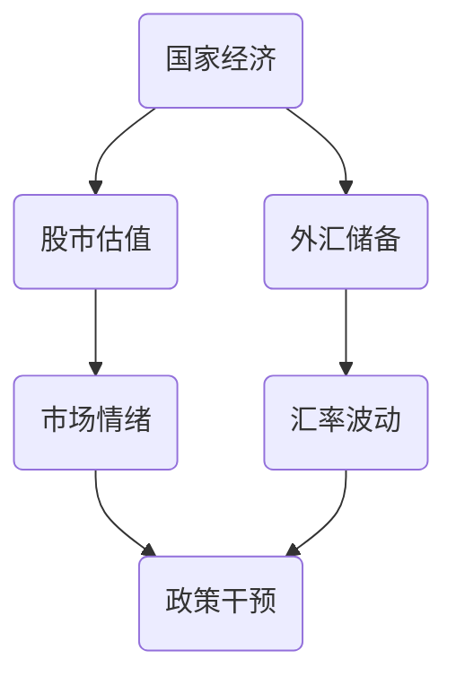
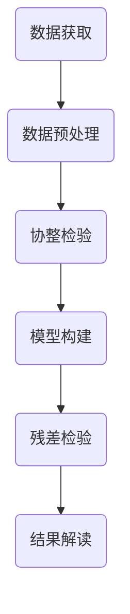
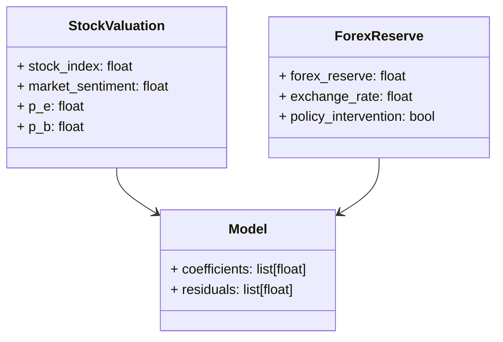
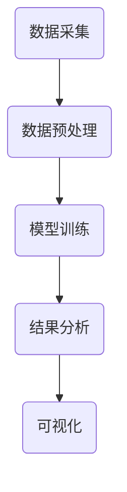
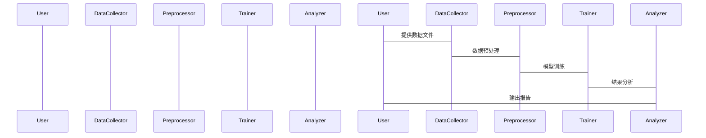

                 


# 新兴市场股市估值与外汇储备的关联

**关键词**：新兴市场、股市估值、外汇储备、协整分析、系统架构

**摘要**：本文探讨了新兴市场中股市估值与外汇储备之间的关联性，通过背景分析、理论模型构建、实证研究和系统设计等方法，深入剖析两者之间的互动关系及其影响机制。文章结合计量经济学方法，构建了协整模型，并通过Python代码实现，最后提出了系统的架构设计方案，为实际应用提供了参考。

---

# 第一部分: 新兴市场股市估值与外汇储备的关联概述

## 第1章: 新兴市场股市估值与外汇储备的关联背景

### 1.1 问题背景与描述

#### 1.1.1 新兴市场的定义与特点
新兴市场通常指那些经济发展迅速、市场规模逐渐扩大的国家和地区，例如中国、印度、巴西等。这些市场的特点是经济增长潜力大，但同时也伴随着较高的风险。

#### 1.1.2 股市估值与外汇储备的基本概念
- **股市估值**：通过市盈率（P/E）和市净率（P/B）等指标衡量市场整体价值。
- **外汇储备**：国家持有的外汇资产，用于稳定汇率和应对国际支付需求。

#### 1.1.3 问题解决的必要性与目标
研究新兴市场中股市估值与外汇储备的关联，旨在为政策制定者和投资者提供决策依据，优化资源配置，降低金融风险。

### 1.2 核心概念与边界
#### 1.2.1 核心概念的结构与组成
- 股市估值：反映市场整体价值。
- 外汇储备：反映国家经济实力和国际支付能力。

#### 1.2.2 问题的边界与外延
- 研究范围：新兴市场，不包括发达国家。
- 研究时间：2000年至今。

#### 1.2.3 核心要素的对比分析
- 股市估值受市场情绪和经济基本面影响。
- 外汇储备受汇率波动和政策干预影响。

### 1.3 本章小结
本章介绍了新兴市场的定义和特点，明确了股市估值与外汇储备的基本概念，并提出了研究的必要性与目标。

---

# 第二部分: 核心概念与关联分析

## 第2章: 股市估值与外汇储备的核心概念

### 2.1 股市估值的定义与计算方法

#### 2.1.1 市盈率与市净率的计算公式
- 市盈率（P/E）= 股价 / 每股收益。
- 市净率（P/B）= 股价 / 每股净资产。

#### 2.1.2 市场情绪对估值的影响
市场情绪通过投资者行为影响股市估值，例如恐慌情绪会导致市盈率下降。

#### 2.1.3 股市估值与宏观经济的关系
股市估值受GDP增速、通胀率等宏观经济指标影响。

### 2.2 外汇储备的定义与管理策略

#### 2.2.1 外汇储备的构成与功能
- 构成：美元、欧元等主要货币。
- 功能：稳定汇率、应对国际支付需求。

#### 2.2.2 外汇储备的管理目标
- 维持汇率稳定。
- 优化资产配置。

#### 2.2.3 外汇储备与货币政策的关系
中央银行通过外汇储备干预市场，影响货币政策。

### 2.3 股市估值与外汇储备的关联性分析

#### 2.3.1 股市估值波动对外汇储备的影响
股市估值波动会导致资本流动变化，影响外汇储备规模。

#### 2.3.2 外汇储备变化对股市估值的影响
外汇储备变化通过汇率波动影响股市估值。

#### 2.3.3 两者关联的边界条件与限制
- 经济政策的干预。
- 全球经济环境的变化。

### 2.4 核心概念对比分析表

| **属性**       | **股市估值**              | **外汇储备**              |
|-----------------|---------------------------|---------------------------|
| 反映指标         | 市盈率、市净率             | 汇率、外汇资产规模         |
| 主要影响因素     | 市场情绪、经济基本面       | 汇率波动、政策干预         |
| 管理主体         | 投资者、机构              | 中央银行                  |

### 2.5 ER实体关系图


---

# 第三部分: 关联关系的数学模型与算法

## 第3章: 关联关系的数学模型

### 3.1 股市估值与外汇储备的协整分析

#### 3.1.1 协整分析的定义与原理
协整分析用于检验两个时间序列变量之间的长期均衡关系。

#### 3.1.2 股市指数与外汇储备的协整检验
- 数据来源：新兴市场股市指数和外汇储备数据。
- 检验方法：Engle-Granger两步法。

#### 3.1.3 协整关系的数学公式
$$
\text{协整方程：} \ln(\text{股价}) = \alpha + \beta \ln(\text{汇率}) + \gamma \text{时间趋势} + \epsilon
$$

#### 3.1.4 协整关系的验证
- 通过残差检验（如ADF检验）验证协整性。

#### 3.1.5 协整分析流程图


#### 3.1.6 协整分析的Python实现
```python
import pandas as pd
from statsmodels.tsa.stattools import adfuller, coint

# 数据预处理
data = pd.read_csv('emerging_market_data.csv')
stock_index = data['stock_index']
forex_reserve = data['forex_reserve']

# 协整检验
result = coint(stock_index, forex_reserve)
print(f"协整检验结果：p-value={result[1]}")
```

---

## 第3.2 股市估值与外汇储备的回归分析

### 3.2.1 回归分析的定义与原理
回归分析用于预测一个变量对另一个变量的影响程度。

### 3.2.2 回归分析的数学模型
$$
\text{回归方程：} y = \beta_0 + \beta_1 x + \epsilon
$$
其中，$y$ 为股市估值，$x$ 为外汇储备。

### 3.2.3 回归分析的Python实现
```python
import statsmodels.api as sm

# 数据准备
X = stock_index
X = sm.add_constant(X)
y = forex_reserve

# 模型拟合
model = sm.OLS(y, X).fit()
print(model.summary())
```

---

## 第3.3 股市估值与外汇储备的时间序列分析

### 3.3.1 时间序列分析的定义与原理
时间序列分析用于研究变量随时间的变化趋势。

### 3.3.2 股市估值与外汇储备的时间序列模型
$$
\text{ARIMA模型：} y_t = \phi y_{t-1} + \theta \epsilon_{t-1} + \epsilon_t
$$

### 3.3.3 时间序列分析的Python实现
```python
from statsmodels.tsa.arima.model import ARIMA

# 模型拟合
model = ARIMA(y, order=(1, 1, 1))
model_fit = model.fit()
print(model_fit.summary())
```

---

# 第四部分: 系统分析与架构设计

## 第4章: 系统分析与架构设计

### 4.1 问题场景介绍
分析新兴市场股市估值与外汇储备的关联，构建预测模型。

### 4.2 系统功能设计

#### 4.2.1 领域模型类图


#### 4.2.2 系统架构图


### 4.3 系统架构设计

#### 4.3.1 数据采集模块
- 数据来源：新兴市场股市指数和外汇储备数据。

#### 4.3.2 数据预处理模块
- 数据清洗：处理缺失值、异常值。
- 数据转换：标准化、对数变换。

#### 4.3.3 模型训练模块
- 选择协整分析、回归分析等模型。
- 模型优化：调整参数、交叉验证。

#### 4.3.4 结果分析模块
- 残差分析：验证模型的显著性。
- 结果解读：解释变量之间的关联。

#### 4.3.5 可视化模块
- 绘制时间序列图、散点图、回归结果图。

---

## 第4.4 系统接口设计

### 4.4.1 数据接口
- 数据输入：CSV格式。
- 数据输出：结果报告。

### 4.4.2 模型接口
- 输入：股票指数和外汇储备数据。
- 输出：协整检验结果、回归系数。

---

## 第4.5 系统交互序列图


---

# 第五部分: 项目实战

## 第5章: 项目实战

### 5.1 环境安装

#### 5.1.1 安装Python和相关库
```bash
pip install numpy pandas statsmodels matplotlib
```

### 5.2 系统核心实现

#### 5.2.1 数据获取与预处理
```python
import pandas as pd
import numpy as np
from statsmodels.tsa.stattools import coint

# 数据获取
data = pd.read_csv('emerging_market_data.csv')
stock_index = data['stock_index'].values
forex_reserve = data['forex_reserve'].values

# 数据预处理
stock_index = stock_index[~np.isnan(stock_index)]
forex_reserve = forex_reserve[~np.isnan(forex_reserve)]
```

#### 5.2.2 协整分析实现
```python
# 协整检验
result = coint(stock_index, forex_reserve)
print(f"协整检验结果：p-value={result[1]}")
```

#### 5.2.3 回归分析实现
```python
import statsmodels.api as sm

# 数据准备
X = stock_index
X = sm.add_constant(X)
y = forex_reserve

# 回归模型
model = sm.OLS(y, X).fit()
print(model.summary())
```

### 5.3 代码应用解读与分析

#### 5.3.1 协整检验结果解读
```python
print(f"协整检验结果：p-value={result[1]}")
```
- 如果p-value小于0.05，说明存在协整关系。

#### 5.3.2 回归分析结果解读
```python
print(model.summary())
```
- 查看回归系数和p值，判断变量之间的显著性。

### 5.4 实际案例分析
以某新兴市场为例，分析其股市估值与外汇储备的关联性。

### 5.5 项目小结
通过项目实战，验证了协整分析和回归分析的有效性，为后续研究提供了参考。

---

# 第六部分: 最佳实践

## 第6章: 最佳实践

### 6.1 小结
本文通过理论分析和实证研究，探讨了新兴市场股市估值与外汇储备的关联性。

### 6.2 注意事项
- 数据质量：确保数据准确性和完整性。
- 模型选择：根据实际需求选择合适的方法。

### 6.3 未来研究方向
- 结合更多变量，如政策干预、全球经济环境等。
- 使用机器学习方法进行预测。

### 6.4 拓展阅读
- 建议阅读相关领域的经典文献，如《计量经济学》。

---

# 结语
通过本文的系统分析和实证研究，读者可以深入理解新兴市场股市估值与外汇储备的关联性，并将其应用于实际投资和政策制定中。

