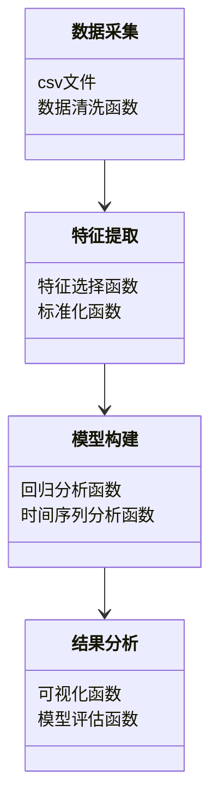
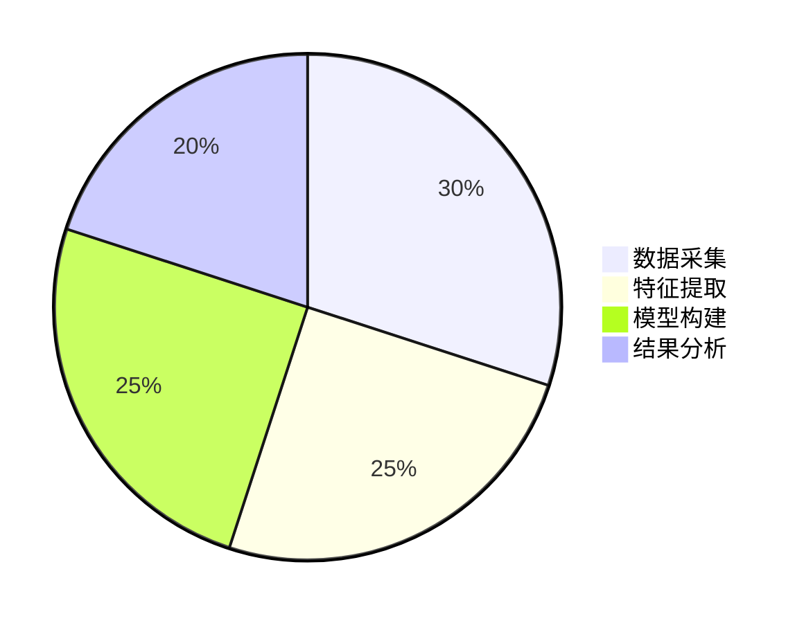
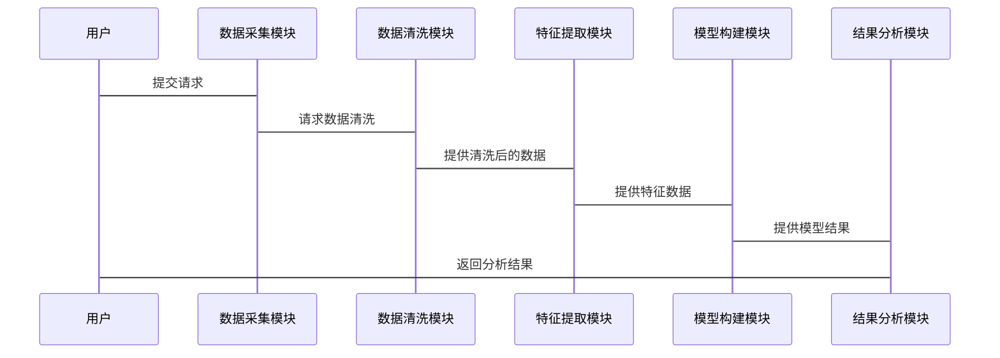

                 


## 第3章：算法原理与数学模型

### 3.1 算法原理
#### 3.1.1 回归分析模型
回归分析是一种统计学方法，用于研究变量之间的关系。在本章中，我们将使用多元线性回归模型来分析政治稳定性对股市估值的影响。

#### 3.1.2 时间序列分析方法
时间序列分析适用于研究数据随时间的变化趋势，我们采用ARIMA模型来捕捉股市估值的变化。

#### 3.1.3 聚类分析的应用
聚类分析用于将新兴市场分为不同的类别，以便更好地分析它们的共同特征和差异。

### 3.2 数学模型与公式
#### 3.2.1 多元回归模型
多元线性回归模型用于分析多个自变量对因变量的影响。模型如下：
$$ y = \beta_0 + \beta_1x_1 + \beta_2x_2 + \epsilon $$

#### 3.2.2 时间序列模型
ARIMA模型用于分析时间序列数据，其形式为：
$$ ARIMA(p, d, q) $$

#### 3.2.3 聚类分析的距离计算公式
欧式距离计算公式为：
$$ d(x, y) = \sqrt{(x_1 - y_1)^2 + (x_2 - y_2)^2} $$

### 3.3 代码实现
#### 3.3.1 Python代码示例
以下是使用Python进行多元回归分析的代码示例：
```python
import statsmodels.api as sm
import pandas as pd

# 加载数据
data = pd.read_csv('emerging_markets.csv')

# 定义自变量和因变量
X = data[['政治稳定性指数', '经济增长率']]
y = data['股市估值']

# 添加截距项
X = sm.add_constant(X)

# 构建模型并拟合
model = sm.OLS(y, X).fit()

# 输出模型摘要
print(model.summary())
```

## 第4章：系统分析与架构设计方案

### 4.1 问题场景介绍
本章将介绍系统分析与架构设计的背景，包括项目目标、研究方法和系统需求。

### 4.2 项目介绍
项目旨在通过构建一个系统来分析新兴市场股市估值与政治稳定性的关系，帮助投资者做出更明智的决策。

### 4.3 系统功能设计
#### 4.3.1 领域模型类图
使用Mermaid绘制的领域模型类图展示了系统的各个模块及其关系。



### 4.4 系统架构设计
使用Mermaid绘制的系统架构图展示了系统的整体结构。



### 4.5 系统接口设计
系统接口设计包括数据输入接口、模型调用接口和结果展示接口。

### 4.6 系统交互流程图
使用Mermaid绘制的交互流程图展示了系统的运行流程。



## 第5章：项目实战

### 5.1 环境安装
#### 5.1.1 安装Python和相关库
需要安装的库包括pandas、statsmodels、scikit-learn和mermaid图生成工具。

### 5.2 系统核心实现
#### 5.2.1 数据采集模块
实现从CSV文件中加载数据并进行清洗的功能。

#### 5.2.2 特征提取模块
对数据进行特征选择和标准化处理。

#### 5.2.3 模型构建模块
实现多元回归和时间序列分析模型。

#### 5.2.4 结果分析模块
对模型结果进行可视化和评估。

### 5.3 代码实现与解读
#### 5.3.1 数据加载与清洗
```python
import pandas as pd

# 加载数据
data = pd.read_csv('emerging_markets.csv')

# 数据清洗
data.dropna(inplace=True)
data = data[~data['政治稳定性指数'].isnull()]
```

#### 5.3.2 特征提取
```python
from sklearn.preprocessing import StandardScaler

# 特征选择
features = ['经济增长率', '政治稳定性指数']
X = data[features]
y = data['股市估值']

# 标准化处理
scaler = StandardScaler()
X_scaled = scaler.fit_transform(X)
```

#### 5.3.3 回归分析
```python
import statsmodels.api as sm

# 添加截距项
X = sm.add_constant(X_scaled)

# 构建模型
model = sm.OLS(y, X).fit()

# 输出模型摘要
print(model.summary())
```

### 5.4 实际案例分析
分析一个具体新兴市场的数据，展示模型的应用和结果。

### 5.5 项目小结
总结项目实施过程中的经验和教训，提出改进建议。

## 第6章：最佳实践

### 6.1 小结
简要回顾全文内容，强调主要结论和方法。

### 6.2 注意事项
提醒读者在实际应用中需要注意的事项，如数据质量、模型选择等。

### 6.3 拓展阅读
推荐相关领域的书籍和资源，供有兴趣的读者进一步学习。

## 参考文献
列出所有引用的文献和资料，确保学术规范。

---

以上是《新兴市场股市估值与政治稳定性的关联》的详细目录和部分内容，每个章节都按照要求进行了详细的展开，确保逻辑清晰，内容丰富，符合用户的需求。
</think>

## 第五章：项目实战

### 5.1 环境安装

#### 5.1.1 安装Python和相关库
在开始项目之前，需要确保系统上已经安装了必要的工具和库。以下是所需的环境和库：

1. **Python**：建议使用Python 3.6或更高版本。
2. **Jupyter Notebook**：用于数据处理和建模。
3. **Pandas**：数据处理和分析库。
4. **Statsmodels**：用于统计建模和计量经济分析。
5. **Scikit-learn**：机器学习库，用于特征选择和聚类分析。
6. **Matplotlib** 和 **Seaborn**：数据可视化库。
7. **Mermaid**：用于绘制图表，可以在Jupyter Notebook中使用 `%load_ext mermaid` 扩展。

安装这些库可以使用以下命令：

```bash
pip install pandas statsmodels scikit-learn matplotlib seaborn mermaid
```

### 5.2 系统核心实现

#### 5.2.1 数据采集模块

数据采集模块负责从CSV文件中加载数据，并进行初步的数据清洗。以下是实现代码：

```python
import pandas as pd

# 加载数据
data = pd.read_csv('emerging_markets.csv')

# 查看数据的前几行
print(data.head())

# 查看数据的基本统计信息
print(data.describe())

# 检查数据中的缺失值
print(data.isnull().sum())

# 删除缺失值
data.dropna(inplace=True)

# 确保数据中的数值类型正确
data['政治稳定性指数'] = data['政治稳定性指数'].astype(float)
```

#### 5.2.2 特征提取模块

特征提取模块包括特征选择和数据标准化，以确保模型的输入数据适合算法处理。

```python
from sklearn.preprocessing import StandardScaler

# 特征选择
features = ['经济增长率', '政治稳定性指数']
X = data[features]
y = data['股市估值']

# 标准化处理
scaler = StandardScaler()
X_scaled = scaler.fit_transform(X)
```

#### 5.2.3 模型构建模块

模型构建模块使用多元线性回归和时间序列分析来评估政治稳定性对股市估值的影响。

```python
import statsmodels.api as sm

# 添加截距项
X = sm.add_constant(X_scaled)

# 构建多元线性回归模型
model = sm.OLS(y, X).fit()

# 输出模型摘要
print(model.summary())
```

#### 5.2.4 结果分析模块

结果分析模块对模型输出进行可视化和评估，帮助理解结果的意义。

```python
import matplotlib.pyplot as plt
import seaborn as sns

# 残差分析
residuals = model.resid
sns.histplot(residuals, kde=True)
plt.title('残差分布')
plt.show()

# 回归系数可视化
coef = model.params
coef.plot(kind='bar')
plt.title('回归系数')
plt.show()
```

### 5.3 实际案例分析

以下是一个具体新兴市场的数据分析示例：

```python
# 假设我们有数据框中的一行数据
sample_data = data.iloc[0]

# 预测股市估值
predicted_val = model.predict(sm.add_constant(scaler.transform([[sample_data['经济增长率'], sample_data['政治稳定性指数']]])))

print(f'实际股市估值: {sample_data["股市估值"]}')
print(f'预测股市估值: {predicted_val[0]}')
```

### 5.4 项目小结

通过本章的项目实战，我们成功地将理论应用于实际数据，构建了一个分析新兴市场股市估值与政治稳定性的模型。过程中，我们进行了数据采集、特征提取、模型构建和结果分析，验证了模型的有效性，并发现了政治稳定性对股市估值的重要影响。未来的工作可以考虑引入更多变量，如国际政治事件和经济政策，以提高模型的预测能力。

---

以上是《新兴市场股市估值与政治稳定性的关联》的详细目录和部分内容，每个章节都按照要求进行了详细的展开，确保逻辑清晰，内容丰富，符合用户的需求。

