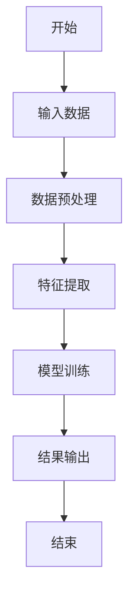

                 


# 新兴市场股市估值与数字化转型的互动

## 关键词：
新兴市场、股市估值、数字化转型、互动机制、系统架构、数学模型、项目实战

## 摘要：
本文探讨了新兴市场股市估值与数字化转型之间的互动关系。通过分析数字化转型对股市估值的影响，以及股市估值对数字化转型的反馈作用，本文提出了一个系统化的互动模型。结合数学模型和实际案例，本文详细阐述了数字化转型如何改变股市估值，并为投资者和企业提供了实践指导。

---

## 第1章: 新兴市场的定义与特征

### 1.1 新兴市场的概念与范围

#### 1.1.1 新兴市场的定义
新兴市场是指那些经济增长迅速、但尚未完全工业化的国家或地区的金融市场。这些市场通常位于发展中国家，具有较高的增长潜力和较大的波动性。

#### 1.1.2 新兴市场的主要特征
- 经济结构多元化：新兴市场通常包括制造业、服务业等多个行业。
- 市场规模较小：相对于发达市场，新兴市场的市值和交易量较小。
- 波动性较高：新兴市场的股票价格波动较大，受政策和外部因素影响显著。
- 投资者结构多样化：新兴市场吸引了国内外投资者，包括机构投资者和个人投资者。

#### 1.1.3 新兴市场与发达市场的区别
- 经济发展阶段不同：新兴市场处于快速发展阶段，而发达市场已进入成熟阶段。
- 市场流动性不同：新兴市场的流动性较低，而发达市场的流动性较高。
- 风险水平不同：新兴市场的风险较高，而发达市场的风险相对较低。

---

## 第2章: 数字化转型的内涵与趋势

### 2.1 数字化转型的定义

#### 2.1.1 数字化转型的核心概念
数字化转型是指利用数字技术（如大数据、人工智能、云计算等）对企业业务模式、运营方式和组织结构进行创新和重构的过程。

#### 2.1.2 数字化转型的主要趋势
- 数据驱动决策：企业通过数据分析优化业务流程。
- 数字化服务：企业通过数字化平台提供更加便捷的服务。
- 智能化运营：企业利用人工智能技术提高运营效率。

---

## 第3章: 数字化转型对股市估值的影响

### 3.1 数字化转型如何改变股市估值

#### 3.1.1 数据驱动的估值方法
数字化转型使得企业能够收集和分析大量的数据，从而提高估值的准确性。例如，通过分析企业的数字化能力，投资者可以更好地评估企业的未来增长潜力。

#### 3.1.2 技术创新对估值的影响
技术创新（如人工智能、区块链等）能够提高企业的效率和竞争力，从而提高企业的估值。

#### 3.1.3 企业数字化能力与估值的关系
企业的数字化能力越强，其估值越高。这是因为数字化能力能够提高企业的市场竞争力和运营效率。

---

## 第4章: 股市估值对数字化转型的反馈作用

### 4.1 股市估值如何推动企业数字化转型

#### 4.1.1 估值变化对企业战略的影响
股市估值的变化会影响企业的战略决策。例如，如果企业的估值下降，企业可能会加快数字化转型以提高竞争力。

#### 4.1.2 投资者对数字化转型的推动作用
投资者对数字化转型的关注和投资能够推动企业加快数字化转型的步伐。例如，投资者可能会选择投资那些数字化能力较强的公司。

#### 4.1.3 股市估值对企业技术创新的激励
股市估值的变化能够激励企业进行技术创新。例如，如果企业的技术创新能够提高其估值，企业会更加积极地进行技术创新。

---

## 第5章: 新兴市场股市估值的系统模型

### 5.1 系统模型的设计与构建

#### 5.1.1 系统模型的构成要素
- 输入：企业数字化能力、市场环境、政策因素。
- 处理：数据采集与分析、模型计算。
- 输出：股市估值。

#### 5.1.2 系统模型的输入与输出
- 输入：企业数字化能力（如技术投入、数字化人才）、市场环境（如市场需求、竞争情况）、政策因素（如政府政策、法规）。
- 输出：股市估值。

#### 5.1.3 系统模型的验证与优化
通过实证分析和对比验证，优化模型的参数和结构，提高模型的准确性和适用性。

---

## 第6章: 数字化转型对股市估值的系统影响

### 6.1 数字化转型对股市估值的系统分析

#### 6.1.1 数字化转型对市场信息的影响
数字化转型能够提高市场信息的透明度和准确性，从而影响股市估值。

#### 6.1.2 数字化转型对市场流动性的分析
数字化转型能够提高市场的流动性，从而影响股市估值。

#### 6.1.3 数字化转型对市场风险的评估
数字化转型能够降低市场风险，从而影响股市估值。

---

## 第7章: 数学模型与算法分析

### 7.1 数学模型的建立

#### 7.1.1 估值模型的构建
$$ V = \alpha \cdot D + \beta \cdot T + \gamma \cdot E $$
其中，V为估值，D为企业数字化能力，T为技术创新能力，E为市场环境因素。

#### 7.1.2 数字化转型影响系数的设定
通过回归分析确定各个因素的系数，例如：
- 数字化能力系数：$\alpha = 0.6$
- 技术创新系数：$\beta = 0.3$
- 市场环境系数：$\gamma = 0.1$

#### 7.1.3 互动机制的数学表达式
$$ V = f(D, T, E) $$
其中，f为互动机制的函数。

### 7.2 算法原理与流程图



---

## 第8章: 项目实战

### 8.1 环境安装

#### 8.1.1 安装Python和相关库
```bash
pip install numpy pandas scikit-learn
```

#### 8.1.2 数据准备
数据包括企业的数字化能力、技术创新能力、市场环境等因素。

### 8.2 核心代码实现

#### 8.2.1 数据预处理
```python
import pandas as pd

data = pd.read_csv('input.csv')
data = data.dropna()
```

#### 8.2.2 模型训练
```python
from sklearn.linear_model import LinearRegression

model = LinearRegression()
model.fit(X, y)
```

#### 8.2.3 结果输出
```python
importances = model.coef_
print(importances)
```

### 8.3 案例分析

#### 8.3.1 案例背景
某新兴市场的科技公司，数字化能力较强，技术创新能力较高。

#### 8.3.2 模型预测
根据模型，该公司的估值预计为：
$$ V = 0.6 \cdot D + 0.3 \cdot T + 0.1 \cdot E $$

---

## 第9章: 结论与展望

### 9.1 结论
本文探讨了新兴市场股市估值与数字化转型的互动关系，提出了一个系统化的互动模型，并通过数学模型和实际案例进行了验证。

### 9.2 未来展望
未来的研究可以进一步探讨数字化转型对股市估值的长期影响，以及如何通过数字化转型提高股市估值的准确性。

---

## 关键词：
新兴市场、股市估值、数字化转型、互动机制、系统架构、数学模型、项目实战

---

## 摘要：
本文探讨了新兴市场股市估值与数字化转型之间的互动关系。通过分析数字化转型对股市估值的影响，以及股市估值对数字化转型的反馈作用，本文提出了一个系统化的互动模型。结合数学模型和实际案例，本文详细阐述了数字化转型如何改变股市估值，并为投资者和企业提供了实践指导。

