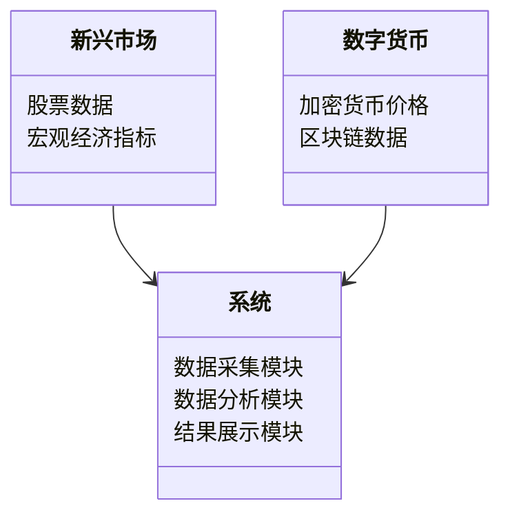
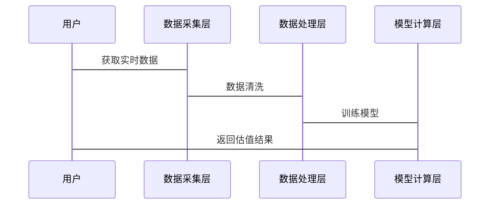

                 


# 新兴市场股市估值与数字货币发展的互动

## 关键词

- 新兴市场
- 股市估值
- 数字货币
- 区块链技术
- 互动关系
- 价格波动
- 投资策略

## 摘要

新兴市场和数字货币的发展正在以前所未有的方式相互影响。本文通过分析新兴市场股市估值的核心原理、数字货币的技术特性以及两者之间的互动关系，探讨如何利用数字货币技术优化股市估值模型。文章结合数学模型和实际案例，详细讲解了基于区块链技术的数字货币对新兴市场股市估值的积极影响，提出了创新的投资策略。

---

# 第一部分: 新兴市场股市估值与数字货币发展的背景与概念

## 第1章: 背景介绍

### 1.1 问题背景

#### 1.1.1 新兴市场的定义与特点
新兴市场是指那些经济快速发展、产业结构逐步升级的国家或地区，例如中国、印度、东南亚国家等。这些市场通常具有高增长潜力，但也伴随着高波动性和不确定性。

#### 1.1.2 数字货币的兴起与现状
数字货币的兴起源于区块链技术的突破，比特币、以太坊等加密货币的出现改变了传统的金融体系。数字货币具有去中心化、透明性和安全性等特点，正在逐步融入全球金融体系。

#### 1.1.3 股市估值与数字货币的相互影响
新兴市场股市估值受多种因素影响，包括经济指标、政策变化、市场情绪等。数字货币的波动性也可能通过投资者情绪、资金流动等渠道影响股市估值。

### 1.2 问题描述

#### 1.2.1 新兴市场股市估值的挑战
新兴市场股市估值面临数据不完整、市场波动大、政策不确定性高等问题，传统估值方法可能不适用。

#### 1.2.2 数字货币对股市估值的影响
数字货币的价格波动可能通过投资者情绪、资金流动影响股市估值，尤其是在新兴市场中，这种影响更为显著。

#### 1.2.3 问题的边界与外延
本文研究的边界包括新兴市场的定义范围、数字货币的种类选择以及互动关系的具体表现形式。外延则涉及数字货币对传统金融体系的颠覆性影响。

### 1.3 问题解决

#### 1.3.1 新兴市场股市估值的方法
采用多元回归模型，结合宏观经济指标、行业景气度、政策因素等变量进行综合估值。

#### 1.3.2 数字货币对股市估值的促进作用
通过分析数字货币的价格波动与股市的相关性，提出新的估值指标和调整系数。

#### 1.3.3 问题解决的路径与策略
引入数字货币价格波动数据，构建混合估值模型，实现对新兴市场股市估值的优化。

### 1.4 核心概念组成

#### 1.4.1 股市估值的核心要素
- 宏观经济指标（GDP、通胀率等）
- 行业景气度
- 公司基本面（收入、利润等）
- 市场情绪

#### 1.4.2 数字货币的核心属性
- 去中心化
- 区块链技术
- 通货膨胀率
- 交易透明性

#### 1.4.3 互动关系的结构化分析
通过构建互动关系模型，分析数字货币价格波动如何影响新兴市场股市估值。

---

# 第二部分: 核心概念与联系

## 第2章: 核心概念原理

### 2.1 股市估值的原理

#### 2.1.1 股票估值的基本方法
- 市盈率（P/E）
- 市净率（P/B）
- 股息率
- 内在价值法

#### 2.1.2 新兴市场的特殊性
新兴市场具有高波动性、信息不对称、政策不确定性等特点，传统估值方法需要调整。

#### 2.1.3 影响股市估值的主要因素
- 宏观经济指标
- 政策变化
- 市场情绪
- 行业动态

### 2.2 数字货币的原理

#### 2.2.1 数字货币的定义与分类
- 比特币、以太坊等加密货币
- 稳定币（如USDT）
- 代币（如ERC20）

#### 2.2.2 区块链技术的核心作用
- 去中心化
- 分布式账本
- 智能合约

#### 2.2.3 数字货币的价格波动机制
- 市场供需
- 技术指标（如RSI、MACD）
- 媒体影响和社交媒体情绪

### 2.3 核心概念属性对比

#### 2.3.1 股市估值与数字货币的属性对比表

| 属性           | 股市估值                  | 数字货币                |
|-----------------|--------------------------|-------------------------|
| 资产类型       | 股票                     | 加密货币                |
| 价格波动       | 中高波动                 | 高波动                 |
| 投资门槛       | 高                      | 中低                   |
| 监管           | 严格                    | 区块链技术去中心化      |
| 透明度         | 高（上市公司披露）       | 高（区块链公开）        |

#### 2.3.2 互动关系的特征分析
- 数字货币价格波动影响投资者情绪，进而影响股市资金流动。
- 数字货币的高波动性可能成为新兴市场股市估值的外部风险因素。

#### 2.3.3 实体关系图


---

# 第三部分: 算法原理讲解

## 第3章: 数学模型与算法原理

### 3.1 股市估值的数学模型

#### 3.1.1 线性回归模型
$$ y = \beta_0 + \beta_1x_1 + \beta_2x_2 + \dots + \beta_nx_n + \epsilon $$
其中，\( y \) 为目标变量（股价），\( x_i \) 为自变量（如市盈率、市净率等），\( \epsilon \) 为误差项。

#### 3.1.2 时间序列分析
使用ARIMA模型对新兴市场股市指数进行预测：
$$ ARIMA(p, d, q) $$

#### 3.1.3 互动关系模型
$$ V_{stock} = \alpha + \beta V_{crypto} + \gamma X + \epsilon $$
其中，\( V_{stock} \) 为股市估值，\( V_{crypto} \) 为数字货币估值，\( X \) 为其他控制变量。

### 3.2 数字货币价格波动的预测模型

#### 3.2.1 基于区块链技术的回归模型
$$ P_t = \alpha + \beta P_{t-1} + \gamma V_{market} + \epsilon $$
其中，\( P_t \) 为当前价格，\( V_{market} \) 为市场情绪指数。

#### 3.2.2 机器学习模型
使用LSTM神经网络对数字货币价格进行预测：
$$ LSTM(input\_seq) $$

### 3.3 算法流程图


### 3.4 核心代码实现

```python
import pandas as pd
import numpy as np
from sklearn.linear_model import LinearRegression
from sklearn.metrics import mean_squared_error

# 示例数据
data = pd.DataFrame({
    'stock_price': [100, 105, 110, 115, 120],
    'crypto_price': [40000, 40500, 41000, 41500, 42000]
})

# 线性回归模型
model = LinearRegression()
model.fit(data[['crypto_price']], data['stock_price'])

# 预测结果
predicted = model.predict(data[['crypto_price']])
print(mean_squared_error(data['stock_price'], predicted))
```

---

# 第四部分: 系统分析与架构设计

## 第4章: 系统分析与架构设计

### 4.1 问题场景介绍
本文设计一个新兴市场股市估值与数字货币互动的分析系统，旨在通过实时数据采集和模型计算，提供精准的估值结果。

### 4.2 系统功能设计

#### 4.2.1 领域模型


### 4.3 系统架构设计

#### 4.3.1 系统架构图


### 4.4 接口设计
- 数据采集接口：API用于从交易所获取实时价格数据。
- 模型计算接口：REST API提供估值结果。

### 4.5 交互设计

#### 4.5.1 用户交互流程


---

# 第五部分: 项目实战

## 第5章: 项目实战

### 5.1 环境安装

#### 5.1.1 安装Python环境
- 安装Python 3.8以上版本。
- 安装必要的库：`pandas`, `numpy`, `scikit-learn`, `mermaid`, `plotly`.

#### 5.1.2 数据源获取
- 从新兴市场交易所获取股票数据。
- 从加密货币交易所获取数字货币数据。

### 5.2 核心代码实现

#### 5.2.1 数据清洗与预处理
```python
import pandas as pd

# 读取数据
data = pd.read_csv('data.csv')

# 删除缺失值
data.dropna(inplace=True)

# 标准化处理
from sklearn.preprocessing import StandardScaler
scaler = StandardScaler()
data_scaled = scaler.fit_transform(data)
```

#### 5.2.2 模型训练与预测
```python
from sklearn.ensemble import RandomForestRegressor

# 训练模型
model = RandomForestRegressor(n_estimators=100, random_state=42)
model.fit(X_train, y_train)

# 预测结果
y_pred = model.predict(X_test)
```

#### 5.2.3 结果可视化
```python
import matplotlib.pyplot as plt

plt.figure(figsize=(10, 6))
plt.plot(y_test, label='真实值')
plt.plot(y_pred, label='预测值')
plt.legend()
plt.show()
```

### 5.3 案例分析

#### 5.3.1 某新兴市场股市估值案例
- 数据来源：某新兴市场的股票指数数据。
- 模型选择：随机森林回归模型。
- 结果分析：预测与实际值的对比。

#### 5.3.2 数字货币价格波动案例
- 数据来源：比特币价格数据。
- 模型选择：LSTM神经网络。
- 结果分析：价格预测的准确率评估。

---

# 第六部分: 最佳实践

## 第6章: 最佳实践

### 6.1 技术建议
- 数据清洗与特征选择是关键。
- 使用多种模型进行对比，选择最优方案。

### 6.2 业务建议
- 结合宏观经济指标，优化模型效果。
- 定期更新模型，适应市场变化。

### 6.3 注意事项
- 数据隐私与安全需高度重视。
- 模型需定期校准，避免过拟合。

### 6.4 拓展阅读
- 建议阅读《区块链技术进阶》、《时间序列分析与应用》等相关书籍，深入理解相关技术原理。

---

# 第七部分: 总结

## 第7章: 总结

通过本文的系统分析与实践，我们深入探讨了新兴市场股市估值与数字货币发展的互动关系。结合数学模型、算法原理和实际案例，提出了创新的解决方案和优化策略。未来，随着技术的进步和市场的变化，这一领域的研究将更加深入，为投资者提供更精准的决策支持。

--- 

# END

