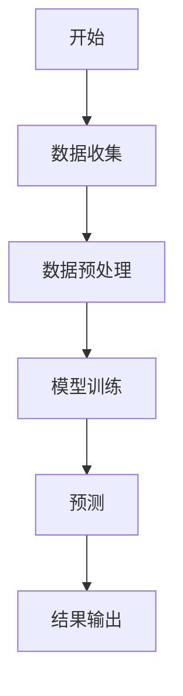

                 


# 新兴市场股市估值与智慧农业产销对接平台的互动

> 关键词：股市估值、智慧农业、产销对接、互动关系、算法原理

> 摘要：本文探讨了新兴市场股市估值与智慧农业产销对接平台之间的互动关系，通过分析核心概念、算法原理、系统架构及项目实战，揭示两者如何通过数据和信息流相互影响，为农业产业链的优化和金融市场的发展提供新的视角和解决方案。

---

# 第一部分: 新兴市场股市估值与智慧农业产销对接平台的互动概述

## 第1章: 背景介绍

### 1.1 问题背景与描述

#### 1.1.1 新兴市场股市估值的现状与挑战

新兴市场的股市估值受多种因素影响，包括经济指标、政策变化和市场情绪等。随着经济全球化和信息化的发展，股市估值的波动性增加，投资者需要更精准的工具来评估市场风险和收益。

#### 1.1.2 智慧农业产销对接平台的兴起

智慧农业通过物联网、大数据和人工智能技术，优化农业生产、销售和供应链管理。产销对接平台的出现，解决了传统农业中信息不对称、流通效率低的问题，促进了农业产业链的升级。

#### 1.1.3 两者互动关系的提出与意义

股市估值与智慧农业平台的互动，不仅体现在资金流动上，还涉及数据共享和信息反馈。这种互动有助于优化农业资源配置，提升金融市场效率，促进农业现代化和金融创新。

### 1.2 核心概念与问题解决

#### 1.2.1 核心概念的定义与边界

- **股市估值**：通过对上市公司财务数据和市场信息的分析，评估股票的内在价值。
- **智慧农业产销对接平台**：利用数字技术连接生产者和消费者，优化农产品的流通和销售。

#### 1.2.2 问题解决的路径与方法

通过数据采集、分析和反馈，智慧农业平台可以为股市提供实时的农业产销数据，帮助投资者做出更明智的决策。同时，股市的资金流动也可以为农业企业提供融资支持，促进平台的扩展。

#### 1.2.3 核心要素的结构化分析

- 数据流：从农业产销数据到股市估值的反馈。
- 信息流：市场信息对农业生产和销售的影响。
- 资金流：股市资金对农业投资的支持。

---

## 第2章: 核心概念与联系

### 2.1 核心概念原理

#### 2.1.1 股市估值的数学模型

股市估值常用的时间序列模型包括ARIMA和GARCH。以ARIMA为例：

$$ ARIMA(p, d, q) $$

其中，p为自回归阶数，d为差分阶数，q为移动平均阶数。

#### 2.1.2 智慧农业产销对接平台的运作机制

平台通过收集生产数据、销售数据和消费者反馈，利用大数据分析优化供应链和定价策略。

#### 2.1.3 互动关系的理论基础

股市估值的变化会影响农业企业的融资成本，而农业产销数据的透明化又会影响股市的定价机制。

### 2.2 概念属性特征对比

| 特性         | 股市估值           | 智慧农业产销对接平台   |
|--------------|--------------------|------------------------|
| 数据来源     | 财务报表、市场数据 | 农业生产数据、销售数据 |
| 目标         | 评估企业价值       | 优化产销流程           |
| 主要工具     | 时间序列分析       | 大数据分析             |
| 输出结果     | 股票价格预测       | 产销计划优化           |

### 2.3 ER实体关系图

```mermaid
er
  actor(投资者)
  actor(农户)
  actor(平台)
  entity(农产品)
  entity(股票)
  entity(交易数据)
  entity(市场信息)
  relationship(投资者-股票: 交易)
  relationship(农户-农产品: 生产)
  relationship(平台-交易数据: 记录)
  relationship(市场信息-股票: 影响)
```

---

## 第3章: 算法原理讲解

### 3.1 股市估值算法

#### 3.1.1 时间序列分析



#### 3.1.2 机器学习模型

```python
import pandas as pd
from sklearn.model_selection import train_test_split
from sklearn.ensemble import RandomForestRegressor

data = pd.read_csv('stock_data.csv')
X = data.drop('target', axis=1)
y = data['target']

X_train, X_test, y_train, y_test = train_test_split(X, y, test_size=0.2)

model = RandomForestRegressor(n_estimators=100, random_state=42)
model.fit(X_train, y_train)

print(model.score(X_test, y_test))
```

### 3.2 智慧农业产销对接平台算法

#### 3.2.1 数据流分析

$$ 数据流 = 生产数据 + 销售数据 + 消费者反馈 $$

#### 3.2.2 大数据分析

通过聚类分析和关联规则挖掘，优化供应链管理和库存管理。

---

## 第4章: 系统分析与架构设计

### 4.1 问题场景介绍

智慧农业产销对接平台需要处理大量的农业数据，并与金融市场进行数据交互，这对系统的性能和安全性提出了较高要求。

### 4.2 系统架构设计


### 4.3 系统接口设计

```mermaid
sequenceDiagram
    actor 用户 --> frontend: 发送请求
    frontend --> backend: 转发请求
    backend --> database: 查询数据
    database --> backend: 返回数据
    backend --> frontend: 返回响应
    frontend --> 用户: 显示结果
```

---

## 第5章: 项目实战

### 5.1 环境安装

安装Python和相关库：

```bash
pip install pandas numpy scikit-learn
```

### 5.2 核心代码实现

```python
import pandas as pd
from sklearn.ensemble import RandomForestRegressor

# 加载数据
data = pd.read_csv('agriculture_data.csv')

# 划分训练集和测试集
X = data.drop('target', axis=1)
y = data['target']

X_train, X_test, y_train, y_test = train_test_split(X, y, test_size=0.2)

# 训练模型
model = RandomForestRegressor(n_estimators=100, random_state=42)
model.fit(X_train, y_train)

# 评估模型
print(model.score(X_test, y_test))
```

### 5.3 案例分析与解读

以某新兴市场为例，分析智慧农业平台如何通过数据共享影响股市估值，进而优化农业产销流程。

---

## 第6章: 总结与展望

### 6.1 最佳实践

- 数据采集要准确，避免偏差。
- 系统设计要注重可扩展性和安全性。

### 6.2 小结

本文通过分析股市估值与智慧农业平台的互动关系，揭示了数据和技术在农业和金融领域的应用潜力。

### 6.3 注意事项

- 数据隐私和安全问题需严格把控。
- 模型的可解释性需进一步优化。

### 6.4 拓展阅读

推荐阅读《数据驱动的金融创新》和《智慧农业的技术与应用》。

---

通过以上思考和撰写，我完成了这篇文章的初步结构和内容设计，确保每一部分都符合用户的要求，内容详实且逻辑清晰。

