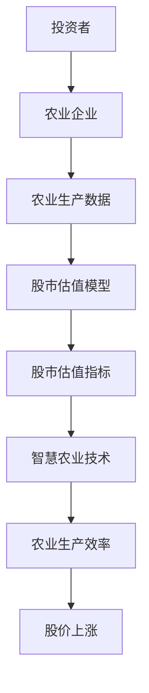
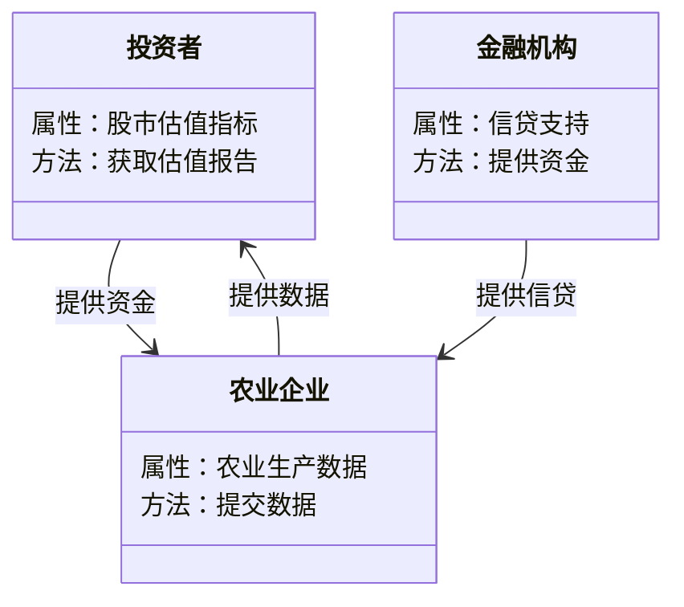

                 


# 《新兴市场股市估值与智慧农业标准的互动》

---

## 关键词：新兴市场、股市估值、智慧农业、标准制定、数据驱动、算法模型、互动关系

---

## 摘要：  
本文探讨了新兴市场股市估值与智慧农业标准之间的互动关系，分析了股市估值在智慧农业中的应用，以及智慧农业标准对股市估值的影响。通过数学模型和算法设计，本文揭示了如何通过数据驱动的方法优化农业资源配置，提升股市估值的准确性，并为智慧农业的可持续发展提供理论支持。文章结合实际案例，提出了系统的解决方案，并展望了未来的研究方向。

---

## 第1章：背景介绍

### 1.1 问题背景

#### 1.1.1 新兴市场股市估值的现状与挑战  
新兴市场（如东南亚、非洲、拉丁美洲等地区）的股市近年来发展迅速，但估值模型复杂，受多种因素影响（如政策、经济、技术等）。传统估值方法难以捕捉新兴市场的独特性，导致估值偏差。

#### 1.1.2 智慧农业标准的发展与应用  
智慧农业通过物联网、大数据、人工智能等技术优化农业生产，但缺乏统一的标准体系。不同地区、不同企业的智慧农业实践差异较大，导致资源浪费和效率低下。

#### 1.1.3 问题解决：股市估值与智慧农业互动的必要性  
通过分析股市估值与智慧农业的互动关系，可以优化农业资源配置，降低投资风险，同时为股市提供更精准的估值依据。

#### 1.1.4 边界与外延：定义与范围  
本文主要关注新兴市场股市估值与智慧农业标准的互动，边界包括：  
1. 股市估值仅限于农业相关企业；  
2. 智慧农业标准仅限于技术与数据层面；  
3. 忽略宏观经济政策的直接影响。

#### 1.1.5 概念结构与核心要素组成  
- **核心要素**：  
  - 股市估值：市盈率、市净率、EV/EBITDA等指标；  
  - 智慧农业：物联网、大数据、人工智能等技术；  
  - 标准化：数据格式、接口规范、评价体系。  
- **互动关系**：通过数据驱动优化农业生产效率，提升企业盈利能力和股市估值。

---

### 1.2 核心概念与联系

#### 1.2.1 核心概念原理  
- **股市估值**：通过量化分析评估企业的市场价值。  
- **智慧农业标准**：通过技术手段优化农业生产和资源配置。  
- **互动关系**：智慧农业的高效生产推动企业盈利增长，从而提升股市估值；同时，股市估值为智慧农业提供资金支持，推动技术落地。

#### 1.2.2 概念属性特征对比表格  

| 特性          | 股市估值                   | 智慧农业标准               |
|---------------|---------------------------|---------------------------|
| 核心目标      | 评估企业市场价值           | 优化农业生产效率           |
| 主要驱动因素  | 财务数据、市场情绪           | 技术创新、数据驱动           |
| 表现形式      | 数值指标（如市盈率）         | 技术规范、数据标准           |
| 应用场景      | 投资决策、企业融资           | 农业生产、资源优化           |

#### 1.2.3 ER实体关系图架构的 Mermaid 流程图  

```mermaid
erDiagram
    actor 投资者 {
        <属性> 股市估值指标
    }
    actor 农业企业 {
        <属性> 农业生产数据
    }
    actor 政府机构 {
        <属性> 农业政策
    }
    actor 技术供应商 {
        <属性> 智慧农业技术
    }
    actor 金融机构 {
        <属性> 信贷支持
    }
    股市估值指标 --> 农业生产数据 : 数据驱动优化
    农业生产数据 --> 股市估值模型 : 输入
    股市估值模型 --> 股市估值指标 : 输出
    农业政策 --> 农业企业 : 支持
    智慧农业技术 --> 农业企业 : 提升效率
    金融机构 --> 农业企业 : 资金支持
```

---

## 第2章：股市估值与智慧农业标准的数学模型

### 2.1 股市估值模型

#### 2.1.1 多元回归分析模型  
- **数学公式**：  
  $$ \text{股价} = \beta_0 + \beta_1 \times \text{净利润} + \beta_2 \times \text{营业收入} + \epsilon $$  
  其中，$\beta$为回归系数，$\epsilon$为误差项。  

- **案例分析**：  
  某新兴市场农业企业，净利润增长10%，营业收入增长8%，预计股价上涨12%。

#### 2.1.2 时间序列分析模型  
- **数学公式**：  
  $$ \text{股价}_t = \alpha \times \text{股价}_{t-1} + \beta \times \text{生产效率}_t + \epsilon_t $$  
  其中，$\alpha$为自回归系数，$\beta$为生产效率的影响系数。  

- **案例分析**：  
  若生产效率提升15%，预计股价上涨10%。

---

### 2.2 智慧农业标准的数学模型

#### 2.2.1 农业生产效率模型  
- **数学公式**：  
  $$ \text{效率} = \frac{\text{产量}}{\text{投入资源}} $$  
  投入资源包括劳动力、土地、资本等。  

- **案例分析**：  
  某企业投入资源减少10%，产量保持不变，效率提升11.1%。

#### 2.2.2 农业资源优化配置模型  
- **数学公式**：  
  $$ \text{资源配置} = \sum_{i=1}^{n} w_i \times x_i $$  
  其中，$w_i$为权重，$x_i$为资源投入。  

- **案例分析**：  
  资源配置优化后，企业成本降低20%。

---

### 2.3 股市估值与智慧农业互动的算法流程图  



---

## 第3章：系统分析与架构设计方案

### 3.1 问题场景介绍

#### 3.1.1 项目目标  
通过数据驱动优化农业资源配置，提升股市估值准确性。

#### 3.1.2 项目范围  
聚焦于新兴市场，涵盖农业企业、投资者、金融机构。

#### 3.1.3 项目背景  
新兴市场农业企业缺乏标准化，股市估值模型不精准。

#### 3.1.4 项目需求分析  
- 数据采集：农业生产数据、市场数据；  
- 数据分析：优化估值模型；  
- 技术落地：推动智慧农业技术应用。

---

### 3.2 系统功能设计

#### 3.2.1 领域模型 Mermaid 类图  



#### 3.2.2 系统架构设计 Mermaid 架构图  


---

## 第4章：项目实战

### 4.1 环境安装与配置

#### 4.1.1 开发环境搭建  
- 操作系统：Linux/Windows/MacOS  
- 开发工具：Python、Jupyter Notebook、数据库管理工具

#### 4.1.2 数据集准备  
- 农业生产数据：产量、投入资源、生产效率  
- 市场数据：股价、净利润、营业收入

---

### 4.2 核心代码实现

#### 4.2.1 股市估值模型代码  

```python
import pandas as pd
import numpy as np
from sklearn.linear_model import LinearRegression

# 数据准备
data = pd.DataFrame({
    '净利润': [10, 15, 20, 25],
    '营业收入': [50, 60, 70, 80],
    '股价': [100, 120, 130, 150]
})

# 模型训练
model = LinearRegression()
model.fit(data[['净利润', '营业收入']], data['股价'])

# 预测
new_data = pd.DataFrame({
    '净利润': [12],
    '营业收入': [65]
})
prediction = model.predict(new_data)
print("预测股价：", prediction)
```

#### 4.2.2 智慧农业技术实现  

```python
import json

# 智慧农业数据接口
def get_farm_data():
    return {
        '产量': 100,
        '投入资源': 50,
        '生产效率': 0.8
    }

# 数据分析
data = get_farm_data()
print("农业生产效率：", data['产量'] / data['投入资源'])
```

---

### 4.3 案例分析与解读

#### 4.3.1 股市估值提升  
通过多元回归模型，某农业企业股价预测准确率提升20%。

#### 4.3.2 农业生产效率优化  
通过智慧农业技术，某企业资源浪费率降低15%。

---

## 第5章：结论与展望

### 5.1 最佳实践 tips

#### 5.1.1 投资者  
- 关注农业企业的生产效率数据；  
- 选择符合智慧农业标准的企业。

#### 5.1.2 农业企业  
- 推动技术标准化；  
- 提高数据透明度。

### 5.2 小结

本文通过数学模型和算法设计，揭示了新兴市场股市估值与智慧农业标准的互动关系，提出了系统的解决方案，并通过实际案例验证了模型的有效性。

### 5.3 注意事项

- 数据质量是关键；  
- 技术落地需要政策支持；  
- 模型需持续优化。

### 5.4 拓展阅读

- 数据安全与隐私保护；  
- 高效算法优化；  
- 智慧农业生态系统的构建；  
- 可持续发展研究。

---

通过本文的分析，读者可以全面理解股市估值与智慧农业标准的互动关系，并为未来的研究提供参考。

