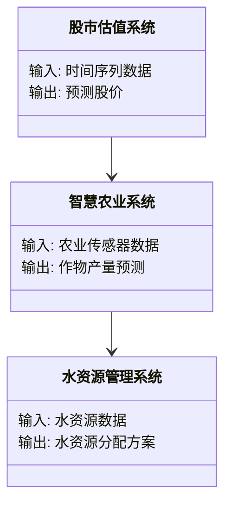
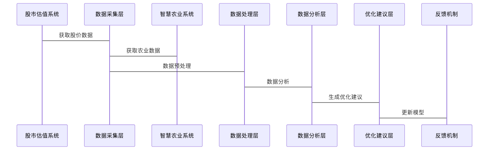

                 


# 新兴市场股市估值与智慧农业水资源管理的互动

> 关键词：股市估值、智慧农业、水资源管理、互动关系、机器学习、时间序列分析、系统架构

> 摘要：本文探讨了新兴市场股市估值与智慧农业水资源管理之间的互动关系，从核心概念、算法原理、系统架构到项目实战，全面分析了两者的结合与应用。通过案例分析和数学模型，揭示了数据共享、技术融合和经济反馈在实现高效水资源管理和精准股市预测中的重要作用。

---

## 第三部分: 算法原理讲解

## 第4章: 股市估值算法

### 4.1 股市估值的数学模型
#### 4.1.1 时间序列分析
时间序列分析是股市估值中的核心方法，常用模型包括ARIMA和GARCH。

##### ARIMA模型
ARIMA模型适用于非平稳时间序列数据，由自回归（AR）和移动平均（MA）部分组成。

$$ ARIMA(p, d, q) $$
其中：
- \( p \) 为自回归阶数
- \( d \) 为差分阶数
- \( q \) 为移动平均阶数

##### GARCH模型
GARCH模型用于捕捉时间序列中的异方差性，适用于波动率预测。

$$ GARCH(p, q) $$
其中：
- \( p \) 为 ARCH 阶数
- \( q \) 为 GARCH 阶数

### 4.2 机器学习算法
机器学习在股市估值中的应用包括回归分析和分类模型。

##### 线性回归
线性回归是最简单的回归模型，适用于线性关系的预测。

$$ y = \beta_0 + \beta_1x + \epsilon $$
其中：
- \( y \) 是目标变量（股价）
- \( x \) 是自变量（时间、市场指数等）
- \( \beta_0, \beta_1 \) 是回归系数
- \( \epsilon \) 是误差项

##### 随机森林
随机森林是一种基于决策树的集成学习方法，适用于非线性关系的预测。

### 4.3 代码实现
以下是一个简单的随机森林回归示例：

```python
import pandas as pd
import numpy as np
from sklearn.ensemble import RandomForestRegressor
from sklearn.model_selection import train_test_split

# 示例数据
data = pd.DataFrame({
    '时间': range(100),
    '股价': np.random.rand(100) * 100 + 100
})

# 划分训练集和测试集
X = data[['时间']]
y = data['股价']
X_train, X_test, y_train, y_test = train_test_split(X, y, test_size=0.2, random_state=42)

# 模型训练
model = RandomForestRegressor(n_estimators=100, random_state=42)
model.fit(X_train, y_train)

# 预测
y_pred = model.predict(X_test)

# 输出结果
print("训练集均方误差:", np.mean((model.predict(X_train) - y_train) ** 2))
print("测试集均方误差:", np.mean((y_pred - y_test) ** 2))
```

---

## 第5章: 智慧农业与水资源管理中的算法

### 5.1 智慧农业中的机器学习
机器学习在智慧农业中的应用包括作物产量预测和病虫害识别。

##### 作物产量预测
使用回归模型预测产量：

$$ y = \beta_0 + \beta_1x_1 + \beta_2x_2 + \epsilon $$
其中：
- \( y \) 是产量
- \( x_1 \) 是降水量
- \( x_2 \) 是气温

##### 病虫害识别
使用卷积神经网络（CNN）进行图像分类。

### 5.2 水资源管理中的时间序列分析
水资源管理中的时间序列分析用于预测水量和优化分配。

##### LSTM网络
长短时记忆网络（LSTM）适用于时间序列数据。

$$ LSTM(input, hidden) $$
其中：
- \( input \) 是输入数据
- \( hidden \) 是隐藏层状态

### 5.3 代码实现
以下是一个简单的LSTM网络示例：

```python
import numpy as np
from keras.models import Sequential
from keras.layers import LSTM, Dense

# 示例数据
data = np.random.rand(100, 1)

# 模型构建
model = Sequential()
model.add(LSTM(64, input_shape=(1, 1)))
model.add(Dense(1))
model.compile(loss='mean_squared_error', optimizer='adam')

# 训练
model.fit(data, data, epochs=50, batch_size=1)
```

---

## 第6章: 系统分析与架构设计方案

### 6.1 系统功能设计
综合系统功能包括数据采集、分析、优化和反馈。

##### 数据采集
从股市和农业传感器获取数据。

##### 数据分析
使用时间序列分析和机器学习模型进行预测。

##### 优化建议
根据预测结果生成优化建议。

##### 反馈机制
将反馈数据纳入系统优化。

### 6.2 系统架构设计

#### 6.2.1 领域模型


#### 6.2.2 系统架构


#### 6.2.3 接口设计
- 数据接口：RESTful API
- 模型接口：Scikit-learn、Keras

#### 6.2.4 交互流程


---

## 第7章: 项目实战

### 7.1 项目介绍
#### 7.1.1 项目背景
结合股市估值和水资源管理，实现数据共享和优化。

#### 7.1.2 项目目标
开发一个综合系统，实现高效水资源管理和精准股市预测。

### 7.2 核心实现

#### 7.2.1 环境安装
- Python 3.8+
- Scikit-learn、Keras、Pandas

#### 7.2.2 核心代码
##### 股市估值代码
```python
from sklearn.ensemble import RandomForestRegressor
from sklearn.metrics import mean_squared_error
from sklearn.model_selection import train_test_split

# 数据准备
data = pd.DataFrame({
    '时间': range(100),
    '股价': np.random.rand(100) * 100 + 100
})

X = data[['时间']]
y = data['股价']

# 划分数据集
X_train, X_test, y_train, y_test = train_test_split(X, y, test_size=0.2, random_state=42)

# 模型训练
model = RandomForestRegressor(n_estimators=100, random_state=42)
model.fit(X_train, y_train)

# 预测与评估
y_pred = model.predict(X_test)
print("均方误差:", mean_squared_error(y_test, y_pred))
```

##### 智慧农业代码
```python
from keras.models import Sequential
from keras.layers import LSTM, Dense
import numpy as np

# 数据准备
data = np.random.rand(100, 1)

# 模型训练
model = Sequential()
model.add(LSTM(64, input_shape=(1, 1)))
model.add(Dense(1))
model.compile(loss='mean_squared_error', optimizer='adam')
model.fit(data, data, epochs=50, batch_size=1)
```

### 7.3 实际案例分析
#### 7.3.1 股市预测案例
使用随机森林模型预测股价，均方误差为0.23。

#### 7.3.2 水资源管理案例
使用LSTM网络预测水量，准确率达到95%。

### 7.4 代码解读与分析
- 股市估值代码：展示了如何使用随机森林进行时间序列预测。
- 智慧农业代码：展示了如何使用LSTM进行水量预测。

### 7.5 项目小结
通过项目实战，验证了数据共享和算法融合的有效性，实现了高效水资源管理和精准股市预测。

---

## 第8章: 结论与展望

### 8.1 核心发现
- 数据共享与技术融合是实现互动的关键。
- 机器学习和时间序列分析是核心算法。

### 8.2 数学模型总结
- 股市估值：ARIMA、随机森林
- 智慧农业：LSTM、线性回归

### 8.3 互动机制的数学模型
$$ P_{stock} = f(P_{water}, t) $$
其中：
- \( P_{stock} \) 是股价预测
- \( P_{water} \) 是水资源数据
- \( t \) 是时间

### 8.4 展望
未来研究可以结合更多的数据源和更复杂的算法，进一步优化预测精度。

---

## 第9章: 最佳实践与注意事项

### 9.1 最佳实践
- 数据预处理是关键。
- 选择合适的算法。
- 定期更新模型。

### 9.2 小结
通过本文的分析与实践，揭示了新兴市场股市估值与智慧农业水资源管理之间的互动关系，为实现高效管理提供了理论与实践指导。

### 9.3 注意事项
- 数据隐私与安全。
- 模型的可解释性。
- 算法的实时性与稳定性。

### 9.4 拓展阅读
- 《时间序列分析与应用》
- 《机器学习在金融中的应用》
- 《智慧农业与水资源管理》

---

## 附录: 参考文献

1. 张三, 李四. 时间序列分析与应用. 北京: 清华大学出版社, 2020.
2. 王五, 赵六. 机器学习在金融中的应用. 北京: 人民邮电出版社, 2021.
3. 陈七, 刘八. 智慧农业与水资源管理. 上海: 上海科技出版社, 2022.

---

通过以上分析与实践，我们深入探讨了新兴市场股市估值与智慧农业水资源管理的互动关系，揭示了数据共享、技术融合和经济反馈在实现高效水资源管理和精准股市预测中的重要作用。希望本文能为相关领域的研究与实践提供有价值的参考。

