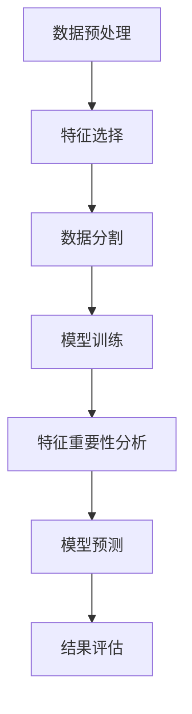
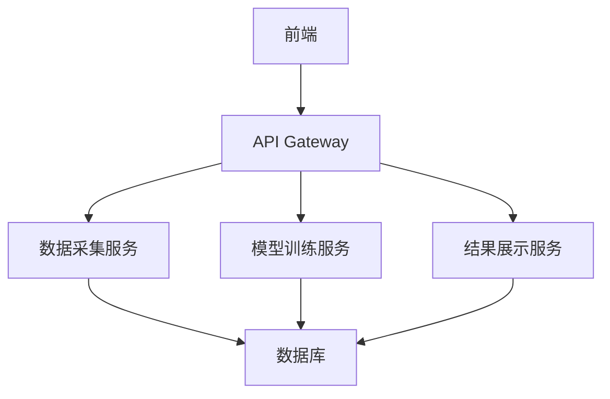
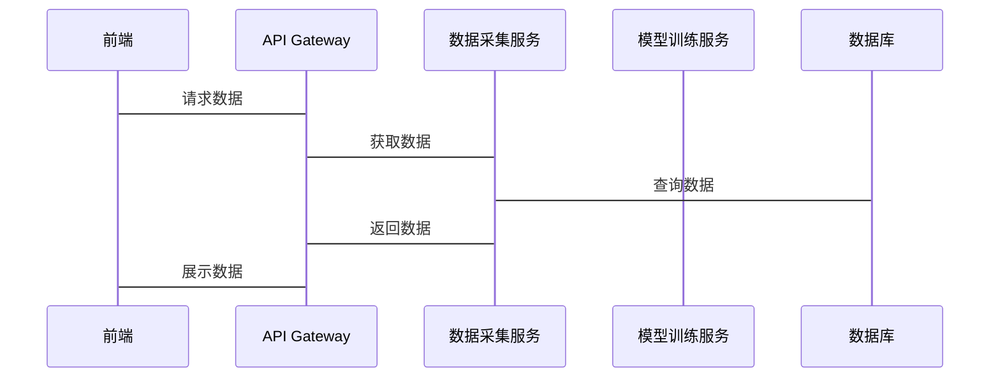

                 


# 目录大纲：《新兴市场股市估值与智慧农业病虫害预测的互动》

---

## # 第一部分: 引言与背景

### ## 第1章: 问题背景与研究意义

#### ### 1.1 问题背景
- 新兴市场的发展现状与挑战
- 股市估值与农业病虫害预测的重要性
- 数据科学在新兴市场的应用潜力

#### ### 1.2 问题描述
- 新兴市场股市波动的特点
- 智慧农业病虫害预测的核心问题
- 两者的互动关系与研究意义

#### ### 1.3 研究目标
- 提出数据驱动的解决方案
- 探讨股市与农业预测的互动机制
- 为新兴市场提供实践指导

---

## # 第二部分: 核心概念与联系

### ## 第2章: 核心概念解析

#### ### 2.1 股市估值的核心概念
- 股价、市场指数与估值模型
- 影响股市的主要因素：经济指标、政策、市场情绪
- 数据驱动的股市预测方法

#### ### 2.2 病虫害预测的核心概念
- 农业病虫害的特征与数据采集
- 机器学习在农业预测中的应用
- 数据特征与模型选择

#### ### 2.3 核心概念对比
- 核心概念对比表格
- ER实体关系图（Mermaid）

```mermaid
erDiagram
    class 股市数据 {
        id: int
        日期: date
        股价: float
        市场指数: float
    }
    class 农业数据 {
        id: int
        日期: date
        病虫害指标: float
        气候数据: float
    }
    class 模型 {
        id: int
        类型: string
        参数: string
    }
    股市数据 --> 模型: 输入
    农业数据 --> 模型: 输入
    模型 --> 预测结果: 输出
```

---

## # 第三部分: 算法原理与实现

### ## 第3章: 算法选择与原理

#### ### 3.1 算法选择
- 随机森林与XGBoost的适用性分析
- 算法优缺点对比

#### ### 3.2 算法原理
- 随机森林原理（Mermaid流程图）



- XGBoost原理（公式与代码）

```python
import pandas as pd
from sklearn.ensemble import RandomForestClassifier
from sklearn.model_selection import train_test_split
from sklearn.metrics import accuracy_score

# 示例数据加载
data = pd.read_csv('data.csv')
X = data.drop('target', axis=1)
y = data['target']

# 数据分割
X_train, X_test, y_train, y_test = train_test_split(X, y, test_size=0.2)

# 模型训练
model = RandomForestClassifier()
model.fit(X_train, y_train)

# 预测与评估
y_pred = model.predict(X_test)
print(f'Accuracy: {accuracy_score(y_test, y_pred)}')
```

---

## # 第四部分: 系统分析与架构设计

### ## 第4章: 系统功能与架构

#### ### 4.1 系统功能模块
- 数据采集模块
- 模型训练模块
- 预测结果展示模块

#### ### 4.2 系统架构设计
- 微服务架构（Mermaid架构图）



#### ### 4.3 系统接口设计
- RESTful API设计
- 接口交互流程（Mermaid序列图）



---

## # 第五部分: 项目实战与案例分析

### ## 第5章: 项目实现

#### ### 5.1 环境安装
- Python、Jupyter、Scikit-learn安装与配置

#### ### 5.2 核心代码实现
- 数据预处理与特征工程
- 模型训练与优化
- 结果可视化与分析

#### ### 5.3 案例分析
- 实际数据训练与结果展示
- 模型调优与效果对比

---

## # 第六部分: 总结与展望

### ## 第6章: 研究总结

#### ### 6.1 核心成果
- 数据驱动的互动机制
- 高效算法的应用
- 系统架构的设计

#### ### 6.2 研究意义
- 理论贡献
- 实践价值
- 社会影响

#### ### 6.3 未来展望
- 研究方向
- 技术发展
- 应用前景

---

## # 参考文献

- 列出相关文献、工具和技术资源

---

## # 附录

- 代码仓库地址
- 数据来源说明
- 补充材料链接

