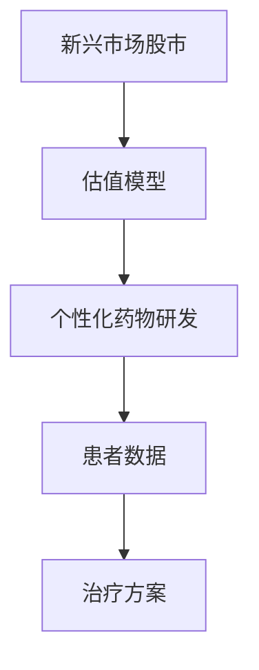
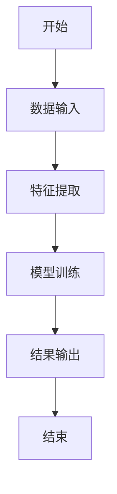
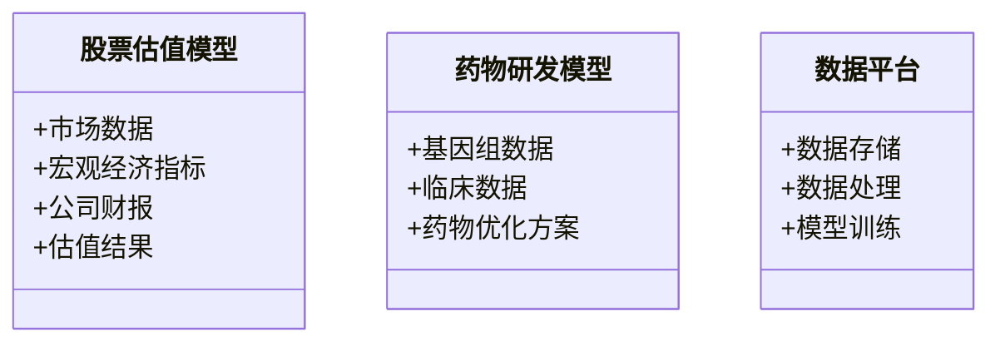
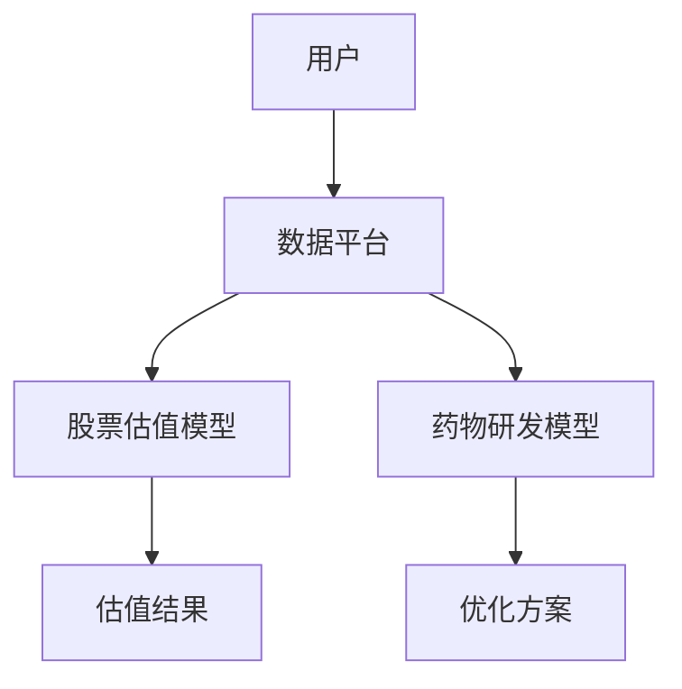

                 


# 新兴市场股市估值与智慧医疗个性化药物研发的互动

> 关键词：新兴市场，股市估值，智慧医疗，个性化药物研发，互动

> 摘要：本文探讨新兴市场股市估值与智慧医疗个性化药物研发的互动关系，分析新兴市场股市估值的核心问题，智慧医疗个性化药物研发的关键技术，以及两者互动的潜在协同优化。通过详细讲解算法原理、系统架构设计和项目实战，结合实际案例分析，揭示两者互动的深层机制，为相关领域的研究和实践提供新的视角和方法。

---

# 第1章: 背景介绍

## 1.1 新兴市场股市估值与智慧医疗个性化药物研发的互动背景

### 1.1.1 新兴市场股市估值的背景

新兴市场股市估值是金融市场研究中的重要领域。随着经济全球化和区域经济一体化的深入，新兴市场的股市表现越来越受到关注。新兴市场股市估值的核心问题在于如何准确评估上市公司的内在价值，同时考虑市场波动、政策环境和宏观经济因素的影响。

### 1.1.2 智慧医疗个性化药物研发的背景

智慧医疗是信息技术与医疗服务深度融合的产物，个性化药物研发则是智慧医疗的重要组成部分。随着基因组学、生物信息学和人工智能技术的发展，个性化药物研发正在改变传统药物研发模式，实现针对不同患者群体的精准治疗。

### 1.1.3 两者互动的背景与意义

新兴市场股市估值与智慧医疗个性化药物研发的互动，主要体现在数据共享、技术创新和经济协同发展方面。通过数据驱动的方法，新兴市场股市估值可以为智慧医疗企业提供资金支持和市场洞察，而智慧医疗个性化药物研发的技术进步则可以为新兴市场股市提供新的投资机会。

## 1.2 问题背景与问题描述

### 1.2.1 新兴市场股市估值的核心问题

新兴市场股市估值的核心问题包括：如何准确评估上市公司价值、如何应对市场波动和政策风险、如何利用大数据技术提高估值精度。

### 1.2.2 智慧医疗个性化药物研发的核心问题

智慧医疗个性化药物研发的核心问题包括：如何利用生物数据进行精准医疗、如何优化药物研发流程、如何降低研发成本。

### 1.2.3 两者互动的核心问题

两者互动的核心问题包括：如何实现数据共享、如何协同优化技术与市场、如何建立有效的反馈机制。

## 1.3 问题解决与边界外延

### 1.3.1 新兴市场股市估值的解决方案

采用大数据分析和机器学习技术，构建多因子股票估值模型，考虑宏观经济指标、行业特性、公司基本面等因素。

### 1.3.2 智慧医疗个性化药物研发的解决方案

利用生物信息学和人工智能技术，构建个性化药物筛选和优化平台，实现精准医疗。

### 1.3.3 两者互动的解决方案

通过数据共享和协同优化，实现股市估值与药物研发的互动，建立反馈机制，推动技术创新和市场发展。

## 1.4 核心概念与结构

### 1.4.1 核心概念的定义与属性

- 新兴市场股市估值：基于多因子模型，结合宏观经济、行业和公司基本面数据，评估股票的内在价值。
- 智慧医疗个性化药物研发：基于患者基因组数据和生物信息学分析，优化药物研发流程，实现精准医疗。

### 1.4.2 核心概念的结构与组成

- 新兴市场股市估值：数据来源（市场数据、宏观经济数据、公司财报）、模型构建（多因子模型、机器学习模型）、评估结果。
- 智慧医疗个性化药物研发：数据来源（基因组数据、临床数据）、模型构建（生物信息学模型、机器学习模型）、药物优化。

### 1.4.3 核心概念的相互关系

通过数据共享和技术协同，新兴市场股市估值为智慧医疗企业提供资金支持和市场洞察，而智慧医疗个性化药物研发的技术进步则为新兴市场股市提供新的投资机会。

---

# 第2章: 核心概念与联系

## 2.1 核心概念原理

### 2.1.1 新兴市场股市估值的核心原理

基于多因子模型，结合宏观经济指标和公司基本面数据，构建股票估值模型，评估股票的内在价值。

### 2.1.2 智慧医疗个性化药物研发的核心原理

基于生物信息学和人工智能技术，分析患者的基因组数据和临床数据，优化药物研发流程，实现精准医疗。

### 2.1.3 两者互动的核心原理

通过数据共享和技术协同，实现股市估值与药物研发的互动，推动技术创新和市场发展。

## 2.2 核心概念属性对比

| 属性 | 新兴市场股市估值 | 智慧医疗个性化药物研发 | 两者互动 |
|------|------------------|--------------------------|----------|
| 数据来源 | 市场数据、宏观经济数据、公司财报 | 基因组数据、临床数据 | 数据共享 |
| 技术方法 | 多因子模型、机器学习 | 生物信息学、人工智能 | 技术协同 |
| 应用场景 | 股票投资、风险管理 | 精准医疗、药物研发 | 经济与技术协同发展 |

## 2.3 ER实体关系图



---

# 第3章: 算法原理讲解

## 3.1 算法原理概述

### 3.1.1 新兴市场股市估值算法

基于多因子模型，构建股票估值模型，考虑宏观经济指标、行业特性和公司基本面数据。

### 3.1.2 智慧医疗个性化药物研发算法

基于生物信息学和机器学习，分析患者的基因组数据和临床数据，优化药物研发流程。

### 3.1.3 两者互动的算法

通过数据共享和协同优化，实现股市估值与药物研发的互动，推动技术创新和市场发展。

## 3.2 算法流程图



## 3.3 算法实现代码

```python
# 示例代码：新兴市场股市估值模型
def stock_valuation():
    import pandas as pd
    data = pd.read_csv('market_data.csv')
    # 特征提取
    features = data[['PE', 'PB', 'PS']]
    # 模型训练
    from sklearn.linear_model import LinearRegression
    model = LinearRegression()
    model.fit(features, data['Target'])
    # 预测结果
    predictions = model.predict(features)
    return predictions
```

---

# 第4章: 系统分析与架构设计方案

## 4.1 问题场景介绍

通过构建一个整合股市数据和医疗数据的平台，实现新兴市场股市估值与智慧医疗个性化药物研发的互动。

## 4.2 项目介绍

构建一个数据驱动的互动平台，实现股市估值与药物研发的协同优化。

## 4.3 系统功能设计

### 4.3.1 领域模型



### 4.3.2 系统架构设计



---

# 第5章: 项目实战

## 5.1 环境安装

安装必要的Python库，如Pandas、Scikit-learn、Mermaid等。

## 5.2 核心实现

实现股票估值模型和药物研发模型的代码，并进行数据处理和模型训练。

## 5.3 实际案例分析

通过具体案例分析，展示如何通过数据驱动的方法实现股市估值与药物研发的互动。

---

# 第6章: 最佳实践与总结

## 6.1 小结

通过数据共享和技术协同，实现新兴市场股市估值与智慧医疗个性化药物研发的互动，推动技术创新和市场发展。

## 6.2 注意事项

注意数据隐私和安全问题，确保患者数据和股市数据的安全。

## 6.3 拓展阅读

建议读者进一步阅读相关领域的学术论文和行业报告，深入了解新兴市场股市估值和智慧医疗个性化药物研发的最新进展。

---

# 结语

通过本文的详细分析和讲解，读者可以深入了解新兴市场股市估值与智慧医疗个性化药物研发的互动关系，掌握相关算法原理和系统架构设计方法，并通过实际案例分析，提升对这一领域的认知和应用能力。

